本文作者JoeyDeVries，由[Django](http://bullteacher.com/8-transformations.html)翻译自[http://learnopengl.com](http://learnopengl.com/#!Getting-started/Transformations)

# 变换(Transformations)

我们现在已经知道了如何创建一个物体，为它们上色，使用纹理给它们一些细节表现，但是它们仍然还是不够有趣，因为它们都是静态的物体。我们可以尝试通过在每一帧中重新配置它们的缓冲，移动它们的顶点来使它们动起来，但这样就复杂了，而且会耗费处理能力。使用（多个）矩阵（matrix）对象可以更好的变换（transform）一个物体。这并不意味着我们会去讨论武术和数字虚拟世界（译注：Matrix是电影「黑客帝国」的英文名，电影中人类生活在数字虚拟世界，主角会武术）。

矩阵是非常强大的数学概念，开始看起来可怕，但是当你了解它们后，它们会非常有用。讨论矩阵之前，我们需要先了解一些数学，对于一些愿意多了解一些的读者我会附加一些资源给你们之后阅读。

然而， 要完全理解变换，我们首先要在讨论矩阵之前了解一点向量（vector）。本章的目标是给你一个后面内容需要的基本的数学背景知识。如果这个主题很难，尝试尽量理解它们，当你需要它们的时候回过头来复习这些概念。

# 向量

向量最近本的定义是它是一个方向。向量有一个方向和大小（也叫做强度或长度）。你可以把向量想成一个藏宝图上的方向：“向左走10步，向北走3步，然后向右走5步”；这里的“左”是方向，“10步”是向量的长度。藏宝图上的方向包含3个向量。向量可以有任何维度，但是我们通常只是用2至4维。如果一个向量有2个维度，它表示一个平面的方向（想象2D图像），当它有3个维度的时候它可以表达一个3D世界的方向。

下面你会看到3个向量，每个向量在2D图像中用一个箭头（x, y）表示。因为在2D中表示向量很容易，你可以想象2D向量有一个z坐标0，这样它就是一个3D向量了。由于向量表示的是方向，起始于何处并不会改变它的值。下图我们可以看到向量和是相等的，尽管他们的起始点不同：


数学家喜欢把向量表示为一个字符头上像这样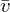有个横。当用在公式中时它们通常是这样的：


由于向量是一个方向，因此此有时候很难把它们显示为一个位置。我们简单的把方向的起点设置为（0, 0, 0）然后指向某个方向，它的终点就是一个位置向量（position vector）了（你也可以把起点设置为其他的点，然后说：这个向量从这个点起始指向另一个点）。位置向量（3, 5）的起点是（0, 0）指向（3, 5）。我们可以这样描述2D和3D空间中的方向和位置。

和普通数字一样，我们也可以用向量进行多种操作（其中一些你已经看到了）。

## 向量和标量运算

标量只是一个数字（如果你想用向量表示，那么这个向量只能有一个元素）。当把一个向量加减乘除一个标量，我们可以简单的把向量的每个元素分别加减乘除标量。就像这样：

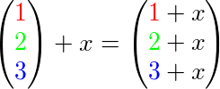

＋可以是＋和-，·，÷，其中·是乘号。记住，-和÷的逆序操作不存在。

## 向量取反

向量的相反数是一个有着相反方向的向量。一个指向东北的向量的相反数是指向西南的向量。向量取相反数是在向量的每个元素前加上一个减号（你也可以用一个标量-1乘以这个向量来表示）：

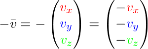

## 向量加减

两个向量相加被定义为元素逐个相加，一个向量的元素与另一个向量相同的元素相加，就像这样：


向量v = (4, 2)和k = (1, 2)直观地表示为：


就像普通数字的加减一样，向量的减法等于加上第二个向量的相反数：

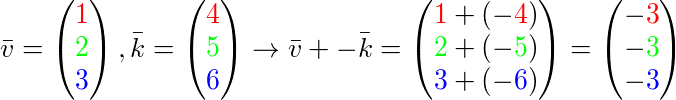

两个向量的差的结果是两个向量所指的位置的向量。在我们需要获得两点之间的差的向量这种情境这很有用。


## 长度

我们使用勾股定理获取向量的长度/大小，你可能想起来数学课上学过了。一个向量的x和y元素可以看作是三角形的两条边，这个向量可以表示成一个三角形：


因为两条边（x和y）是已知的，我们希望知道斜边 ，我们可以通过勾股定理来计算出它:

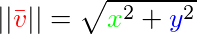

表示向量的长度，通过添加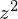很容易能扩展到3D空间。

例子中向量(4, 2)的长度等于：

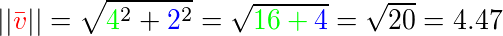

结果是4.47。

有一个特殊类型向量叫做单位向量（unit vector）。单位向量有一个特别的性质——它的长度是1。我们可以用任意向量的每个元素除以向量的长度得到单位向量：


我们把这种方法叫做一个向量的标准化（normalizing）。单位向量头上有一个小屋顶，特别是在我们只关心方向不关系长度的时候，它变得很有用（如果我们改变向量的长度，它的方向并不会改变）。

## 向量与向量相乘

两个向量相乘有点怪异。在向量中没有普通乘法的定义，这是因为它没有视觉意义，但是有两种特定情境，当需要乘法时我们可以从中选择：一个是点乘（dot product）写作另一个是叉乘（cross product）表示为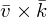。

### 点乘（Dot Product）

两个向量的点乘等于它们的模乘以两个向量之间夹角的余弦。听起来有点费解，先看一下公式：

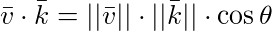

它们之间的夹角是。为什么这很有趣？想象如果和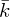是单位向量，它们的长度等于1。公式会有效简化：

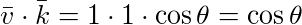

现在点乘只和两个向量的角度有关。你也许记得当90度的余弦是0，0度的余弦是1。使用点乘可以很容易测试两个向量是否垂直或平行（垂直意味着两个向量互为直角）。你可能想要了解更多的关于正弦或余弦的知识，我推荐你看[可汗学院](https://www.khanacademy.org/math/trigonometry/basic-trigonometry/basic_trig_ratios/v/basic-trigonometry)的基础三角学视频。

!!! Important

	你可以计算两个非单位向量的角度，但是你必须除把结果以两个向量的长度，再除以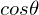。

所以，我们如何计算点乘？点乘是按元素逐个相乘，然后再把结果相加。两个单位向量点乘就像这样（你可以用两个长度为1的验证）：

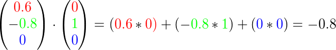

计算两个单位余弦的角度，我们使用反余弦 ，结果是143.1度。现在我们很快就计算出了两个向量的角度。当计算光照的时候点乘被证明很有用。

### 叉乘（Cross Product）

叉乘只在3D空间才被定义，它需要两个不平行向量作为输入，生成垂直于两个向量的第三个向量。如果输入的两个向量也垂直，那么叉乘的结果返回3个垂直向量。接下来的教程中，这很有用。下面的图片展示了3D空间中叉乘的样子：


不同于其他操作，如果没有钻研过线性代数，叉乘很饭直觉，所以最好记住公式，就没问题（记不住也没问题）。下面你会看到两个垂直向量A和B叉乘结果：


就像你所看到的，看起来毫无头绪。可如果你这么做了，你会得到第三个向量，它垂直于你的输入向量。

# 矩阵

现在我们已经讨论了向量的全部内容，是时候看看矩阵了！矩阵简单说是一个矩形的数字、符号或表达式阵列。矩阵中每个单独内容叫做矩阵的元素（element）。下面是一个2×3矩阵的例子：

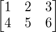

矩阵可以通过（i, j）进行索引，i是行，j是列，这就是上面的矩阵叫做2×3矩阵的原因（3列、2行，也叫做矩阵的维度）。与你在索引2D图像（x, y）相反，获取4的索引是（2, 1）（第二行，第一列）（译注：如果是图像索引应该是（1, 2），先算列，再算行）。

关于矩阵基本也就是这些了，它就是矩形数学表达式阵列。矩阵也有非常漂亮的数学属性，就跟向量一样。矩阵有几个操作，叫做：矩阵加法、减法和乘法。

## 矩阵加减

矩阵与标量的加减如下所示：


标量值要加到矩阵的每个独立元素上。同样的方式也能应用到矩阵与标量的减法上：

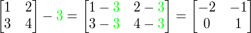

矩阵之间的加减可以用元素相加减。和普通数字适用同样的法则，但是只能在矩阵间的相同索引的元素上进行。这意味着加法和减法只能在同样维度的矩阵之间进行。一个3×2矩阵和一个2×3矩阵（或一个3×3矩阵与4×4矩阵）是不能进行加减的。我们看看两个2×2矩阵是怎样加减的：


同样的法则也适用于减法：

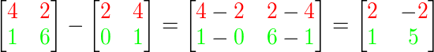

## 矩阵与标量相乘

和加减一样，矩阵与标量之间的乘法也是矩阵的元素分别乘以标量。下面的例子描述了乘法：


现在我们也能明白为什么一个单独数字叫做标量(Scalar)了。简单来说，标量就是用它的值缩放(Scale)矩阵的所有元素（译注：注意Scalar是由Scale + -ar演变过来的）。前面的例子里，所有的元素都被放大2。
到目前为止都还好，我们的例子都不复杂。不过矩阵与矩阵的乘法就不一样了。

## 矩阵与矩阵相乘

矩阵之间的乘法不见得多难，但的确不太让人适应。矩阵乘法基本上意味着遵照预定好的法则进行相乘。有一些限制存在：

1. 只有当左侧的矩阵列数等于右侧矩阵的行数，两个矩阵才能相乘。
2. 矩阵间相乘不能交换，。

我们先看一个两个2×2矩阵相乘的例子：

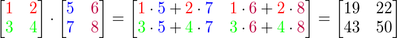

现在你可能正尝试看出到底发生了什么？矩阵乘法结合了普通的乘法和用左侧矩阵行加上右侧矩阵的列。我们可以看下面的图片：

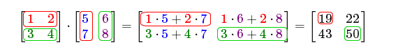

我们先把左侧矩阵的行和右侧矩阵的列拿出来。这些我们挑出来行和列决定着作为结果的2×2矩阵的输出值。如果我们拿出来的是左矩阵的第一行，最终的值就会出现在作为结果的矩阵的第一行，如果我们拿出来的是右矩阵的第一列，最终值会出现在作为结果的矩阵的第一列。这正是红框框住的情况。计算结果矩阵右下的值，我们要用第一个矩阵的第二行和第二个矩阵的第二列（译注：简单来说就是结果矩阵的元素的行取决于第一个矩阵，列取决于第二个矩阵）。

计算结果值的方式是先计算行和列的第一个元素之间的积，然后是第二个，第三个，第四个等等。然后把所有的乘积相加。现在就能解释为什么左矩阵的列数必须和右矩阵的行数想等了，否则就不能进行操作了!

结果的矩阵的维度是（n, m），n等于左矩阵的行数，m等于右矩阵的列数。

如果你在脑子里想象出乘法有困难别担心。用笔写下来，如果遇到困难回头看这页的内容。随着时间流逝，矩阵乘法对你来说会成为自然的事。

我们用一个更大的例子来结束矩阵与矩阵乘法的讨论。尝试使用颜色来视觉化公式。作为一个有用的练习你可以自己回答这个乘法问题然后对比结果矩阵（如果你用笔计算，你很快就能掌握它们）。


就像你所看到的那样，矩阵与矩阵相乘复杂而容易犯错（这就是我们通常让计算机做这件事的原因），而且当矩阵变大以后很快就会出现问题。如果你仍然希望了解更多，对矩阵的数学属性感到好奇，我强烈推荐你看看[可汗学院](https://www.khanacademy.org/math/algebra2/algebra-matrices)的矩阵内容视频。

不管怎样，反正现在我们知道如何进行矩阵相乘了，我们可以开始了解好东西了。

# 矩阵与向量相乘

到目前，通过这些教程我们已经相当了解向量了。我们用向量来表示位置、颜色和纹理坐标。让我们进到兔子洞更深处：向量基本上就是一个N×1矩阵，N是向量元素的个数（也叫N维向量）。如果你仔细思考这个问题，会很有意思。向量和矩阵一样都是一个数字序列，但是它只有1列。所以，这个新信息能如何帮助我们？如果我们有一个M×N矩阵，我们可以用这个矩阵乘以我们的N×1向量，因为我们的矩阵的列数等于向量的行数，所以它们就能相乘。

但是为什么我们关心矩阵是否能够乘以一个向量？有很多有意思的2D/3D变换本质上都是矩阵，而矩阵与我们的向量相乘会变换我们的向量。假如你仍然有些困惑，我们看一些例子，你很快就能明白了。

## 单位矩阵

因为一些缘故，在OpenGL中，我们通常使用4 × 4变换矩阵，每一个元素都是4元素向量。我们能想到的最简单的变换矩阵是单位矩阵。单位矩阵是一个除了对角线以外都是0的N × N矩阵。就像你看到的，这个变换矩阵使一个向量完全不变：


向量看起来完全没动。从乘法法则来看很明显：第一个结果元素是矩阵的第一行的每个对立元素乘以向量的每一个元素。因为每行的元素除了第一个都是0，可得: ，这对向量的其他3个元素同样适用。

!!! Important

	你可能会奇怪一个没变换的变换矩阵有什么用？单位矩阵通常是生成其他变换矩阵的起点，如果我们深挖线性代数，这就是一个对证明定理、解线性方程非常有用的矩阵。

## 缩放

当我们对一个向量进行缩放的时候就是对向量的长度进行缩放，而它的方向保持不变。如果我们进行2或3维操作，那么我们可以定义一个2或3个的缩放向量，每个缩放一个轴（x、y或z）。

我们可以尝试去缩放向量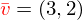。我们可以把向量沿着x轴缩放0.5，使它的宽度缩小为原来的二分之一；我们可以沿着y轴把向量的高度缩放为原来的两倍。我们看看把向量缩放（0.5, 2）所获得的是什么样的：


记住，OpenGL通常是在3D空间操作的，对于2D的情况我们可以把z轴缩放1这样就无害了。我们刚刚的缩放操作是不均匀（non-uniform）缩放，因为每个轴的缩放因子都不一样。如果每个轴的缩放都一样那么就叫均匀（uniform）缩放。

我们下面设置一个变换矩阵来为我们提供缩放功能。我们从单位矩阵了解到，每个对角线元素曾以对应的向量元素。如果我们把1变为3会怎样？这种情况，我们就把向量的每个元素乘以3了，这事实上就把向量缩放3。如果我们把缩放变量表示为我们可以为任意向量（x, y, z）定义一个缩放矩阵：

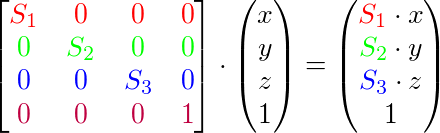

注意，第四个缩放的向量仍然是1，因为不会缩放3D空间中的w元素。w元素另有其他用途，后面我们会看到。

## 平移（Translation）

平移是把一个新向量放在原向量的上面来返回一个具有不用位置的新向量，这样就基于平移向量移动了向量。我们已经讨论了向量加法，所以这不是什么新东西。
如同缩放矩阵，有几个4×4矩阵的位置，用来执行特定的操作，对于平移它们是第四列前三个值。如果我们把缩放向量表示为我们就能把平移矩阵定义为:


因为所有的平移值都要乘以向量的w列，然后加到向量的起点值上（想想矩阵乘法法则）。用3×3矩阵是不行的。

!!! Important

	**齐次坐标（Homogeneous coordinates）**

	向量的w元素也叫齐次坐标。从齐次坐标得到3D坐标，我们可以把x、y和z坐标除以w坐标。我们通常不会注意这个问题，因为w元素通常是1.0。使用齐次坐标有几点好处：它允许我们在3D向量上进行平移（如果没有w元素我们是不能尽心平移向量的），下一章我们会用w值创建3D图像。
	如果一个向量的齐次坐标是0，这个坐标就是方向向量（direction vector），因为w坐标是0，这个向量就不能平移。

有了平移矩阵我们就可以在3个方向（x、y、z）上移动物体，它是我们的变换工具箱中非常有用的一个变换矩阵。

## 旋转

上面几个的变换内容相对容易理解，在2D或3D空间中也容易表示出来，但旋转稍复杂些。如果你想知道矩阵是如何构造出来的，我推荐你去看可汗学院线性代数视频。

首先我们来定义一个向量的旋转到底是什么。2D或3D空间中点的旋转用角来表示。角可以是角度或弧度，周角是360度或2PI弧度。我个人更喜欢用角度，因为它们看起来更直观。

!!! Important

	大多数旋转函数需要用弧度制的角，但是角度制的角也可以很容易地转化为弧度制：
	弧度转角度：角度 = 弧度 * （180.0f / PI）
	角度转弧度：弧度 = 角度 * （PI / 180.0f）
	PI约等于3.14159265359。

平角会向右旋转向右360/2 = 180度，向右旋转1/5表示向右360/5 = 72度。这表明2D空间的向量是向右旋转72度得到的：


在3D空间中旋转需要一个角和一个旋转轴。物体会沿着给定的旋转轴旋转特定角度。你可以尝试慢慢向下看，头部向下旋转一定角度，这就会沿着一个旋转轴旋转。2D向量在3D空间中旋转，我们把旋转轴设为z轴（尝试想象）。

使用三角学就能把一个向量变换为一个经过旋转给定角度的新向量。这通常是通过把正弦和余弦函数结合得到的（一般简称sin和cos）。讨论如何生成变换矩阵超出了这个教程的范围。

旋转矩阵在3D空间中每个轴都有不同定义，这个角度表示为。

沿x轴旋转：

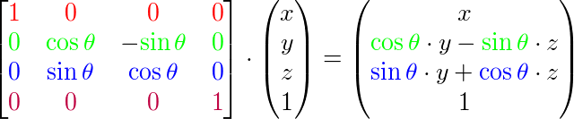

沿y轴旋转：

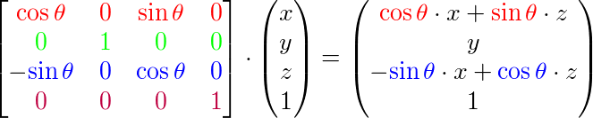

沿z轴旋转：

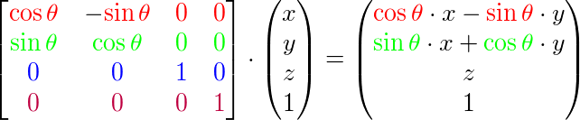

利用旋转矩阵我们可以把我们的位置矩阵（position vectors）沿一个或多个轴进行旋转。也可以把多个矩阵结合起来，比如第一个沿X轴旋转第二个沿Y轴旋转。然而，这会很快导致一个问题——Gimbal lock（译注：万向节死锁，这个视频描述了这个问题）。我们不会讨论它的细节，但是更好的解决方案是沿着任意轴比如（0.662, 0.2, 0.7222）旋转（注意，它是个单位向量上），而不再使用旋转矩阵相结合。这样一个（难看）的矩阵是存在的，下面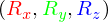代表任意旋转轴：

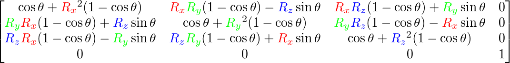

在数学上讨论如何生成这样的矩阵超出了本节内容。但是记住，即使这样一个矩阵也不能完全解决万向节死锁问题（尽管会极大地避免）。避免万向节死锁的真正解决方案是使用四元数（quaternions），它不仅安全，而且计算更友好。有关四元数会在后面的教程中讨论。

## 矩阵的组合

感谢矩阵与矩阵乘法，使用矩阵变换的真正力量在于，我们可以把多个变换结合到一个矩阵中。让我们看看我们是否能生成一个多个变换相结合而成的变换矩阵。我们有一个顶点(x, y, z)，我们希望用2对它进行缩放，然后平移(1, 2, 3)。为了必不可少的步骤，我们需要一个平移和缩放矩阵。结果的变换矩阵看起来像这样：

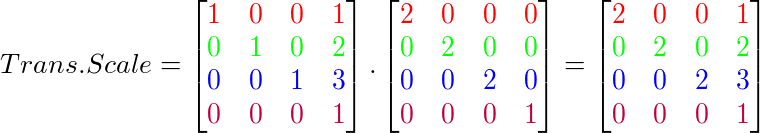

注意，当矩阵相乘时我们先写平移，然后写缩放变换。矩阵乘法是不可交换的，这意味着它们的顺序很重要。当矩阵相乘，最右边的矩阵是第一个乘以向量的，所以你应该从右向左读这个乘法。建议当在结合矩阵时，先做缩放操作，然后旋转，最后平移，否则它们会（消极地）影响其他变换。比如，如果你先平移然后缩放，平移向量也会缩放（译注：比如向某方向移动2米，2米也许会被缩放成1米）！

我们的顶点运行最终的变换矩阵，最为结果的顶点是：

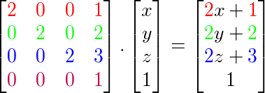

不错！向量先缩放2，然后平移(1, 2, 3)。

# 实践

现在我们已经解释了所有变换背后的理论，是时候白这些知识利用起来了。OpenGL没有任何内建的矩阵和向量形式，所以我们必须自己定义数学类和方法。在这个教程中我们更愿意使用已抽象出来的、做好了的数学库。幸运的是有个使用简单的专门为OpenGL量身定做的数学库，它就是GLM。

## GLM

GLM代表OpenGL Mathematics，它是一个只有头文件的库，这意味着我们只需包含合适的头文件就行了；不用链接和编译。GLM可以从他们的[网站](http://glm.g-truc.net/0.9.5/index.html)上下载。把头文件的根目录复制到你的`includes`文件夹，让我们开始摇滚吧。


GLM的大多数功能都可以从3个头文件中找到，这里我们会包含：

```c++
#include <glm/glm.hpp>
#include <glm/gtc/matrix_transform.hpp>
#include <glm/gtc/type_ptr.hpp>
```

我们来看看是否可以利用变换知识把一个向量（1, 0, 0）平移（1, 1, 0）（注意，我们把它定义成一个齐次坐标为1.0的。

```c++
glm::vec4 vec(1.0f, 0.0f, 0.0f, 1.0f);
glm::mat4 trans;
trans = glm::translate(trans, glm::vec3(1.0f, 1.0f, 0.0f));
vec = trans * vec;
std::cout << vec.x << vec.y << vec.z << std::endl;
```

我们先用GLM的内建vec类定义一个叫做vec的向量。下一步使我们定义一个默认mat4的4×4单位矩阵。接下来把单位矩阵传递给glm::translate函数创建一个变换矩阵，用来与平移向量结合（用给定的矩阵乘以平移矩阵就能获得需要的最后的矩阵）。

我们把向量乘以平移矩阵就能获得最后的结果。如果我们仍然记得平移矩阵是如何工作的话，得到的向量应该是（1 + 1, 0 + 1, 0 + 0）就是（2, 1, 0）。这段代码用平移矩阵输出210。

我们来做些更有意思的是，旋转和缩放前面教程中的那个箱子。首先我们把箱子逆时针旋转90度。然后缩放0.5，使它变成原来的二分之一。我们先来创建变换矩阵：

```c++
glm::mat4 trans;
trans = glm::rotate(trans, 90.0f, glm::vec3(0.0, 0.0, 1.0));
trans = glm::scale(trans, glm::vec3(0.5, 0.5, 0.5));  
```

我们先把箱子在每个轴缩放到0.5然后沿Z轴旋转90度。因为我们把矩阵传递给了GLM的每个函数，GLM会自动乘以矩阵，返回的结果是一个变换矩阵，它结合了多个变换。

!!! Attention

	有些GLM版本接收的是弧度而不是角度，这种情况下你可以用`glm::radians(90.0f)`转换为弧度。

下一个大问题是：如何把矩阵传递给着色器？我们在前面简单提到过GLSL里的mat4类型。所以我们改写顶点着色器来接收一个mat4的uniform变量，然后用矩阵uniform乘以位置向量：

```c++
#version 330 core
layout (location = 0) in vec3 position;
layout (location = 1) in vec3 color;
layout (location = 2) in vec2 texCoord;

out vec3 ourColor;
out vec2 TexCoord;
  
uniform mat4 transform;

void main()
{
    gl_Position = transform * vec4(position, 1.0f);
    ourColor = color;
    TexCoord = vec2(texCoord.x, 1.0 - texCoord.y);
} 
```

!!! Attention

	GLSL也有mat2和mat3类型，允许如同向量一样的混合运算。前面提到的所有数学运算（比如标量-矩阵乘法，矩阵-向量乘法和矩阵-矩阵乘法）都被允许使用矩阵类型。无论在哪里只要指定矩阵运算我们都会解释发生了什么。

我们添加一个uniform，在把它传给gl_Position之前用变换矩阵乘以位置向量。我们的箱子现在应该是原来的二分之一大小并旋转了90度（向左倾斜）。我们仍需要把变换矩阵传给着色器：

```c++
GLuint transformLoc = glGetUniformLocation(ourShader.Program, "transform");
glUniformMatrix4fv(transformLoc, 1, GL_FALSE, glm::value_ptr(trans));
```

首先请求uniform变量的地址，然后用glUniform函数把矩阵数据发送给着色器，这个函数有一个Matrix4fv的后缀。第一个参数现在应该很熟悉了，它是uniform的地址。第二个参数告诉OpenGL多少个矩阵会被发送过去，目前是1。第三个参数询问我们我们是否希望对我们的矩阵进行置换，这样会把矩阵的行转换为列。OpenGL使用的内部的矩阵布局叫做以列为主顺序（column-major ordering）布局。GLM已经是用以列为主顺序定义了它的矩阵，所以并不需要置换矩阵，我们可以填为GL_FALSE、最后一个参数是实际的矩阵数据，但是GLM并不是把它们的矩阵储存为OpenGL所希望的那种，因此我们要先用GLM的内建函数value_ptr来变换这些数据。

我们创建了一个变换矩阵，在顶点着色器中声明了一个uniform，并把矩阵发送给了着色器，着色器会变换我们的顶点坐标。最后的结果应该看起来像这样：


完美！我们的箱子向左侧倾斜，是原来的二分之一大小，看来变换成功了。我们现在做些更有意思的，看看我们是否可以让箱子随着时间旋转，我们还会把箱子重置在窗口的左下角。要随着时间旋转箱子我们必须在游戏循环中更新变换矩阵，因为每一次渲染循环都要更新它。我们使用GLFW的时间函数来推导出不同时间的不同角度：

```c++
glm::mat4 trans;
trans = glm::translate(trans, glm::vec3(0.5f, -0.5f, 0.0f));
trans = glm::rotate(trans,(GLfloat)glfwGetTime() * 50.0f, glm::vec3(0.0f, 0.0f, 1.0f));
```

要记住的是前面的例子中我们可以在任何地方声明变换矩阵，但是现在我们必须在每一帧中创建它，所以才能持续更新旋转。这意味着我们不得不在每次循环中重新创建变换矩阵。通常在渲染场景的时候，我们有多个变换矩阵用来重新创建每次渲染的新值。

在这儿我们先把箱子围绕原点（0, 0, 0）旋转，之后，我们把它平移到屏幕的右下角。记住，实际的变换顺序应该从后往前阅读：尽管在代码中我们先平移再旋转，实际的变换确实先应用旋转然后平移的。明白所有这些变换结合，并知道它们是如何应用到物体上的并不简单。尝试和实验才能快速掌握它。
如果你做对了，你将看到下面的结果：


这就是你所得到的！一个平移过的箱子，它会一直转，一个变换矩阵就做到了！现在你可以明白为什么矩阵在图形领域是一个如此重要的工具了。我们可以定义一个无限数量的变换，把它们结合为一个单独矩阵，如果愿意的话我们可以重复使用。在着色器中使用矩阵可以省区重新定义顶点数据的时间，也会节约处理资源，因为我们没有总是重新发送数据（这很慢）。

如果你没有得到正确的结果，或者你有哪儿不清楚的地方。可以看[源码](http://learnopengl.com/code_viewer.php?code=getting-started/transformations)和[顶点](http://learnopengl.com/code_viewer.php?code=getting-started/transformations&type=vertex)、[片段](http://learnopengl.com/code_viewer.php?code=getting-started/transformations&type=fragment)着色器。

下个教程中，我们会讨论怎样使用矩阵为顶点定义不同的坐标空间。这将是我们进入实时3D图像的第一步！

# 练习

- 使用应用在箱子上的最后的变换，尝试将其改变成先旋转，后平移。看看发生了什么，试着想想为什么会发生这样的事情: [参考解答](http://learnopengl.com/code_viewer.php?code=getting-started/transformations-exercise1)
- 尝试着再次调用`glDrawElements`画出第二个箱子，但是**只能**使用变换将其摆放在不同的位置。保证这个箱子被摆放在窗口的左上角，并且会不断的缩放(而不是旋转)。使用sin函数在这里会很有用；注意使用sin函数取到负值时会导致物体被翻转: [参考解答](http://learnopengl.com/code_viewer.php?code=getting-started/transformations-exercise2)