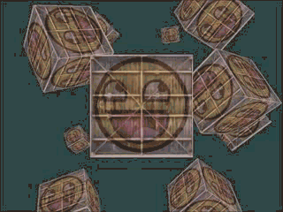
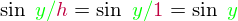

本文作者JoeyDeVries，由[Django](http://bullteacher.com/10-camera.html)翻译自[http://learnopengl.com](http://learnopengl.com/#!Getting-started/Camera)

# 摄像机(Camera)

前面的教程中我们讨论了视图矩阵以及如何使用视图矩阵移动场景。OpenGL本身没有摄像机的概念，但我们可以通过把场景中的所有物体往相反方向移动的方式来模拟出摄像机，这样感觉就像我们在移动，而不是场景在移动。

本节我们会讨论如何在OpenGL中设置一个摄像机。我们讨论一下FPS风格的可自由在3D场景中移动的摄像机。这里也会讨论键盘和鼠标输入，最终完成一个自定义的摄像机类。

## 摄像机/视图空间(Canera/View Space)

当我们谈论摄像机/视图空间的时候，我们在谈论以摄像机的透视图作为场景原点时场景中所有可见顶点坐标。视图矩阵把所有的世界坐标变换到观察坐标，这些新坐标是相对于摄像机的位置和方向的。定义一个摄像机，我们需要一个摄像机在世界空间中的位置、观察的方向、一个指向它的右测的向量以及一个指向它上方的向量。细心的读者可能已经注意到我们实际上创建了一个三个单位轴相互垂直的、以摄像机的位置为原点的坐标系。


### 1.摄像机位置

获得摄像机位置很简单。摄像机位置简单来说就是世界空间中代表摄像机位置的向量。我们把摄像机位置设置为前面教程中的那个相同的位置：

```c++
glm::vec3 cameraPos = glm::vec3(0.0f, 0.0f, 3.0f);
```

!!! Important

	不要忘记正z轴是从屏幕指向你的，如果我们希望摄像机向后移动，我们就往z轴正方向移动。

### 2.摄像机方向

下一个需要的向量是摄像机的方向，比如它指向哪个方向。现在我们让摄像机指向场景原点：（0, 0, 0）。用摄像机位置向量减去场景原点向量的结果就是摄像机指向向量。由于我们知道摄像机指向z轴负方向，我们希望方向向量指向摄像机的z轴正方向。如果我们改变相减的顺序，我们就会获得一个指向摄像机正z轴方向的向量(译注：注意看前面的那个图，所说的「方向向量/direction vector」是指向z的正方向的，而不是摄像机所注视的那个方向。)：

```c++
glm::vec3 cameraTarget = glm::vec3(0.0f, 0.0f, 0.0f);
glm::vec3 cameraDirection = glm::normalize(cameraPos - cameraTarget);
```

!!! Attention

	方向向量（Direction Vector）并不是最好的名字，因为它正好指向从它到目标的向量的相反方向。

### 3.右轴(Right axis)

我们需要的另一个向量是一个‘右向量’，它代表摄像机空间的x轴的正方向。为获取右向量我们需要先使用一个小技巧：定义一个‘上向量’。我们把上向量和第二步得到的摄像机方向向量进行叉乘。两个向量叉乘的结果就是同时垂直于两向量的向量，因此我们会得到指向x轴正方向的那个向量（如果我们交换两个向量的顺序就会得到相反的指向x轴负方向的向量）：

```c++
glm::vec3 up = glm::vec3(0.0f, 1.0f, 0.0f); 
glm::vec3 cameraRight = glm::normalize(glm::cross(up, cameraDirection));
```

### 4.上轴(Up axis)

现在我们已经有了x轴向量和z轴向量，获取摄像机的正y轴相对简单；我们把右向量和方向向量（direction vector）进行叉乘：

```c++
glm::vec3 cameraUp = glm::cross(cameraDirection, cameraRight);
```

在叉乘和一些小技巧的帮助下，我们创建了所有视图/摄像机空间的向量。对于想学到更多数学原理的读者，提示一下，在线性代数中这个处理叫做[Gram-Schmidt（葛兰—施密特）正交](http://en.wikipedia.org/wiki/Gram%E2%80%93Schmidt_process)。使用这些摄像机向量我们就可以创建一个**LookAt**矩阵了，使用它创建摄像机非常好。

## Look At

使用矩阵的好处之一是如果你定义了一个坐标空间，里面有3个相互垂直的轴，你可以用这三个轴外加一个平移向量来创建一个矩阵，你可以用这个矩阵乘以任何向量来变换到那个坐标空间。这正是LookAt矩阵所做的，现在我们有了3个相互垂直的轴和一个定义摄像机空间的位置坐标，我们可以创建我们自己的LookAt矩阵了：


是右向量，是上向量，是方向向量是摄像机位置向量。注意，位置向量是相反的，因为我们最终希望把世界平移到与我们自身移动的相反方向。使用这个LookAt矩阵坐标视图矩阵可以很高效地把所有世界坐标变换为观察坐标LookAt矩阵就像它的名字表达的那样：它会创建一个视图矩阵looks at（看着）一个给定目标。

幸运的是，GLM已经提供了这些支持。我们要做的只是定义一个摄像机位置，一个目标位置和一个表示上向量的世界空间中的向量（我们使用上向量计算右向量）。接着GLM就会创建一个LookAt矩阵，我们可以把它当作我们的视图矩阵：

```c++
glm::mat4 view;
view = glm::lookAt(glm::vec3(0.0f, 0.0f, 3.0f), 
  		   glm::vec3(0.0f, 0.0f, 0.0f), 
  		   glm::vec3(0.0f, 1.0f, 0.0f));
```

glm::LookAt函数需要一个位置、目标和上向量。它可以创建一个和前面所说的同样的视图矩阵。

在开始做用户输入之前，我们来做些有意思的事，把我们的摄像机在场景中旋转。我们的注视点保持在（0, 0, 0）。

我们在每一帧都创建x和z坐标，这要使用一点三角学知识。x和z表示一个在一个圆圈上的一点，我们会使用它作为摄像机的位置。通过重复计算x和y坐标，遍历所有圆圈上的点，这样摄像机就会绕着场景旋转了。我们预先定义这个圆圈的半径，使用glfwGetTime函数不断增加它的值，在每次循环迭代创建一个新的视图矩阵。

```c++
GLfloat radius = 10.0f;
GLfloat camX = sin(glfwGetTime()) * radius;
GLfloat camZ = cos(glfwGetTime()) * radius;
glm::mat4 view;
view = glm::lookAt(glm::vec3(camX, 0.0, camZ), glm::vec3(0.0, 0.0, 0.0), glm::vec3(0.0, 1.0, 0.0));  
```

如果你运行代码你会得到下面的东西：


这一小段代码中，摄像机围绕场景转动。自己试试改变半径和位置/方向参数，看看LookAt矩阵是如何工作的。同时，这里有源码、顶点和像素着色器。

## 自由移动

让摄像机绕着场景转很有趣，但是让我们自己移动摄像机更有趣！首先我们必须设置一个摄像机系统，在我们的程序前面定义一些摄像机变量很有用：

```c++
glm::vec3 cameraPos   = glm::vec3(0.0f, 0.0f,  3.0f);
glm::vec3 cameraFront = glm::vec3(0.0f, 0.0f, -1.0f);
glm::vec3 cameraUp    = glm::vec3(0.0f, 1.0f,  0.0f);
```

LookAt函数现在成了：

```c++
view = glm::lookAt(cameraPos, cameraPos + cameraFront, cameraUp);
```

我们首先设置之前定义的cameraPos为摄像机位置。方向（direction）是当前的位置加上我们刚刚定义的方向向量。这样能保证无论我们怎么移动，摄像机都会注视目标。我们在按下某个按钮时更新cameraPos向量。

我们已经为GLFW的键盘输入定义了一个key_callback函数，我们来添加几个新按键命令：

```c++
void key_callback(GLFWwindow* window, int key, int scancode, int action, int mode)
{
    ...
    GLfloat cameraSpeed = 0.05f;
    if(key == GLFW_KEY_W)
        cameraPos += cameraSpeed * cameraFront;
    if(key == GLFW_KEY_S)
        cameraPos -= cameraSpeed * cameraFront;
    if(key == GLFW_KEY_A)
        cameraPos -= glm::normalize(glm::cross(cameraFront, cameraUp)) * cameraSpeed;
    if(key == GLFW_KEY_D)
        cameraPos += glm::normalize(glm::cross(cameraFront, cameraUp)) * cameraSpeed;  
}
```

当我们按下WASD键，摄像机的位置都会相应更新。如果我们希望向前或向后移动，我们就把位置向量加上或减去方向向量。如果我们希望向旁边移动，我们做一个叉乘来创建一个右向量，沿着它移动就可以了。这样就创建了类似使用摄像机横向、前后移动的效果。

!!! Important

	注意，我们对右向量进行了标准化。如果我们没对这个向量进行标准话，最后的叉乘结果会根据cameraFront变量的大小返回不同的大小。如果我们不对向量进行标准化，我们就得根据摄像机的方位加速或减速移动了，但假如进行了标准化移动就是匀速的。

如果你用这段代码更新key_callback函数，你就可以在场景中自由的前后左右移动了。



你可能会注意到这个摄像机系统不能同时朝两个方向移动，当你按下一个按键时，它会先顿一下才开始移动。这是因为大多数事件输入系统一次只能处理一个键盘输入，它们的函数只有当我们激活了一个按键时才被调用。大多数GUI系统都是这样的，它对摄像机来说用并不合理。我们可以用一些小技巧解决这个问题。

这个技巧是只在回调函数中跟踪哪个键被按下/释放。在游戏循环中我们读取这些值，检查那个按键被激活了，然后做出相应反应。我们只储存哪个键被按下/释放的状态信息，在游戏循环中对状态做出反应，我们来创建一个布尔数组代表按下/释放的键：

```c++
bool keys[1024];
```
然后我们必须在key_callback函数中设置按下/释放键为true或false：

```c++
if(action == GLFW_PRESS)
    keys[key] = true;
else if(action == GLFW_RELEASE)
    keys[key] = false;
```

我们创建一个新的叫做do_movement的函数，用它根据按下的按键来更新摄像机的值：

```c++
void do_movement()
{
  // 摄像机控制
  GLfloat cameraSpeed = 0.01f;
  if(keys[GLFW_KEY_W])
  	cameraPos += cameraSpeed * cameraFront;
  if(keys[GLFW_KEY_S])
  	cameraPos -= cameraSpeed * cameraFront;
  if(keys[GLFW_KEY_A])
  	cameraPos -= glm::normalize(glm::cross(cameraFront, cameraUp)) * cameraSpeed;
  if(keys[GLFW_KEY_D])
  	cameraPos += glm::normalize(glm::cross(cameraFront, cameraUp)) * cameraSpeed;
}
```

之前的代码移动到了do_movement函数中。由于所有GLFW的按键枚举都是整数，我们可以把它们当数组索引使用。

最后，我们需要在游戏循环中添加新函数的调用：

```c++
while(!glfwWindowShouldClose(window))
{
  // 检测并调用事件
  glfwPollEvents();
  do_movement();  
  
  // 渲染
  ...
}
```

至此，你可以同时向多个方向移动了，并且当你按下按钮也会立刻运动了。如遇困难查看源码。

### 移动速度

目前我们的移动速度是个常量。看起来不错，但是实际情况下根据处理器的能力不同，有的人在同一段时间内会比其他人绘制更多帧。也就是调用了更多次do_movement函数。每个人的运动速度就都不同了。当你要发布的你应用的时候，你必须确保在所有硬件上移动速度都一样。

图形和游戏应用通常有回跟踪一个deltaTime变量，它储存渲染上一帧所用的时间。我们把所有速度都去乘以deltaTime值。当我们的deltaTime变大时意味着上一帧渲染花了更多时间，所以这一帧使用这个更大的deltaTime的值乘以速度，会获得更高的速度，这样就与上一帧平衡了。使用这种方法时，无论你的机器快还是慢，摄像机的速度都会保持一致，这样每个用户的体验就都一样了。

我们要用两个全局变量来计算出deltaTime值：

```c++
GLfloat deltaTime = 0.0f;	// 当前帧遇上一帧的时间差
GLfloat lastFrame = 0.0f;  	// 上一帧的时间
```

在每一帧中我们计算出新的deltaTime以备后用

```c++
GLfloat currentFrame = glfwGetTime();
deltaTime = currentFrame - lastFrame;
lastFrame = currentFrame;  
```

现在我们有了deltaTime在计算速度的使用可以使用了：

```c++
void Do_Movement()
{
  GLfloat cameraSpeed = 5.0f * deltaTime;
  ...
}
```

与前面的部分结合在一起，我们有了一个更流畅点的摄像机系统：


现在我们有了一个在任何系统上移动速度都一样的摄像机。这里是源码。我们可以看到任何移动都会影响返回的deltaTime值。


## 自由观看

只用键盘移动没什么意思。特别是我们还不能转向。是时候使用鼠标了！

为了能够改变方向，我们必须根据鼠标的输入改变cameraFront向量。然而，根据鼠标旋转改变方向向量有点复杂，需要更多的三角学知识。如果你对三角学知之甚少，别担心。你可以复制粘贴的；当你想了解更多的时候再回来看。

### 欧拉角

欧拉角是表示3D空间中可以表示任何旋转的三个值，由莱昂哈德·欧拉在18世纪提出。有三种欧拉角：俯仰角（pitch）、偏航角（yaw）和滚转角（roll），下面的图片展示了它们的含义：


俯仰角是描述我们如何往上和往下看的角，它在第一张图中表示。第二张图显示了偏航角，偏航角表示我们往左和往右看的大小。滚转角代表我们如何翻滚摄像机。每个欧拉角都有一个值来表示，把三个角结合起来我们就能够计算3D空间中任何的旋转了。

对于我们的摄像机系统来说，我们只关心俯仰角和偏航角，所以我们不会讨论滚转角。用一个给定的俯仰角和偏航角，我们可以把它们转换为一个代表新的方向向量的3D向量。俯仰角和偏航角转换为方向向量的处理需要一些三角学知识，我们以最基本的情况开始：


如果我们把斜边边长定义为1，我们就能知道邻边的长度是，它的对边是。这样我们获得了能够得到x和y方向的长度的公式，它们取决于所给的角度。我们使用它来计算方向向量的元素：


这个三角形看起来和前面的三角形很像，所以如果我们想象自己在xz平面上，正望向y轴，我们可以基于第一个三角形计算长度/y方向的强度（我们往上或往下看多少）。从图中我们可以看到一个给定俯仰角的y值等于sinθ:

```c++
direction.y = sin(glm::radians(pitch)); // 注意我们先把角度转为弧度
```

这里我们只更新了y值，仔细观察x和z元素也被影响了。从三角形中我们可以看到它们的值等于：

```c++
direction.x = cos(glm::radians(pitch));
direction.z = cos(glm::radians(pitch));
```

看看我们是否能够为偏航角找到需要的元素：


就像俯仰角一样我们可以看到x元素取决于cos(偏航角)的值，z值同样取决于偏航角的正弦值。把这个加到前面的值中，会得到基于俯仰角和偏航角的方向向量①：

①译注:这里的球坐标与笛卡尔坐标的转换把x和z弄反了，如果你去看最后的源码，会发现作者在摄像机源码那里写了yaw = yaw – 90，实际上在这里x就应该是sin(glm::radians(yaw))，z也是同样处理，当然也可以认为是这个诡异的坐标系，但是在这里使用球坐标转笛卡尔坐标有个大问题，就是在初始渲染时，无法指定摄像机的初始朝向，还要花一些功夫自己实现这个；此外这只能实现像第一人称游戏一样的简易摄像机，类似Maya、Unity3D编辑器窗口的那种摄像机还是最好自己设置摄像机的位置、上、右、前轴，在旋转时用四元数对这四个变量进行调整，才能获得更好的效果，而不是仅仅调整摄像机前轴。

```c++
direction.x = cos(glm::radians(pitch)) * cos(glm::radians(yaw));//译注：direction代表摄像机的“前”轴，但此前轴是和本文第一幅图片的第二个摄像机的direction是相反的
direction.y = sin(glm::radians(pitch));
direction.z = cos(glm::radians(pitch)) * sin(glm::radians(yaw));
```

这样我们就有了一个可以把俯仰角和偏航角转化为用来自由旋转的摄像机的3个维度的方向向量了。你可能会奇怪：我们怎么得到俯仰角和偏航角？

### 鼠标输入

偏航角和俯仰角是从鼠标移动获得的，鼠标水平移动影响偏航角，鼠标垂直移动影响俯仰角。它的思想是储存上一帧鼠标的位置，在当前帧中我们当前计算鼠标位置和上一帧的位置相差多少。如果差别越大那么俯仰角或偏航角就改变越大。

首先我们要告诉GLFW，应该隐藏光标，并捕捉它。捕捉鼠标意味着当应用集中焦点到鼠标上的时候光标就应该留在窗口中（除非应用拾取焦点或退出）。我们可以进行简单的配置:


```c++
glfwSetInputMode(window, GLFW_CURSOR, GLFW_CURSOR_DISABLED);
```

这个函数调用后，无论我们怎么去移动鼠标，它都不会显示了，也不会离开窗口。对于FPS摄像机系统来说很好：

为计算俯仰角和偏航角我们需要告诉GLFW监听鼠标移动事件。我们用下面的原型创建一个回调函数来做这件事（和键盘输入差不多）：

```c++
void mouse_callback(GLFWwindow* window, double xpos, double ypos);
```

这里的xpos和ypos代表当前鼠标的位置。我们注册了GLFW的回调函数，鼠标一移动mouse_callback函数就被调用：

```c++
glfwSetCursorPosCallback(window, mouse_callback);
```

在处理FPS风格的摄像机鼠标输入的时候，我们必须在获取最终的方向向量之前做下面这几步：

- 计算鼠标和上一帧的偏移量。
- 把偏移量添加到摄像机和俯仰角和偏航角中。
- 对偏航角和俯仰角进行最大和最小值的限制。
- 计算方向向量。

第一步计算鼠标自上一帧的偏移量。我们必须先储存上一帧的鼠标位置，我们把它的初始值设置为屏幕的中心（屏幕的尺寸是800乘600）：

```c++
GLfloat lastX = 400, lastY = 300;
```

然后在回调函数中我们计算当前帧和上一帧鼠标位置的偏移量：

```c++
GLfloat xoffset = xpos - lastX;
GLfloat yoffset = lastY - ypos; // Reversed since y-coordinates range from bottom to top
lastX = xpos;
lastY = ypos;

GLfloat sensitivity = 0.05f;
xoffset *= sensitivity;
yoffset *= sensitivity;
```

注意我们把偏移量乘以了sensitivity值。如果我们移除它，鼠标移动就会太大了；你可以自己调整sensitivity的值。

下面我们把偏移量加到全局变量pitch和yaw上：

```c++
yaw   += xoffset;
pitch += yoffset;  
```

第三步我们给摄像机添加一些限制，这样摄像机就不会发生奇怪的移动了。对于俯仰角，要让用户不能看向高于89度（90度时视图会逆转，所以我们把89度作为极限）的地方，同样也不允许小于-89度。这样能够保证用户只能看到天空或脚下但是不能更进一步超越过去。限制可以这样做：

```c++
if(pitch > 89.0f)
  pitch =  89.0f;
if(pitch < -89.0f)
  pitch = -89.0f;
```

注意我们没有给偏航角设置限制是因为我们不希望限制用户的水平旋转。然而，给偏航角设置限制也很容易，只要你愿意。

第四也是最后一步是使用俯仰角和偏航角来的到前面提到的实际方向向量：

```c++
glm::vec3 front;
front.x = cos(glm::radians(pitch)) * cos(glm::radians(yaw));
front.y = sin(glm::radians(pitch));
front.z = cos(glm::radians(pitch)) * sin(glm::radians(yaw));
cameraFront = glm::normalize(front);
```

这回计算出方向向量，根据鼠标点的移动它包含所有的旋转。由于cameraFront向量已经包含在glm的lookAt函数中，我们直接去设置。

如果你现在运行代码，你会发现当程序运行第一次捕捉到鼠标的时候摄像机会突然调一下。原因是当你的鼠标进入窗口鼠标回调函数会使用这时的xpos和ypos。这通常是一个距离屏幕中心很远的地方，因而产生一个很大的偏移量，所以就会跳了。我们可以简单的使用一个布尔变量检验我们是否是第一次获取鼠标输入，如果是，那么我们先把鼠标的位置更新为xpos和ypos，这样就能解决这个问题；最后的鼠标移动会使用进入以后鼠标的位置坐标来计算它的偏移量：

```c++
if(firstMouse) // this bool variable is initially set to true
{
  lastX = xpos;
  lastY = ypos;
  firstMouse = false;
}
```

最后的代码应该是这样的：

```c++
void mouse_callback(GLFWwindow* window, double xpos, double ypos)
{
    if(firstMouse)
    {
        lastX = xpos;
        lastY = ypos;
        firstMouse = false;
    }
  
    GLfloat xoffset = xpos - lastX;
    GLfloat yoffset = lastY - ypos; 
    lastX = xpos;
    lastY = ypos;

    GLfloat sensitivity = 0.05;
    xoffset *= sensitivity;
    yoffset *= sensitivity;

    yaw   += xoffset;
    pitch += yoffset;

    if(pitch > 89.0f)
        pitch = 89.0f;
    if(pitch < -89.0f)
        pitch = -89.0f;

    glm::vec3 front;
    front.x = cos(glm::radians(yaw)) * cos(glm::radians(pitch));
    front.y = sin(glm::radians(pitch));
    front.z = sin(glm::radians(yaw)) * cos(glm::radians(pitch));
    cameraFront = glm::normalize(front);
}  
```

现在我们可以自由的在3D场景中移动了！如果你遇到困难，[这是](http://www.learnopengl.com/code_viewer.php?code=getting-started/camera_mouse)源码。

### 缩放

我们还要往摄像机系统里加点东西，实现一个缩放接口。前面教程中我们说FoV定义了我们可以看到场景中多大的范围。当fov变小时可视区域就会减小，产生放大了的感觉。我们用鼠标滚轮来放大。和鼠标移动、键盘输入一样我们需要一个鼠标滚轮的回调函数：

```c++
void scroll_callback(GLFWwindow* window, double xoffset, double yoffset)
{
  if(aspect >= 1.0f && aspect <= 45.0f)
  	aspect -= yoffset;
  if(aspect <= 1.0f)
  	aspect = 1.0f;
  if(aspect >= 45.0f)
  	aspect = 45.0f;
}
```

yoffset值代表我们滚动的大小。当scroll_callback函数调用后，我们改变全局aspect变量的内容。因为45.0f是默认的fov，我们将会把缩放级别限制在1.0f到45.0f。

我们现在在每一帧都必须把透视投影矩阵上传到GPU，但这一次使用aspect变量作为它的fov：

```c++
projection = glm::perspective(aspect, (GLfloat)WIDTH/(GLfloat)HEIGHT, 0.1f, 100.0f);
```

最后不要忘记注册滚动回调函数：

```c++
glfwSetScrollCallback(window, scroll_callback);
```

现在我们实现了一个简单的摄像机系统，它能够让我们在3D环境中自由移动。


自由的去实验，如果遇到困难对比源代码。

!!! Important

	注意，使用欧拉角作为摄像机系统并不完美。你仍然可能遇到万向节死锁。最好的摄像机系统是使用四元数的，后面会有讨论。

## 摄像机类

接下来的教程我们会使用一个摄像机来浏览场景，从各个角度观察结果。然而由于一个摄像机会占教程的很大的篇幅，我们会从细节抽象出创建一个自己的摄像机对象。与着色器教程不同我们不会带你一步一步创建摄像机类，如果你想知道怎么工作的的话，只会给你提供一个（有完整注释的）源码。

如同着色器对象我们把它写在一个单独的头文件中。你可以在这里找到摄像机类。你应该能够理解所有的代码。建议至少检查一下这个类，看看你如何创建一个自己的摄像机类。

!!! Attention

	我们介绍的欧拉角FPS风格摄像机系统能够满足大多数情况需要，但是在创建不同的摄像机系统，比如飞行模拟就要当心。每个摄像机系统都有自己的有点和不足，所以确保对它们进行了详细研究。比如，这个FPS射线机不允许俯仰角大于90多，由于使用了固定的上向量（0, 1, 0），我们就不能用滚转角。

使用新的摄像机对象的更新后的版本源码可以在这里找到。(总而言之这个摄像机实现并不十分完美，你可以看看最终的源码。建议先看[这篇文章](https://github.com/cybercser/OpenGL_3_3_Tutorial_Translation/blob/master/Tutorial%2017%20Rotations.md)，对旋转有更深的理解后，你就能做出更好的摄像机类，不过本文有些内容比如如何防止按键停顿和glfw鼠标事件实现摄像机的注意事项比较重要，其它的就要做一定的取舍了)


## 练习

- 看看你是否能够变换摄像机类从而使得其能够变- 成一个真正的FPS摄像机(也就是说不能够随意飞行)；你只能够呆在xz平面上: [参考解答](http://www.learnopengl.com/code_viewer.php?code=getting-started/camera-exercise1)

- 试着创建你自己的LookAt函数，使你能够手动创建一个我们在一开始讨论的观察矩阵。用你的函数实现来替换glm的LookAt函数，看看它是否还能一样的工作：[参考解答](http://www.learnopengl.com/code_viewer.php?code=getting-started/camera-exercise2)