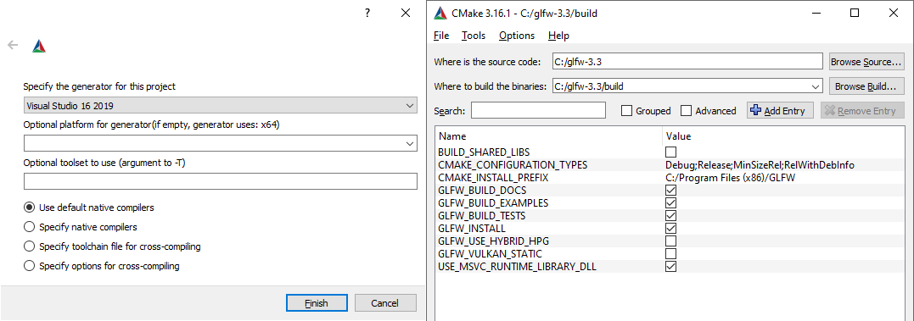
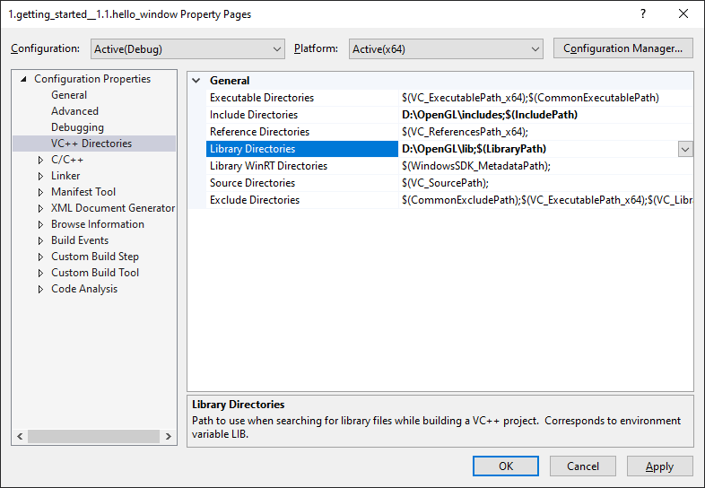
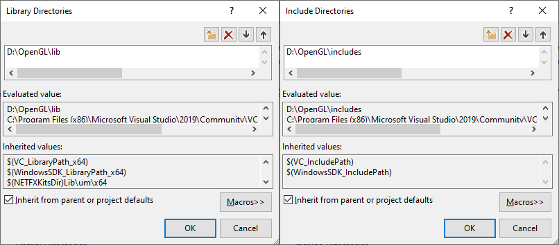
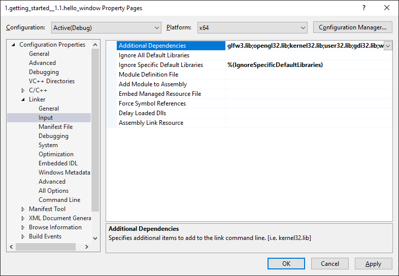

# 创建窗口

原文     | [Creating a window](http://learnopengl.com/#!Getting-started/Creating-a-window)
      ---|---
作者     | JoeyDeVries
翻译     | gjy_1992
校对     | Geequlim

在我们画出出色的效果之前，首先要做的就是创建一个OpenGL上下文(Context)和一个用于显示的窗口。然而，这些操作在每个系统上都是不一样的，OpenGL有目的地从这些操作抽象(Abstract)出去。这意味着我们不得不自己处理创建窗口，定义OpenGL上下文以及处理用户输入。

幸运的是，有一些库已经提供了我们所需的功能，其中一部分是特别针对OpenGL的。这些库节省了我们书写操作系统相关代码的时间，提供给我们一个窗口和上下文用来渲染。最流行的几个库有GLUT，SDL，SFML和GLFW。在教程里我们将使用**GLFW**。

## GLFW

GLFW是一个专门针对OpenGL的C语言库，它提供了一些渲染物体所需的最低限度的接口。它允许用户创建OpenGL上下文，定义窗口参数以及处理用户输入，这正是我们需要的。


本节和下一节的目标是建立GLFW环境，并保证它恰当地创建OpenGL上下文并显示窗口。这篇教程会一步步从获取、编译、链接GLFW库讲起。我们使用的是Microsoft Visual Studio 2012 IDE（操作过程在新版的Visual Studio都是相同的）。如果你用的不是Visual Studio（或者用的是它的旧版本）请不要担心，大多数IDE上的操作都是类似的。

## 构建GLFW

GLFW可以从它官方网站的[下载页](http://www.glfw.org/download.html)上获取。GLFW已经有针对Visual Studio 2012/2013的预编译的二进制版本和相应的头文件，但是为了完整性我们将从编译源代码开始。所以我们需要下载**源代码包**。


!!! Attention

	当你下载二进制版本时，请下载32位的版本而不是64位的除非你清楚你在做什么。大部分读者反映64位版本会出现很多奇怪的问题。

下载源码包之后，将其解压并打开。我们只需要里面的这些内容：

- 编译生成的库
- **include**文件夹

从源代码编译库可以保证生成的库是兼容你的操作系统和CPU的，而预编译的二进制文件可能会出现兼容问题（甚至有时候没提供支持你系统的文件）。提供源代码所产生的一个问题在于不是每个人都用相同的IDE开发程序，因而提供的工程文件可能和一些人的IDE不兼容。所以人们只能从.cpp和.h文件来自己建立工程，这是一项笨重的工作。因此诞生了一个叫做CMake的工具。

### CMake

CMake是一个工程文件生成工具。用户可以使用预定义好的CMake脚本，根据自己的选择（像是Visual Studio, Code::Blocks, Eclipse）生成不同IDE的工程文件。这允许我们从GLFW源码里创建一个Visual Studio 2012工程文件，之后进行编译。首先，我们需要从[这里](http://www.cmake.org/cmake/resources/software.html)下载安装CMake。我选择的是Win32安装程序。

当CMake安装成功后，你可以选择从命令行或者GUI启动CMake，由于我不想让事情变得太过复杂，我们选择用GUI。CMake需要一个源代码目录和一个存放编译结果的目标文件目录。源代码目录我们选择GLFW的源代码的根目录，然后我们新建一个 *build* 文件夹，选中作为目标目录。



之后，点击**Configure(设置)**按钮，让CMake读取设置和源代码。接下来，我们选择工程的生成器为**Visual Studio 11**（因为Visual Studio 2012的内部版本号是11.0）。CMake会显示可选的编译选项，这里我们使用默认设置，再次点击**Configure(设置)**按钮保存设置。保存之后，点击**Generate(生成)**按钮，生成的工程文件会在你的**build**文件夹中。

### 编译

在**build**文件夹里可以找到**GLFW.sln**文件，用Visual Studio 2012打开。因为CMake已经配置好了项目，所以我们直接点击**Build Solution(生成解决方案)**按钮，然后编译的库**glfw3.lib**（注意我们用的是第3版）就会出现在**src/Debug**文件夹内。

库生成完毕之后，我们需要让IDE知道库和头文件的位置。有两种方法：

1. 找到IDE或者编译器的**/lib**和**/include**文件夹，添加GLFW的**include**文件夹里的文件到IDE的**/include**文件夹里去。用类似的方法，将**glfw3.lib**添加到**/lib**文件夹里去。虽然这样能工作，但这不是推荐的方式，因为这样会让你很难去管理库和include文件，而且重新安装IDE或编译器可能会导致这些文件丢失。
2. 推荐的方式是建立一个新的目录包含所有的第三方库文件和头文件，并且在你的IDE或编译器中指定这些文件夹。我个人会使用一个单独的文件夹，里面包含**Libs**和**Include**文件夹，在这里存放OpenGL工程用到的所有第三方库和头文件。这样我的所有第三方库都在同一个位置（并且可以共享至多台电脑）。然而这要求你每次新建一个工程时都需要告诉IDE/编译器在哪能找到这些目录。

完成上面步骤后，我们就可以使用GLFW创建我们的第一个OpenGL工程了！

## 我们的第一个工程

首先，打开Visual Studio，创建一个新的项目。如果VS提供了多个选项，选择Visual C++，然后选择**Empty Project(空项目)**（别忘了给你的项目起一个合适的名字）。现在我们终于有一个空的工作空间了，开始创建我们第一个OpenGL程序吧。

## 链接

为了使我们的程序使用GLFW，我们需要把GLFW库<def>链接</def>(Link)进工程。这可以通过在链接器的设置里指定我们要使用**glfw3.lib**来完成，但是由于我们将第三方库放在另外的目录中，我们的工程还不知道在哪寻找这个文件。于是我们首先需要将我们放第三方库的目录添加进设置。

要添加这些目录（需要VS搜索库和include文件的地方），我们首先进入Project Properties(工程属性，在解决方案窗口里右键项目)，然后选择**VC++ Directories(VC++ 目录)**选项卡（如下图）。在下面的两栏添加目录：



这里你可以把自己的目录加进去，让工程知道到哪去搜索。你需要手动把目录加在后面，也可以点击需要的位置字符串，选择**<Edit..>**选项，之后会出现类似下面这幅图的界面，图是选择**Include Directories(包含目录)**时的界面：



这里可以添加任意多个目录，IDE会从这些目录里寻找头文件。所以只要你将GLFW的**Include**文件夹加进路径中，你就可以使用`<GLFW/..>`来引用头文件。库文件夹也是一样的。

现在VS可以找到所需的所有文件了。最后需要在**Linker(链接器)**选项卡里的**Input(输入)**选项卡里添加**glfw3.lib**这个文件：



要链接一个库我们必须告诉链接器它的文件名。库名字是**glfw3.lib**，我们把它加到**Additional Dependencies(附加依赖项)**字段中(手动或者使用**<Edit..>**选项都可以)。这样GLFW在编译的时候就会被链接进来了。除了GLFW之外，你还需要添加一个链接条目链接到OpenGL的库，但是这个库可能因为系统的不同而有一些差别。

### Windows上的OpenGL库

如果你是Windows平台，**opengl32.lib**已经包含在Microsoft SDK里了，它在Visual Studio安装的时候就默认安装了。由于这篇教程用的是VS编译器，并且是在Windows操作系统上，我们只需将**opengl32.lib**添加进连接器设置里就行了。

### Linux上的OpenGL库

在Linux下你需要链接**libGL.so**库文件，这需要添加`-lGL`到你的链接器设置中。如果找不到这个库你可能需要安装Mesa，NVidia或AMD的开发包，这部分因平台而异（而且我也不熟悉Linux）就不仔细讲解了。

接下来，如果你已经添加GLFW和OpenGL库到连接器设置中，你可以用如下方式添加GLFW头文件：

```c++
#include <GLFW\glfw3.h>
```

GLFW的安装与配置就到此为止。

## GLEW

到这里，我们仍然有一件事要做。因为OpenGL只是一个标准/规范，具体的实现是由驱动开发商针对特定显卡实现的。由于OpenGL驱动版本众多，它大多数函数的位置都无法在编译时确定下来，需要在运行时查询。任务就落在了开发者身上，开发者需要在运行时获取函数地址并将其保存在一个函数指针中供以后使用。取得地址的方法因平台而异，在Windows上会是类似这样：

```c++
// 定义函数原型
typedef void (*GL_GENBUFFERS) (GLsizei, GLuint*);
// 找到正确的函数并赋值给函数指针
GL_GENBUFFERS glGenBuffers  = (GL_GENBUFFERS)wglGetProcAddress("glGenBuffers");
// 现在函数可以被正常调用了
GLuint buffer;
glGenBuffers(1, &buffer);
```

你可以看到代码非常复杂，而且很繁琐，我们需要对每个可能使用的函数都要重复这个过程。幸运的是，有些库能简化此过程，其中**GLEW**是目前最新，也是最流行的库。

### 编译和链接GLEW

GLEW是OpenGL Extension Wrangler Library的缩写，它能解决我们上面提到的那个繁琐的问题。因为GLEW也是一个库，我们同样需要构建并将其链接进工程。GLEW可以从[这里](http://glew.sourceforge.net/index.html)下载，你同样可以选择下载二进制版本，如果你的目标平台列在上面的话，或者下载源码编译，步骤和编译GLFW时差不多。记住，如果不确定的话，选择32位的二进制版本。

我们使用GLEW的**静态**版本**glew32s.lib**（注意这里的's'），将库文件添加到你的库目录，将**include**内容添加到你的include目录。接下来，在VS的链接器选项里加上**glew32s.lib**。注意GLFW3（默认）也是编译成了一个静态库。


!!! Important

	**静态**(Static)链接是指编译时就将库代码里的内容整合进你的二进制文件。优点就是你不需要管理额外的文件了，只需要发布你单独的一个二进制文件就行了。缺点就是你的可执行文件会变得更大，另外当库有升级版本时，你必须重新进行编译整个程序。
	
	**动态**(Dynamic)链接是指一个库通过`.dll`或`.so`的方式存在，它的代码与你的二进制文件的代码是分离的。优点是使你的二进制文件大小变小并且更容易升级，缺点是你最终发布程序时必须带上这些DLL。

如果你希望静态链接GLEW，必须在包含GLEW头文件之前定义预处理器宏`GLEW_STATIC`：

```c++
#define GLEW_STATIC
#include <GL/glew.h>
```

如果你希望动态链接，那么你可以省略这个宏。但是记住使用动态链接的话你需要拷贝一份.DLL文件到你的应用程序目录。

!!! Important

	对于用GCC编译的Linux用户建议使用这个命令行选项`-lGLEW -lglfw3 -lGL -lX11 -lpthread -lXrandr -lXi`。没有正确链接相应的库会产生 *undefined reference*(未定义的引用) 这个错误。

我们现在成功编译了GLFW和GLEW库，我们已经准备好将进入[下一节](03 Hello Window.md)去真正使用GLFW和GLEW来设置OpenGL上下文并创建窗口。记得确保你的头文件和库文件的目录设置正确，以及链接器里引用的库文件名正确。如果仍然遇到错误，可以先看一下评论有没有人遇到类似的问题，请参考额外资源中的例子或者在下面的评论区提问。

## 附加资源

- [Building applications](http://www.opengl-tutorial.org/miscellaneous/building-your-own-c-application/): 提供了很多编译或链接相关的信息和一大列错误及对应的解决方案。
- [GLFW with Code::Blocks](http://wiki.codeblocks.org/index.php?title=Using_GLFW_with_Code::Blocks):使用Code::Blocks IDE编译GLFW。
- [Running CMake](http://www.cmake.org/runningcmake/): 简要的介绍如何在Windows和Linux上使用CMake。
- [Writing a build system under Linux](http://learnopengl.com/demo/autotools_tutorial.txt): Wouter Verholst写的一个autotools的教程，讲的是如何在Linux上编写构建系统，尤其是针对这些教程。
- [Polytonic/Glitter](https://github.com/Polytonic/Glitter): 一个简单的样板项目，它已经提前配置了所有相关的库；如果你想要很方便地搞到一个LearnOpenGL教程的范例工程，这也是很不错的。