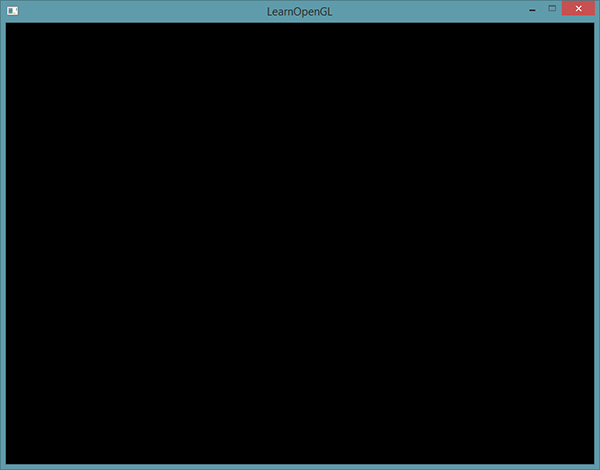
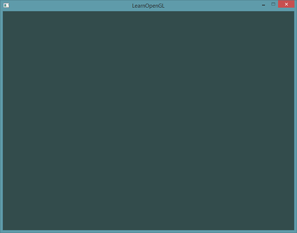

# 你好，窗口

原文     | [Hello Window](http://learnopengl.com/#!Getting-started/Hello-Window)
      ---|---
作者     | JoeyDeVries
翻译     | Geequlim, Krasjet
校对     | 暂未校对

让我们试试能不能让GLFW正常工作。首先，新建一个`.cpp`文件，然后把下面的代码粘贴到该文件的最前面。

```c++
#include <glad/glad.h>
#include <GLFW/glfw3.h>
```

!!! Attention

	请确认是在包含GLFW的头文件之前包含了GLAD的头文件。GLAD的头文件包含了正确的OpenGL头文件（例如`GL/gl.h`），所以需要在其它依赖于OpenGL的头文件之前包含GLAD。

接下来我们创建<fun>main</fun>函数，在这个函数中我们将会实例化GLFW窗口：

```c++
int main()
{
    glfwInit();
    glfwWindowHint(GLFW_CONTEXT_VERSION_MAJOR, 3);
    glfwWindowHint(GLFW_CONTEXT_VERSION_MINOR, 3);
    glfwWindowHint(GLFW_OPENGL_PROFILE, GLFW_OPENGL_CORE_PROFILE);
    //glfwWindowHint(GLFW_OPENGL_FORWARD_COMPAT, GL_TRUE);
  
    return 0;
}
```

首先，我们在main函数中调用<fun>glfwInit</fun>函数来初始化GLFW，然后我们可以使用<fun>glfwWindowHint</fun>函数来配置GLFW。<fun>glfwWindowHint</fun>函数的第一个参数代表选项的名称，我们可以从很多以`GLFW_`开头的枚举值中选择；第二个参数接受一个整型，用来设置这个选项的值。该函数的所有的选项以及对应的值都可以在 [GLFW's window handling](http://www.glfw.org/docs/latest/window.html#window_hints) 这篇文档中找到。如果你现在编译你的cpp文件会得到大量的 *undefined reference* (未定义的引用)错误，也就是说你并未顺利地链接GLFW库。

由于本站的教程都是基于OpenGL 3.3版本展开讨论的，所以我们需要告诉GLFW我们要使用的OpenGL版本是3.3，这样GLFW会在创建OpenGL上下文时做出适当的调整。这也可以确保用户在没有适当的OpenGL版本支持的情况下无法运行。我们将主版本号(Major)和次版本号(Minor)都设为3。我们同样明确告诉GLFW我们使用的是核心模式(Core-profile)。明确告诉GLFW我们需要使用核心模式意味着我们只能使用OpenGL功能的一个子集（没有我们已不再需要的向后兼容特性）。如果使用的是Mac OS X系统，你还需要加下面这行代码到你的初始化代码中这些配置才能起作用（将上面的代码解除注释）：

```c++
glfwWindowHint(GLFW_OPENGL_FORWARD_COMPAT, GL_TRUE);
```

!!! Important

	请确认您的系统支持OpenGL3.3或更高版本，否则此应用有可能会崩溃或者出现不可预知的错误。如果想要查看OpenGL版本的话，在Linux上运行**glxinfo**，或者在Windows上使用其它的工具（例如[OpenGL Extension Viewer](http://download.cnet.com/OpenGL-Extensions-Viewer/3000-18487_4-34442.html)）。如果你的OpenGL版本低于3.3，检查一下显卡是否支持OpenGL 3.3+（不支持的话你的显卡真的太老了），并更新你的驱动程序，有必要的话请更新显卡。

接下来我们创建一个窗口对象，这个窗口对象存放了所有和窗口相关的数据，而且会被GLFW的其他函数频繁地用到。

```c++
GLFWwindow* window = glfwCreateWindow(800, 600, "LearnOpenGL", NULL, NULL);
if (window == NULL)
{
    std::cout << "Failed to create GLFW window" << std::endl;
    glfwTerminate();
    return -1;
}
glfwMakeContextCurrent(window);
```

<fun>glfwCreateWindow</fun>函数需要窗口的宽和高作为它的前两个参数。第三个参数表示这个窗口的名称（标题），这里我们使用`"LearnOpenGL"`，当然你也可以使用你喜欢的名称。最后两个参数我们暂时忽略。这个函数将会返回一个<fun>GLFWwindow</fun>对象，我们会在其它的GLFW操作中使用到。创建完窗口我们就可以通知GLFW将我们窗口的上下文设置为当前线程的主上下文了。

## GLAD

在之前的教程中已经提到过，GLAD是用来管理OpenGL的函数指针的，所以在调用任何OpenGL的函数之前我们需要初始化GLAD。

```c++
if (!gladLoadGLLoader((GLADloadproc)glfwGetProcAddress))
{
    std::cout << "Failed to initialize GLAD" << std::endl;
    return -1;
}
```

我们给GLAD传入了用来加载系统相关的OpenGL函数指针地址的函数。GLFW给我们的是`glfwGetProcAddress`，它根据我们编译的系统定义了正确的函数。


## 视口

在我们开始渲染之前还有一件重要的事情要做，我们必须告诉OpenGL渲染窗口的尺寸大小，即视口(Viewport)，这样OpenGL才只能知道怎样根据窗口大小显示数据和坐标。我们可以通过调用<fun>glViewport</fun>函数来设置窗口的**维度**(Dimension)：

```c++
glViewport(0, 0, 800, 600);
```

<fun>glViewport</fun>函数前两个参数控制窗口左下角的位置。第三个和第四个参数控制渲染窗口的宽度和高度（像素）。

我们实际上也可以将视口的维度设置为比GLFW的维度小，这样子之后所有的OpenGL渲染将会在一个更小的窗口中显示，这样子的话我们也可以将一些其它元素显示在OpenGL视口之外。

!!! Important

	OpenGL幕后使用<fun>glViewport</fun>中定义的位置和宽高进行2D坐标的转换，将OpenGL中的位置坐标转换为你的屏幕坐标。例如，OpenGL中的坐标(-0.5, 0.5)有可能（最终）被映射为屏幕中的坐标(200,450)。注意，处理过的OpenGL坐标范围只为-1到1，因此我们事实上将(-1到1)范围内的坐标映射到(0, 800)和(0, 600)。

然而，当用户改变窗口的大小的时候，视口也应该被调整。我们可以对窗口注册一个回调函数(Callback Function)，它会在每次窗口大小被调整的时候被调用。这个回调函数的原型如下：

```c++
void framebuffer_size_callback(GLFWwindow* window, int width, int height);
```

这个帧缓冲大小函数需要一个<fun>GLFWwindow</fun>作为它的第一个参数，以及两个整数表示窗口的新维度。每当窗口改变大小，GLFW会调用这个函数并填充相应的参数供你处理。

```c++
void framebuffer_size_callback(GLFWwindow* window, int width, int height)
{
    glViewport(0, 0, width, height);
}
```

我们还需要注册这个函数，告诉GLFW我们希望每当窗口调整大小的时候调用这个函数：

```c++
glfwSetFramebufferSizeCallback(window, framebuffer_size_callback);
```

当窗口被第一次显示的时候<fun>framebuffer_size_callback</fun>也会被调用。对于视网膜(Retina)显示屏，<var>width</var>和<var>height</var>都会明显比原输入值更高一点。

我们还可以将我们的函数注册到其它很多的回调函数中。比如说，我们可以创建一个回调函数来处理手柄输入变化，处理错误消息等。我们会在创建窗口之后，渲染循环初始化之前注册这些回调函数。

# 准备好你的引擎

我们可不希望只绘制一个图像之后我们的应用程序就立即退出并关闭窗口。我们希望程序在我们主动关闭它之前不断绘制图像并能够接受用户输入。因此，我们需要在程序中添加一个while循环，我们可以把它称之为<def>渲染循环</def>(Render Loop)，它能在我们让GLFW退出前一直保持运行。下面几行的代码就实现了一个简单的渲染循环：

```c++
while(!glfwWindowShouldClose(window))
{
    glfwSwapBuffers(window);
    glfwPollEvents();    
}
```

- <fun>glfwWindowShouldClose</fun>函数在我们每次循环的开始前检查一次GLFW是否被要求退出，如果是的话该函数返回`true`然后渲染循环便结束了，之后为我们就可以关闭应用程序了。
- <fun>glfwPollEvents</fun>函数检查有没有触发什么事件（比如键盘输入、鼠标移动等）、更新窗口状态，并调用对应的回调函数（可以通过回调方法手动设置）。
- <fun>glfwSwapBuffers</fun>函数会交换颜色缓冲（它是一个储存着GLFW窗口每一个像素颜色值的大缓冲），它在这一迭代中被用来绘制，并且将会作为输出显示在屏幕上。

!!! Important

	**双缓冲(Double Buffer)**

	应用程序使用单缓冲绘图时可能会存在图像闪烁的问题。 这是因为生成的图像不是一下子被绘制出来的，而是按照从左到右，由上而下逐像素地绘制而成的。最终图像不是在瞬间显示给用户，而是通过一步一步生成的，这会导致渲染的结果很不真实。为了规避这些问题，我们应用双缓冲渲染窗口应用程序。**前**缓冲保存着最终输出的图像，它会在屏幕上显示；而所有的的渲染指令都会在**后**缓冲上绘制。当所有的渲染指令执行完毕后，我们**交换**(Swap)前缓冲和后缓冲，这样图像就立即呈显出来，之前提到的不真实感就消除了。

## 最后一件事

当渲染循环结束后我们需要正确释放/删除之前的分配的所有资源。我们可以在<fun>main</fun>函数的最后调用<fun>glfwTerminate</fun>函数来完成。

```c++
glfwTerminate();
return 0;
```

这样便能清理所有的资源并正确地退出应用程序。现在你可以尝试编译并运行你的应用程序了，如果没做错的话，你将会看到如下的输出：



如果你看见了一个非常无聊的黑色窗口，那么就对了！如果你没得到正确的结果，或者你不知道怎么把所有东西放到一起，请到[这里](https://learnopengl.com/code_viewer_gh.php?code=src/1.getting_started/1.1.hello_window/hello_window.cpp)参考源代码。

如果程序编译有问题，请先检查连接器选项是否正确，IDE中是否导入了正确的目录（前面教程解释过）。并且请确认你的代码是否正确，直接对照上面提供的源代码就行了。如果还是有问题，欢迎评论，我或者其他人可能会帮助你的。

## 输入

我们同样也希望能够在GLFW中实现一些输入控制，这可以通过使用GLFW的几个输入函数来完成。我们将会使用GLFW的<fun>glfwGetKey</fun>函数，它需要一个窗口以及一个按键作为输入。这个函数将会返回这个按键是否正在被按下。我们将创建一个<fun>processInput</fun>函数来让所有的输入代码保持整洁。

```c++
void processInput(GLFWwindow *window)
{
    if(glfwGetKey(window, GLFW_KEY_ESCAPE) == GLFW_PRESS)
        glfwSetWindowShouldClose(window, true);
}
```

这里我们检查用户是否按下了返回键(Esc)（如果没有按下，<fun>glfwGetKey</fun>将会返回<var>GLFW_RELEASE</var>。如果用户的确按下了返回键，我们将通过<fun>glfwSetwindowShouldClose</fun>使用把`WindowShouldClose`属性设置为 `true`的方法关闭GLFW。下一次while循环的条件检测将会失败，程序将会关闭。

我们接下来在渲染循环的每一个迭代中调用<fun>processInput</fun>：

```c++
while (!glfwWindowShouldClose(window))
{
    processInput(window);

    glfwSwapBuffers(window);
    glfwPollEvents();
}
```

这就给我们一个非常简单的方式来检测特定的键是否被按下，并在每一帧做出处理。

## 渲染

我们要把所有的渲染(Rendering)操作放到渲染循环中，因为我们想让这些渲染指令在每次渲染循环迭代的时候都能被执行。代码将会是这样的：

```c++
// 渲染循环
while(!glfwWindowShouldClose(window))
{
    // 输入
    processInput(window);

    // 渲染指令
    ...

    // 检查并调用事件，交换缓冲
    glfwPollEvents();
    glfwSwapBuffers(window);
}
```

为了测试一切都正常工作，我们使用一个自定义的颜色清空屏幕。在每个新的渲染迭代开始的时候我们总是希望清屏，否则我们仍能看见上一次迭代的渲染结果（这可能是你想要的效果，但通常这不是）。我们可以通过调用<fun>glClear</fun>函数来清空屏幕的颜色缓冲，它接受一个缓冲位(Buffer Bit)来指定要清空的缓冲，可能的缓冲位有<var>GL_COLOR_BUFFER_BIT</var>，<var>GL_DEPTH_BUFFER_BIT</var>和<var>GL_STENCIL_BUFFER_BIT</var>。由于现在我们只关心颜色值，所以我们只清空颜色缓冲。

```c++
glClearColor(0.2f, 0.3f, 0.3f, 1.0f);
glClear(GL_COLOR_BUFFER_BIT);
```

注意，除了<fun>glClear</fun>之外，我们还调用了<fun>glClearColor</fun>来设置清空屏幕所用的颜色。当调用<fun>glClear</fun>函数，清除颜色缓冲之后，整个颜色缓冲都会被填充为<fun>glClearColor</fun>里所设置的颜色。在这里，我们将屏幕设置为了类似黑板的深蓝绿色。

!!! Important

	你应该能够回忆起来我们在 *OpenGL* 这节教程的内容，<fun>glClearColor</fun>函数是一个**状态设置**函数，而<fun>glClear</fun>函数则是一个**状态使用**的函数，它使用了当前的状态来获取应该清除为的颜色。



这个程序的完整源代码可以在[这里](https://learnopengl.com/code_viewer_gh.php?code=src/1.getting_started/1.2.hello_window_clear/hello_window_clear.cpp)找到。

好了，现在我们已经做好开始在渲染循环中添加许多渲染调用的准备了，但这是[下一节](04 Hello Triangle.md)教程了，这一节的内容已经太多了。