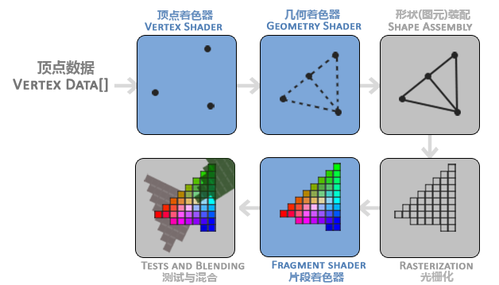
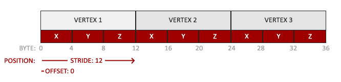
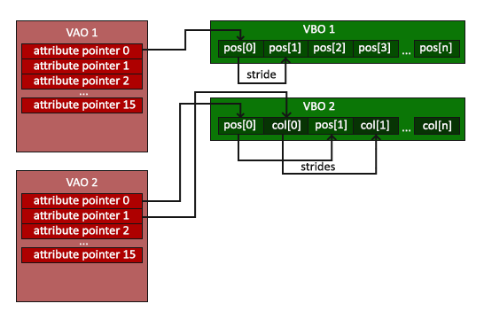
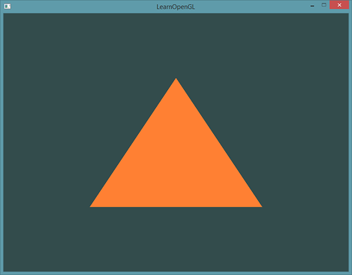
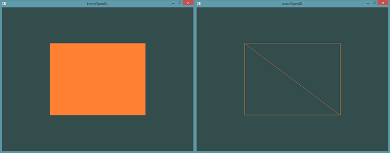

# 你好，三角形

原文     | [Hello Triangle](http://www.learnopengl.com/#!Getting-started/Hello-Triangle)
      ---|---
作者     | JoeyDeVries
翻译     | [Django](http://bullteacher.com/), Krasjet, Geequlim
校对     | 暂未校对

!!! note "译注"

	在学习此节之前，建议将这三个单词先记下来：
	
	- 顶点数组对象：Vertex Array Object，VAO
	- 顶点缓冲对象：Vertex Buffer Object，VBO
	- 索引缓冲对象：Element Buffer Object，EBO或Index Buffer Object，IBO
	
	当指代这三个东西的时候，可能使用的是全称，也可能用的是英文缩写，翻译的时候和原文保持的一致。由于没有英文那样的分词间隔，中文全称的部分可能不太容易注意。但请记住，缩写和中文全称指代的是一个东西。

在OpenGL中，任何事物都在3D空间中，而屏幕和窗口却是2D像素数组，这导致OpenGL的大部分工作都是关于把3D坐标转变为适应你屏幕的2D像素。3D坐标转为2D坐标的处理过程是由OpenGL的<def>图形渲染管线</def>（Graphics Pipeline，大多译为管线，实际上指的是一堆原始图形数据途经一个输送管道，期间经过各种变化处理最终出现在屏幕的过程）管理的。图形渲染管线可以被划分为两个主要部分：第一部分把你的3D坐标转换为2D坐标，第二部分是把2D坐标转变为实际的有颜色的像素。这个教程里，我们会简单地讨论一下图形渲染管线，以及如何利用它创建一些漂亮的像素。

!!! Important

	2D坐标和像素也是不同的，2D坐标精确表示一个点在2D空间中的位置，而2D像素是这个点的近似值，2D像素受到你的屏幕/窗口分辨率的限制。

图形渲染管线接受一组3D坐标，然后把它们转变为你屏幕上的有色2D像素输出。图形渲染管线可以被划分为几个阶段，每个阶段将会把前一个阶段的输出作为输入。所有这些阶段都是高度专门化的（它们都有一个特定的函数），并且很容易并行执行。正是由于它们具有并行执行的特性，当今大多数显卡都有成千上万的小处理核心，它们在GPU上为每一个（渲染管线）阶段运行各自的小程序，从而在图形渲染管线中快速处理你的数据。这些小程序叫做<def>着色器</def>(Shader)。

有些着色器允许开发者自己配置，这就允许我们用自己写的着色器来替换默认的。这样我们就可以更细致地控制图形渲染管线中的特定部分了，而且因为它们运行在GPU上，所以它们可以给我们节约宝贵的CPU时间。OpenGL着色器是用<def>OpenGL着色器语言</def>(OpenGL Shading Language, <def>GLSL</def>)写成的，在下一节中我们再花更多时间研究它。

下面，你会看到一个图形渲染管线的每个阶段的抽象展示。要注意蓝色部分代表的是我们可以注入自定义的着色器的部分。



如你所见，图形渲染管线包含很多部分，每个部分都将在转换顶点数据到最终像素这一过程中处理各自特定的阶段。我们会概括性地解释一下渲染管线的每个部分，让你对图形渲染管线的工作方式有个大概了解。

首先，我们以数组的形式传递3个3D坐标作为图形渲染管线的输入，用来表示一个三角形，这个数组叫做顶点数据(Vertex Data)；顶点数据是一系列顶点的集合。一个<def>顶点</def>(Vertex)是一个3D坐标的数据的集合。而顶点数据是用<def>顶点属性</def>(Vertex Attribute)表示的，它可以包含任何我们想用的数据，但是简单起见，我们还是假定每个顶点只由一个3D位置(译注1)和一些颜色值组成的吧。

!!! note "译注1"

	当我们谈论一个“位置”的时候，它代表在一个“空间”中所处地点的这个特殊属性；同时“空间”代表着任何一种坐标系，比如x、y、z三维坐标系，x、y二维坐标系，或者一条直线上的x和y的线性关系，只不过二维坐标系是一个扁扁的平面空间，而一条直线是一个很瘦的长长的空间。

!!! Important

	为了让OpenGL知道我们的坐标和颜色值构成的到底是什么，OpenGL需要你去指定这些数据所表示的渲染类型。我们是希望把这些数据渲染成一系列的点？一系列的三角形？还是仅仅是一个长长的线？做出的这些提示叫做<def>图元</def>(Primitive)，任何一个绘制指令的调用都将把图元传递给OpenGL。这是其中的几个：<var>GL_POINTS</var>、<var>GL_TRIANGLES</var>、<var>GL_LINE_STRIP</var>。

图形渲染管线的第一个部分是<def>顶点着色器</def>(Vertex Shader)，它把一个单独的顶点作为输入。顶点着色器主要的目的是把3D坐标转为另一种3D坐标（后面会解释），同时顶点着色器允许我们对顶点属性进行一些基本处理。

<def>图元装配</def>(Primitive Assembly)阶段将顶点着色器输出的所有顶点作为输入（如果是<var>GL_POINTS</var>，那么就是一个顶点），并所有的点装配成指定图元的形状；本节例子中是一个三角形。

图元装配阶段的输出会传递给<def>几何着色器</def>(Geometry Shader)。几何着色器把图元形式的一系列顶点的集合作为输入，它可以通过产生新顶点构造出新的（或是其它的）图元来生成其他形状。例子中，它生成了另一个三角形。

几何着色器的输出会被传入<def>光栅化阶段</def>(Rasterization Stage)，这里它会把图元映射为最终屏幕上相应的像素，生成供片段着色器(Fragment Shader)使用的片段(Fragment)。在片段着色器运行之前会执行<def>裁切</def>(Clipping)。裁切会丢弃超出你的视图以外的所有像素，用来提升执行效率。

!!! Important

	OpenGL中的一个片段是OpenGL渲染一个像素所需的所有数据。

<def>片段着色器</def>的主要目的是计算一个像素的最终颜色，这也是所有OpenGL高级效果产生的地方。通常，片段着色器包含3D场景的数据（比如光照、阴影、光的颜色等等），这些数据可以被用来计算最终像素的颜色。

在所有对应颜色值确定以后，最终的对象将会被传到最后一个阶段，我们叫做<def>Alpha测试</def>和<def>混合</def>(Blending)阶段。这个阶段检测片段的对应的深度（和模板(Stencil)）值（后面会讲），用它们来判断这个像素是其它物体的前面还是后面，决定是否应该丢弃。这个阶段也会检查<def>alpha</def>值（alpha值定义了一个物体的透明度）并对物体进行<def>混合</def>(Blend)。所以，即使在片段着色器中计算出来了一个像素输出的颜色，在渲染多个三角形的时候最后的像素颜色也可能完全不同。

可以看到，图形渲染管线非常复杂，它包含很多可配置的部分。然而，对于大多数场合，我们只需要配置顶点和片段着色器就行了。几何着色器是可选的，通常使用它默认的着色器就行了。

在现代OpenGL中，我们**必须**定义至少一个顶点着色器和一个片段着色器（因为GPU中没有默认的顶点/片段着色器）。出于这个原因，刚开始学习现代OpenGL的时候可能会非常困难，因为在你能够渲染自己的第一个三角形之前已经需要了解一大堆知识了。在本节结束你最终渲染出你的三角形的时候，你也会了解到非常多的图形编程知识。

## 顶点输入

开始绘制图形之前，我们必须先给OpenGL输入一些顶点数据。OpenGL是一个3D图形库，所以我们在OpenGL中指定的所有坐标都是3D坐标（x、y和z）。OpenGL不是简单地把**所有的**3D坐标变换为屏幕上的2D像素；OpenGL仅当3D坐标在3个轴（x、y和z）上都为-1.0到1.0的范围内时才处理它。所有在所谓的<def>标准化设备坐标</def>(Normalized Device Coordinates)范围内的坐标才会最终呈现在屏幕上（在这个范围以外的坐标都不会显示）。

由于我们希望渲染一个三角形，我们一共要指定三个顶点，每个顶点都有一个3D位置。我们会将它们以标准化设备坐标的形式（OpenGL的可见区域）定义为一个`float`数组。

```c++
float vertices[] = {
    -0.5f, -0.5f, 0.0f,
     0.5f, -0.5f, 0.0f,
     0.0f,  0.5f, 0.0f
};
```

由于OpenGL是在3D空间中工作的，而我们渲染的是一个2D三角形，我们将它顶点的z坐标设置为0.0。这样子的话三角形每一点的**深度**(Depth，译注2)都是一样的，从而使它看上去像是2D的。

!!! note "译注2"

	通常深度可以理解为z坐标，它代表一个像素在空间中和你的距离，如果离你远就可能被别的像素遮挡，你就看不到它了，它会被丢弃，以节省资源。

!!! Important

	**标准化设备坐标(Normalized Device Coordinates, NDC)**

	一旦你的顶点坐标已经在顶点着色器中处理过，它们就应该是**标准化设备坐标**了，标准化设备坐标是一个x、y和z值在-1.0到1.0的一小段空间。任何落在范围外的坐标都会被丢弃/裁剪，不会显示在你的屏幕上。下面你会看到我们定义的在标准化设备坐标中的三角形(忽略z轴)：

	

	与通常的屏幕坐标不同，y轴正方向为向上，(0, 0)坐标是这个图像的中心，而不是左上角。最终你希望所有(变换过的)坐标都在这个坐标空间中，否则它们就不可见了。

	你的标准化设备坐标接着会变换为<def>屏幕空间坐标</def>(Screen-space Coordinates)，这是使用你通过<fun>glViewport</fun>函数提供的数据，进行<def>视口变换</def>(Viewport Transform)完成的。所得的屏幕空间坐标又会被变换为片段输入到片段着色器中。

定义这样的顶点数据以后，我们会把它作为输入发送给图形渲染管线的第一个处理阶段：顶点着色器。它会在GPU上创建内存用于储存我们的顶点数据，还要配置OpenGL如何解释这些内存，并且指定其如何发送给显卡。顶点着色器接着会处理我们在内存中指定数量的顶点。

我们通过<def>顶点缓冲对象</def>(Vertex Buffer Objects, VBO)管理这个内存，它会在GPU内存（通常被称为显存）中储存大量顶点。使用这些缓冲对象的好处是我们可以一次性的发送一大批数据到显卡上，而不是每个顶点发送一次。从CPU把数据发送到显卡相对较慢，所以只要可能我们都要尝试尽量一次性发送尽可能多的数据。当数据发送至显卡的内存中后，顶点着色器几乎能立即访问顶点，这是个非常快的过程。

顶点缓冲对象是我们在[OpenGL](01 OpenGL.md)教程中第一个出现的OpenGL对象。就像OpenGL中的其它对象一样，这个缓冲有一个独一无二的ID，所以我们可以使用<fun>glGenBuffers</fun>函数和一个缓冲ID生成一个VBO对象：

```c++
unsigned int VBO;
glGenBuffers(1, &VBO);
```

OpenGL有很多缓冲对象类型，顶点缓冲对象的缓冲类型是<var>GL_ARRAY_BUFFER</var>。OpenGL允许我们同时绑定多个缓冲，只要它们是不同的缓冲类型。我们可以使用<fun>glBindBuffer</fun>函数把新创建的缓冲绑定到<var>GL_ARRAY_BUFFER</var>目标上：

```c++
glBindBuffer(GL_ARRAY_BUFFER, VBO);  
```

从这一刻起，我们使用的任何（在<var>GL_ARRAY_BUFFER</var>目标上的）缓冲调用都会用来配置当前绑定的缓冲(<var>VBO</var>)。然后我们可以调用<fun>glBufferData</fun>函数，它会把之前定义的顶点数据复制到缓冲的内存中：

```c++
glBufferData(GL_ARRAY_BUFFER, sizeof(vertices), vertices, GL_STATIC_DRAW);
```

<fun>glBufferData</fun>是一个专门用来把用户定义的数据复制到当前绑定缓冲的函数。它的第一个参数是目标缓冲的类型：顶点缓冲对象当前绑定到<var>GL_ARRAY_BUFFER</var>目标上。第二个参数指定传输数据的大小(以字节为单位)；用一个简单的`sizeof`计算出顶点数据大小就行。第三个参数是我们希望发送的实际数据。

第四个参数指定了我们希望显卡如何管理给定的数据。它有三种形式：

- <var>GL_STATIC_DRAW</var> ：数据不会或几乎不会改变。
- <var>GL_DYNAMIC_DRAW</var>：数据会被改变很多。
- <var>GL_STREAM_DRAW</var> ：数据每次绘制时都会改变。

三角形的位置数据不会改变，每次渲染调用时都保持原样，所以它的使用类型最好是<var>GL_STATIC_DRAW</var>。如果，比如说一个缓冲中的数据将频繁被改变，那么使用的类型就是<var>GL_DYNAMIC_DRAW</var>或<var>GL_STREAM_DRAW</var>，这样就能确保显卡把数据放在能够高速写入的内存部分。

现在我们已经把顶点数据储存在显卡的内存中，用<var>VBO</var>这个顶点缓冲对象管理。下面我们会创建一个顶点和片段着色器来真正处理这些数据。现在我们开始着手创建它们吧。

## 顶点着色器

顶点着色器(Vertex Shader)是几个可编程着色器中的一个。如果我们打算做渲染的话，现代OpenGL需要我们至少设置一个顶点和一个片段着色器。我们会简要介绍一下着色器以及配置两个非常简单的着色器来绘制我们第一个三角形。下一节中我们会更详细的讨论着色器。

我们需要做的第一件事是用着色器语言GLSL(OpenGL Shading Language)编写顶点着色器，然后编译这个着色器，这样我们就可以在程序中使用它了。下面你会看到一个非常基础的GLSL顶点着色器的源代码：

```c++
#version 330 core
layout (location = 0) in vec3 aPos;

void main()
{
    gl_Position = vec4(aPos.x, aPos.y, aPos.z, 1.0);
}
```

可以看到，GLSL看起来很像C语言。每个着色器都起始于一个版本声明。OpenGL 3.3以及和更高版本中，GLSL版本号和OpenGL的版本是匹配的（比如说GLSL 420版本对应于OpenGL 4.2）。我们同样明确表示我们会使用核心模式。

下一步，使用`in`关键字，在顶点着色器中声明所有的输入顶点属性(Input Vertex Attribute)。现在我们只关心位置(Position)数据，所以我们只需要一个顶点属性。GLSL有一个向量数据类型，它包含1到4个`float`分量，包含的数量可以从它的后缀数字看出来。由于每个顶点都有一个3D坐标，我们就创建一个`vec3`输入变量<var>aPos</var>。我们同样也通过`layout (location = 0)`设定了输入变量的位置值(Location)你后面会看到为什么我们会需要这个位置值。

!!! Important

	**向量(Vector)**

	在图形编程中我们经常会使用向量这个数学概念，因为它简明地表达了任意空间中的位置和方向，并且它有非常有用的数学属性。在GLSL中一个向量有最多4个分量，每个分量值都代表空间中的一个坐标，它们可以通过`vec.x`、`vec.y`、`vec.z`和`vec.w`来获取。注意`vec.w`分量不是用作表达空间中的位置的（我们处理的是3D不是4D），而是用在所谓透视除法(Perspective Division)上。我们会在后面的教程中更详细地讨论向量。

为了设置顶点着色器的输出，我们必须把位置数据赋值给预定义的<var>gl_Position</var>变量，它在幕后是`vec4`类型的。在<fun>main</fun>函数的最后，我们将<var>gl_Position</var>设置的值会成为该顶点着色器的输出。由于我们的输入是一个3分量的向量，我们必须把它转换为4分量的。我们可以把`vec3`的数据作为`vec4`构造器的参数，同时把`w`分量设置为`1.0f`（我们会在后面解释为什么）来完成这一任务。

当前这个顶点着色器可能是我们能想到的最简单的顶点着色器了，因为我们对输入数据什么都没有处理就把它传到着色器的输出了。在真实的程序里输入数据通常都不是标准化设备坐标，所以我们首先必须先把它们转换至OpenGL的可视区域内。

## 编译着色器
现在，我们暂时将顶点着色器的源代码硬编码在代码文件顶部的C风格字符串中：

```c++
const char *vertexShaderSource = "#version 330 core\n"
    "layout (location = 0) in vec3 aPos;\n"
    "void main()\n"
    "{\n"
    "   gl_Position = vec4(aPos.x, aPos.y, aPos.z, 1.0);\n"
    "}\0";
```

为了能够让OpenGL使用它，我们必须在运行时动态编译它的源代码。

我们首先要做的是创建一个着色器对象，注意还是用ID来引用的。所以我们储存这个顶点着色器为`unsigned int`，然后用<fun>glCreateShader</fun>创建这个着色器：

```c++
unsigned int vertexShader;
vertexShader = glCreateShader(GL_VERTEX_SHADER);
```

我们把需要创建的着色器类型以参数形式提供给<fun>glCreateShader</fun>。由于我们正在创建一个顶点着色器，传递的参数是<var>GL_VERTEX_SHADER</var>。

下一步我们把这个着色器源码附加到着色器对象上，然后编译它：

```c++
glShaderSource(vertexShader, 1, &vertexShaderSource, NULL);
glCompileShader(vertexShader);
```

<fun>glShaderSource</fun>函数把要编译的着色器对象作为第一个参数。第二参数指定了传递的源码字符串数量，这里只有一个。第三个参数是顶点着色器真正的源码，第四个参数我们先设置为`NULL`。

!!! Important

	你可能会希望检测在调用<fun>glCompileShader</fun>后编译是否成功了，如果没成功的话，你还会希望知道错误是什么，这样你才能修复它们。检测编译时错误可以通过以下代码来实现：
	
	    int  success;
    	char infoLog[512];
    	glGetShaderiv(vertexShader, GL_COMPILE_STATUS, &success);

	首先我们定义一个整型变量来表示是否成功编译，还定义了一个储存错误消息（如果有的话）的容器。然后我们用<fun>glGetShaderiv</fun>检查是否编译成功。如果编译失败，我们会用<fun>glGetShaderInfoLog</fun>获取错误消息，然后打印它。

		if(!success)
		{
		    glGetShaderInfoLog(vertexShader, 512, NULL, infoLog);
		    std::cout << "ERROR::SHADER::VERTEX::COMPILATION_FAILED\n" << infoLog << std::endl;
		}

如果编译的时候没有检测到任何错误，顶点着色器就被编译成功了。

## 片段着色器

片段着色器(Fragment Shader)是第二个也是最后一个我们打算创建的用于渲染三角形的着色器。片段着色器所做的是计算像素最后的颜色输出。为了让事情更简单，我们的片段着色器将会一直输出橘黄色。

!!! Important

	在计算机图形中颜色被表示为有4个元素的数组：红色、绿色、蓝色和alpha(透明度)分量，通常缩写为RGBA。当在OpenGL或GLSL中定义一个颜色的时候，我们把颜色每个分量的强度设置在0.0到1.0之间。比如说我们设置红为1.0f，绿为1.0f，我们会得到两个颜色的混合色，即黄色。这三种颜色分量的不同调配可以生成超过1600万种不同的颜色！

```c++
#version 330 core
out vec4 FragColor;

void main()
{
    FragColor = vec4(1.0f, 0.5f, 0.2f, 1.0f);
} 
```

片段着色器只需要一个输出变量，这个变量是一个4分量向量，它表示的是最终的输出颜色，我们应该自己将其计算出来。声明输出变量可以使用`out`关键字，这里我们命名为<var>FragColor</var>。下面，我们将一个Alpha值为1.0(1.0代表完全不透明)的橘黄色的`vec4`赋值给颜色输出。

编译片段着色器的过程与顶点着色器类似，只不过我们使用<var>GL_FRAGMENT_SHADER</var>常量作为着色器类型：

```c++
unsigned int fragmentShader;
fragmentShader = glCreateShader(GL_FRAGMENT_SHADER);
glShaderSource(fragmentShader, 1, &fragmentShaderSource, NULL);
glCompileShader(fragmentShader);
```

两个着色器现在都编译了，剩下的事情是把两个着色器对象链接到一个用来渲染的<def>着色器程序</def>(Shader Program)中。

### 着色器程序

着色器程序对象(Shader Program Object)是多个着色器合并之后并最终链接完成的版本。如果要使用刚才编译的着色器我们必须把它们<def>链接</def>(Link)为一个着色器程序对象，然后在渲染对象的时候激活这个着色器程序。已激活着色器程序的着色器将在我们发送渲染调用的时候被使用。

当链接着色器至一个程序的时候，它会把每个着色器的输出链接到下个着色器的输入。当输出和输入不匹配的时候，你会得到一个连接错误。

创建一个程序对象很简单：

```c++
unsigned int shaderProgram;
shaderProgram = glCreateProgram();
```

<fun>glCreateProgram</fun>函数创建一个程序，并返回新创建程序对象的ID引用。现在我们需要把之前编译的着色器附加到程序对象上，然后用<fun>glLinkProgram</fun>链接它们：

```c++
glAttachShader(shaderProgram, vertexShader);
glAttachShader(shaderProgram, fragmentShader);
glLinkProgram(shaderProgram);
```

代码应该很清楚，我们把着色器附加到了程序上，然后用<fun>glLinkProgram</fun>链接。

!!! Important

	就像着色器的编译一样，我们也可以检测链接着色器程序是否失败，并获取相应的日志。与上面不同，我们不会调用<fun>glGetShaderiv</fun>和<fun>glGetShaderInfoLog</fun>，现在我们使用：

		glGetProgramiv(shaderProgram, GL_LINK_STATUS, &success);
		if(!success) {
		    glGetProgramInfoLog(shaderProgram, 512, NULL, infoLog);
		    ...
		}

得到的结果就是一个程序对象，我们可以调用<fun>glUseProgram</fun>函数，用刚创建的程序对象作为它的参数，以激活这个程序对象：

```c++
glUseProgram(shaderProgram);
```

在<fun>glUseProgram</fun>函数调用之后，每个着色器调用和渲染调用都会使用这个程序对象（也就是之前写的着色器)了。

对了，在把着色器对象链接到程序对象以后，记得删除着色器对象，我们不再需要它们了：

```c++
glDeleteShader(vertexShader);
glDeleteShader(fragmentShader);
```

现在，我们已经把输入顶点数据发送给了GPU，并指示了GPU如何在顶点和片段着色器中处理它。就快要完成了，但还没结束，OpenGL还不知道它该如何解释内存中的顶点数据，以及它该如何将顶点数据链接到顶点着色器的属性上。我们需要告诉OpenGL怎么做。

## 链接顶点属性

顶点着色器允许我们指定任何以顶点属性为形式的输入。这使其具有很强的灵活性的同时，它还的确意味着我们必须手动指定输入数据的哪一个部分对应顶点着色器的哪一个顶点属性。所以，我们必须在渲染前指定OpenGL该如何解释顶点数据。

我们的顶点缓冲数据会被解析为下面这样子：



- 位置数据被储存为32位（4字节）浮点值。
- 每个位置包含3个这样的值。
- 在这3个值之间没有空隙（或其他值）。这几个值在数组中<def>紧密排列</def>(Tightly Packed)。
- 数据中第一个值在缓冲开始的位置。

有了这些信息我们就可以使用<fun>glVertexAttribPointer</fun>函数告诉OpenGL该如何解析顶点数据（应用到逐个顶点属性上）了：

```c++
glVertexAttribPointer(0, 3, GL_FLOAT, GL_FALSE, 3 * sizeof(float), (void*)0);
glEnableVertexAttribArray(0);
```

<var>glVertexAttribPointer</var>函数的参数非常多，所以我会逐一介绍它们：

- 第一个参数指定我们要配置的顶点属性。还记得我们在顶点着色器中使用`layout(location = 0)`定义了<var>position</var>顶点属性的位置值(Location)吗？它可以把顶点属性的位置值设置为`0`。因为我们希望把数据传递到这一个顶点属性中，所以这里我们传入`0`。
- 第二个参数指定顶点属性的大小。顶点属性是一个`vec3`，它由3个值组成，所以大小是3。
- 第三个参数指定数据的类型，这里是<var>GL_FLOAT</var>(GLSL中`vec*`都是由浮点数值组成的)。
- 下个参数定义我们是否希望数据被标准化(Normalize)。如果我们设置为<var>GL_TRUE</var>，所有数据都会被映射到0（对于有符号型signed数据是-1）到1之间。我们把它设置为<var>GL_FALSE</var>。
- 第五个参数叫做<def>步长</def>(Stride)，它告诉我们在连续的顶点属性组之间的间隔。由于下个组位置数据在3个`float`之后，我们把步长设置为`3 * sizeof(float)`。要注意的是由于我们知道这个数组是紧密排列的（在两个顶点属性之间没有空隙）我们也可以设置为0来让OpenGL决定具体步长是多少（只有当数值是紧密排列时才可用）。一旦我们有更多的顶点属性，我们就必须更小心地定义每个顶点属性之间的间隔，我们在后面会看到更多的例子（译注: 这个参数的意思简单说就是从这个属性第二次出现的地方到整个数组0位置之间有多少字节）。
- 最后一个参数的类型是`void*`，所以需要我们进行这个奇怪的强制类型转换。它表示位置数据在缓冲中起始位置的<def>偏移量</def>(Offset)。由于位置数据在数组的开头，所以这里是0。我们会在后面详细解释这个参数。

!!! Important

	每个顶点属性从一个VBO管理的内存中获得它的数据，而具体是从哪个VBO（程序中可以有多个VBO）获取则是通过在调用<fun>glVertexAttribPointer</fun>时绑定到<var>GL_ARRAY_BUFFER</var>的VBO决定的。由于在调用<fun>glVertexAttribPointer</fun>之前绑定的是先前定义的<var>VBO</var>对象，顶点属性`0`现在会链接到它的顶点数据。

现在我们已经定义了OpenGL该如何解释顶点数据，我们现在应该使用<fun>glEnableVertexAttribArray</fun>，以顶点属性位置值作为参数，启用顶点属性；顶点属性默认是禁用的。自此，所有东西都已经设置好了：我们使用一个顶点缓冲对象将顶点数据初始化至缓冲中，建立了一个顶点和一个片段着色器，并告诉了OpenGL如何把顶点数据链接到顶点着色器的顶点属性上。在OpenGL中绘制一个物体，代码会像是这样：

```c++
// 0. 复制顶点数组到缓冲中供OpenGL使用
glBindBuffer(GL_ARRAY_BUFFER, VBO);
glBufferData(GL_ARRAY_BUFFER, sizeof(vertices), vertices, GL_STATIC_DRAW);
// 1. 设置顶点属性指针
glVertexAttribPointer(0, 3, GL_FLOAT, GL_FALSE, 3 * sizeof(float), (void*)0);
glEnableVertexAttribArray(0);
// 2. 当我们渲染一个物体时要使用着色器程序
glUseProgram(shaderProgram);
// 3. 绘制物体
someOpenGLFunctionThatDrawsOurTriangle();
```

每当我们绘制一个物体的时候都必须重复这一过程。这看起来可能不多，但是如果有超过5个顶点属性，上百个不同物体呢（这其实并不罕见）。绑定正确的缓冲对象，为每个物体配置所有顶点属性很快就变成一件麻烦事。有没有一些方法可以使我们把所有这些状态配置储存在一个对象中，并且可以通过绑定这个对象来恢复状态呢？

### 顶点数组对象

<def>顶点数组对象</def>(Vertex Array Object, <def>VAO</def>)可以像顶点缓冲对象那样被绑定，任何随后的顶点属性调用都会储存在这个VAO中。这样的好处就是，当配置顶点属性指针时，你只需要将那些调用执行一次，之后再绘制物体的时候只需要绑定相应的VAO就行了。这使在不同顶点数据和属性配置之间切换变得非常简单，只需要绑定不同的VAO就行了。刚刚设置的所有状态都将存储在VAO中

!!! Attention

	OpenGL的核心模式**要求**我们使用VAO，所以它知道该如何处理我们的顶点输入。如果我们绑定VAO失败，OpenGL会拒绝绘制任何东西。

一个顶点数组对象会储存以下这些内容：

- <fun>glEnableVertexAttribArray</fun>和<fun>glDisableVertexAttribArray</fun>的调用。
- 通过<fun>glVertexAttribPointer</fun>设置的顶点属性配置。
- 通过<fun>glVertexAttribPointer</fun>调用与顶点属性关联的顶点缓冲对象。



创建一个VAO和创建一个VBO很类似：

```c++
unsigned int VAO;
glGenVertexArrays(1, &VAO);
```

要想使用VAO，要做的只是使用<fun>glBindVertexArray</fun>绑定VAO。从绑定之后起，我们应该绑定和配置对应的VBO和属性指针，之后解绑VAO供之后使用。当我们打算绘制一个物体的时候，我们只要在绘制物体前简单地把VAO绑定到希望使用的设定上就行了。这段代码应该看起来像这样：

```c++
// ..:: 初始化代码（只运行一次 (除非你的物体频繁改变)） :: ..
// 1. 绑定VAO
glBindVertexArray(VAO);
// 2. 把顶点数组复制到缓冲中供OpenGL使用
glBindBuffer(GL_ARRAY_BUFFER, VBO);
glBufferData(GL_ARRAY_BUFFER, sizeof(vertices), vertices, GL_STATIC_DRAW);
// 3. 设置顶点属性指针
glVertexAttribPointer(0, 3, GL_FLOAT, GL_FALSE, 3 * sizeof(float), (void*)0);
glEnableVertexAttribArray(0);
 
[...]
 
// ..:: 绘制代码（渲染循环中） :: ..
// 4. 绘制物体
glUseProgram(shaderProgram);
glBindVertexArray(VAO);
someOpenGLFunctionThatDrawsOurTriangle();
```

就这么多了！前面做的一切都是等待这一刻，一个储存了我们顶点属性配置和应使用的VBO的顶点数组对象。一般当你打算绘制多个物体时，你首先要生成/配置所有的VAO（和必须的VBO及属性指针)，然后储存它们供后面使用。当我们打算绘制物体的时候就拿出相应的VAO，绑定它，绘制完物体后，再解绑VAO。

### 我们一直期待的三角形

要想绘制我们想要的物体，OpenGL给我们提供了<fun>glDrawArrays</fun>函数，它使用当前激活的着色器，之前定义的顶点属性配置，和VBO的顶点数据（通过VAO间接绑定）来绘制图元。

```c++
glUseProgram(shaderProgram);
glBindVertexArray(VAO);
glDrawArrays(GL_TRIANGLES, 0, 3);
```

<fun>glDrawArrays</fun>函数第一个参数是我们打算绘制的OpenGL图元的类型。由于我们在一开始时说过，我们希望绘制的是一个三角形，这里传递<var>GL_TRIANGLES</var>给它。第二个参数指定了顶点数组的起始索引，我们这里填`0`。最后一个参数指定我们打算绘制多少个顶点，这里是`3`（我们只从我们的数据中渲染一个三角形，它只有3个顶点长）。

现在尝试编译代码，如果弹出了任何错误，回头检查你的代码。如果你编译通过了，你应该看到下面的结果：



完整的程序源码可以在[这里](https://learnopengl.com/code_viewer_gh.php?code=src/1.getting_started/2.1.hello_triangle/hello_triangle.cpp)找到。

如果你的输出和这个看起来不一样，你可能做错了什么。去查看一下源码，检查你是否遗漏了什么东西，或者你也可以在评论区提问。

## 索引缓冲对象

在渲染顶点这一话题上我们还有最后一个需要讨论的东西——索引缓冲对象(Element Buffer Object，EBO，也叫Index Buffer Object，IBO)。要解释索引缓冲对象的工作方式最好还是举个例子：假设我们不再绘制一个三角形而是绘制一个矩形。我们可以绘制两个三角形来组成一个矩形（OpenGL主要处理三角形）。这会生成下面的顶点的集合：

```c++
float vertices[] = {
    // 第一个三角形
    0.5f, 0.5f, 0.0f,   // 右上角
    0.5f, -0.5f, 0.0f,  // 右下角
    -0.5f, 0.5f, 0.0f,  // 左上角
    // 第二个三角形
    0.5f, -0.5f, 0.0f,  // 右下角
    -0.5f, -0.5f, 0.0f, // 左下角
    -0.5f, 0.5f, 0.0f   // 左上角
};
```

可以看到，有几个顶点叠加了。我们指定了`右下角`和`左上角`两次！一个矩形只有4个而不是6个顶点，这样就产生50%的额外开销。当我们有包括上千个三角形的模型之后这个问题会更糟糕，这会产生一大堆浪费。更好的解决方案是只储存不同的顶点，并设定绘制这些顶点的顺序。这样子我们只要储存4个顶点就能绘制矩形了，之后只要指定绘制的顺序就行了。如果OpenGL提供这个功能就好了，对吧？

很幸运，索引缓冲对象的工作方式正是这样的。和顶点缓冲对象一样，EBO也是一个缓冲，它专门储存索引，OpenGL调用这些顶点的索引来决定该绘制哪个顶点。所谓的<def>索引绘制</def>(Indexed Drawing)正是我们问题的解决方案。首先，我们先要定义（不重复的）顶点，和绘制出矩形所需的索引：

```c++
float vertices[] = {
    0.5f, 0.5f, 0.0f,   // 右上角
    0.5f, -0.5f, 0.0f,  // 右下角
    -0.5f, -0.5f, 0.0f, // 左下角
    -0.5f, 0.5f, 0.0f   // 左上角
};
 
unsigned int indices[] = { // 注意索引从0开始! 
    0, 1, 3, // 第一个三角形
    1, 2, 3  // 第二个三角形
};
```

你可以看到，当使用索引的时候，我们只定义了4个顶点，而不是6个。下一步我们需要创建索引缓冲对象：

```c++
unsigned int EBO;
glGenBuffers(1, &EBO);
```

与VBO类似，我们先绑定EBO然后用<fun>glBufferData</fun>把索引复制到缓冲里。同样，和VBO类似，我们会把这些函数调用放在绑定和解绑函数调用之间，只不过这次我们把缓冲的类型定义为<var>GL_ELEMENT_ARRAY_BUFFER</var>。

```c++
glBindBuffer(GL_ELEMENT_ARRAY_BUFFER, EBO);
glBufferData(GL_ELEMENT_ARRAY_BUFFER, sizeof(indices), indices, GL_STATIC_DRAW);
```

要注意的是，我们传递了<var>GL_ELEMENT_ARRAY_BUFFER</var>当作缓冲目标。最后一件要做的事是用<fun>glDrawElements</fun>来替换<fun>glDrawArrays</fun>函数，来指明我们从索引缓冲渲染。使用<fun>glDrawElements</fun>时，我们会使用当前绑定的索引缓冲对象中的索引进行绘制：

```c++
glBindBuffer(GL_ELEMENT_ARRAY_BUFFER, EBO);
glDrawElements(GL_TRIANGLES, 6, GL_UNSIGNED_INT, 0);
```

第一个参数指定了我们绘制的模式，这个和<fun>glDrawArrays</fun>的一样。第二个参数是我们打算绘制顶点的个数，这里填6，也就是说我们一共需要绘制6个顶点。第三个参数是索引的类型，这里是<var>GL_UNSIGNED_INT</var>。最后一个参数里我们可以指定EBO中的偏移量（或者传递一个索引数组，但是这是当你不在使用索引缓冲对象的时候），但是我们会在这里填写0。

<fun>glDrawElements</fun>函数从当前绑定到<var>GL_ELEMENT_ARRAY_BUFFER</var>目标的EBO中获取索引。这意味着我们必须在每次要用索引渲染一个物体时绑定相应的EBO，这还是有点麻烦。不过顶点数组对象同样可以保存索引缓冲对象的绑定状态。VAO绑定时正在绑定的索引缓冲对象会被保存为VAO的元素缓冲对象。绑定VAO的同时也会自动绑定EBO。


!!! Attention

	当目标是<var>GL_ELEMENT_ARRAY_BUFFER</var>的时候，VAO会储存<fun>glBindBuffer</fun>的函数调用。这也意味着它也会储存解绑调用，所以确保你没有在解绑VAO之前解绑索引数组缓冲，否则它就没有这个EBO配置了。

最后的初始化和绘制代码现在看起来像这样：

```c++
// ..:: 初始化代码 :: ..
// 1. 绑定顶点数组对象
glBindVertexArray(VAO);
// 2. 把我们的顶点数组复制到一个顶点缓冲中，供OpenGL使用
glBindBuffer(GL_ARRAY_BUFFER, VBO);
glBufferData(GL_ARRAY_BUFFER, sizeof(vertices), vertices, GL_STATIC_DRAW);
// 3. 复制我们的索引数组到一个索引缓冲中，供OpenGL使用
glBindBuffer(GL_ELEMENT_ARRAY_BUFFER, EBO);
glBufferData(GL_ELEMENT_ARRAY_BUFFER, sizeof(indices), indices, GL_STATIC_DRAW);
// 4. 设定顶点属性指针
glVertexAttribPointer(0, 3, GL_FLOAT, GL_FALSE, 3 * sizeof(float), (void*)0);
glEnableVertexAttribArray(0);
 
[...]
 
// ..:: 绘制代码（渲染循环中） :: ..
glUseProgram(shaderProgram);
glBindVertexArray(VAO);
glDrawElements(GL_TRIANGLES, 6, GL_UNSIGNED_INT, 0)
glBindVertexArray(0);
```

运行程序会获得下面这样的图片的结果。左侧图片看应该起来很熟悉，而右侧的则是使用<def>线框模式</def>(Wireframe Mode)绘制的。线框矩形可以显示出矩形的确是由两个三角形组成的。



!!! Important

	**线框模式(Wireframe Mode)**

	要想用线框模式绘制你的三角形，你可以通过`glPolygonMode(GL_FRONT_AND_BACK, GL_LINE)`函数配置OpenGL如何绘制图元。第一个参数表示我们打算将其应用到所有的三角形的正面和背面，第二个参数告诉我们用线来绘制。之后的绘制调用会一直以线框模式绘制三角形，直到我们用`glPolygonMode(GL_FRONT_AND_BACK, GL_FILL)`将其设置回默认模式。

如果你遇到任何错误，回头检查代码，看看是否遗漏了什么。同时，你可以在[这里](https://learnopengl.com/code_viewer_gh.php?code=src/1.getting_started/2.2.hello_triangle_indexed/hello_triangle_indexed.cpp)找到全部源码，你也可以在评论区自由提问。

如果你像我这样成功绘制出了这个三角形或矩形，那么恭喜你，你成功地通过了现代OpenGL最难部分之一：绘制你自己的第一个三角形。这部分很难，因为在可以绘制第一个三角形之前你需要了解很多知识。幸运的是我们现在已经越过了这个障碍，接下来的教程会比较容易理解一些。

## 附加资源

- [antongerdelan.net/hellotriangle](http://antongerdelan.net/opengl/hellotriangle.html)：Anton Gerdelan的渲染第一个三角形教程。
- [open.gl/drawing](https://open.gl/drawing)：Alexander Overvoorde的渲染第一个三角形教程。
- [antongerdelan.net/vertexbuffers](http://antongerdelan.net/opengl/vertexbuffers.html)：顶点缓冲对象的一些深入探讨。
- [调试](https://learnopengl.com/#!In-Practice/Debugging)：这个教程中涉及到了很多步骤，如果你在哪卡住了，阅读一点调试的教程是非常值得的（只需要阅读到调试输出部分）。

# 练习

为了更好的掌握上述概念，我准备了一些练习。建议在继续下一节的学习之前先做完这些练习，确保你对这些知识有比较好的理解。

1. 添加更多顶点到数据中，使用<fun>glDrawArrays</fun>，尝试绘制两个彼此相连的三角形：[参考解答](https://learnopengl.com/code_viewer_gh.php?code=src/1.getting_started/2.3.hello_triangle_exercise1/hello_triangle_exercise1.cpp)
2. 创建相同的两个三角形，但对它们的数据使用不同的VAO和VBO：[参考解答](https://learnopengl.com/code_viewer_gh.php?code=src/1.getting_started/2.4.hello_triangle_exercise2/hello_triangle_exercise2.cpp)
3. 创建两个着色器程序，第二个程序使用一个不同的片段着色器，输出黄色；再次绘制这两个三角形，让其中一个输出为黄色：[参考解答](https://learnopengl.com/code_viewer_gh.php?code=src/1.getting_started/2.5.hello_triangle_exercise3/hello_triangle_exercise3.cpp)
