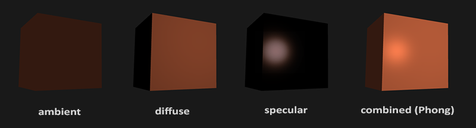
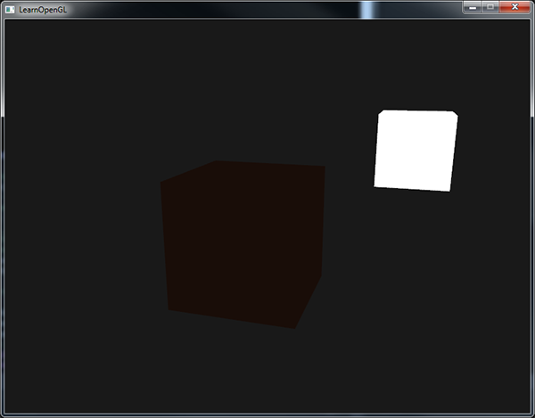
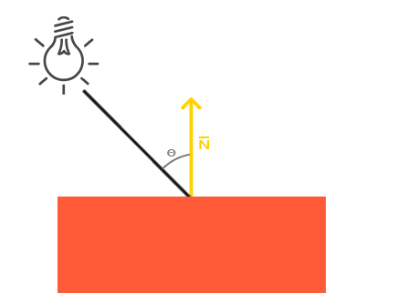
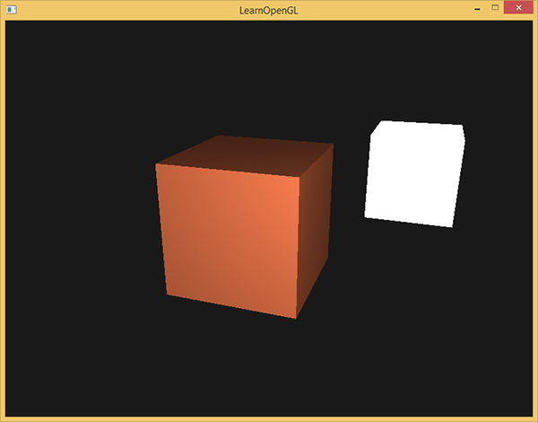
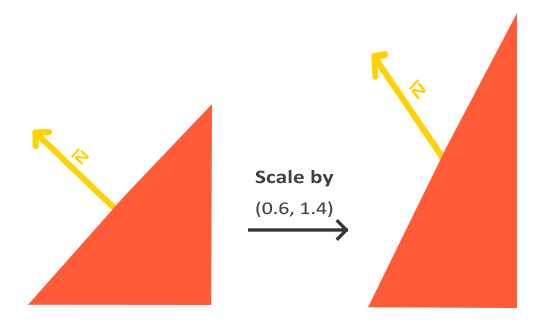
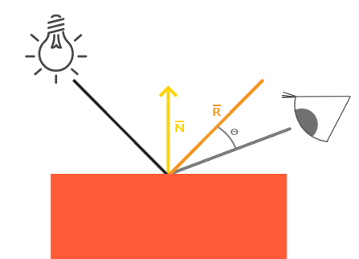
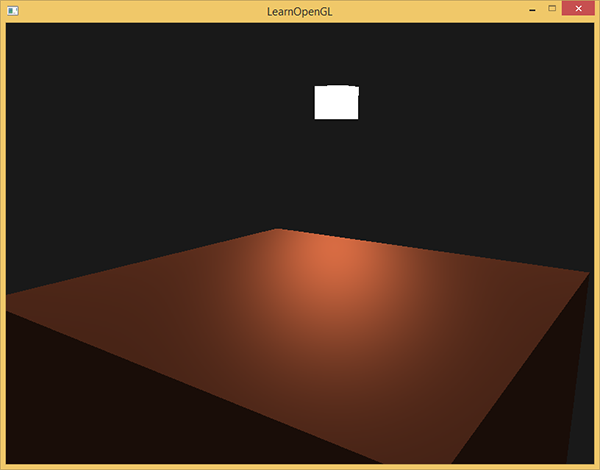
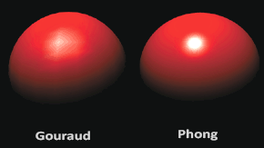

# 基础光照

原文     | [Basic Lighting](http://learnopengl.com/#!Lighting/Basic-Lighting)
      ---|---
作者     | JoeyDeVries
翻译     | [Django](http://bullteacher.com/), Krasjet, Geequlim, [BLumia](https://github.com/blumia/)
校对     | 暂未校对

现实世界的光照是极其复杂的，而且会受到诸多因素的影响，这是我们有限的计算能力所无法模拟的。因此OpenGL的光照使用的是简化的模型，对现实的情况进行近似，这样处理起来会更容易一些，而且看起来也差不多一样。这些光照模型都是基于我们对光的物理特性的理解。其中一个模型被称为<def>冯氏光照模型</def>(Phong Lighting Model)。冯氏光照模型的主要结构由3个分量组成：环境(Ambient)、漫反射(Diffuse)和镜面(Specular)光照。下面这张图展示了这些光照分量看起来的样子：



- <def>环境光照</def>(Ambient Lighting)：即使在黑暗的情况下，世界上通常也仍然有一些光亮（月亮、远处的光），所以物体几乎永远不会是完全黑暗的。为了模拟这个，我们会使用一个环境光照常量，它永远会给物体一些颜色。
- <def>漫反射光照</def>(Diffuse Lighting)：模拟光源对物体的方向性影响(Directional Impact)。它是冯氏光照模型中视觉上最显著的分量。物体的某一部分越是正对着光源，它就会越亮。
- <def>镜面光照</def>(Specular Lighting)：模拟有光泽物体上面出现的亮点。镜面光照的颜色相比于物体的颜色会更倾向于光的颜色。

为了创建有趣的视觉场景，我们希望模拟至少这三种光照分量。我们将以最简单的一个开始：**环境光照**。

# 环境光照

光通常都不是来自于同一个光源，而是来自于我们周围分散的很多光源，即使它们可能并不是那么显而易见。光的一个属性是，它可以向很多方向发散并反弹，从而能够到达不是非常直接临近的点。所以，光能够在其它的表面上**反射**，对一个物体产生间接的影响。考虑到这种情况的算法叫做<def>全局照明</def>(Global Illumination)算法，但是这种算法既开销高昂又极其复杂。

由于我们现在对那种又复杂又开销高昂的算法不是很感兴趣，所以我们将会先使用一个简化的全局照明模型，即<def>环境光照</def>。正如你在上一节所学到的，我们使用一个很小的常量（光照）颜色，添加到物体片段的最终颜色中，这样子的话即便场景中没有直接的光源也能看起来存在有一些发散的光。

把环境光照添加到场景里非常简单。我们用光的颜色乘以一个很小的常量环境因子，再乘以物体的颜色，然后将最终结果作为片段的颜色：

```c++
void main()
{
    float ambientStrength = 0.1;
    vec3 ambient = ambientStrength * lightColor;

    vec3 result = ambient * objectColor;
    FragColor = vec4(result, 1.0);
}
```

如果你现在运行你的程序，你会注意到冯氏光照的第一个阶段已经应用到你的物体上了。这个物体非常暗，但由于应用了环境光照（注意光源立方体没受影响是因为我们对它使用了另一个着色器），也不是完全黑的。它看起来应该像这样：



# 漫反射光照

环境光照本身不能提供最有趣的结果，但是漫反射光照就能开始对物体产生显著的视觉影响了。漫反射光照使物体上与光线方向越接近的片段能从光源处获得更多的亮度。为了能够更好的理解漫反射光照，请看下图：



图左上方有一个光源，它所发出的光线落在物体的一个片段上。我们需要测量这个光线是以什么角度接触到这个片段的。如果光线垂直于物体表面，这束光对物体的影响会最大化（译注：更亮）。为了测量光线和片段的角度，我们使用一个叫做<def>法向量</def>(Normal Vector)的东西，它是垂直于片段表面的一个向量（这里以黄色箭头表示），我们在后面再讲这个东西。这两个向量之间的角度很容易就能够通过点乘计算出来。

你可能记得在[变换](../01 Getting started/07 Transformations.md)那一节教程里，我们知道两个单位向量的夹角越小，它们点乘的结果越倾向于1。当两个向量的夹角为90度的时候，点乘会变为0。这同样适用于\(\theta\)，\(\theta\)越大，光对片段颜色的影响就应该越小。

!!! Important

    注意，为了（只）得到两个向量夹角的余弦值，我们使用的是单位向量（长度为1的向量），所以我们需要确保所有的向量都是标准化的，否则点乘返回的就不仅仅是余弦值了（见[变换](../01 Getting started/07 Transformations.md)）。

点乘返回一个标量，我们可以用它计算光线对片段颜色的影响。不同片段朝向光源的方向的不同，这些片段被照亮的情况也不同。

所以，计算漫反射光照需要什么？

- 法向量：一个垂直于顶点表面的向量。
- 定向的光线：作为光源的位置与片段的位置之间向量差的方向向量。为了计算这个光线，我们需要光的位置向量和片段的位置向量。

## 法向量

法向量是一个垂直于顶点表面的（单位）向量。由于顶点本身并没有表面（它只是空间中一个独立的点），我们利用它周围的顶点来计算出这个顶点的表面。我们能够使用一个小技巧，使用叉乘对立方体所有的顶点计算法向量，但是由于3D立方体不是一个复杂的形状，所以我们可以简单地把法线数据手工添加到顶点数据中。更新后的顶点数据数组可以在[这里](https://learnopengl.com/code_viewer.php?code=lighting/basic_lighting_vertex_data)找到。试着去想象一下，这些法向量真的是垂直于立方体各个平面的表面的（一个立方体由6个平面组成）。

由于我们向顶点数组添加了额外的数据，所以我们应该更新光照的顶点着色器：

```c++
#version 330 core
layout (location = 0) in vec3 aPos;
layout (location = 1) in vec3 aNormal;
...
```

现在我们已经向每个顶点添加了一个法向量并更新了顶点着色器，我们还要更新顶点属性指针。注意，灯使用同样的顶点数组作为它的顶点数据，然而灯的着色器并没有使用新添加的法向量。我们不需要更新灯的着色器或者是属性的配置，但是我们必须至少修改一下顶点属性指针来适应新的顶点数组的大小：

```c++
glVertexAttribPointer(0, 3, GL_FLOAT, GL_FALSE, 6 * sizeof(float), (void*)0);
glEnableVertexAttribArray(0);
```

我们只想使用每个顶点的前三个float，并且忽略后三个float，所以我们只需要把**步长**参数改成`float`大小的6倍就行了。

!!! Important

	虽然对灯的着色器使用不能完全利用的顶点数据看起来不是那么高效，但这些顶点数据已经从箱子对象载入后开始就储存在GPU的内存里了，所以我们并不需要储存新数据到GPU内存中。这实际上比给灯专门分配一个新的VBO更高效了。

所有光照的计算都是在片段着色器里进行，所以我们需要将法向量由顶点着色器传递到片段着色器。我们这么做：

```c++
out vec3 Normal;

void main()
{
    gl_Position = projection * view * model * vec4(aPos, 1.0);
    Normal = aNormal;
}
```

接下来，在片段着色器中定义相应的输入变量：

```c++
in vec3 Normal;
```

## 计算漫反射光照

我们现在对每个顶点都有了法向量，但是我们仍然需要光源的位置向量和片段的位置向量。由于光源的位置是一个静态变量，我们可以简单地在片段着色器中把它声明为uniform：

```c++
uniform vec3 lightPos;
```

然后在渲染循环中（渲染循环的外面也可以，因为它不会改变）更新uniform。我们使用在前面声明的<def>lightPos</def>向量作为光源位置：

```c++
lightingShader.setVec3("lightPos", lightPos);
```

最后，我们还需要片段的位置。我们会在世界空间中进行所有的光照计算，因此我们需要一个在世界空间中的顶点位置。我们可以通过把顶点位置属性乘以模型矩阵（不是观察和投影矩阵）来把它变换到世界空间坐标。这个在顶点着色器中很容易完成，所以我们声明一个输出变量，并计算它的世界空间坐标：

```c++
out vec3 FragPos;  
out vec3 Normal;
  
void main()
{
    gl_Position = projection * view * model * vec4(aPos, 1.0);
    FragPos = vec3(model * vec4(aPos, 1.0));
    Normal = aNormal;
}
```

最后，在片段着色器中添加相应的输入变量。

```c++
in vec3 FragPos;
```

现在，所有需要的变量都设置好了，我们可以在片段着色器中添加光照计算了。

我们需要做的第一件事是计算光源和片段位置之间的方向向量。前面提到，光的方向向量是光源位置向量与片段位置向量之间的向量差。你可能记得在[变换](../01 Getting started/07 Transformations.md)教程中，我们能够简单地通过让两个向量相减的方式计算向量差。我们同样希望确保所有相关向量最后都转换为单位向量，所以我们把法线和最终的方向向量都进行标准化：

```c++
vec3 norm = normalize(Normal);
vec3 lightDir = normalize(lightPos - FragPos);
```

!!! Important

	当计算光照时我们通常不关心一个向量的模长或它的位置，我们只关心它们的方向。所以，几乎所有的计算都使用单位向量完成，因为这简化了大部分的计算（比如点乘）。所以当进行光照计算时，确保你总是对相关向量进行标准化，来保证它们是真正地单位向量。忘记对向量进行标准化是一个十分常见的错误。

下一步，我们对<var>norm</var>和<var>lightDir</var>向量进行点乘，计算光源对当前片段实际的漫发射影响。结果值再乘以光的颜色，得到漫反射分量。两个向量之间的角度越大，漫反射分量就会越小：

```c++
float diff = max(dot(norm, lightDir), 0.0);
vec3 diffuse = diff * lightColor;
```

如果两个向量之间的角度大于90度，点乘的结果就会变成负数，这样会导致漫反射分量变为负数。为此，我们使用<fun>max</fun>函数返回两个参数之间较大的参数，从而保证漫反射分量不会变成负数。负数颜色的光照是没有定义的，所以最好避免它，除非你是那种古怪的艺术家。

现在我们有了环境光分量和漫反射分量，我们把它们相加，然后把结果乘以物体的颜色，来获得片段最后的输出颜色。

```c++
vec3 result = (ambient + diffuse) * objectColor;
FragColor = vec4(result, 1.0);
```

如果你的应用(和着色器)编译成功了，你可能看到类似的输出：



你可以看到使用了漫反射光照，立方体看起来就真的像个立方体了。尝试在你的脑中想象一下法向量，并在立方体周围移动，注意观察法向量和光的方向向量之间的夹角越大，片段就会越暗。

如果你在哪卡住了，可以在[这里](https://learnopengl.com/code_viewer_gh.php?code=src/2.lighting/2.1.basic_lighting_diffuse/basic_lighting_diffuse.cpp)对比一下完整的源代码。

## 最后一件事

现在我们已经把法向量从顶点着色器传到了片段着色器。可是，目前片段着色器里的计算都是在世界空间坐标中进行的。所以，我们是不是应该把法向量也转换为世界空间坐标？基本正确，但是这不是简单地把它乘以一个模型矩阵就能搞定的。

首先，法向量只是一个方向向量，不能表达空间中的特定位置。同时，法向量没有齐次坐标（顶点位置中的w分量）。这意味着，位移不应该影响到法向量。因此，如果我们打算把法向量乘以一个模型矩阵，我们就要从矩阵中移除位移部分，只选用模型矩阵左上角3×3的矩阵（注意，我们也可以把法向量的w分量设置为0，再乘以4×4矩阵；这同样可以移除位移）。对于法向量，我们只希望对它实施缩放和旋转变换。

其次，如果模型矩阵执行了不等比缩放，顶点的改变会导致法向量不再垂直于表面了。因此，我们不能用这样的模型矩阵来变换法向量。下面的图展示了应用了不等比缩放的模型矩阵对法向量的影响：



每当我们应用一个不等比缩放时（注意：等比缩放不会破坏法线，因为法线的方向没被改变，仅仅改变了法线的长度，而这很容易通过标准化来修复），法向量就不会再垂直于对应的表面了，这样光照就会被破坏。

修复这个行为的诀窍是使用一个为法向量专门定制的模型矩阵。这个矩阵称之为<def>法线矩阵</def>(Normal Matrix)，它使用了一些线性代数的操作来移除对法向量错误缩放的影响。如果你想知道这个矩阵是如何计算出来的，建议去阅读这个[文章](http://www.lighthouse3d.com/tutorials/glsl-tutorial/the-normal-matrix/)。

法线矩阵被定义为「模型矩阵左上角的逆矩阵的转置矩阵」。真是拗口，如果你不明白这是什么意思，别担心，我们还没有讨论逆矩阵(Inverse Matrix)和转置矩阵(Transpose Matrix)。注意，大部分的资源都会将法线矩阵定义为应用到模型-观察矩阵(Model-view Matrix)上的操作，但是由于我们只在世界空间中进行操作（不是在观察空间），我们只使用模型矩阵。

在顶点着色器中，我们可以使用<fun>inverse</fun>和<fun>transpose</fun>函数自己生成这个法线矩阵，这两个函数对所有类型矩阵都有效。注意我们还要把被处理过的矩阵强制转换为3×3矩阵，来保证它失去了位移属性以及能够乘以`vec3`的法向量。

```c++
Normal = mat3(transpose(inverse(model))) * aNormal;
```

在漫反射光照部分，光照表现并没有问题，这是因为我们没有对物体本身执行任何缩放操作，所以并不是必须要使用一个法线矩阵，仅仅让模型矩阵乘以法线也可以。可是，如果你进行了不等比缩放，使用法线矩阵去乘以法向量就是必不可少的了。

!!! Attention

    即使是对于着色器来说，逆矩阵也是一个开销比较大的运算，因此，只要可能就应该避免在着色器中进行逆矩阵运算，它们必须为你场景中的每个顶点都进行这样的处理。用作学习目这样做是可以的，但是对于一个对效率有要求的应用来说，在绘制之前你最好用CPU计算出法线矩阵，然后通过uniform把值传递给着色器（像模型矩阵一样）。

# 镜面光照

如果你还没被这些光照计算搞得精疲力尽，我们就再把镜面高光(Specular Highlight)加进来，这样冯氏光照才算完整。

和漫反射光照一样，镜面光照也是依据光的方向向量和物体的法向量来决定的，但是它也依赖于观察方向，例如玩家是从什么方向看着这个片段的。镜面光照是基于光的反射特性。如果我们想象物体表面像一面镜子一样，那么，无论我们从哪里去看那个表面所反射的光，镜面光照都会达到最大化。你可以从下面的图片看到效果：



我们通过反射法向量周围光的方向来计算反射向量。然后我们计算反射向量和视线方向的角度差，如果夹角越小，那么镜面光的影响就会越大。它的作用效果就是，当我们去看光被物体所反射的那个方向的时候，我们会看到一个高光。

观察向量是镜面光照附加的一个变量，我们可以使用观察者世界空间位置和片段的位置来计算它。之后，我们计算镜面光强度，用它乘以光源的颜色，再将它加上环境光和漫反射分量。

!!! Important

    我们选择在世界空间进行光照计算，但是大多数人趋向于在观察空间进行光照计算。在观察空间计算的好处是，观察者的位置总是(0, 0, 0)，所以这样你直接就获得了观察者位置。可是我发现在学习的时候在世界空间中计算光照更符合直觉。如果你仍然希望在观察空间计算光照的话，你需要将所有相关的向量都用观察矩阵进行变换（记得也要改变法线矩阵）。

为了得到观察者的世界空间坐标，我们简单地使用摄像机对象的位置坐标代替（它当然就是观察者）。所以我们把另一个uniform添加到片段着色器，把相应的摄像机位置坐标传给片段着色器：

```c++
uniform vec3 viewPos;
```

```c++
lightingShader.setVec3("viewPos", camera.Position);
```

现在我们已经获得所有需要的变量，可以计算高光强度了。首先，我们定义一个镜面强度(Specular Intensity)变量，给镜面高光一个中等亮度颜色，让它不要产生过度的影响。

```c++
float specularStrength = 0.5;
```

如果我们把它设置为1.0f，我们会得到一个非常亮的镜面光分量，这对于一个珊瑚色的立方体来说有点太多了。下一节教程中我们会讨论如何合理设置这些光照强度，以及它们是如何影响物体的。下一步，我们计算视线方向向量，和对应的沿着法线轴的反射向量：

```
vec3 viewDir = normalize(viewPos - FragPos);
vec3 reflectDir = reflect(-lightDir, norm);
```

需要注意的是我们对`lightDir`向量进行了取反。`reflect`函数要求第一个向量是**从**光源指向片段位置的向量，但是`lightDir`当前正好相反，是从片段**指向**光源（由先前我们计算`lightDir`向量时，减法的顺序决定）。为了保证我们得到正确的`reflect`向量，我们通过对`lightDir`向量取反来获得相反的方向。第二个参数要求是一个法向量，所以我们提供的是已标准化的`norm`向量。

剩下要做的是计算镜面分量。下面的代码完成了这件事：

```c++
float spec = pow(max(dot(viewDir, reflectDir), 0.0), 32);
vec3 specular = specularStrength * spec * lightColor;
```

我们先计算视线方向与反射方向的点乘（并确保它不是负值），然后取它的32次幂。这个32是高光的<def>反光度</def>(Shininess)。一个物体的反光度越高，反射光的能力越强，散射得越少，高光点就会越小。在下面的图片里，你会看到不同反光度的视觉效果影响：


我们不希望镜面成分过于显眼，所以我们把指数保持为32。剩下的最后一件事情是把它加到环境光分量和漫反射分量里，再用结果乘以物体的颜色：

```c++
vec3 result = (ambient + diffuse + specular) * objectColor;
FragColor = vec4(result, 1.0);
```

我们现在为冯氏光照计算了全部的光照分量。根据你的视角，你可以看到类似下面的画面：



你可以在[这里](https://learnopengl.com/code_viewer_gh.php?code=src/2.lighting/2.2.basic_lighting_specular/basic_lighting_specular.cpp)找到完整源码。

!!! Important

    在光照着色器的早期，开发者曾经在顶点着色器中实现冯氏光照模型。在顶点着色器中做光照的优势是，相比片段来说，顶点要少得多，因此会更高效，所以（开销大的）光照计算频率会更低。然而，顶点着色器中的最终颜色值是仅仅只是那个顶点的颜色值，片段的颜色值是由插值光照颜色所得来的。结果就是这种光照看起来不会非常真实，除非使用了大量顶点。

    

    在顶点着色器中实现的冯氏光照模型叫做<def>Gouraud着色</def>(Gouraud Shading)，而不是<def>冯氏着色</def>(Phong Shading)。记住，由于插值，这种光照看起来有点逊色。冯氏着色能产生更平滑的光照效果。

现在你应该能够看到着色器的强大之处了。只用很少的信息，着色器就能计算出光照如何影响到所有物体的片段颜色。[下一节](03 Materials.md)中，我们会更深入的研究光照模型，看看我们还能做些什么。

## 练习

- 目前，我们的光源时静止的，你可以尝试使用<fun>sin</fun>或<fun>cos</fun>函数让光源在场景中来回移动。观察光照随时间的改变能让你更容易理解冯氏光照模型。[参考解答](https://learnopengl.com/code_viewer.php?code=lighting/basic_lighting-exercise1)。
- 尝试使用不同的环境光、漫反射和镜面强度，观察它们怎么是影响光照效果的。同样，尝试实验一下镜面光照的反光度因子。尝试理解为什么某一个值能够有着某一种视觉输出。
- 在观察空间（而不是世界空间）中计算冯氏光照：[参考解答](https://learnopengl.com/code_viewer.php?code=lighting/basic_lighting-exercise2)。
- 尝试实现一个Gouraud着色（而不是冯氏着色）。如果你做对了话，立方体的光照应该会[看起来有些奇怪](../img/02/02/basic_lighting_exercise3.png)，尝试推理为什么它会看起来这么奇怪：[参考解答](https://learnopengl.com/code_viewer.php?code=lighting/basic_lighting-exercise3)。
