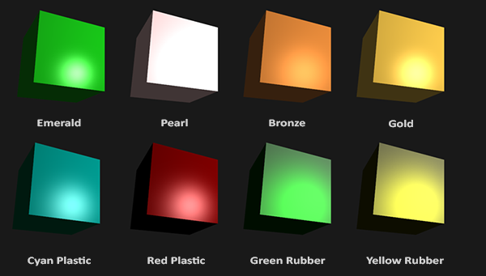
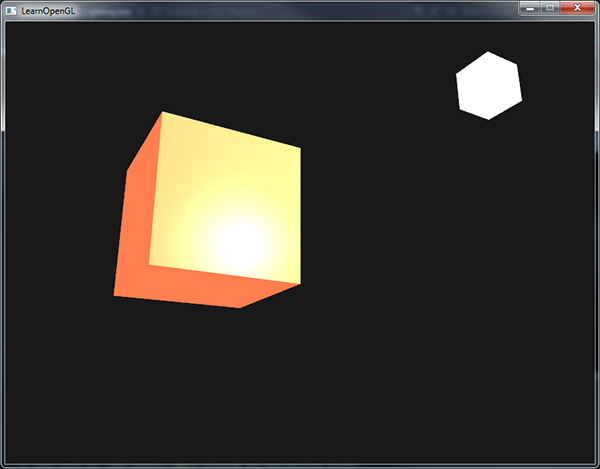
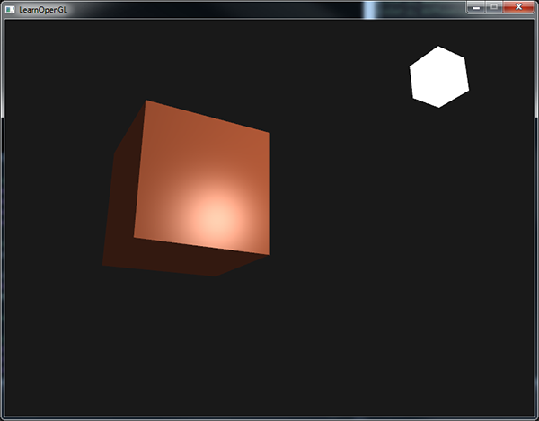

# 材质

原文     | [Materials](http://learnopengl.com/#!Lighting/Materials)
      ---|---
作者     | JoeyDeVries
翻译     | [Django](http://bullteacher.com/)
校对     | [Geequlim](http://geequlim.com)

在真实世界里，每个物体会对光产生不同的反应。钢看起来比陶瓷花瓶更闪闪发光，一个木头箱子不会像钢箱子一样对光产生很强的反射。每个物体对镜面高光也有不同的反应。有些物体不会散射(Scatter)很多光却会反射(Reflect)很多光，结果看起来就有一个较小的高光点(Highlight)，有些物体散射了很多，它们就会产生一个半径更大的高光。如果我们想要在OpenGL中模拟多种类型的物体，我们必须为每个物体分别定义材质(Material)属性。

在前面的教程中，我们指定一个物体和一个光的颜色来定义物体的图像输出，并使之结合环境(Ambient)和镜面强度(Specular Intensity)元素。当描述物体的时候，我们可以使用3种光照元素：环境光照(Ambient Lighting)、漫反射光照(Diffuse Lighting)、镜面光照(Specular Lighting)定义一个材质颜色。通过为每个元素指定一个颜色，我们已经对物体的颜色输出有了精密的控制。现在把一个镜面高光元素添加到这三个颜色里，这是我们需要的所有材质属性：

```c++
#version 330 core
struct Material
{
    vec3 ambient;
    vec3 diffuse;
    vec3 specular;
    float shininess;
};
uniform Material material;
```

在片段着色器中，我们创建一个结构体(Struct)，来储存物体的材质属性。我们也可以把它们储存为独立的uniform值，但是作为一个结构体来储存可以更有条理。我们首先定义结构体的布局，然后简单声明一个uniform变量，以新创建的结构体作为它的类型。

就像你所看到的，我们为每个冯氏光照模型的元素都定义一个颜色向量。`ambient`材质向量定义了在环境光照下这个物体反射的是什么颜色；通常这是和物体颜色相同的颜色。`diffuse`材质向量定义了在漫反射光照下物体的颜色。漫反射颜色被设置为(和环境光照一样)我们需要的物体颜色。`specular`材质向量设置的是物体受到的镜面光照的影响的颜色(或者可能是反射一个物体特定的镜面高光颜色)。最后，`shininess`影响镜面高光的散射/半径。

这四个元素定义了一个物体的材质，通过它们我们能够模拟很多真实世界的材质。这里有一个列表[devernay.free.fr](http://devernay.free.fr/cours/opengl/materials.html)展示了几种材质属性，这些材质属性模拟外部世界的真实材质。下面的图片展示了几种真实世界材质对我们的立方体的影响：



如你所见，正确地指定一个物体的材质属性，似乎就是改变我们物体的相关属性的比例。效果显然很引人注目，但是对于大多数真实效果，我们最终需要更加复杂的形状，而不单单是一个立方体。在[后面的教程](../03 Model Loading/01 Assimp.md)中，我们会讨论更复杂的形状。

为一个物体赋予一款正确的材质是非常困难的，这需要大量实验和丰富的经验，所以由于错误的设置材质而毁了物体的画面质量是件经常发生的事。

让我们试试在着色器中实现这样的一个材质系统。


# 设置材质

我们在片段着色器中创建了一个uniform材质结构体，所以下面我们希望改变光照计算来顺应新的材质属性。由于所有材质元素都储存在结构体中，我们可以从uniform变量`material`取得它们：

```c++
void main()
{
    // 环境光
    vec3 ambient = lightColor * material.ambient;

    // 漫反射光
    vec3 norm = normalize(Normal);
    vec3 lightDir = normalize(lightPos - FragPos);
    float diff = max(dot(norm, lightDir), 0.0);
    vec3 diffuse = lightColor * (diff * material.diffuse);

    // 镜面高光
    vec3 viewDir = normalize(viewPos - FragPos);
    vec3 reflectDir = reflect(-lightDir, norm);  
    float spec = pow(max(dot(viewDir, reflectDir), 0.0), material.shininess);
    vec3 specular = lightColor * (spec * material.specular);  

    vec3 result = ambient + diffuse + specular;
    color = vec4(result, 1.0f);
}
```

你可以看到，我们现在获得所有材质结构体的属性，无论在哪儿我们都需要它们，这次通过材质颜色的帮助，计算结果输出的颜色。物体的每个材质属性都乘以它们对应的光照元素。

通过设置适当的uniform，我们可以在应用中设置物体的材质。当设置uniform时，GLSL中的一个结构体并不会被认为有什么特别之处。一个结构体值扮演uniform变量的封装体，所以如果我们希望填充这个结构体，我们就仍然必须设置结构体中的各个元素的uniform值，但是这次带有结构体名字作为前缀：

```c++
GLint matAmbientLoc = glGetUniformLocation(lightingShader.Program, "material.ambient");
GLint matDiffuseLoc = glGetUniformLocation(lightingShader.Program, "material.diffuse");
GLint matSpecularLoc = glGetUniformLocation(lightingShader.Program, "material.specular");
GLint matShineLoc = glGetUniformLocation(lightingShader.Program, "material.shininess");

glUniform3f(matAmbientLoc, 1.0f, 0.5f, 0.31f);
glUniform3f(matDiffuseLoc, 1.0f, 0.5f, 0.31f);
glUniform3f(matSpecularLoc, 0.5f, 0.5f, 0.5f);
glUniform1f(matShineLoc, 32.0f);
```

我们将`ambient`和`diffuse`元素设置成我们想要让物体所呈现的颜色，设置物体的`specular`元素为中等亮度颜色；我们不希望`specular`元素对这个指定物体产生过于强烈的影响。我们同样设置`shininess`为32。我们现在可以简单的在应用中影响物体的材质。

运行程序，会得到下面这样的结果：



看起来很奇怪不是吗？


## 光的属性

这个物体太亮了。物体过亮的原因是环境、漫反射和镜面三个颜色任何一个光源都会去全力反射。光源对环境、漫反射和镜面元素同时具有不同的强度。前面的教程，我们通过使用一个强度值改变环境和镜面强度的方式解决了这个问题。我们想做一个相同的系统，但是这次为每个光照元素指定了强度向量。如果我们想象`lightColor`是`vec3(1.0)`，代码看起来像是这样：

```c++
vec3 ambient = vec3(1.0f) * material.ambient;
vec3 diffuse = vec3(1.0f) * (diff * material.diffuse);
vec3 specular = vec3(1.0f) * (spec * material.specular);
```

所以物体的每个材质属性返回了每个光照元素的全强度。这些vec3(1.0)值可以各自独立的影响各个光源，这通常就是我们想要的。现在物体的`ambient`元素完全地展示了立方体的颜色，可是环境元素不应该对最终颜色有这么大的影响，所以我们要设置光的`ambient`亮度为一个小一点的值，从而限制环境色：

```c++
vec3 result = vec3(0.1f) * material.ambient;
```

我们可以用同样的方式影响光源`diffuse`和`specular`的强度。这和我们[前面教程](http://learnopengl-cn.readthedocs.org/zh/latest/02%20Lighting/02%20Basic%20Lighting/)所做的极为相似；你可以说我们已经创建了一些光的属性来各自独立地影响每个光照元素。我们希望为光的属性创建一些与材质结构体相似的东西：

```c++
struct Light
{
    vec3 position;
    vec3 ambient;
    vec3 diffuse;
    vec3 specular;
};
uniform Light light;
```

一个光源的`ambient`、`diffuse`和`specular`光都有不同的亮度。环境光通常设置为一个比较低的亮度，因为我们不希望环境色太过显眼。光源的`diffuse`元素通常设置为我们希望光所具有的颜色；经常是一个明亮的白色。`specular`元素通常被设置为`vec3(1.0f)`类型的全强度发光。要记住的是我们同样把光的位置添加到结构体中。

就像材质uniform一样，需要更新片段着色器：

```c++
vec3 ambient = light.ambient * material.ambient;
vec3 diffuse = light.diffuse * (diff * material.diffuse);
vec3 specular = light.specular * (spec * material.specular);
```

然后我们要在应用里设置光的亮度：

```c++
GLint lightAmbientLoc = glGetUniformLocation(lightingShader.Program, "light.ambient");
GLint lightDiffuseLoc = glGetUniformLocation(lightingShader.Program, "light.diffuse");
GLint lightSpecularLoc = glGetUniformLocation(lightingShader.Program, "light.specular");

glUniform3f(lightAmbientLoc, 0.2f, 0.2f, 0.2f);
glUniform3f(lightDiffuseLoc, 0.5f, 0.5f, 0.5f);// 让我们把这个光调暗一点，这样会看起来更自然
glUniform3f(lightSpecularLoc, 1.0f, 1.0f, 1.0f);
```

现在，我们调整了光是如何影响物体所有的材质的，我们得到一个更像前面教程的视觉输出。这次我们完全控制了物体光照和材质：



现在改变物体的外观相对简单了些。我们做点更有趣的事！


## 不同的光源颜色

目前为止，我们使用光源的颜色仅仅去改变物体各个元素的强度(通过选用从白到灰到黑范围内的颜色)，并没有影响物体的真实颜色(只是强度)。由于现在能够非常容易地访问光的属性了，我们可以随着时间改变它们的颜色来获得一些有很意思的效果。由于所有东西都已经在片段着色器做好了，改变光的颜色很简单，我们可以立即创建出一些有趣的效果：

<video src="../../img/02/03/materials.mp4" controls="controls">
</video>

如你所见，不同光的颜色极大地影响了物体的颜色输出。由于光的颜色直接影响物体反射的颜色(你可能想起在颜色教程中有讨论过)，它对视觉输出有显著的影响。

利用`sin`和`glfwGetTime`改变光的环境和漫反射颜色，我们可以随着时间流逝简单的改变光源颜色：

```c++
glm::vec3 lightColor; lightColor.x = sin(glfwGetTime() * 2.0f);
lightColor.y = sin(glfwGetTime() * 0.7f);
lightColor.z = sin(glfwGetTime() * 1.3f);

glm::vec3 diffuseColor = lightColor * glm::vec3(0.5f);
glm::vec3 ambientColor = diffuseColor * glm::vec3(0.2f);

glUniform3f(lightAmbientLoc, ambientColor.x, ambientColor.y, ambientColor.z);
glUniform3f(lightDiffuseLoc, diffuseColor.x, diffuseColor.y, diffuseColor.z);
```

尝试和实验使用这些光照和材质值，看看它们怎样影响图像输出的。你可以从这里找到[程序的源码](http://learnopengl.com/code_viewer.php?code=lighting/materials)，[片段着色器](http://learnopengl.com/code_viewer.php?code=lighting/materials&type=fragment)的源码。

## 练习

- 你能像我们教程一开始那样根据一些材质的属性来模拟一个真实世界的物体吗？
注意[材质表](http://devernay.free.fr/cours/opengl/materials.html)中的环境光颜色与漫反射光的颜色可能不一样，因为他们并没有把光照强度考虑进去来模拟，你需要将光照颜色的强度改为`vec(1.0f)`来输出正确的结果：[参考解答](http://learnopengl.com/code_viewer.php?code=lighting/materials-exercise1)，我做了一个青色(Cyan)的塑料箱子
