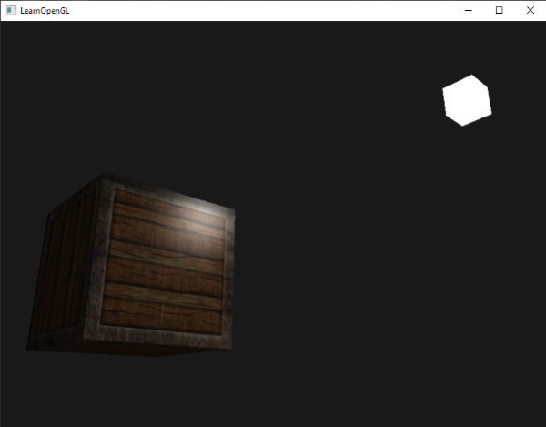
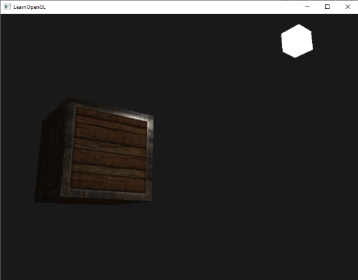

# 光照贴图

原文     | [Lighting maps](http://learnopengl.com/#!Lighting/Lighting-maps)
      ---|---
作者     | JoeyDeVries
翻译     | Krasjet
校对     | 暂未校对

在[上一节](03 Materials.md)中，我们讨论了让每个物体都拥有自己独特的材质从而对光照做出不同的反应的可能性。这样做的很棒之处在于可以赋予每个物体一个独特的外观，但是这仍不能对一个物体的视觉输出提供足够多的灵活性。

在上一节中，我们将整个物体的材质定义为一个整体。但现实世界中的物体通常并不只包含有一种材质，而是由多种材质所组成。想想一辆汽车：它的外壳由闪亮的材料组成，车窗会部分反射周围的环境，轮胎基本没有光泽，所以它没有镜面高光，而轮毂超级闪亮（如果你洗了车的话）。汽车同样会有漫反射和环境光颜色，它们在整个物体上也不会是一样的，一辆汽车表现出许多种不同的环境光/漫反射颜色。总之，这样一个物体的不同的部件有不同的材质属性。

所以，上一节中的那个材质系统只对最简单的模型够用，所以我们需要拓展之前的系统，引入**漫反射**和**镜面光**贴图(Map)。这允许我们对物体的漫反射分量（以及间接地对环境光分量，它们几乎总是一样的）和镜面光分量有着更精确的控制。

# 漫反射贴图

我们希望通过某种方式对物体的每个片段单独设置漫反射颜色。有能够让我们根据片段在物体上的位置来获取颜色值的系统吗？

这可能听起来很熟悉，而且事实上这个系统我们已经使用很长时间了。这听起来很像在[之前](../01 Getting started/06 Textures.md)章节中详细讨论过的**纹理**，而这基本就是它：一个纹理。我们仅仅是对同样基本原理使用了不同的名字：使用一张包裹物体的图像，我们能够逐片段索引其独立的颜色值。在光照场景中，它通常叫做一个<def>漫反射贴图</def>(Diffuse Map)（3D艺术家在PBR之前通常这么叫它），因为一张纹理图像呈现了物体所有的漫反射颜色。

为了演示漫反射贴图，我们将会使用[下面的图片](../img/02/04/container2.png)，它是一个有钢边框的木箱：


在着色器中使用漫反射贴图与我们在纹理章节中展示的完全一样。但这次我们会将纹理储存为<fun>Material</fun>结构体中的一个`sampler2D`。我们将之前定义的`vec3`漫反射颜色向量替换为漫反射贴图。

!!! Attention

	记住`sampler2D`是所谓的<def>不透明类型</def>(Opaque Type)，也就是说我们不能将此类型实例化，而只能定义为uniform。如果实例化这个结构体而不是作为uniform（就像一个函数参数），GLSL会抛出一些奇怪的错误，这同样也适用于任何封装了不透明类型的结构体。

我们也移除了环境光材质颜色向量，因为既然我们用光来控制环境光那么环境光颜色无论如何都等于漫反射颜色，所以我们不需要将它们分开储存：

```c++
struct Material {
    sampler2D diffuse;
    vec3      specular;
    float     shininess;
}; 
...
in vec2 TexCoords;
```

!!! Important

	如果你有点固执，仍想将环境光颜色设置为一个不同的值（与漫反射值不一样），你也可以保留那个环境光的`vec3`，但那样的话整个物体的环境光颜色将相同。要想让每个片段有不同的环境光值，你必须单独对环境光值使用另外一个纹理。

注意我们将在片段着色器中再次需要纹理坐标，所以我们声明一个额外的输入变量。接下来我们只需要从纹理中采样得到片段的漫反射颜色值即可：

```c++
vec3 diffuse = light.diffuse * diff * vec3(texture(material.diffuse, TexCoords));
```

不要忘记将环境光的材质颜色设置为漫反射材质颜色同样的值。

```c++
vec3 ambient = light.ambient * vec3(texture(material.diffuse, TexCoords));
```

这就是使用漫反射贴图的全部步骤了。你可以看到，这并不是什么新的东西，但带来了视觉品质的巨大提高。为了让它生效，我们需要使用纹理坐标更新顶点数据，将它们作为顶点属性传递给片段着色器，加载纹理，并将纹理绑定到合适的纹理单元。

更新后的顶点数据可以在[这里](https://learnopengl.com/code_viewer.php?code=lighting/vertex_data_textures)找到。顶点数据现在包含了顶点位置、法向量和立方体顶点处的纹理坐标。让我们更新顶点着色器来以顶点属性的形式接受纹理坐标，并将它们传递到片段着色器中：

```c++
#version 330 core
layout (location = 0) in vec3 aPos;
layout (location = 1) in vec3 aNormal;
layout (location = 2) in vec2 aTexCoords;
...
out vec2 TexCoords;

void main()
{
    ...
    TexCoords = aTexCoords;
}
```

确保更新两个VAO的顶点属性指针来匹配新的顶点数据，并加载箱子图像为一个纹理。在绘制箱子之前，我们希望将正确的纹理单元赋值到<var>material.diffuse</var>这个uniform采样器，并将箱子纹理绑定到这个纹理单元：

```c++
lightingShader.setInt("material.diffuse", 0);
...
glActiveTexture(GL_TEXTURE0);
glBindTexture(GL_TEXTURE_2D, diffuseMap);
```

使用了漫反射贴图之后，细节再一次得到巨大的提升，这次箱子真的开始闪耀了（毫不夸张地说）。你的箱子现在看起来可能像这样：



你可以在[这里](https://learnopengl.com/code_viewer_gh.php?code=src/2.lighting/4.1.lighting_maps_diffuse_map/lighting_maps_diffuse.cpp)找到程序的全部代码。


# 镜面光贴图

你可能会注意到，镜面高光看起来有些奇怪，因为我们的物体大部分都是木头，我们知道木头不应该有这么强的镜面高光的。我们可以将物体的镜面光材质设置为`vec3(0.0)`来解决这个问题，但这也意味着箱子钢制的边框将不再能够显示镜面高光了，我们知道钢铁**应该**是有一些镜面高光的。所以，我们想要让物体的某些部分以不同的强度显示镜面高光。这个问题看起来和漫反射贴图非常相似。是巧合吗？我想不是。

我们同样可以使用一个专门用于镜面高光的纹理贴图。这也就意味着我们需要生成一个黑白的（如果你想得话也可以是彩色的）纹理，来定义物体每部分的镜面光强度。下面是一个[镜面光贴图](../img/02/04/container2_specular.png)(Specular Map)的例子：


镜面高光的强度可以通过图像每个像素的亮度来获取。镜面光贴图上的每个像素都可以由一个颜色向量来表示，比如说黑色代表颜色向量`vec3(0.0)`，灰色代表颜色向量`vec3(0.5)`。在片段着色器中，我们接下来会取样对应的颜色值并将它乘以光源的镜面强度。一个像素越「白」，乘积就会越大，物体的镜面光分量就会越亮。

由于箱子大部分都由木头所组成，而且木头材质应该没有镜面高光，所以漫反射纹理的整个木头部分全部都转换成了黑色。箱子钢制边框的镜面光强度是有细微变化的，钢铁本身会比较容易受到镜面高光的影响，而裂缝则不会。

!!! important

	从实际角度来说，木头其实也有镜面高光，尽管它的反光度(Shininess)很小（更多的光被散射），影响也比较小，但是为了教学目的，我们可以假设木头不会对镜面光有任何反应。

使用**Photoshop**或**Gimp**之类的工具，将漫反射纹理转换为镜面光纹理还是比较容易的，只需要剪切掉一些部分，将图像转换为黑白的，并增加亮度/对比度就好了。


## 采样镜面光贴图

镜面光贴图和其它的纹理非常类似，所以代码也和漫反射贴图的代码很类似。记得要保证正确地加载图像并生成一个纹理对象。由于我们正在同一个片段着色器中使用另一个纹理采样器，我们必须要对镜面光贴图使用一个不同的纹理单元（见[纹理](../01 Getting started/06 Textures.md)），所以我们在渲染之前先把它绑定到合适的纹理单元上：

```c++
lightingShader.setInt("material.specular", 1);
...
glActiveTexture(GL_TEXTURE1);
glBindTexture(GL_TEXTURE_2D, specularMap);
```

接下来更新片段着色器的材质属性，让其接受一个`sampler2D`而不是`vec3`作为镜面光分量：

```c++
struct Material {
    sampler2D diffuse;
    sampler2D specular;
    float     shininess;
};
```

最后我们希望采样镜面光贴图，来获取片段所对应的镜面光强度：

```c++
vec3 ambient  = light.ambient  * vec3(texture(material.diffuse, TexCoords));
vec3 diffuse  = light.diffuse  * diff * vec3(texture(material.diffuse, TexCoords));  
vec3 specular = light.specular * spec * vec3(texture(material.specular, TexCoords));
FragColor = vec4(ambient + diffuse + specular, 1.0);
```

通过使用镜面光贴图我们可以可以对物体设置大量的细节，比如物体的哪些部分需要有**闪闪发光**的属性，我们甚至可以设置它们对应的强度。镜面光贴图能够在漫反射贴图之上给予我们更高一层的控制。

!!! important

	如果你想另辟蹊径，你也可以在镜面光贴图中使用真正的颜色，不仅设置每个片段的镜面光强度，还设置了镜面高光的颜色。从现实角度来说，镜面高光的颜色大部分（甚至全部）都是由光源本身所决定的，所以这样并不能生成非常真实的视觉效果（这也是为什么图像通常是黑白的，我们只关心强度）。

如果你现在运行程序的话，你可以清楚地看到箱子的材质现在和真实的钢制边框箱子非常类似了：



你可以在[这里](https://learnopengl.com/code_viewer_gh.php?code=src/2.lighting/4.2.lighting_maps_specular_map/lighting_maps_specular.cpp)找到程序的全部源码。

通过使用漫反射和镜面光贴图，我们可以给相对简单的物体添加大量的细节。我们甚至可以使用<def>法线/凹凸贴图</def>(Normal/Bump Map)或者<def>反射贴图</def>(Reflection Map)给物体添加更多的细节，但这些将会留到之后的教程中。把你的箱子给你的朋友或者家人看看，并且坚信我们的箱子有一天会比现在更加漂亮！

## 练习

- 调整光源的环境光、漫反射和镜面光向量，看看它们如何影响箱子的视觉输出。
- 尝试在片段着色器中反转镜面光贴图的颜色值，让木头显示镜面高光而钢制边缘不反光（由于钢制边缘中有一些裂缝，边缘仍会显示一些镜面高光，虽然强度会小很多）：[参考解答](https://learnopengl.com/code_viewer.php?code=lighting/lighting_maps-exercise2)
- 使用漫反射贴图创建一个彩色而不是黑白的镜面光贴图，看看结果看起来并不是那么真实了。如果你不会生成的话，可以使用这张[彩色的镜面光贴图](../img/02/04/lighting_maps_specular_color.png)：[最终效果](../img/02/04/lighting_maps_exercise3.png)
- 添加一个叫做<def>放射光贴图</def>(Emission Map)的东西，它是一个储存了每个片段的发光值(Emission Value)的贴图。发光值是一个包含（假设）光源的物体发光(Emit)时可能显现的颜色，这样的话物体就能够忽略光照条件进行发光(Glow)。游戏中某个物体在发光的时候，你通常看到的就是放射光贴图（比如 [机器人的眼](../img/02/04/shaders_enemy.jpg)，或是[箱子上的灯带](../img/02/04/emissive.png)）。将[这个](../img/02/04/matrix.jpg)纹理（作者为 creativesam）作为放射光贴图添加到箱子上，产生这些字母都在发光的效果：[参考解答](https://learnopengl.com/code_viewer_gh.php?code=src/2.lighting/4.3.lighting_maps_exercise4/lighting_maps_exercise4.cpp)，[最终效果](../img/02/04/lighting_maps_exercise4.png)
