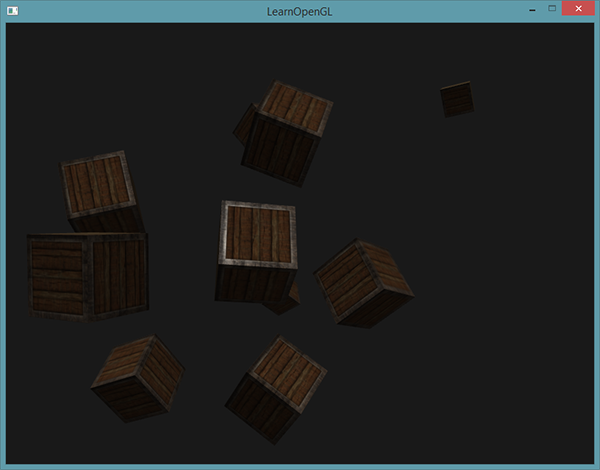
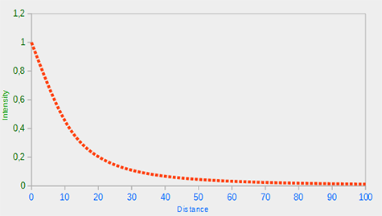
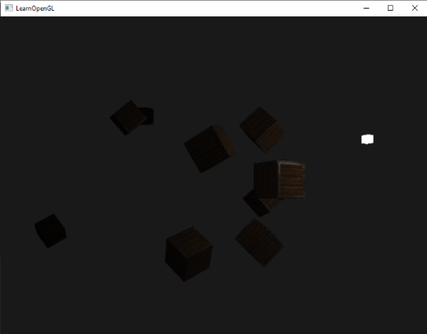
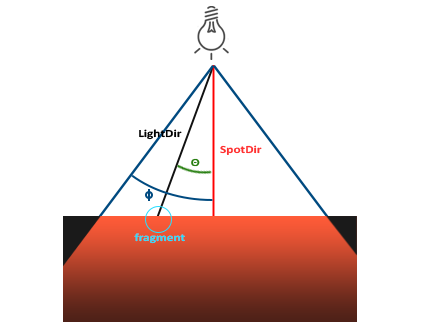
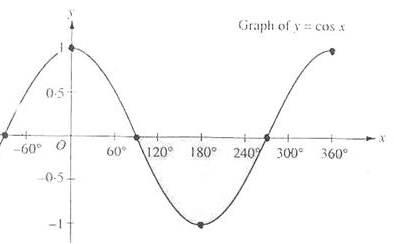
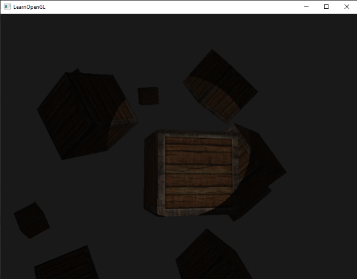
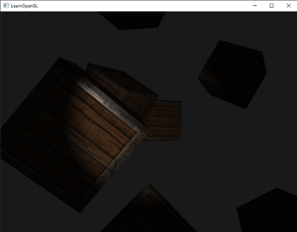

# 投光物

原文     | [Light casters](http://www.learnopengl.com/#!Lighting/Light-casters)
      ---|---
作者     | JoeyDeVries
翻译     | [Django](http://bullteacher.com/)
校对     | [Geequlim](http://geequlim.com), [BLumia](https://github.com/BLumia)

我们目前使用的所有光照都来自于一个单独的光源，这是空间中的一个点。它的效果不错，但是在真实世界，我们有多种类型的光，它们每个表现都不同。一个光源把光投射到物体上，叫做投光。这个教程里我们讨论几种不同的投光类型。学习模拟不同的光源是你未来丰富你的场景的另一个工具。

我们首先讨论定向光(directional light)，接着是作为之前学到知识的扩展的点光(point light)，最后我们讨论聚光(Spotlight)。下面的教程我们会把这几种不同的光类型整合到一个场景中。

# 定向光

当一个光源很远的时候，来自光源的每条光线接近于平行。这看起来就像所有的光线来自于同一个方向，无论物体和观察者在哪儿。当一个光源被设置为无限远时，它被称为定向光(Directional Light)，因为所有的光线都有着同一个方向；它会独立于光源的位置。

我们知道的定向光源的一个好例子是，太阳。太阳和我们不是无限远，但它也足够远了，在计算光照的时候，我们感觉它就像无限远。在下面的图片里，来自于太阳的所有的光线都被定义为平行光：


因为所有的光线都是平行的，对于场景中的每个物体光的方向都保持一致，物体和光源的位置保持怎样的关系都无所谓。由于光的方向向量保持一致，光照计算会和场景中的其他物体相似。

我们可以通过定义一个光的方向向量，来模拟这样一个定向光，而不是使用光的位置向量。着色器计算保持大致相同的要求，这次我们直接使用光的方向向量来代替用`lightDir`向量和`position`向量的计算：

```c++
struct Light
{
    // vec3 position; // 现在不在需要光源位置了，因为它是无限远的
    vec3 direction;
    vec3 ambient;
    vec3 diffuse;
    vec3 specular;
};
...
void main()
{
    vec3 lightDir = normalize(-light.direction);
    ...
}
```

注意，我们首先对`light.direction`向量取反。目前我们使用的光照计算需要光的方向作为一个来自片段朝向的光源的方向，但是人们通常更习惯定义一个定向光作为一个全局方向，它从光源发出。所以我们必须对全局光的方向向量取反来改变它的方向；它现在是一个方向向量指向光源。同时，确保对向量进行标准化处理，因为假定输入的向量就是一个单位向量是不明智的。

作为结果的`lightDir`向量被使用在`diffuse`和`specular`计算之前。

为了清晰地强调一个定向光对所有物体都有同样的影响，我们再次访问[坐标系教程](../01 Getting started/08 Coordinate Systems.md)结尾部分的箱子场景。例子里我们先定义10个不同的箱子位置，为每个箱子生成不同的模型矩阵，每个模型矩阵包含相应的本地到世界变换：

```c++
for(GLuint i = 0; i < 10; i++)
{
    model = glm::mat4();
    model = glm::translate(model, cubePositions[i]);
    GLfloat angle = 20.0f * i;
    model = glm::rotate(model, angle, glm::vec3(1.0f, 0.3f, 0.5f));
    glUniformMatrix4fv(modelLoc, 1, GL_FALSE, glm::value_ptr(model));
    glDrawArrays(GL_TRIANGLES, 0, 36);
}
```

同时，不要忘记定义光源的方向（注意，我们把方向定义为：从光源处发出的方向；在下面，你可以快速看到光的方向的指向）：

```c++
GLint lightDirPos = glGetUniformLocation(lightingShader.Program, "light.direction");
glUniform3f(lightDirPos, -0.2f, -1.0f, -0.3f);
```

!!! Important
    
    我们已经把光的位置和方向向量传递为vec3，但是有些人去想更喜欢把所有的向量设置为vec4.当定义位置向量为vec4的时候，把w元素设置为1.0非常重要，这样平移和投影才会合理的被应用。然而，当定义一个方向向量为vec4时，我们并不想让平移发挥作用（因为它们除了代表方向，其他什么也不是）所以我们把w元素设置为0.0。

    方向向量被表示为：vec4(0.2f, 1.0f, 0.3f, 0.0f)。这可以作为简单检查光的类型的方法：你可以检查w元素是否等于1.0，查看我们现在所拥有的光的位置向量，w是否等于0.0，我们有一个光的方向向量，所以根据那个调整计算方法：
    

    	if(lightVector.w == 0.0) // 请留意浮点数错误
        	// 执行定向光照计算
    
    	else if(lightVector.w == 1.0)
        	// 像上一个教程一样执行顶点光照计算

    
    有趣的事实：这就是旧OpenGL（固定函数式）决定一个光源是一个定向光还是位置光源，根据这个修改它的光照。
    
如果你现在编译应用，并在场景中自由移动，它看起来像有一个太阳一样的光源，把光抛到物体身上。你可以看到`diffuse`和`specular`元素都对该光源进行反射了，就像天空上有一个光源吗？看起来就像这样：



你可以在这里获得[应用的所有代码](http://learnopengl.com/code_viewer.php?code=lighting/light_casters_directional)，这里是[顶点](http://learnopengl.com/code_viewer.php?code=lighting/lighting_maps&type=vertex)和[片段](http://learnopengl.com/code_viewer.php?code=lighting/light_casters_directional&type=fragment)着色器代码。

# 点光源

定向光作为全局光可以照亮整个场景，这非常棒，但是另一方面除了定向光，我们通常也需要几个点光源(Point Light)，在场景里发亮。点光是一个在时间里有位置的光源，它向所有方向发光，光线随距离增加逐渐变暗。想象灯泡和火炬作为投光物，它们可以扮演点光的角色。


之前的教程我们已经使用了（最简单的）点光。我们指定了一个光源以及其所在的位置，它从这个位置向所有方向发散光线。然而，我们定义的光源所模拟光线的强度却不会因为距离变远而衰减，这使得看起来像是光源亮度极强。在大多数3D仿真场景中，我们更希望去模拟一个仅仅能照亮靠近光源点附近场景的光源，而不是照亮整个场景的光源。

如果你把10个箱子添加到之前教程的光照场景中，你会注意到黑暗中的每个箱子都会有同样的亮度，就像箱子在光照的前面；没有公式定义光的距离衰减。我们想让黑暗中与光源比较近的箱子被轻微地照亮。

## 衰减

随着光线穿越距离的变远使得亮度也相应地减少的现象，通常称之为**衰减(Attenuation)**。一种随着距离减少亮度的方式是使用线性等式。这样的一个随着距离减少亮度的线性方程，可以使远处的物体更暗。然而，这样的线性方程效果会有点假。在真实世界，通常光在近处时非常亮，但是一个光源的亮度，开始的时候减少的非常快，之后随着距离的增加，减少的速度会慢下来。我们需要一种不同的方程来减少光的亮度。

幸运的是一些聪明人已经早就把它想到了。下面的方程把一个片段的光的亮度除以一个已经计算出来的衰减值，这个值根据光源的远近得到：

$$
\begin{equation} F_{att} = \frac{1.0}{K_c + K_l * d + K_q * d^2} \end{equation}
$$

在这里\(d\)代表片段到光源的距离。为了计算衰减值，我们定义3个（可配置）项：**常数**项\(K_c\)，**一次**项\(K_l\)和**二次**项\(K_q\)。

- 常数项通常是1.0，它的作用是保证分母永远不会比1小，因为它可以利用一定的距离增加亮度，这个结果不会影响到我们所寻找的。
- 一次项用于与距离值相乘，这会以线性的方式减少亮度。
- 二次项用于与距离的平方相乘，为光源设置一个亮度的二次递减。二次项在距离比较近的时候相比一次项会比一次项更小，但是当距离更远的时候比一次项更大。

由于二次项的光会以线性方式减少，指导距离足够大的时候，就会超过一次项，之后，光的亮度会减少的更快。最后的效果就是光在近距离时亮度很高，但是距离变远亮度迅速降低，最后亮度降低速度再次变慢。下面的图展示了在100以内的范围，这样的衰减效果。



你可以看到当距离很近的时候光有最强的亮度，但是随着距离增大，亮度明显减弱，大约接近100的时候，就会慢下来。这就是我们想要的。

### 选择正确的值

但是，我们把这三个项设置为什么值呢？正确的值的设置由很多因素决定：环境、你希望光所覆盖的距离范围、光的类型等。大多数场合，这是经验的问题，也要适度调整。下面的表格展示一些各项的值，它们模拟现实（某种类型的）光源，覆盖特定的半径（距离）。第一栏定义一个光的距离，它覆盖所给定的项。这些值是大多数光的良好开始，它是来自Ogre3D的维基的礼物：

距离|常数项|一次项|二次项
-------|------|-----|------
7|1.0|0.7|1.8
13|1.0|0.35|0.44
20|1.0|0.22|0.20
32|1.0|0.14|0.07
50|1.0|0.09|0.032
65|1.0|0.07|0.017
100|1.0|0.045|0.0075
160|1.0|0.027|0.0028
200|1.0|0.022|0.0019
325|1.0|0.014|0.0007
600|1.0|0.007|0.0002
3250|1.0|0.0014|0.000007

就像你所看到的，常数项\(K_c\)一直都是1.0。一次项\(K_l\)为了覆盖更远的距离通常很小，二次项\(K_q\)就更小了。尝试用这些值进行实验，看看它们在你的实现中各自的效果。我们的环境中，32到100的距离对大多数光通常就足够了。

### 实现衰减

为了实现衰减，在着色器中我们会需要三个额外数值：也就是公式的常量、一次项和二次项。最好把它们储存在之前定义的Light结构体中。要注意的是我们计算`lightDir`，就是在前面的教程中我们所做的，不是像之前的定向光的那部分。

```c++
struct Light
{
    vec3 position;
    vec3 ambient;
    vec3 diffuse;
    vec3 specular;
    float constant;
    float linear;
    float quadratic;
};
```

然后，我们在OpenGL中设置这些项：我们希望光覆盖50的距离，所以我们会使用上面的表格中合适的常数项、一次项和二次项：

```c++
glUniform1f(glGetUniformLocation(lightingShader.Program, "light.constant"), 1.0f);
glUniform1f(glGetUniformLocation(lightingShader.Program, "light.linear"), 0.09);
glUniform1f(glGetUniformLocation(lightingShader.Program, "light.quadratic"), 0.032);
```

在片段着色器中实现衰减很直接：我们根据公式简单的计算衰减值，在乘以`ambient`、`diffuse`和`specular`元素。

我们需要将光源的距离提供给公式；还记得我们是怎样计算向量的长度吗？我们可以通过获取片段和光源之间的不同向量把向量的长度结果作为距离项。我们可以使用GLSL的内建`length`函数做这件事：

```c++
float distance = length(light.position - FragPos);
float attenuation = 1.0f / (light.constant + light.linear*distance +light.quadratic*(distance*distance));
```

然后，我们在光照计算中，通过把衰减值乘以`ambient`、`diffuse`和`specular`颜色，包含这个衰减值。

!!! Important

    我们可以可以把`ambient`元素留着不变，这样`amient`光照就不会随着距离减少，但是如果我们使用多余1个的光源，所有的`ambient`元素会开始叠加，因此这种情况，我们希望`ambient`光照也衰减。简单的调试出对于你的环境来说最好的效果。

```c++
ambient *= attenuation;
diffuse *= attenuation;
specular *= attenuation;
```

如果你运行应用后获得这样的效果：



你可以看到现在只有最近处的箱子的前面被照得最亮。后面的箱子一点都没被照亮，因为它们距离光源太远了。你可以在这里找到[应用源码](http://learnopengl.com/code_viewer.php?code=lighting/light_casters_point)和[片段着色器](http://learnopengl.com/code_viewer.php?code=lighting/light_casters_point&type=fragment)的代码。

定点光就是一个可配的置位置和衰减值应用到光照计算中。还有另一种类型光可用于我们照明库当中。


## 聚光

我们要讨论的最后一种类型光是聚光(Spotlight)。聚光是一种位于环境中某处的光源，它不是向所有方向照射，而是只朝某个方向照射。结果是只有一个聚光照射方向的确定半径内的物体才会被照亮，其他的都保持黑暗。聚光的好例子是路灯或手电筒。

OpenGL中的聚光用世界空间位置，一个方向和一个指定了聚光半径的切光角来表示。我们计算的每个片段，如果片段在聚光的切光方向之间（就是在圆锥体内），我们就会把片段照亮。下面的图可以让你明白聚光是如何工作的：



* `LightDir`：从片段指向光源的向量。
* `SpotDir`：聚光所指向的方向。
* `Phi`\(\phi\)：定义聚光半径的切光角。每个落在这个角度之外的，聚光都不会照亮。
* `Theta`\(\theta\)：`LightDir`向量和`SpotDir`向量之间的角度。\(\theta\)值应该比\(\Phi\)值小，这样才会在聚光内。

所以我们大致要做的是，计算`LightDir`向量和`SpotDir`向量的点乘（返回两个单位向量的点乘，还记得吗？），然后在和切光角\(\phi\)对比。现在你应该明白聚光是我们下面将创建的手电筒的范例。

## 手电筒

手电筒(Flashlight)是一个坐落在观察者位置的聚光，通常瞄准玩家透视图的前面。基本上说，一个手电筒是一个普通的聚光，但是根据玩家的位置和方向持续的更新它的位置和方向。

所以我们需要为片段着色器提供的值，是聚光的位置向量（来计算光的方向坐标），聚光的方向向量和切光角。我们可以把这些值储存在`Light`结构体中：

```c++
struct Light
{
    vec3 position;
    vec3 direction;
    float cutOff;
    ...
};
```

下面我们把这些适当的值传给着色器：

```c++
glUniform3f(lightPosLoc, camera.Position.x, camera.Position.y, camera.Position.z);
glUniform3f(lightSpotdirLoc, camera.Front.x, camera.Front.y, camera.Front.z);
glUniform1f(lightSpotCutOffLoc, glm::cos(glm::radians(12.5f)));
```

你可以看到，我们为切光角设置一个角度，但是我们根据一个角度计算了余弦值，把这个余弦结果传给了片段着色器。这么做的原因是在片段着色器中，我们计算`LightDir`和`SpotDir`向量的点乘，而点乘返回一个余弦值，不是一个角度，所以我们不能直接把一个角度和余弦值对比。为了获得这个角度，我们必须计算点乘结果的反余弦，这个操作开销是很大的。所以为了节约一些性能，我们先计算给定切光角的余弦值，然后把结果传递给片段着色器。由于每个角度都被表示为余弦了，我们可以直接对比它们，而不用进行任何开销高昂的操作。

现在剩下要做的是计算\(\theta\)值，用它和\(\phi\)值对比，以决定我们是否在或不在聚光的内部：

```c++
float theta = dot(lightDir, normalize(-light.direction));
if(theta > light.cutOff)
{
    // 执行光照计算
}
else // 否则使用环境光，使得场景不至于完全黑暗
color = vec4(light.ambient*vec3(texture(material.diffuse,TexCoords)), 1.0f);
```

我们首先计算`lightDir`和取反的`direction`向量的点乘（它是取反过的因为我们想要向量指向光源，而不是从光源作为指向出发点。译注：前面的`specular`教程中作者却用了相反的表示方法，这里读者可以选择喜欢的表达方式）。确保对所有相关向量进行了标准化处理。

!!! Important

    你可能奇怪为什么if条件中使用>符号而不是<符号。为了在聚光以内，`theta`不是应该比光的切光值更小吗？这没错，但是不要忘了，角度值是以余弦值来表示的，一个0度的角表示为1.0的余弦值，当一个角是90度的时候被表示为0.0的余弦值，你可以在这里看到：

    

    现在你可以看到，余弦越是接近1.0，角度就越小。这就解释了为什么θ需要比切光值更大了。切光值当前被设置为12.5的余弦，它等于0.9978，所以θ的余弦值在0.9979和1.0之间，片段会在聚光内，被照亮。

运行应用，在聚光内的片段才会被照亮。这看起来像这样：



你可以在这里获得[全部源码](http://learnopengl.com/code_viewer.php?code=lighting/light_casters_spotlight_hard)和[片段着色器的源码](http://learnopengl.com/code_viewer.php?code=lighting/light_casters_spotlight_hard&type=fragment)。

它看起来仍然有点假，原因是聚光有了一个硬边。片段着色器一旦到达了聚光的圆锥边缘，它就立刻黑了下来，却没有任何平滑减弱的过度。一个真实的聚光的光会在它的边界处平滑减弱的。

## 平滑/软化边缘

为创建聚光的平滑边，我们希望去模拟的聚光有一个内圆锥和外圆锥。我们可以把内圆锥设置为前面部分定义的圆锥，我们希望外圆锥从内边到外边逐步的变暗。

为创建外圆锥，我们简单定义另一个余弦值，它代表聚光的方向向量和外圆锥的向量（等于它的半径）的角度。然后，如果片段在内圆锥和外圆锥之间，就会给它计算出一个0.0到1.0之间的亮度。如果片段在内圆锥以内这个亮度就等于1.0，如果在外面就是0.0。

我们可以使用下面的公式计算这样的值：

$$
\begin{equation} I = \frac{\theta - \gamma}{\epsilon} \end{equation}
$$

这里\(\epsilon\)是内部（\(\phi\)）和外部圆锥（\(\gamma\)）（\epsilon =  \phi - \gamma）的差。结果\(I\)的值是聚光在当前片段的亮度。

很难用图画描述出这个公式是怎样工作的，所以我们尝试使用一个例子：


\(\theta\)|\(\theta\)（角度）|\(\phi\)（内切）|\(\phi\)（角度）|\(\gamma\)（外切）|\(\gamma\)（角度）|\(\epsilon\)|\(I\)
--|---|---|---|---|---|---|---
0.87|30|0.91|25|0.82|35|0.91 - 0.82 = 0.09|0.87 - 0.82 / 0.09 = 0.56
0.9|26|0.91|25|0.82|35|0.91 - 0.82 = 0.09|0.9 - 0.82 / 0.09 = 0.89
0.97|14|0.91|25|0.82|35|0.91 - 0.82 = 0.09|0.97 - 0.82 / 0.09 = 1.67
0.83|34|0.91|25|0.82|35|0.91 - 0.82 = 0.09|0.83 - 0.82 / 0.09 = 0.11
0.64|50|0.91|25|0.82|35|0.91 - 0.82 = 0.09|0.64 - 0.82 / 0.09 = -2.0
0.966|15|0.9978|12.5|0.953|17.5|0.966 - 0.953 = 0.0448|0.966 - 0.953 / 0.0448 = 0.29

就像你看到的那样我们基本是根据θ在外余弦和内余弦之间插值。如果你仍然不明白怎么继续，不要担心。你可以简单的使用这个公式计算，当你更加老道和明白的时候再来看。

由于我们现在有了一个亮度值，当在聚光外的时候是个负的，当在内部圆锥以内大于1。如果我们适当地把这个值固定，我们在片段着色器中就再不需要if-else了，我们可以简单地用计算出的亮度值乘以光的元素：

```c++
float theta = dot(lightDir, normalize(-light.direction));
float epsilon = light.cutOff - light.outerCutOff;
float intensity = clamp((theta - light.outerCutOff) / epsilon,0.0, 1.0);
...
// We’ll leave ambient unaffected so we always have a little
light.diffuse* = intensity;
specular* = intensity;
...
```

注意，我们使用了`clamp`函数，它把第一个参数固定在0.0和1.0之间。这保证了亮度值不会超出[0, 1]以外。

确定你把`outerCutOff`值添加到了`Light`结构体，并在应用中设置了它的uniform值。对于下面的图片，内部切光角`12.5f`，外部切光角是`17.5f`：



看起来好多了。仔细看看内部和外部切光角，尝试创建一个符合你求的聚光。可以在这里找到应用源码，以及片段的源代码。

这样的一个手电筒/聚光类型的灯光非常适合恐怖游戏，结合定向和点光，环境会真的开始被照亮了。[下一节](06 Multiple lights.md)中，我们会结合所有我们目前讨论了的光和技巧。

## 练习

- 试着修改上面的各种不同种类的光源及其片段着色器。试着将部分矢量进行反向并尝试使用 < 来代替 > 。试着解释这些修改导致不同显示效果的原因。
