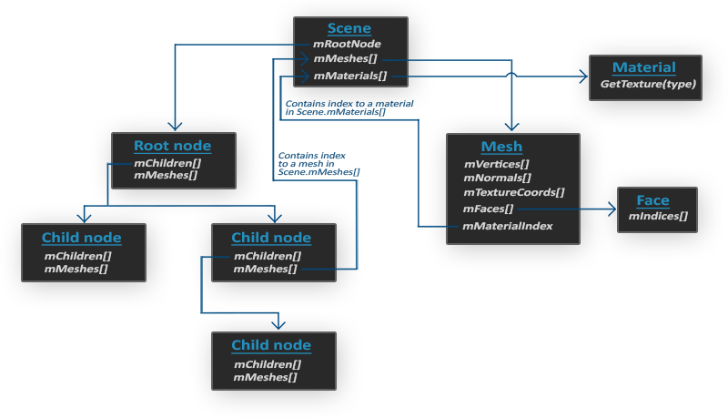

# Assimp

原文     | [Assimp](http://learnopengl.com/#!Model-Loading/Assimp)
      ---|---
作者     | JoeyDeVries
翻译     | Cocoonshu, Krasjet, [Geequlim](http://geequlim.com)
校对     | 暂未校对

到目前为止的所有场景中，我们一直都在滥用我们的箱子朋友，但时间久了甚至是我们最好的朋友也会感到无聊。在日常的图形程序中，通常都会使用非常复杂且好玩的模型，它们比静态的箱子要好看多了。然而，和箱子对象不同，我们不太能够对像是房子、汽车或者人形角色这样的复杂形状手工定义所有的顶点、法线和纹理坐标。我们想要的是将这些模型(Model)**导入**(Import)到程序当中。模型通常都由3D艺术家在[Blender](http://www.blender.org/)、[3DS Max](http://www.autodesk.nl/products/3ds-max/overview)或者[Maya](http://www.autodesk.com/products/autodesk-maya/overview)这样的工具中精心制作。

这些所谓的<def>3D建模工具</def>(3D Modeling Tool)可以让艺术家创建复杂的形状，并使用一种叫做<def>UV映射</def>(uv-mapping)的手段来应用贴图。这些工具将会在导出到模型文件的时候自动生成所有的顶点坐标、顶点法线以及纹理坐标。这样子艺术家们即使不了解图形技术细节的情况下，也能拥有一套强大的工具来构建高品质的模型了。所有的技术细节都隐藏在了导出的模型文件中。但是，作为图形开发者，我们就**必须**要了解这些技术细节了。

所以，我们的工作就是解析这些导出的模型文件以及提取所有有用的信息，将它们储存为OpenGL能够理解的格式。一个很常见的问题是，模型的文件格式有很多种，每一种都会以它们自己的方式来导出模型数据。像是[Wavefront的.obj](http://en.wikipedia.org/wiki/Wavefront_.obj_file)这样的模型格式，只包含了模型数据以及材质信息，像是模型颜色和漫反射/镜面光贴图。而以XML为基础的[Collada文件格式](http://en.wikipedia.org/wiki/COLLADA)则非常的丰富，包含模型、光照、多种材质、动画数据、摄像机、完整的场景信息等等。Wavefront的.obj格式通常被认为是一个易于解析的模型格式。建议至少去Wavefront的wiki页面上看看文件格式的信息是如何封装的。这应该能让你认识到模型文件的基本结构。

总而言之，不同种类的文件格式有很多，它们之间通常并没有一个通用的结构。所以如果我们想从这些文件格式中导入模型的话，我们必须要去自己对每一种需要导入的文件格式写一个导入器。很幸运的是，正好有一个库专门处理这个问题。

## 模型加载库

一个非常流行的模型导入库是[Assimp](http://assimp.org/)，它是**Open Asset Import Library**（开放的资产导入库）的缩写。Assimp能够导入很多种不同的模型文件格式（并也能够导出部分的格式），它会将所有的模型数据加载至Assimp的通用数据结构中。当Assimp加载完模型之后，我们就能够从Assimp的数据结构中提取我们所需的所有数据了。由于Assimp的数据结构保持不变，不论导入的是什么种类的文件格式，它都能够将我们从这些不同的文件格式中抽象出来，用同一种方式访问我们需要的数据。

当使用Assimp导入一个模型的时候，它通常会将整个模型加载进一个**场景**(Scene)对象，它会包含导入的模型/场景中的所有数据。Assimp会将场景载入为一系列的节点(Node)，每个节点包含了场景对象中所储存数据的索引，每个节点都可以有任意数量的子节点。Assimp数据结构的（简化）模型如下：



- 和材质和网格(Mesh)一样，所有的场景/模型数据都包含在<u>Scene</u>对象中。<u>Scene</u>对象也包含了场景根节点的引用。
- 场景的<u>Root node</u>（根节点）可能包含子节点（和其它的节点一样），它会有一系列指向场景对象中<var>mMeshes</var>数组中储存的网格数据的索引。<u>Scene</u>下的<var>mMeshes</var>数组储存了真正的<u>Mesh</u>对象，节点中的<var>mMeshes</var>数组保存的只是场景中网格数组的索引。
- 一个<u>Mesh</u>对象本身包含了渲染所需要的所有相关数据，像是顶点位置、法向量、纹理坐标、面(Face)和物体的材质。
- 一个网格包含了多个面。<u>Face</u>代表的是物体的渲染图元(Primitive)（三角形、方形、点）。一个面包含了组成图元的顶点的索引。由于顶点和索引是分开的，使用一个索引缓冲来渲染是非常简单的（见[你好，三角形](../01 Getting started/04 Hello Triangle.md)）。
- 最后，一个网格也包含了一个<u>Material</u>对象，它包含了一些函数能让我们获取物体的材质属性，比如说颜色和纹理贴图（比如漫反射和镜面光贴图）。

所以，我们需要做的第一件事是将一个物体加载到<u>Scene</u>对象中，遍历节点，获取对应的<u>Mesh</u>对象（我们需要递归搜索每个节点的子节点），并处理每个<u>Mesh</u>对象来获取顶点数据、索引以及它的材质属性。最终的结果是一系列的网格数据，我们会将它们包含在一个`Model`对象中。

!!! Important

	**网格**

	当使用建模工具对物体建模的时候，艺术家通常不会用单个形状创建出整个模型。通常每个模型都由几个子模型/形状组合而成。组合模型的每个单独的形状就叫做一个<def>网格</def>(Mesh)。比如说有一个人形的角色：艺术家通常会将头部、四肢、衣服、武器建模为分开的组件，并将这些网格组合而成的结果表现为最终的模型。一个网格是我们在OpenGL中绘制物体所需的最小单位（顶点数据、索引和材质属性）。一个模型（通常）会包括多个网格。

在[下一节](02 Mesh.md)中，我们将创建我们自己的<fun>Model</fun>和<fun>Mesh</fun>类来加载并使用刚刚介绍的结构储存导入后的模型。如果我们想要绘制一个模型，我们不需要将整个模型渲染为一个整体，只需要渲染组成模型的每个独立的网格就可以了。然而，在我们开始导入模型之前，我们首先需要将Assimp包含到我们的工程当中。

## 构建Assimp

你可以在Assimp的[下载页面](http://assimp.org/main_downloads.html)中选择相应的版本。在写作时使用的Assimp最高版本为3.1.1。我们建议你自己编译Assimp库，因为它们的预编译库在大部分系统上都是不能运行的。如果你忘记如何使用CMake自己编译一个库的话，可以复习[创建窗口](../01 Getting started/02 Creating a window.md)小节。

构建Assimp时可能会出现一些问题，所以我会将它们的解决方案列在这里，便于大家排除错误：

- CMake在读取配置列表时，不断报出DirectX库丢失的错误。报错如下：
 
```
Could not locate DirectX
CMake Error at cmake-modules/FindPkgMacros.cmake:110 (message):
Required library DirectX not found! Install the library (including dev packages) 
and try again. If the library is already installed, set the missing variables 
manually in cmake.
```

这个问题的解决方案是安装DirectX SDK，如果你之前没安装过的话。你可以从[这里](http://www.microsoft.com/en-us/download/details.aspx?id=6812)下载SDK。

- 安装DirectX SDK时，可能遇到一个错误码为`s1023`的错误。这种情况下，请在安装SDK之前根据[这个](http://blogs.msdn.com/b/chuckw/archive/2011/12/09/known-issue-directx-sdk-june-2010-setup-and-the-s1023-error.aspx)先卸载C++ Redistributable package(s)。
- 一旦配置完成，你就可以生成解决方案文件了，打开解决方案文件并编译Assimp库（可以编译为Debug版本也可以编译为Release版本，只要能工作就行）。
- 使用默认配置构建的Assimp是一个动态库(Dynamic Library)，所以我们需要包含所生成的**assimp.dll**文件以及程序的二进制文件。你可以简单地将DLL复制到我们程序可执行文件的同一目录中。
- Assimp编译之后，生成的库和DLL文件位于**code/Debug**或者**code/Release**文件夹中。
- 接着把编译好的LIB文件和DLL文件拷贝到工程的相应目录下，并在解决方案中链接它们。并且记得把Assimp的头文件也复制到你的**include**目录中（头文件可以在从Assimp中下载的**include**目录里找到）。

如果你仍遇到了未报告的错误，欢迎在评论区中寻求帮助。

!!! Important

	如果你想让Assimp使用多线程来获得更高的性能，你可以使用Boost库来编译Assimp。你可以在它们的[安装页面](http://assimp.org/lib_html/install.html)找到完整的安装介绍。

现在，你应该已经编译完Assimp库并将它链接到你的程序中了。下一步：[导入](02 Mesh.md)漂亮的3D物体！