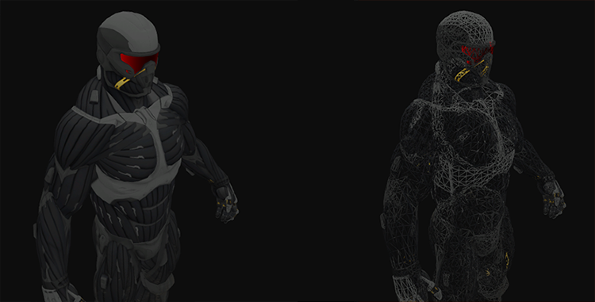
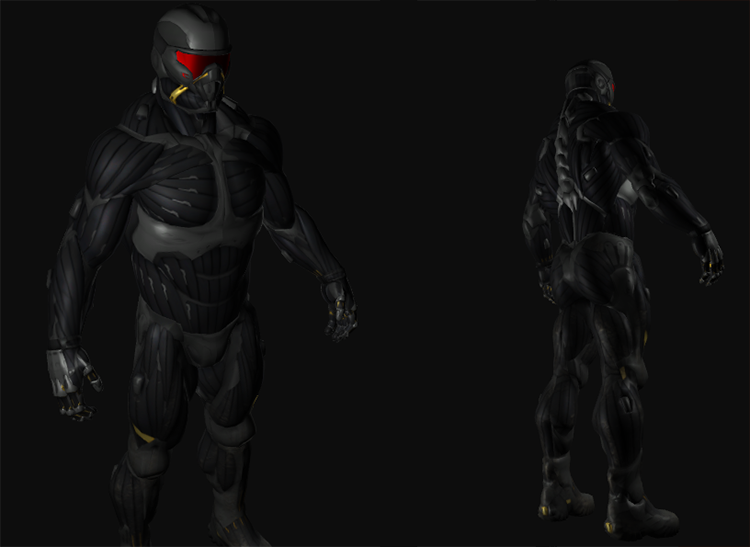

# 模型

原文     | [Model](http://learnopengl.com/#!Model-Loading/Model)
      ---|---
作者     | JoeyDeVries
翻译     | Krasjet
校对     | 暂未校对

现在是时候接触Assimp并创建实际的加载和转换代码了。这个教程的目标是创建另一个类来完整地表示一个模型，或者说是包含多个网格，甚至是多个物体的模型。一个包含木制阳台、塔楼、甚至游泳池的房子可能仍会被加载为一个模型。我们会使用Assimp来加载模型，并将它转换(Translate)至多个在[上一节](02 Mesh.md)中创建的<var>Mesh</var>对象。


事不宜迟，我会先把<fun>Model</fun>类的结构给你：

```c++
class Model 
{
    public:
        /*  函数   */
        Model(char *path)
        {
            loadModel(path);
        }
        void Draw(Shader shader);	
    private:
        /*  模型数据  */
        vector<Mesh> meshes;
        string directory;
        /*  函数   */
        void loadModel(string path);
        void processNode(aiNode *node, const aiScene *scene);
        Mesh processMesh(aiMesh *mesh, const aiScene *scene);
        vector<Texture> loadMaterialTextures(aiMaterial *mat, aiTextureType type, 
                                             string typeName);
};
```

<fun>Model</fun>类包含了一个<fun>Mesh</fun>对象的vector（译注：这里指的是C++中的vector模板类，之后遇到均不译），构造器需要我们给它一个文件路径。在构造器中，它会直接通过<fun>loadModel</fun>来加载文件。私有函数将会处理Assimp导入过程中的一部分，我们很快就会介绍它们。我们还将储存文件路径的目录，在之后加载纹理的时候还会用到它。

<fun>Draw</fun>函数没有什么特别之处，基本上就是遍历了所有网格，并调用它们各自的<fun>Draw</fun>函数。

```c++
void Draw(Shader shader)
{
    for(unsigned int i = 0; i < meshes.size(); i++)
        meshes[i].Draw(shader);
}
```

## 导入3D模型到OpenGL

要想导入一个模型，并将它转换到我们自己的数据结构中的话，首先我们需要包含Assimp对应的头文件，这样编译器就不会抱怨我们了。

```c++
#include <assimp/Importer.hpp>
#include <assimp/scene.h>
#include <assimp/postprocess.h>
```

首先需要调用的函数是<fun>loadModel</fun>，它会从构造器中直接调用。在<fun>loadModel</fun>中，我们使用Assimp来加载模型至Assimp的一个叫做<u>scene</u>的数据结构中。你可能还记得在模型加载章节的[第一节](01 Assimp.md)教程中，这是Assimp数据接口的根对象。一旦我们有了这个场景对象，我们就能访问到加载后的模型中所有所需的数据了。

Assimp很棒的一点在于，它抽象掉了加载不同文件格式的所有技术细节，只需要一行代码就能完成所有的工作：

```c++
Assimp::Importer importer;
const aiScene *scene = importer.ReadFile(path, aiProcess_Triangulate | aiProcess_FlipUVs);
```

我们首先声明了Assimp命名空间内的一个<fun>Importer</fun>，之后调用了它的<var>ReadFile</var>函数。这个函数需要一个文件路径，它的第二个参数是一些<def>后期处理</def>(Post-processing)的选项。除了加载文件之外，Assimp允许我们设定一些选项来强制它对导入的数据做一些额外的计算或操作。通过设定<var>aiProcess_Triangulate</var>，我们告诉Assimp，如果模型不是（全部）由三角形组成，它需要将模型所有的图元形状变换为三角形。<var>aiProcess_FlipUVs</var>将在处理的时候翻转y轴的纹理坐标（你可能还记得我们在[纹理](../01 Getting started/06 Textures.md)教程中说过，在OpenGL中大部分的图像的y轴都是反的，所以这个后期处理选项将会修复这个）。其它一些比较有用的选项有：

- <var>aiProcess_GenNormals</var>：如果模型不包含法向量的话，就为每个顶点创建法线。
- <var>aiProcess_SplitLargeMeshes</var>：将比较大的网格分割成更小的子网格，如果你的渲染有最大顶点数限制，只能渲染较小的网格，那么它会非常有用。
- <var>aiProcess_OptimizeMeshes</var>：和上个选项相反，它会将多个小网格拼接为一个大的网格，减少绘制调用从而进行优化。

Assimp提供了很多有用的后期处理指令，你可以在[这里](http://assimp.sourceforge.net/lib_html/postprocess_8h.html)找到全部的指令。实际上使用Assimp加载模型是非常容易的（你也可以看到）。困难的是之后使用返回的场景对象将加载的数据转换到一个<fun>Mesh</fun>对象的数组。

完整的<fun>loadModel</fun>函数将会是这样的：

```c++
void loadModel(string path)
{
    Assimp::Importer import;
    const aiScene *scene = import.ReadFile(path, aiProcess_Triangulate | aiProcess_FlipUVs);	

    if(!scene || scene->mFlags & AI_SCENE_FLAGS_INCOMPLETE || !scene->mRootNode) 
    {
        cout << "ERROR::ASSIMP::" << import.GetErrorString() << endl;
        return;
    }
    directory = path.substr(0, path.find_last_of('/'));

    processNode(scene->mRootNode, scene);
}
```

在我们加载了模型之后，我们会检查场景和其根节点不为null，并且检查了它的一个标记(Flag)，来查看返回的数据是不是不完整的。如果遇到了任何错误，我们都会通过导入器的<fun>GetErrorString</fun>函数来报告错误并返回。我们也获取了文件路径的目录路径。

如果什么错误都没有发生，我们希望处理场景中的所有节点，所以我们将第一个节点（根节点）传入了递归的<fun>processNode</fun>函数。因为每个节点（可能）包含有多个子节点，我们希望首先处理参数中的节点，再继续处理该节点所有的子节点，以此类推。这正符合一个递归结构，所以我们将定义一个递归函数。递归函数在做一些处理之后，使用不同的参数<def>递归</def>调用这个函数自身，直到某个条件被满足停止递归。在我们的例子中<def>退出条件</def>(Exit Condition)是所有的节点都被处理完毕。

你可能还记得Assimp的结构中，每个节点包含了一系列的网格索引，每个索引指向场景对象中的那个特定网格。我们接下来就想去获取这些网格索引，获取每个网格，处理每个网格，接着对每个节点的子节点重复这一过程。<fun>processNode</fun>函数的内容如下：

```c++
void processNode(aiNode *node, const aiScene *scene)
{
    // 处理节点所有的网格（如果有的话）
    for(unsigned int i = 0; i < node->mNumMeshes; i++)
    {
        aiMesh *mesh = scene->mMeshes[node->mMeshes[i]]; 
        meshes.push_back(processMesh(mesh, scene));			
    }
    // 接下来对它的子节点重复这一过程
    for(unsigned int i = 0; i < node->mNumChildren; i++)
    {
        processNode(node->mChildren[i], scene);
    }
}
```

我们首先检查每个节点的网格索引，并索引场景的<var>mMeshes</var>数组来获取对应的网格。返回的网格将会传递到<fun>processMesh</fun>函数中，它会返回一个<fun>Mesh</fun>对象，我们可以将它存储在<var>meshes</var>列表/vector。

所有网格都被处理之后，我们会遍历节点的所有子节点，并对它们调用相同的<fun>processMesh</fun>函数。当一个节点不再有任何子节点之后，这个函数将会停止执行。

!!! Important

	认真的读者可能会发现，我们可以基本上忘掉处理任何的节点，只需要遍历场景对象的所有网格，就不需要为了索引做这一堆复杂的东西了。我们仍这么做的原因是，使用节点的最初想法是将网格之间定义一个父子关系。通过这样递归地遍历这层关系，我们就能将某个网格定义为另一个网格的父网格了。  
	这个系统的一个使用案例是，当你想位移一个汽车的网格时，你可以保证它的所有子网格（比如引擎网格、方向盘网格、轮胎网格）都会随着一起位移。这样的系统能够用父子关系很容易地创建出来。

	然而，现在我们并没有使用这样一种系统，但如果你想对你的网格数据有更多的控制，通常都是建议使用这一种方法的。这种类节点的关系毕竟是由创建了这个模型的艺术家所定义。

下一步就是将Assimp的数据解析到上一节中创建的<fun>Mesh</fun>类中。

### 从Assimp到网格

将一个`aiMesh`对象转化为我们自己的网格对象不是那么困难。我们要做的只是访问网格的相关属性并将它们储存到我们自己的对象中。<fun>processMesh</fun>函数的大体结构如下：

```c++
Mesh processMesh(aiMesh *mesh, const aiScene *scene)
{
    vector<Vertex> vertices;
    vector<unsigned int> indices;
    vector<Texture> textures;

    for(unsigned int i = 0; i < mesh->mNumVertices; i++)
    {
        Vertex vertex;
        // 处理顶点位置、法线和纹理坐标
        ...
        vertices.push_back(vertex);
    }
    // 处理索引
    ...
    // 处理材质
    if(mesh->mMaterialIndex >= 0)
    {
        ...
    }

    return Mesh(vertices, indices, textures);
}
```

处理网格的过程主要有三部分：获取所有的顶点数据，获取它们的网格索引，并获取相关的材质数据。处理后的数据将会储存在三个vector当中，我们会利用它们构建一个<fun>Mesh</fun>对象，并返回它到函数的调用者那里。

获取顶点数据非常简单，我们定义了一个<fun>Vertex</fun>结构体，我们将在每个迭代之后将它加到<var>vertices</var>数组中。我们会遍历网格中的所有顶点（使用`mesh->mNumVertices`来获取）。在每个迭代中，我们希望使用所有的相关数据填充这个结构体。顶点的位置是这样处理的：

```c++
glm::vec3 vector; 
vector.x = mesh->mVertices[i].x;
vector.y = mesh->mVertices[i].y;
vector.z = mesh->mVertices[i].z; 
vertex.Position = vector;
```

注意我们为了传输Assimp的数据，我们定义了一个`vec3`的临时变量。使用这样一个临时变量的原因是Assimp对向量、矩阵、字符串等都有自己的一套数据类型，它们并不能完美地转换到GLM的数据类型中。

!!! Important

	Assimp将它的顶点位置数组叫做<var>mVertices</var>，这其实并不是那么直观。

处理法线的步骤也是差不多的：

```c++
vector.x = mesh->mNormals[i].x;
vector.y = mesh->mNormals[i].y;
vector.z = mesh->mNormals[i].z;
vertex.Normal = vector;
```

纹理坐标的处理也大体相似，但Assimp允许一个模型在一个顶点上有最多8个不同的纹理坐标，我们不会用到那么多，我们只关心第一组纹理坐标。我们同样也想检查网格是否真的包含了纹理坐标（可能并不会一直如此）

```c++
if(mesh->mTextureCoords[0]) // 网格是否有纹理坐标？
{
    glm::vec2 vec;
    vec.x = mesh->mTextureCoords[0][i].x; 
    vec.y = mesh->mTextureCoords[0][i].y;
    vertex.TexCoords = vec;
}
else
    vertex.TexCoords = glm::vec2(0.0f, 0.0f);
```

<var>vertex</var>结构体现在已经填充好了需要的顶点属性，我们会在迭代的最后将它压入<var>vertices</var>这个vector的尾部。这个过程会对每个网格的顶点都重复一遍。

### 索引

Assimp的接口定义了每个网格都有一个面(Face)数组，每个面代表了一个图元，在我们的例子中（由于使用了<var>aiProcess_Triangulate</var>选项）它总是三角形。一个面包含了多个索引，它们定义了在每个图元中，我们应该绘制哪个顶点，并以什么顺序绘制，所以如果我们遍历了所有的面，并储存了面的索引到<var>indices</var>这个vector中就可以了。

```c++
for(unsigned int i = 0; i < mesh->mNumFaces; i++)
{
    aiFace face = mesh->mFaces[i];
    for(unsigned int j = 0; j < face.mNumIndices; j++)
        indices.push_back(face.mIndices[j]);
}
```

所有的外部循环都结束了，我们现在有了一系列的顶点和索引数据，它们可以用来通过<fun>glDrawElements</fun>函数来绘制网格。然而，为了结束这个话题，并且对网格提供一些细节，我们还需要处理网格的材质。

### 材质

和节点一样，一个网格只包含了一个指向材质对象的索引。如果想要获取网格真正的材质，我们还需要索引场景的<var>mMaterials</var>数组。网格材质索引位于它的<var>mMaterialIndex</var>属性中，我们同样可以用它来检测一个网格是否包含有材质：

```c++
if(mesh->mMaterialIndex >= 0)
{
    aiMaterial *material = scene->mMaterials[mesh->mMaterialIndex];
    vector<Texture> diffuseMaps = loadMaterialTextures(material, 
                                        aiTextureType_DIFFUSE, "texture_diffuse");
    textures.insert(textures.end(), diffuseMaps.begin(), diffuseMaps.end());
    vector<Texture> specularMaps = loadMaterialTextures(material, 
                                        aiTextureType_SPECULAR, "texture_specular");
    textures.insert(textures.end(), specularMaps.begin(), specularMaps.end());
}
```

我们首先从场景的<var>mMaterials</var>数组中获取`aiMaterial`对象。接下来我们希望加载网格的漫反射和/或镜面光贴图。一个材质对象的内部对每种纹理类型都存储了一个纹理位置数组。不同的纹理类型都以`aiTextureType_`为前缀。我们使用一个叫做<fun>loadMaterialTextures</fun>的工具函数来从材质中获取纹理。这个函数将会返回一个<fun>Texture</fun>结构体的vector，我们将在模型的<var>textures</var> vector的尾部之后存储它。

<fun>loadMaterialTextures</fun>函数遍历了给定纹理类型的所有纹理位置，获取了纹理的文件位置，并加载并和生成了纹理，将信息储存在了一个<fun>Vertex</fun>结构体中。它看起来会像这样：

```c++
vector<Texture> loadMaterialTextures(aiMaterial *mat, aiTextureType type, string typeName)
{
    vector<Texture> textures;
    for(unsigned int i = 0; i < mat->GetTextureCount(type); i++)
    {
        aiString str;
        mat->GetTexture(type, i, &str);
        Texture texture;
        texture.id = TextureFromFile(str.C_Str(), directory);
        texture.type = typeName;
        texture.path = str;
        textures.push_back(texture);
    }
    return textures;
}
```

我们首先通过<fun>GetTextureCount</fun>函数检查储存在材质中纹理的数量，这个函数需要一个纹理类型。我们会使用<fun>GetTexture</fun>获取每个纹理的文件位置，它会将结果储存在一个`aiString`中。我们接下来使用另外一个叫做<fun>TextureFromFile</fun>的工具函数，它将会（用`stb_image.h`）加载一个纹理并返回该纹理的ID。如果你不确定这样的代码是如何写出来的话，可以查看最后的完整代码。

!!! Important

	注意，我们假设了模型文件中纹理文件的路径是相对于模型文件的本地(Local)路径，比如说与模型文件处于同一目录下。我们可以将纹理位置字符串拼接到之前（在<fun>loadModel</fun>中）获取的目录字符串上，来获取完整的纹理路径（这也是为什么<fun>GetTexture</fun>函数也需要一个目录字符串）。

	在网络上找到的某些模型会对纹理位置使用绝对(Absolute)路径，这就不能在每台机器上都工作了。在这种情况下，你可能会需要手动修改这个文件，来让它对纹理使用本地路径（如果可能的话）。

这就是使用Assimp导入模型的全部了。

# 重大优化

这还没有完全结束，因为我们还想做出一个重大的（但不是完全必须的）优化。大多数场景都会在多个网格中重用部分纹理。还是想想一个房子，它的墙壁有着花岗岩的纹理。这个纹理也可以被应用到地板、天花板、楼梯、桌子，甚至是附近的一口井上。加载纹理并不是一个开销不大的操作，在我们当前的实现中，即便同样的纹理已经被加载过很多遍了，对每个网格仍会加载并生成一个新的纹理。这很快就会变成模型加载实现的性能瓶颈。

所以我们会对模型的代码进行调整，将所有加载过的纹理全局储存，每当我们想加载一个纹理的时候，首先去检查它有没有被加载过。如果有的话，我们会直接使用那个纹理，并跳过整个加载流程，来为我们省下很多处理能力。为了能够比较纹理，我们还需要储存它们的路径：

```c++
struct Texture {
    unsigned int id;
    string type;
    aiString path;  // 我们储存纹理的路径用于与其它纹理进行比较
};
```

接下来我们将所有加载过的纹理储存在另一个vector中，在模型类的顶部声明为一个私有变量：

```c++
vector<Texture> textures_loaded;
```

之后，在<fun>loadMaterialTextures</fun>函数中，我们希望将纹理的路径与储存在<var>textures_loaded</var>这个vector中的所有纹理进行比较，看看当前纹理的路径是否与其中的一个相同。如果是的话，则跳过纹理加载/生成的部分，直接使用定位到的纹理结构体为网格的纹理。更新后的函数如下：

```c++
vector<Texture> loadMaterialTextures(aiMaterial *mat, aiTextureType type, string typeName)
{
    vector<Texture> textures;
    for(unsigned int i = 0; i < mat->GetTextureCount(type); i++)
    {
        aiString str;
        mat->GetTexture(type, i, &str);
        bool skip = false;
        for(unsigned int j = 0; j < textures_loaded.size(); j++)
        {
            if(std::strcmp(textures_loaded[j].path.data(), str.C_Str()) == 0)
            {
                textures.push_back(textures_loaded[j]);
                skip = true; 
                break;
            }
        }
        if(!skip)
        {   // 如果纹理还没有被加载，则加载它
            Texture texture;
            texture.id = TextureFromFile(str.C_Str(), directory);
            texture.type = typeName;
            texture.path = str.C_Str();
            textures.push_back(texture);
            textures_loaded.push_back(texture); // 添加到已加载的纹理中
        }
    }
    return textures;
}
```

所以现在我们不仅有了个灵活的模型加载系统，我们也获得了一个加载对象很快的优化版本。

!!! Attention

	有些版本的Assimp在使用调试版本或者使用IDE的调试模式下加载模型会非常缓慢，所以在你遇到缓慢的加载速度时，可以试试使用发布版本。

你可以在[这里](https://learnopengl.com/code_viewer_gh.php?code=includes/learnopengl/model.h)找到优化后<fun>Model</fun>类的完整源代码。

# 和箱子模型告别

所以，让我们导入一个由真正的艺术家所创造的模型，替代我这个天才的作品（你要承认，这些箱子可能是你看过的最漂亮的立方体了），测试一下我们的实现吧。由于我不想让我占太多的功劳，我会偶尔让别的艺术家也加入我们，这次我们将会加载Crytek的游戏孤岛危机(Crysis)中的原版[纳米装](http://tf3dm.com/3d-model/crysis-2-nanosuit-2-97837.html)(Nanosuit)。这个模型被输出为一个`.obj`文件以及一个`.mtl`文件，`.mtl`文件包含了模型的漫反射、镜面光和法线贴图（这个会在后面学习到），你可以在[这里](../data/nanosuit.rar)下载到（稍微修改之后的）模型，注意所有的纹理和模型文件应该位于同一个目录下，以供加载纹理。

!!! Important

	你从本网站中下载到的版本是修改过的版本，每个纹理的路径都被修改为了一个本地的相对路径，而不是原资源的绝对路径。

现在在代码中，声明一个<fun>Model</fun>对象，将模型的文件位置传入。接下来模型应该会自动加载并（如果没有错误的话）在渲染循环中使用它的<fun>Draw</fun>函数来绘制物体，这样就可以了。不再需要缓冲分配、属性指针和渲染指令，只需要一行代码就可以了。接下来如果你创建一系列着色器，其中片段着色器仅仅输出物体的漫反射纹理颜色，最终的结果看上去会是这样的：



你可以在[这里](https://learnopengl.com/code_viewer_gh.php?code=src/3.model_loading/1.model_loading/model_loading.cpp)找到完整的源码。

我们可以变得更有创造力一点，根据我们之前在[光照](../02 Lighting/05 Light casters.md)教程中学过的知识，引入两个点光源到渲染方程中，结合镜面光贴图，我们能得到很惊人的效果。



甚至我都必须要承认这个可能是比一直使用的箱子要好看多了。使用Assimp，你能够加载互联网上的无数模型。有很多资源网站都提供了多种格式的免费3D模型供你下载。但还是要注意，有些模型会不能正常地载入，纹理的路径会出现问题，或者Assimp并不支持它的格式。