# 骨骼动画

原文     | [Skeletal-Animation](https://learnopengl.com/Guest-Articles/2020/Skeletal-Animation)
      ---|---
作者     | Ankit Singh Kushwah
翻译     | [orbitgw](https://github.com/orbitgw/)
校对     | [orbitgw](https://github.com/orbitgw/)

3D动画可以让我们的游戏栩栩如生。3D世界中的物体，比如人类和动物，当它们做某些事情移动四肢时，比如走路、跑步和攻击，会使我们感到更生动。本篇教程是关于你们一直在等待的骨骼动画。我们将首先彻底理解这个概念，然后了解使用Assimp制作3D模型动画所需的数据。我建议您完成本教程的[模型加载](./01%20Assimp.md)部分，因为本教程代码将从那里继续。你仍然可以理解这个概念，并以自己的方式实现它。所以让我们开始吧。

## 插值
要了解动画是如何工作的基础，我们需要了解插值(Interpolation)的概念。插值可以定义为随着时间的推移而发生的事情。就像敌人在时间T上从A点移动到B点一样，即随着时间的推移发生平移。炮塔平滑旋转以面对目标，即随着时间的推移发生旋转，树在时间T内从尺寸A放大到尺寸B，即随时间推移发生缩放。

!!! note "译注"
    (动画)插值就是**关键帧**的中间值。比如我们使用Blender制作动画，不需要设置每一帧的骨骼位置，只需要在几个关键帧中记录它们的位置，旋转，缩放等等信息。然后由程序自动计算出的中间的过渡帧就是我们的插值。通常插值可以使用曲线描述，比如我们的贝塞尔曲线。

用于平移和缩放的简单插值方程如下所示：

$$
a = a \cdot (1 - t) + b \cdot t
$$

它被称为线性插值方程或Lerp。对于旋转，我们不能使用向量。原因是，如果我们继续尝试在X（俯仰）、Y（偏航）和Z（滚转）的向量上使用线性插值方程，插值就不会是线性的。你会遇到一些奇怪的问题，比如Gimbal Lock（请参阅下面的参考资料部分了解它）。为了避免这个问题，我们使用四元数进行旋转。四元数提供了一种叫做球面插值或Slerp方程的东西，它给出了与Lerp相同的结果，但对于两个旋转A和B。我无法解释这个方程是如何工作的，因为它目前不在范围内。您可以查看下面的参考资料部分来理解四元数。


## 动画模型的组件：蒙皮、骨骼和关键帧

动画的整个过程始于添加第一个组件，即blender或Maya等软件中的蒙皮(Skin)。蒙皮只不过是网格(Mesh)，它为模型添加了视觉方面，告诉观察者它的外观。但是，如果你想移动任何网格，那么就像现实世界一样，你需要添加骨骼。你可以看到下面的图片来了解它在blender等软件中的外观。

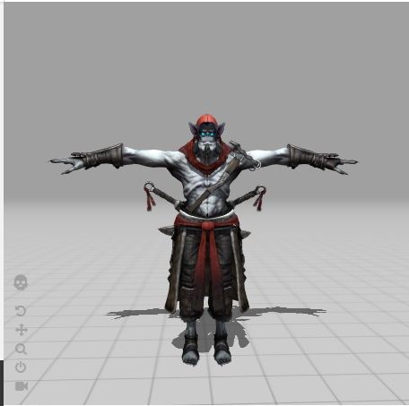
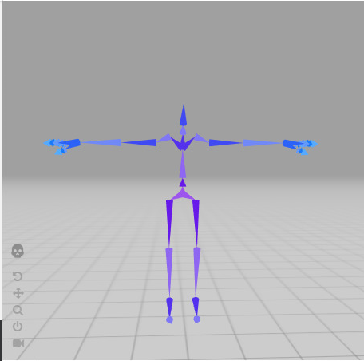
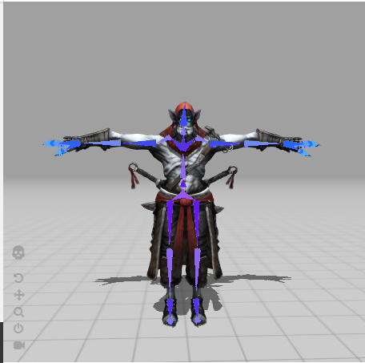

这些骨头通常是以分层的方式添加给人类和动物等角色的，原因很明显。我们想要四肢之间的父子关系(parent-child relationship)。例如，如果我们移动右肩，那么我们的右二头肌、前臂、手和手指也应该移动。这就是层次结构的样子：


在上图中，如果你抓住髋骨(hip bone)并移动它，所有的肢体都会受到它的移动的影响。

此时，我们已经准备好为动画创建关键帧了。关键帧是动画中不同时间点的姿势。我们将在这些关键帧之间进行插值，以便在代码中从一个姿势平滑地过渡到另一个姿势。下面您可以看到如何为简单的4帧跳跃动画创建姿势：

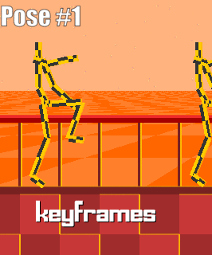
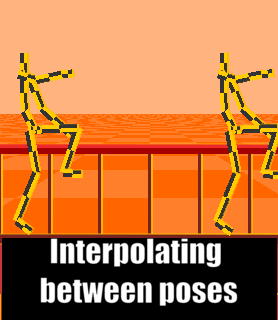


## Assimp如何保存动画数据
我们马上就会到代码部分，但首先我们需要了解assimp是如何保存导入的动画数据的。看下图：


就像[模型加载](./01%20Assimp.md)部分一样，我们将从`aiScene`指针开始，该指针包含指向根节点的指针，然后看看我们这里有什么，一个动画数组。这个`aiAnimation`数组包含一般信息，比如动画的持续时间，这里表示为`mDuration`，然后我们有一个`mTicksPerSecond`变量，它控制我们应该在帧之间插值的速度。如果您还记得上一节中的动画有关键帧。类似地，`aiAnimation`包含一个名为`Channels`的`aiNodeAnim`数组。此数组包含将要参与动画的所有骨骼及其关键帧。一个`aiNodeAnim`包含骨骼的名称，你会发现在这里插入三种类型的关键点，平移、旋转和缩放。

好吧，还有最后一件事我们需要理解，并且很乐意去做的一件事就是写代码。

 

## 多个骨骼对顶点的影响

当我们弯曲前臂时，我们会看到我们的二头肌弹出。我们也可以说前臂骨骼的变形正在影响我们肱二头肌上的顶点。类似地，可能有多个骨骼影响网格中的单个顶点。对于像固体金属机器人这样的角色，所有前臂顶点都只会受到前臂骨骼的影响，但对于像人类、动物等角色，可能有多达4块骨骼可以影响一个顶点。让我们看看assimp是如何存储这些信息的：

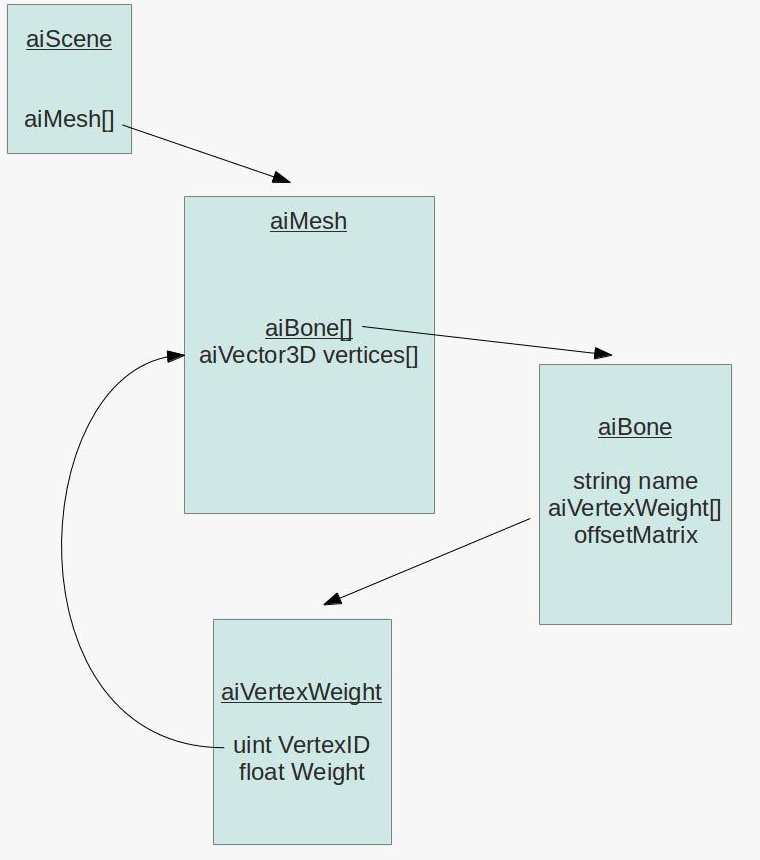
 
我们再次从`aiScene`指针开始，该指针包含所有`aiMeshes`的数组。每个aiMesh对象都有一个`aiBone`数组，其中包含诸如此`aiBone`将对网格上的顶点集产生多大影响之类的信息。`aiBone`包含骨骼的名称，这是一个`aiVertexWeight`数组，基本上告诉此`aiBone`对网格上的顶点有多大影响。现在我们有了`aiBone`的另一个成员，它是`offsetMatrix`。这是一个4x4矩阵，用于将顶点从模型空间转换到骨骼空间。你可以在下面的图片中看到这一点：

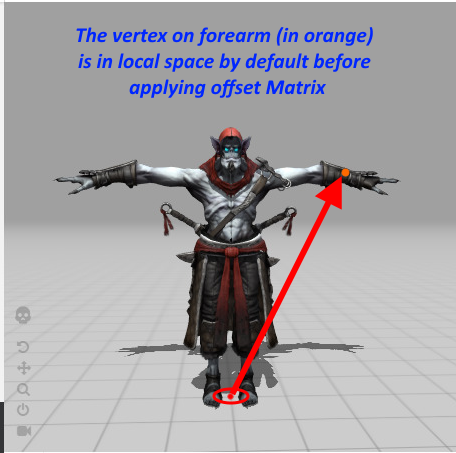
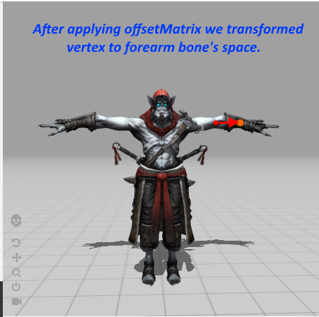

当顶点位于骨骼空间中时，它们将按照预期相对于骨骼进行变换。您很快就会在代码中看到这一点。

## 最后让我们写代码
谢谢你走到这一步。我们将从直接查看最终结果开始，这是我们的最终顶点着色器代码。这将给我们很好的感觉，我们最终需要什么。

```c++
#version 430 core

layout(location = 0) in vec3 pos;
layout(location = 1) in vec3 norm;
layout(location = 2) in vec2 tex;
layout(location = 5) in ivec4 boneIds; 
layout(location = 6) in vec4 weights;
	
uniform mat4 projection;
uniform mat4 view;
uniform mat4 model;
	
const int MAX_BONES = 100;
const int MAX_BONE_INFLUENCE = 4;
uniform mat4 finalBonesMatrices[MAX_BONES];
	
out vec2 TexCoords;
	
void main()
{
    vec4 totalPosition = vec4(0.0f);
    for(int i = 0 ; i < MAX_BONE_INFLUENCE ; i++)
    {
        if(boneIds[i] == -1) 
            continue;
        if(boneIds[i] >=MAX_BONES) 
        {
            totalPosition = vec4(pos,1.0f);
            break;
        }
        vec4 localPosition = finalBonesMatrices[boneIds[i]] * vec4(pos,1.0f);
        totalPosition += localPosition * weights[i];
        vec3 localNormal = mat3(finalBonesMatrices[boneIds[i]]) * norm;
    }
		
    mat4 viewModel = view * model;
    gl_Position =  projection * viewModel * totalPosition;
    TexCoords = tex;
}
```


片段着色器与[这篇教程](./03%20Model.md)中的保持相同。从顶部开始，您可以看到两个新的属性布局声明。第一个骨骼ID，第二个是重量。我们还有一个统一的数组`finalBonesMatrix`，它存储所有骨骼的变换。`boneIds`包含用于读取最终`BonesMatrix`数组并将这些变换应用于pos顶点的索引，其各自的权重存储在权重数组中。这发生在上面循环的内部。现在，让我们先在Mesh类中添加对骨骼重量的支持：


```c++
#define MAX_BONE_INFLUENCE 4

struct Vertex {
    // position
    glm::vec3 Position;
    // normal
    glm::vec3 Normal;
    // texCoords
    glm::vec2 TexCoords;
	
    // tangent
    glm::vec3 Tangent;
    // bitangent
    glm::vec3 Bitangent;

    //bone indexes which will influence this vertex
    int m_BoneIDs[MAX_BONE_INFLUENCE];
    //weights from each bone
    float m_Weights[MAX_BONE_INFLUENCE];
  
};
```
我们为顶点添加了两个新属性，就像我们在顶点着色器中看到的那样。现在，让我们将它们加载到GPU缓冲区中，就像我们的`Mesh::setupMesh`函数中的其他属性一样：
```c++
class Mesh
{
    ...
    
    void setupMesh()
    {
        ....
        
        // ids
        glEnableVertexAttribArray(3);
        glVertexAttribIPointer(3, 4, GL_INT, sizeof(Vertex), (void*)offsetof(Vertex, m_BoneIDs));

        // weights
        glEnableVertexAttribArray(4);
        glVertexAttribPointer(4, 4, GL_FLOAT, GL_FALSE, sizeof(Vertex), 
            (void*)offsetof(Vertex, m_Weights));   
  
        ...
    }    
    ...
}
```
就像以前一样，只是现在我们为`boneID`和`weights`添加了3个和4个布局位置ID。这里需要注意的一件重要的事情是我们如何传递`boneID`的数据。我们使用的是`glVertexAttribIPointer`，并将`GL_INT`作为第三个参数传递。

现在我们可以从assimp数据结构中提取骨骼重量信息。让我们在Model类中进行一些更改：
```c++
struct BoneInfo
{
    /*id is index in finalBoneMatrices*/
    int id;

    /*offset matrix transforms vertex from model space to bone space*/
    glm::mat4 offset;

};
```
此`BoneInfo`将存储我们的偏移矩阵，以及一个唯一的id，该id将用作索引，将其存储在我们之前在着色器中看到的最终`BoneMatrices`数组中。现在我们将在Model中添加骨量提取支持：

```c++
class Model 
{
private:
    ...
    std::map<string, BoneInfo> m_BoneInfoMap; //
    int m_BoneCounter = 0;

    auto& GetBoneInfoMap() { return m_BoneInfoMap; }
    int& GetBoneCount() { return m_BoneCounter; }    
    ...
    void SetVertexBoneDataToDefault(Vertex& vertex)
    {
        for (int i = 0; i < MAX_BONE_WEIGHTS; i++)
        {
            vertex.m_BoneIDs[i] = -1;
            vertex.m_Weights[i] = 0.0f;
        }
    }

    Mesh processMesh(aiMesh* mesh, const aiScene* scene)
    {
        vector vertices;
        vector indices;
        vector textures;

        for (unsigned int i = 0; i < mesh->mNumVertices; i++)
        {
            Vertex vertex;

            SetVertexBoneDataToDefault(vertex);

            vertex.Position = AssimpGLMHelpers::GetGLMVec(mesh->mVertices[i]);
            vertex.Normal = AssimpGLMHelpers::GetGLMVec(mesh->mNormals[i]);
			
            if (mesh->mTextureCoords[0])
            {
                glm::vec2 vec;
                vec.x = mesh->mTextureCoords[0][i].x;
                vec.y = mesh->mTextureCoords[0][i].y;
                vertex.TexCoords = vec;
            }
            else
                vertex.TexCoords = glm::vec2(0.0f, 0.0f);

            vertices.push_back(vertex);
        }
        ...
        ExtractBoneWeightForVertices(vertices,mesh,scene);

        return Mesh(vertices, indices, textures);
    }

    void SetVertexBoneData(Vertex& vertex, int boneID, float weight)
    {
        for (int i = 0; i < MAX_BONE_WEIGHTS; ++i)
        {
            if (vertex.m_BoneIDs[i] < 0)
            {
                vertex.m_Weights[i] = weight;
                vertex.m_BoneIDs[i] = boneID;
                break;
            }
        }
    }

    void ExtractBoneWeightForVertices(std::vector& vertices, aiMesh* mesh, const aiScene* scene)
    {
        for (int boneIndex = 0; boneIndex < mesh->mNumBones; ++boneIndex)
        {
            int boneID = -1;
            std::string boneName = mesh->mBones[boneIndex]->mName.C_Str();
            if (m_BoneInfoMap.find(boneName) == m_BoneInfoMap.end())
            {
                BoneInfo newBoneInfo;
                newBoneInfo.id = m_BoneCounter;
                newBoneInfo.offset = AssimpGLMHelpers::ConvertMatrixToGLMFormat(
                    mesh->mBones[boneIndex]->mOffsetMatrix);
                m_BoneInfoMap[boneName] = newBoneInfo;
                boneID = m_BoneCounter;
                m_BoneCounter++;
            }
            else
            {
                boneID = m_BoneInfoMap[boneName].id;
            }
            assert(boneID != -1);
            auto weights = mesh->mBones[boneIndex]->mWeights;
            int numWeights = mesh->mBones[boneIndex]->mNumWeights;

            for (int weightIndex = 0; weightIndex < numWeights; ++weightIndex)
            {
                int vertexId = weights[weightIndex].mVertexId;
                float weight = weights[weightIndex].mWeight;
                assert(vertexId <= vertices.size());
                SetVertexBoneData(vertices[vertexId], boneID, weight);
            }
        }
    }
    ...
};
```
我们首先声明一个映射`m_BoneInfoMap`和一个计数器`m_BoneCounter`，一旦我们读取到一个新的骨骼，它就会增加。我们在前面的图表中看到，每个`aiMesh`都包含与`aiMesh`关联的所有`aiBone`。骨量提取的整个过程都是从`processMesh`函数开始的。对于每个循环迭代，我们通过调用函数`SetVertexBoneDataToDefault`将`m_BoneID`和`m_Weights`设置为其默认值。就在`processMesh`函数结束之前，我们调用`ExtractBoneWeightData`。在`ExtractBoneWeightData`中，我们为每个aiBone运行for循环，并检查该骨骼是否已存在于`m_BoneInfoMap`中。如果我们找不到它，那么它被认为是一块新骨头，我们创建一个带有id的新`BoneInfo`，并将其关联的`mOffsetMatrix`存储到它。然后我们将这个新`BoneIInfo`存储在`m_BoneInfoMap`中，然后我们递增`m_BoneCounter`计数器，为下一块骨头创建一个id。如果我们在`m_BoneInfoMap`中找到骨骼名称，那么这意味着该骨骼会影响超出其范围的网格顶点。所以我们取它的Id，进一步了解它会影响哪些顶点。

需要注意的一点是，我们正在调用`AssimpGLMHelpers::ConvertMatrixToGLMFormat`。Assimp以与GLM不同的格式存储其矩阵数据，因此此函数仅为我们提供GLM格式的矩阵。

我们已经提取了骨骼的`offsetMatrix`，现在我们将简单地迭代其`aiVertexWeightarray`，提取将受此骨骼影响的所有顶点索引及其各自的权重，并调用`SetVertexBoneData`以使用提取的信息填充`Vertex.boneIds`和`Vertex.weights`。

呜！到这里你应当休息一下。。。

## 骨骼、动画和动画制作类
这是类的视图：

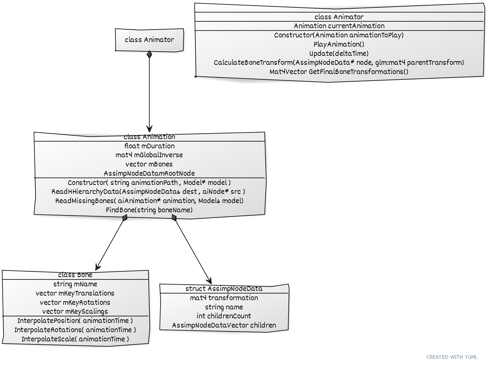


让我们提醒自己我们正在努力实现什么。对于每个渲染帧，我们希望平滑地插值继承中的所有骨骼，并获得它们的最终变换矩阵，这些矩阵将提供给着色器统一的finalBonesMatrix。以下是每个类的内容。。。

**Bone** : 从aiNodeAnim读取所有关键帧数据的单个骨骼。它还将根据当前动画时间在关键帧之间进行插值，即平移、缩放和旋转。

**AssimpNodeData** : 这个结构体将帮助我们将动画从Assimp提取出来。

**Animation** : 从aiAnimation读取数据并创建Bones的继承记录的资源。

**Animator** : 这将读取AssimpNodeData的继承方法，以递归方式插入所有骨骼，然后为我们准备所需的最终骨骼转换矩阵。

这就是代码：
```c++
struct KeyPosition
{
    glm::vec3 position;
    float timeStamp;
};

struct KeyRotation
{
    glm::quat orientation;
    float timeStamp;
};

struct KeyScale
{
    glm::vec3 scale;
    float timeStamp;
};

class Bone
{
private:
    std::vector<KeyPosition> m_Positions;
    std::vector<KeyRotation> m_Rotations;
    std::vector<KeyScale> m_Scales;
    int m_NumPositions;
    int m_NumRotations;
    int m_NumScalings;
	
    glm::mat4 m_LocalTransform;
    std::string m_Name;
    int m_ID;

public:

/*reads keyframes from aiNodeAnim*/
    Bone(const std::string& name, int ID, const aiNodeAnim* channel)
        :
        m_Name(name),
        m_ID(ID),
        m_LocalTransform(1.0f)
    {
        m_NumPositions = channel->mNumPositionKeys;

        for (int positionIndex = 0; positionIndex < m_NumPositions; ++positionIndex)
        {
            aiVector3D aiPosition = channel->mPositionKeys[positionIndex].mValue;
            float timeStamp = channel->mPositionKeys[positionIndex].mTime;
            KeyPosition data;
            data.position = AssimpGLMHelpers::GetGLMVec(aiPosition);
            data.timeStamp = timeStamp;
            m_Positions.push_back(data);
        }

        m_NumRotations = channel->mNumRotationKeys;
        for (int rotationIndex = 0; rotationIndex < m_NumRotations; ++rotationIndex)
        {
            aiQuaternion aiOrientation = channel->mRotationKeys[rotationIndex].mValue;
            float timeStamp = channel->mRotationKeys[rotationIndex].mTime;
            KeyRotation data;
            data.orientation = AssimpGLMHelpers::GetGLMQuat(aiOrientation);
            data.timeStamp = timeStamp;
            m_Rotations.push_back(data);
        }

        m_NumScalings = channel->mNumScalingKeys;
        for (int keyIndex = 0; keyIndex < m_NumScalings; ++keyIndex)
        {
            aiVector3D scale = channel->mScalingKeys[keyIndex].mValue;
            float timeStamp = channel->mScalingKeys[keyIndex].mTime;
            KeyScale data;
            data.scale = AssimpGLMHelpers::GetGLMVec(scale);
            data.timeStamp = timeStamp;
            m_Scales.push_back(data);
        }
    }
	
    /*interpolates  b/w positions,rotations & scaling keys based on the curren time of 
    the animation and prepares the local transformation matrix by combining all keys 
    tranformations*/
    void Update(float animationTime)
    {
        glm::mat4 translation = InterpolatePosition(animationTime);
        glm::mat4 rotation = InterpolateRotation(animationTime);
        glm::mat4 scale = InterpolateScaling(animationTime);
        m_LocalTransform = translation * rotation * scale;
    }

    glm::mat4 GetLocalTransform() { return m_LocalTransform; }
    std::string GetBoneName() const { return m_Name; }
    int GetBoneID() { return m_ID; }
	

    /* Gets the current index on mKeyPositions to interpolate to based on 
    the current animation time*/
    int GetPositionIndex(float animationTime)
    {
        for (int index = 0; index < m_NumPositions - 1; ++index)
        {
            if (animationTime < m_Positions[index + 1].timeStamp)
                return index;
        }
        assert(0);
    }

    /* Gets the current index on mKeyRotations to interpolate to based on the 
    current animation time*/
    int GetRotationIndex(float animationTime)
    {
        for (int index = 0; index < m_NumRotations - 1; ++index)
        {
            if (animationTime < m_Rotations[index + 1].timeStamp)
                return index;
        }
        assert(0);
    }

    /* Gets the current index on mKeyScalings to interpolate to based on the 
    current animation time */
    int GetScaleIndex(float animationTime)
    {
        for (int index = 0; index < m_NumScalings - 1; ++index)
        {
            if (animationTime < m_Scales[index + 1].timeStamp)
                return index;
        }
        assert(0);
    }

private:

    /* Gets normalized value for Lerp & Slerp*/
    float GetScaleFactor(float lastTimeStamp, float nextTimeStamp, float animationTime)
    {
        float scaleFactor = 0.0f;
        float midWayLength = animationTime - lastTimeStamp;
        float framesDiff = nextTimeStamp - lastTimeStamp;
        scaleFactor = midWayLength / framesDiff;
        return scaleFactor;
    }

    /*figures out which position keys to interpolate b/w and performs the interpolation 
    and returns the translation matrix*/
    glm::mat4 InterpolatePosition(float animationTime)
    {
        if (1 == m_NumPositions)
            return glm::translate(glm::mat4(1.0f), m_Positions[0].position);

        int p0Index = GetPositionIndex(animationTime);
        int p1Index = p0Index + 1;
        float scaleFactor = GetScaleFactor(m_Positions[p0Index].timeStamp,
            m_Positions[p1Index].timeStamp, animationTime);
        glm::vec3 finalPosition = glm::mix(m_Positions[p0Index].position,
            m_Positions[p1Index].position, scaleFactor);
        return glm::translate(glm::mat4(1.0f), finalPosition);
    }

    /*figures out which rotations keys to interpolate b/w and performs the interpolation 
    and returns the rotation matrix*/
    glm::mat4 InterpolateRotation(float animationTime)
    {
        if (1 == m_NumRotations)
        {
            auto rotation = glm::normalize(m_Rotations[0].orientation);
            return glm::toMat4(rotation);
        }

        int p0Index = GetRotationIndex(animationTime);
        int p1Index = p0Index + 1;
        float scaleFactor = GetScaleFactor(m_Rotations[p0Index].timeStamp,
            m_Rotations[p1Index].timeStamp, animationTime);
        glm::quat finalRotation = glm::slerp(m_Rotations[p0Index].orientation,
            m_Rotations[p1Index].orientation, scaleFactor);
        finalRotation = glm::normalize(finalRotation);
        return glm::toMat4(finalRotation);
    }

    /*figures out which scaling keys to interpolate b/w and performs the interpolation 
    and returns the scale matrix*/
    glm::mat4 Bone::InterpolateScaling(float animationTime)
    {
        if (1 == m_NumScalings)
            return glm::scale(glm::mat4(1.0f), m_Scales[0].scale);

        int p0Index = GetScaleIndex(animationTime);
        int p1Index = p0Index + 1;
        float scaleFactor = GetScaleFactor(m_Scales[p0Index].timeStamp,
            m_Scales[p1Index].timeStamp, animationTime);
        glm::vec3 finalScale = glm::mix(m_Scales[p0Index].scale, m_Scales[p1Index].scale
            , scaleFactor);
        return glm::scale(glm::mat4(1.0f), finalScale);
    }
	
};
```
我们首先为我们的键类型创建3个结构。每个结构都有一个值和一个时间戳。时间戳告诉我们在动画的哪个点需要插值到它的值。Bone有一个构造函数，它从`aiNodeAnim`读取密钥并将密钥及其时间戳存储到`mPositionKeys`、`mRotationKeys`和`mScalingKeys`。主要插值过程从更新(float animationTime)开始，该过程在每帧调用一次。此函数调用所有键类型的相应插值函数，并组合所有最终插值结果，并将其存储到4x4矩阵`m_LocalTransform`中。平移和缩放关键点的插值函数相似，但对于旋转，我们使用Slerp在四元数之间进行插值。Lerp和Slerp都有3个论点。第一个参数取最后一个键，第二个参数取下一个键和第三个参数取范围为0-1的值，我们在这里称之为比例因子。让我们看看如何在函数`GetScaleFactor`中计算这个比例因子：

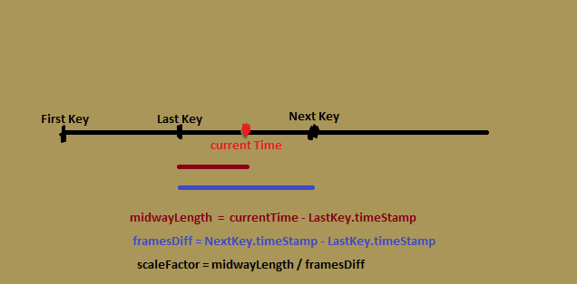

在代码中：

**float midWayLength = animationTime - lastTimeStamp;**

**float framesDiff = nextTimeStamp - lastTimeStamp;**

**scaleFactor = midWayLength / framesDiff;**

现在让我们继续转到**Animation**类：
```c++
struct AssimpNodeData
{
    glm::mat4 transformation;
    std::string name;
    int childrenCount;
    std::vector<AssimpNodeData> children;
};

class Animation
{
public:
    Animation() = default;

    Animation(const std::string& animationPath, Model* model)
    {
        Assimp::Importer importer;
        const aiScene* scene = importer.ReadFile(animationPath, aiProcess_Triangulate);
        assert(scene && scene->mRootNode);
        auto animation = scene->mAnimations[0];
        m_Duration = animation->mDuration;
        m_TicksPerSecond = animation->mTicksPerSecond;
        ReadHeirarchyData(m_RootNode, scene->mRootNode);
        ReadMissingBones(animation, *model);
    }

    ~Animation()
    {
    }

    Bone* FindBone(const std::string& name)
    {
        auto iter = std::find_if(m_Bones.begin(), m_Bones.end(),
            [&](const Bone& Bone)
            {
                return Bone.GetBoneName() == name;
            }
        );
        if (iter == m_Bones.end()) return nullptr;
        else return &(*iter);
    }

	
    inline float GetTicksPerSecond() { return m_TicksPerSecond; }

    inline float GetDuration() { return m_Duration;}

    inline const AssimpNodeData& GetRootNode() { return m_RootNode; }

    inline const std::map<std::string,BoneInfo>& GetBoneIDMap() 
    { 
        return m_BoneInfoMap;
    }

private:
    void ReadMissingBones(const aiAnimation* animation, Model& model)
    {
        int size = animation->mNumChannels;

        auto& boneInfoMap = model.GetBoneInfoMap();//getting m_BoneInfoMap from Model class
        int& boneCount = model.GetBoneCount(); //getting the m_BoneCounter from Model class

        //reading channels(bones engaged in an animation and their keyframes)
        for (int i = 0; i < size; i++)
        {
            auto channel = animation->mChannels[i];
            std::string boneName = channel->mNodeName.data;

            if (boneInfoMap.find(boneName) == boneInfoMap.end())
            {
                boneInfoMap[boneName].id = boneCount;
                boneCount++;
            }
            m_Bones.push_back(Bone(channel->mNodeName.data,
                boneInfoMap[channel->mNodeName.data].id, channel));
        }

        m_BoneInfoMap = boneInfoMap;
    }

    void ReadHeirarchyData(AssimpNodeData& dest, const aiNode* src)
    {
        assert(src);

        dest.name = src->mName.data;
        dest.transformation = AssimpGLMHelpers::ConvertMatrixToGLMFormat(src->mTransformation);
        dest.childrenCount = src->mNumChildren;

        for (int i = 0; i < src->mNumChildren; i++)
        {
            AssimpNodeData newData;
            ReadHeirarchyData(newData, src->mChildren[i]);
            dest.children.push_back(newData);
        }
    }
    float m_Duration;
    int m_TicksPerSecond;
    std::vector<Bone> m_Bones;
    AssimpNodeData m_RootNode;
    std::map<std::string, BoneInfo> m_BoneInfoMap;
};
```
在这里，动画对象的创建从构造函数开始。这需要两个论点。首先，动画文件的路径&第二个参数是该动画的模型。稍后您将看到我们为什么需要此模型参考。然后，我们创建一个`Assimp::Importer`来读取动画文件，然后进行断言检查，如果找不到动画，该检查将引发错误。然后我们读取一般的动画数据，比如这个动画有多长，即`mDuration`和由`mTicksPerSecond`表示的动画速度。然后我们调用`ReadHeirarchyData`，它复制Assimp的`aiNode`继承权并创建`AssimpNodeData`的继承权。

然后我们调用一个名为`ReadMissingBones`的函数。我不得不编写这个函数，因为有时当我单独加载FBX模型时，它缺少一些骨骼，而我在动画文件中找到了这些缺失的骨骼。此函数读取丢失的骨骼信息，并将其信息存储在模型的`m_BoneInfoMap`中，并在`m_BoneIInfoMap`中本地保存`m_BoneIinfoMap`的引用。

我们已经准备好了动画。现在让我们看看我们的最后阶段，Animator类：

```c++
class Animator
{	
public:
    Animator::Animator(Animation* Animation)
    {
        m_CurrentTime = 0.0;
        m_CurrentAnimation = currentAnimation;

        m_FinalBoneMatrices.reserve(100);

        for (int i = 0; i < 100; i++)
            m_FinalBoneMatrices.push_back(glm::mat4(1.0f));
    }
	
    void Animator::UpdateAnimation(float dt)
    {
        m_DeltaTime = dt;
        if (m_CurrentAnimation)
        {
            m_CurrentTime += m_CurrentAnimation->GetTicksPerSecond() * dt;
            m_CurrentTime = fmod(m_CurrentTime, m_CurrentAnimation->GetDuration());
            CalculateBoneTransform(&m_CurrentAnimation->GetRootNode(), glm::mat4(1.0f));
        }
    }
	
    void Animator::PlayAnimation(Animation* pAnimation)
    {
        m_CurrentAnimation = pAnimation;
        m_CurrentTime = 0.0f;
    }
	
    void Animator::CalculateBoneTransform(const AssimpNodeData* node, glm::mat4 parentTransform)
    {
        std::string nodeName = node->name;
        glm::mat4 nodeTransform = node->transformation;
	
        Bone* Bone = m_CurrentAnimation->FindBone(nodeName);
	
        if (Bone)
        {
            Bone->Update(m_CurrentTime);
            nodeTransform = Bone->GetLocalTransform();
        }
	
        glm::mat4 globalTransformation = parentTransform * nodeTransform;
	
        auto boneInfoMap = m_CurrentAnimation->GetBoneIDMap();
        if (boneInfoMap.find(nodeName) != boneInfoMap.end())
        {
            int index = boneInfoMap[nodeName].id;
            glm::mat4 offset = boneInfoMap[nodeName].offset;
            m_FinalBoneMatrices[index] = globalTransformation * offset;
        }
	
        for (int i = 0; i < node->childrenCount; i++)
            CalculateBoneTransform(&node->children[i], globalTransformation);
    }
	
    std::vector<glm::mat4> GetFinalBoneMatrices() 
    { 
        return m_FinalBoneMatrices;  
    }
		
private:
    std::vector<glm::mat4> m_FinalBoneMatrices;
    Animation* m_CurrentAnimation;
    float m_CurrentTime;
    float m_DeltaTime;	
};
```
`Animator`构造函数将播放动画，然后继续将动画时间`m_CurrentTime`重置为0。它还初始化`m_FinalBoneMatrices`，这是一个`std::vector\<glm::mat4\>`。这里的主要注意点是`UpdateAnimation(float deltaTime)`函数。它以`m_TicksPerSecond`的速率推进`m_CurrentTime`，然后调用`CalculateBoneTransform`函数。我们将在开始时传递两个参数，第一个是`m_CurrentAnimation`的`m_RootNode`，第二个是作为`parentTransform`传递的身份矩阵。然后，通过在`animation`的`m_Bones`数组中查找`m_RootNodes`骨骼来检查该骨骼是否参与该动画。如果找到骨骼，则调用`bone.Update()`函数，该函数对所有骨骼进行插值，并将局部骨骼变换矩阵返回到`nodeTransform`。但这是局部空间矩阵，如果在着色器中传递，将围绕原点移动骨骼。因此，我们将这个`nodeTransform`与parentTransform相乘，并将结果存储在`globalTransformation`中。这就足够了，但顶点仍在默认模型空间中。我们在`m_BoneInfoMap`中找到偏移矩阵，然后将其与`globalTransfromMatrix`相乘。我们还将获得id索引，该索引将用于写入该骨骼到`m_FinalBoneMatrices`的最终转换。

最后我们为该节点的每个子节点调用`CalculateBoneTransform`，并将`globalTransformation`作为`parentTransform`传递。当没有子节点需要进一步处理时，我们会跳出这个递归循环。

## 让我们动起来
我们辛勤工作的成果终于来了！以下是我们将如何在main.cpp中播放动画：
```c++
int main()
{
    ...
	
    Model ourModel(FileSystem::getPath("resources/objects/vampire/dancing_vampire.dae"));
    Animation danceAnimation(FileSystem::getPath("resources/objects/vampire/dancing_vampire.dae"),
        &ourModel);
    Animator animator(&danceAnimation);

    // draw in wireframe
    //glPolygonMode(GL_FRONT_AND_BACK, GL_LINE);

    // render loop
    // -----------
    while (!glfwWindowShouldClose(window))
    {
        // per-frame time logic
        // --------------------
        float currentFrame = glfwGetTime();
        deltaTime = currentFrame - lastFrame;
        lastFrame = currentFrame;

        // input
        // -----
        processInput(window);
        animator.UpdateAnimation(deltaTime);
		
        // render
        // ------
        glClearColor(0.05f, 0.05f, 0.05f, 1.0f);
        glClear(GL_COLOR_BUFFER_BIT | GL_DEPTH_BUFFER_BIT);

        // don't forget to enable shader before setting uniforms
        ourShader.use();

        // view/projection transformations
        glm::mat4 projection = glm::perspective(glm::radians(camera.Zoom), 
            (float)SCR_WIDTH / (float)SCR_HEIGHT, 0.1f, 100.0f);
        glm::mat4 view = camera.GetViewMatrix();
        ourShader.setMat4("projection", projection);
        ourShader.setMat4("view", view);

        auto transforms = animator.GetFinalBoneMatrices();
        for (int i = 0; i < transforms.size(); ++i)
            ourShader.setMat4("finalBonesMatrices[" + std::to_string(i) + "]", transforms[i]);

        // render the loaded model
        glm::mat4 model = glm::mat4(1.0f);
        // translate it down so it's at the center of the scene
        model = glm::translate(model, glm::vec3(0.0f, -0.4f, 0.0f)); 
        // it's a bit too big for our scene, so scale it down
        model = glm::scale(model, glm::vec3(.5f, .5f, .5f));	
        ourShader.setMat4("model", model);
        ourModel.Draw(ourShader);

        // glfw: swap buffers and poll IO events (keys pressed/released, mouse moved etc.)
        // -------------------------------------------------------------------------------
        glfwSwapBuffers(window);
        glfwPollEvents();
    }

    // glfw: terminate, clearing all previously allocated GLFW resources.
    // ------------------------------------------------------------------
    glfwTerminate();
    return 0;
```
我们从加载模型开始，该模型将为着色器设置骨骼重量数据，然后通过为其提供路径来创建动画。然后，我们通过将创建的`Animation`传递给它来创建`Animator`对象。在渲染循环中，我们更新`Animator`，进行最终的骨骼变换并将其提供给着色器。这是我们一直在等待的输出:

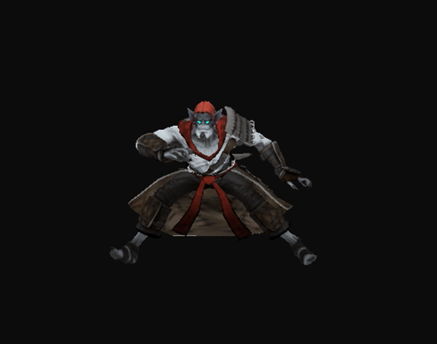

从[此处](https://learnopengl.com/Model-Loading/Assimp)下载使用的模型。请注意，动画和网格是在单个DAE(collada)文件中烘焙的。你可以在[这里](https://learnopengl.com/code_viewer_gh.php?code=src/8.guest/2020/skeletal_animation/skeletal_animation.cpp)找到这个演示的完整源代码。

## 延伸阅读
[Quaternions](http://www.songho.ca/math/quaternion/quaternion.html): An article by songho to understand quaternions in depth.
[Skeletal Animation with Assimp](http://ogldev.atspace.co.uk/www/tutorial38/tutorial38.html): An article by OGL Dev.
[Skeletal Animation with Java](https://youtu.be/f3Cr8Yx3GGA): A fantastic youtube playlist by Thin Matrix.
[Why Quaternions should be used for Rotation](https://www.gamasutra.com/view/feature/131686/rotating_objects_using_quaternions.php): An awesome gamasutra article.
