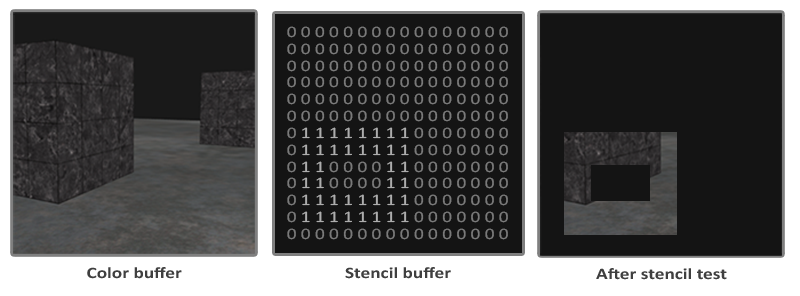
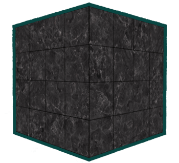
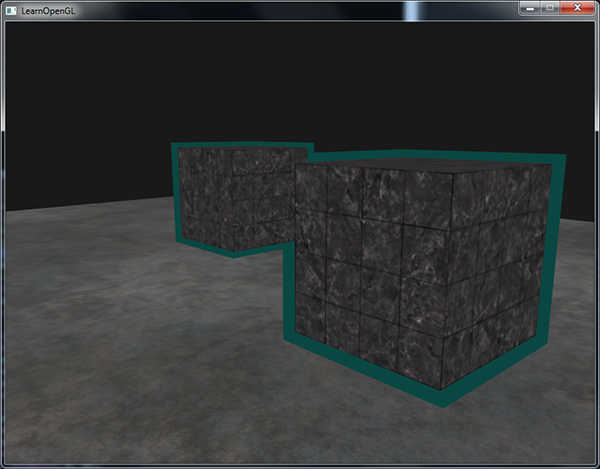

# 模板测试

原文     | [Stencil testing](http://learnopengl.com/#!Advanced-OpenGL/Stencil-testing)
      ---|---
作者     | JoeyDeVries
翻译     | Krasjet
校对     | 暂未校对

当片段着色器处理完一个片段之后，<def>模板测试</def>(Stencil Test)会开始执行，和深度测试一样，它也可能会丢弃片段。接下来，被保留的片段会进入深度测试，它可能会丢弃更多的片段。模板测试是根据又一个缓冲来进行的，它叫做<def>模板缓冲</def>(Stencil Buffer)，我们可以在渲染的时候更新它来获得一些很有意思的效果。

一个模板缓冲中，（通常）每个<def>模板值</def>(Stencil Value)是8位的。所以每个像素/片段一共能有256种不同的模板值。我们可以将这些模板值设置为我们想要的值，然后当某一个片段有某一个模板值的时候，我们就可以选择丢弃或是保留这个片段了。

!!! Important

	每个窗口库都需要为你配置一个模板缓冲。GLFW自动做了这件事，所以我们不需要告诉GLFW来创建一个，但其它的窗口库可能不会默认给你创建一个模板库，所以记得要查看库的文档。

模板缓冲的一个简单的例子如下：



模板缓冲首先会被清除为0，之后在模板缓冲中使用1填充了一个空心矩形。场景中的片段将会只在片段的模板值为1的时候会被渲染（其它的都被丢弃了）。

模板缓冲操作允许我们在渲染片段时将模板缓冲设定为一个特定的值。通过在渲染时修改模板缓冲的内容，我们**写入**了模板缓冲。在同一个（或者接下来的）渲染迭代中，我们可以**读取**这些值，来决定丢弃还是保留某个片段。使用模板缓冲的时候你可以尽情发挥，但大体的步骤如下：

- 启用模板缓冲的写入。
- 渲染物体，更新模板缓冲的内容。
- 禁用模板缓冲的写入。
- 渲染（其它）物体，这次根据模板缓冲的内容丢弃特定的片段。

所以，通过使用模板缓冲，我们可以根据场景中已绘制的其它物体的片段，来决定是否丢弃特定的片段。

你可以启用<var>GL_STENCIL_TEST</var>来启用模板测试。在这一行代码之后，所有的渲染调用都会以某种方式影响着模板缓冲。

```c++
glEnable(GL_STENCIL_TEST);
```

注意，和颜色和深度缓冲一样，你也需要在每次迭代之前清除模板缓冲。

```c++
glClear(GL_COLOR_BUFFER_BIT | GL_DEPTH_BUFFER_BIT | GL_STENCIL_BUFFER_BIT);
```

和深度测试的<fun>glDepthMask</fun>函数一样，模板缓冲也有一个类似的函数。<fun>glStencilMask</fun>允许我们设置一个位掩码(Bitmask)，它会与将要写入缓冲的模板值进行与(AND)运算。默认情况下设置的位掩码所有位都为1，不影响输出，但如果我们将它设置为`0x00`，写入缓冲的所有模板值最后都会变成0.这与深度测试中的<fun>glDepthMask(GL_FALSE)</fun>是等价的。

```c++
glStencilMask(0xFF); // 每一位写入模板缓冲时都保持原样
glStencilMask(0x00); // 每一位在写入模板缓冲时都会变成0（禁用写入）
```

大部分情况下你都只会使用`0x00`或者`0xFF`作为模板掩码(Stencil Mask)，但是知道有选项可以设置自定义的位掩码总是好的。

## 模板函数

和深度测试一样，我们对模板缓冲应该通过还是失败，以及它应该如何影响模板缓冲，也是有一定控制的。一共有两个函数能够用来配置模板测试：<fun>glStencilFunc</fun>和<fun>glStencilOp</fun>。

<fun>glStencilFunc(GLenum func, GLint ref, GLuint mask)</fun>一共包含三个参数：

- `func`：设置模板测试函数(Stencil Test Function)。这个测试函数将会应用到已储存的模板值上和<fun>glStencilFunc</fun>函数的`ref`值上。可用的选项有：<var>GL_NEVER</var>、<var>GL_LESS</var>、<var>GL_LEQUAL</var>、<var>GL_GREATER</var>、<var>GL_GEQUAL</var>、<var>GL_EQUAL</var>、<var>GL_NOTEQUAL</var>和<var>GL_ALWAYS</var>。它们的语义和深度缓冲的函数类似。
- `ref`：设置了模板测试的参考值(Reference Value)。模板缓冲的内容将会与这个值进行比较。
- `mask`：设置一个掩码，它将会与参考值和储存的模板值在测试比较它们之前进行与(AND)运算。初始情况下所有位都为1。

在一开始的那个简单的模板例子中，函数被设置为：

```c++
glStencilFunc(GL_EQUAL, 1, 0xFF)
```

这会告诉OpenGL，只要一个片段的模板值等于(`GL_EQUAL`)参考值1，片段将会通过测试并被绘制，否则会被丢弃。

但是<fun>glStencilFunc</fun>仅仅描述了OpenGL应该对模板缓冲内容做什么，而不是我们应该如何更新缓冲。这就需要<fun>glStencilOp</fun>这个函数了。

<fun>glStencilOp(GLenum sfail, GLenum dpfail, GLenum dppass)</fun>一共包含三个选项，我们能够设定每个选项应该采取的行为：

- `sfail`：模板测试失败时采取的行为。
- `dpfail`：模板测试通过，但深度测试失败时采取的行为。
- `dppass`：模板测试和深度测试都通过时采取的行为。

每个选项都可以选用以下的其中一种行为：

行为 | 描述
  ---|---
GL_KEEP     | 保持当前储存的模板值
GL_ZERO	    | 将模板值设置为0
GL_REPLACE  | 将模板值设置为<fun>glStencilFunc</fun>函数设置的`ref`值
GL_INCR	    | 如果模板值小于最大值则将模板值加1
GL_INCR_WRAP| 与<var>GL_INCR</var>一样，但如果模板值超过了最大值则归零
GL_DECR	    | 如果模板值大于最小值则将模板值减1
GL_DECR_WRAP| 与<var>GL_DECR</var>一样，但如果模板值小于0则将其设置为最大值
GL_INVERT   | 按位翻转当前的模板缓冲值

默认情况下<fun>glStencilOp</fun>是设置为`(GL_KEEP, GL_KEEP, GL_KEEP)`的，所以不论任何测试的结果是如何，模板缓冲都会保留它的值。默认的行为不会更新模板缓冲，所以如果你想写入模板缓冲的话，你需要至少对其中一个选项设置不同的值。

所以，通过使用<fun>glStencilFunc</fun>和<fun>glStencilOp</fun>，我们可以精确地指定更新模板缓冲的时机与行为了，我们也可以指定什么时候该让模板缓冲通过，即什么时候片段需要被丢弃。

# 物体轮廓

仅仅看了前面的部分你还是不太可能能够完全理解模板测试的工作原理，所以我们将会展示一个使用模板测试就可以完成的有用特性，它叫做<def>物体轮廓</def>(Object Outlining)。



物体轮廓所能做的事情正如它名字所描述的那样。我们将会为每个（或者一个）物体在它的周围创建一个很小的有色边框。当你想要在策略游戏中选中一个单位进行操作的，想要告诉玩家选中的是哪个单位的时候，这个效果就非常有用了。为物体创建轮廓的步骤如下：

1. 在绘制（需要添加轮廓的）物体之前，将模板函数设置为<var>GL_ALWAYS</var>，每当物体的片段被渲染时，将模板缓冲更新为1。
2. 渲染物体。
3. 禁用模板写入以及深度测试。
4. 将每个物体缩放一点点。
5. 使用一个不同的片段着色器，输出一个单独的（边框）颜色。
6. 再次绘制物体，但只在它们片段的模板值不等于1时才绘制。
7. 再次启用模板写入和深度测试。

这个过程将每个物体的片段的模板缓冲设置为1，当我们想要绘制边框的时候，我们主要绘制放大版本的物体中模板测试通过的部分，也就是物体的边框的位置。我们主要使用模板缓冲丢弃了放大版本中属于原物体片段的部分。

所以我们首先来创建一个很简单的片段着色器，它会输出一个边框颜色。我们简单地给它设置一个硬编码的颜色值，将这个着色器命名为<var>shaderSingleColor</var>：

```c++
void main()
{
    FragColor = vec4(0.04, 0.28, 0.26, 1.0);
}
```

我们只想给那两个箱子加上边框，所以我们让地板不参与这个过程。我们希望首先绘制地板，再绘制两个箱子（并写入模板缓冲），之后绘制放大的箱子（并丢弃覆盖了之前绘制的箱子片段的那些片段）。

我们首先启用模板测试，并设置测试通过或失败时的行为：

```c++
glEnable(GL_STENCIL_TEST);
glStencilOp(GL_KEEP, GL_KEEP, GL_REPLACE);
```

如果其中的一个测试失败了，我们什么都不做，我们仅仅保留当前储存在模板缓冲中的值。如果模板测试和深度测试都通过了，那么我们希望将储存的模板值设置为参考值，参考值能够通过<fun>glStencilFunc</fun>来设置，我们之后会设置为1。

我们将模板缓冲清除为0，对箱子中所有绘制的片段，将模板值更新为1：

```c++
glStencilFunc(GL_ALWAYS, 1, 0xFF); // 所有的片段都应该更新模板缓冲
glStencilMask(0xFF); // 启用模板缓冲写入
normalShader.use();
DrawTwoContainers();
```

通过使用<var>GL_ALWAYS</var>模板测试函数，我们保证了箱子的每个片段都会将模板缓冲的模板值更新为1。因为片段永远会通过模板测试，在绘制片段的地方，模板缓冲会被更新为参考值。

现在模板缓冲在箱子被绘制的地方都更新为1了，我们将要绘制放大的箱子，但这次要禁用模板缓冲的写入：

```c++
glStencilFunc(GL_NOTEQUAL, 1, 0xFF);
glStencilMask(0x00); // 禁止模板缓冲的写入
glDisable(GL_DEPTH_TEST);
shaderSingleColor.use(); 
DrawTwoScaledUpContainers();
```

我们将模板函数设置为<var>GL_NOTEQUAL</var>，它会保证我们只绘制箱子上模板值不为1的部分，即只绘制箱子在之前绘制的箱子之外的部分。注意我们也禁用了深度测试，让放大的箱子，即边框，不会被地板所覆盖。

记得要在完成之后重新启用深度缓冲。

场景中物体轮廓的完整步骤会看起来像这样：

```c++
glEnable(GL_DEPTH_TEST);
glStencilOp(GL_KEEP, GL_KEEP, GL_REPLACE);  
  
glClear(GL_COLOR_BUFFER_BIT | GL_DEPTH_BUFFER_BIT | GL_STENCIL_BUFFER_BIT); 

glStencilMask(0x00); // 记得保证我们在绘制地板的时候不会更新模板缓冲
normalShader.use();
DrawFloor()  
  
glStencilFunc(GL_ALWAYS, 1, 0xFF); 
glStencilMask(0xFF); 
DrawTwoContainers();
  
glStencilFunc(GL_NOTEQUAL, 1, 0xFF);
glStencilMask(0x00); 
glDisable(GL_DEPTH_TEST);
shaderSingleColor.use(); 
DrawTwoScaledUpContainers();
glStencilMask(0xFF);
glEnable(GL_DEPTH_TEST);  
```

只要你理解了模板缓冲背后的大体思路，这个代码片段就不是那么难理解了。如果还是不能理解的话，尝试再次仔细阅读之前的部分，并尝试通过上面使用的范例，完全理解每个函数的功能。

在[深度测试](01 Depth testing.md)小节的场景中，这个轮廓算法的结果看起来会像是这样的：



可以在[这里](https://learnopengl.com/code_viewer_gh.php?code=src/4.advanced_opengl/2.stencil_testing/stencil_testing.cpp)查看源代码，看看物体轮廓算法的完整代码。

!!! Important

	你可以看到这两个箱子的边框重合了，这通常都是我们想要的结果（想想策略游戏中，我们希望选择10个单位，合并边框通常是我们想需要的结果）。如果你想让每个物体都有一个完整的边框，你需要对每个物体都清空模板缓冲，并有创意地利用深度缓冲。

你看到的物体轮廓算法在需要显示选中物体的游戏（想想策略游戏）中非常常见。这样的算法能够在一个模型类中轻松实现。你可以在模型类中设置一个boolean标记，来设置需不需要绘制边框。如果你有创造力的话，你也可以使用后期处理滤镜(Filter)，像是高斯模糊(Gaussian Blur)，让边框看起来更自然。

除了物体轮廓之外，模板测试还有很多用途，比如在一个后视镜中绘制纹理，让它能够绘制到镜子形状中，或者使用一个叫做阴影体积(Shadow Volume)的模板缓冲技术渲染实时阴影。模板缓冲为我们已经很丰富的OpenGL工具箱又提供了一个很好的工具。
