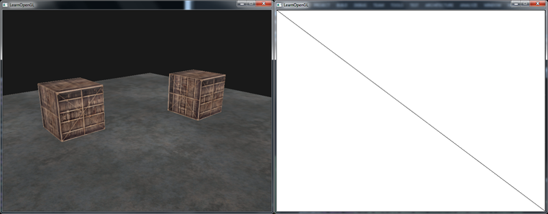
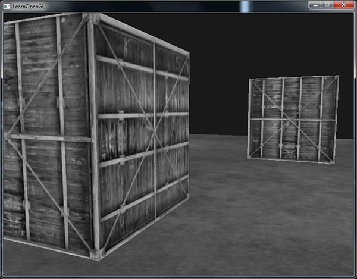
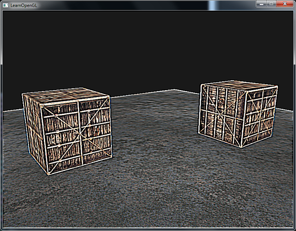
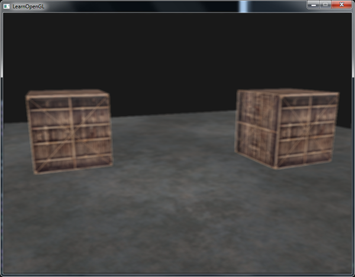
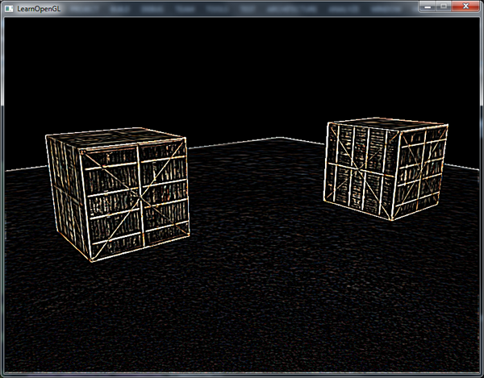

# 帧缓冲

原文     | [Framebuffers](http://learnopengl.com/#!Advanced-OpenGL/Framebuffers)
      ---|---
作者     | JoeyDeVries
翻译     | Krasjet
校对     | 暂未校对

到目前为止，我们已经使用了很多屏幕缓冲了：用于写入颜色值的颜色缓冲、用于写入深度信息的深度缓冲和允许我们根据一些条件丢弃特定片段的模板缓冲。这些缓冲结合起来叫做<def>帧缓冲</def>(Framebuffer)，它被储存在内存中。OpenGL允许我们定义我们自己的帧缓冲，也就是说我们能够定义我们自己的颜色缓冲，甚至是深度缓冲和模板缓冲。

我们目前所做的所有操作都是在<def>默认帧缓冲</def>的渲染缓冲上进行的。默认的帧缓冲是在你创建窗口的时候生成和配置的（GLFW帮我们做了这些）。有了我们自己的帧缓冲，我们就能够有更多方式来渲染了。

你可能不能很快理解帧缓冲的应用，但渲染你的场景到不同的帧缓冲能够让我们在场景中加入类似镜子的东西，或者做出很酷的后期处理效果。首先我们会讨论它是如何工作的，之后我们将来实现这些炫酷的后期处理效果。

## 创建一个帧缓冲

和OpenGL中的其它对象一样，我们会使用一个叫做<fun>glGenFramebuffers</fun>的函数来创建一个帧缓冲对象(Framebuffer Object, FBO)：

```c++
unsigned int fbo;
glGenFramebuffers(1, &fbo);
```

这种创建和使用对象的方式我们已经见过很多次了，所以它的使用函数也和其它的对象类似。首先我们创建一个帧缓冲对象，将它绑定为激活的(Active)帧缓冲，做一些操作，之后解绑帧缓冲。我们使用<fun>glBindFramebuffer</fun>来绑定帧缓冲。

```c++
glBindFramebuffer(GL_FRAMEBUFFER, fbo);
```

在绑定到<var>GL_FRAMEBUFFER</var>目标之后，所有的**读取**和**写入**帧缓冲的操作将会影响当前绑定的帧缓冲。我们也可以使用<var>GL_READ_FRAMEBUFFER</var>或<var>GL_DRAW_FRAMEBUFFER</var>，将一个帧缓冲分别绑定到读取目标或写入目标。绑定到<var>GL_READ_FRAMEBUFFER</var>的帧缓冲将会使用在所有像是<fun>glReadPixels</fun>的读取操作中，而绑定到<var>GL_DRAW_FRAMEBUFFER</var>的帧缓冲将会被用作渲染、清除等写入操作的目标。大部分情况你都不需要区分它们，通常都会使用<var>GL_FRAMEBUFFER</var>，绑定到两个上。

不幸的是，我们现在还不能使用我们的帧缓冲，因为它还不<def>完整</def>(Complete)，一个完整的帧缓冲需要满足以下的条件：

- 附加至少一个缓冲（颜色、深度或模板缓冲）。
- 至少有一个颜色附件(Attachment)。
- 所有的附件都必须是完整的（保留了内存）。
- 每个缓冲都应该有相同的样本数。

如果你不知道什么是样本，不要担心，我们将在[之后的](11 Anti Aliasing.md)教程中讲到。

从上面的条件中可以知道，我们需要为帧缓冲创建一些附件，并将附件附加到帧缓冲上。在完成所有的条件之后，我们可以以<var>GL_FRAMEBUFFER</var>为参数调用<fun>glCheckFramebufferStatus</fun>，检查帧缓冲是否完整。它将会检测当前绑定的帧缓冲，并返回规范中[这些](https://www.khronos.org/registry/OpenGL-Refpages/gl4/html/glCheckFramebufferStatus.xhtml)值的其中之一。如果它返回的是<var>GL_FRAMEBUFFER_COMPLETE</var>，帧缓冲就是完整的了。

```c++
if(glCheckFramebufferStatus(GL_FRAMEBUFFER) == GL_FRAMEBUFFER_COMPLETE)
  // 执行胜利的舞蹈
```

之后所有的渲染操作将会渲染到当前绑定帧缓冲的附件中。由于我们的帧缓冲不是默认帧缓冲，渲染指令将不会对窗口的视觉输出有任何影响。出于这个原因，渲染到一个不同的帧缓冲被叫做<def>离屏渲染</def>(Off-screen Rendering)。要保证所有的渲染操作在主窗口中有视觉效果，我们需要再次激活默认帧缓冲，将它绑定到`0`。

```c++
glBindFramebuffer(GL_FRAMEBUFFER, 0);
```

在完成所有的帧缓冲操作之后，不要忘记删除这个帧缓冲对象：

```c++
glDeleteFramebuffers(1, &fbo);
```

在完整性检查执行之前，我们需要给帧缓冲附加一个附件。<def>附件</def>是一个内存位置，它能够作为帧缓冲的一个缓冲，可以将它想象为一个图像。当创建一个附件的时候我们有两个选项：纹理或渲染缓冲对象(Renderbuffer Object)。

### 纹理附件

当把一个纹理附加到帧缓冲的时候，所有的渲染指令将会写入到这个纹理中，就想它是一个普通的颜色/深度或模板缓冲一样。使用纹理的优点是，所有渲染操作的结果将会被储存在一个纹理图像中，我们之后可以在着色器中很方便地使用它。

为帧缓冲创建一个纹理和创建一个普通的纹理差不多：

```c++
unsigned int texture;
glGenTextures(1, &texture);
glBindTexture(GL_TEXTURE_2D, texture);
  
glTexImage2D(GL_TEXTURE_2D, 0, GL_RGB, 800, 600, 0, GL_RGB, GL_UNSIGNED_BYTE, NULL);

glTexParameteri(GL_TEXTURE_2D, GL_TEXTURE_MIN_FILTER, GL_LINEAR);
glTexParameteri(GL_TEXTURE_2D, GL_TEXTURE_MAG_FILTER, GL_LINEAR);
```

主要的区别就是，我们将维度设置为了屏幕大小（尽管这不是必须的），并且我们给纹理的`data`参数传递了`NULL`。对于这个纹理，我们仅仅分配了内存而没有填充它。填充这个纹理将会在我们渲染到帧缓冲之后来进行。同样注意我们并不关心环绕方式或多级渐远纹理，我们在大多数情况下都不会需要它们。

!!! important

	如果你想将你的屏幕渲染到一个更小或更大的纹理上，你需要（在渲染到你的帧缓冲之前）再次调用<fun>glViewport</fun>，使用纹理的新维度作为参数，否则只有一小部分的纹理或屏幕会被渲染到这个纹理上。

现在我们已经创建好一个纹理了，要做的最后一件事就是将它附加到帧缓冲上了：

```c++
glFramebufferTexture2D(GL_FRAMEBUFFER, GL_COLOR_ATTACHMENT0, GL_TEXTURE_2D, texture, 0);
```

<fun>glFrameBufferTexture2D</fun>有以下的参数：

- `target`：帧缓冲的目标（绘制、读取或者两者皆有）
- `attachment`：我们想要附加的附件类型。当前我们正在附加一个颜色附件。注意最后的`0`意味着我们可以附加多个颜色附件。我们将在之后的教程中提到。
- `textarget`：你希望附加的纹理类型
- `texture`：要附加的纹理本身
- `level`：多级渐远纹理的级别。我们将它保留为0。

除了颜色附件之外，我们还可以附加一个深度和模板缓冲纹理到帧缓冲对象中。要附加深度缓冲的话，我们将附件类型设置为<var>GL_DEPTH_ATTACHMENT</var>。注意纹理的<def>格式</def>(Format)和<def>内部格式</def>(Internalformat)类型将变为<var>GL_DEPTH_COMPONENT</var>，来反映深度缓冲的储存格式。要附加模板缓冲的话，你要将第二个参数设置为<var>GL_STENCIL_ATTACHMENT</var>，并将纹理的格式设定为<var>GL_STENCIL_INDEX</var>。

也可以将深度缓冲和模板缓冲附加为一个单独的纹理。纹理的每32位数值将包含24位的深度信息和8位的模板信息。要将深度和模板缓冲附加为一个纹理的话，我们使用<var>GL_DEPTH_STENCIL_ATTACHMENT</var>类型，并配置纹理的格式，让它包含合并的深度和模板值。将一个深度和模板缓冲附加为一个纹理到帧缓冲的例子可以在下面找到：

```c++
glTexImage2D(
  GL_TEXTURE_2D, 0, GL_DEPTH24_STENCIL8, 800, 600, 0, 
  GL_DEPTH_STENCIL, GL_UNSIGNED_INT_24_8, NULL
);

glFramebufferTexture2D(GL_FRAMEBUFFER, GL_DEPTH_STENCIL_ATTACHMENT, GL_TEXTURE_2D, texture, 0);
```

### 渲染缓冲对象附件

<def>渲染缓冲对象</def>(Renderbuffer Object)是在纹理之后引入到OpenGL中，作为一个可用的帧缓冲附件类型的，所以在过去纹理是唯一可用的附件。和纹理图像一样，渲染缓冲对象是一个真正的缓冲，即一系列的字节、整数、像素等。渲染缓冲对象附加的好处是，它会将数据储存为OpenGL原生的渲染格式，它是为离屏渲染到帧缓冲优化过的。

渲染缓冲对象直接将所有的渲染数据储存到它的缓冲中，不会做任何针对纹理格式的转换，让它变为一个更快的可写储存介质。然而，渲染缓冲对象通常都是只写的，所以你不能读取它们（比如使用纹理访问）。当然你仍然还是能够使用<fun>glReadPixels</fun>来读取它，这会从当前绑定的帧缓冲，而不是附件本身，中返回特定区域的像素。

因为它的数据已经是原生的格式了，当写入或者复制它的数据到其它缓冲中时是非常快的。所以，交换缓冲这样的操作在使用渲染缓冲对象时会非常快。我们在每个渲染迭代最后使用的<fun>glfwSwapBuffers</fun>，也可以通过渲染缓冲对象实现：只需要写入一个渲染缓冲图像，并在最后交换到另外一个渲染缓冲就可以了。渲染缓冲对象对这种操作非常完美。

创建一个渲染缓冲对象的代码和帧缓冲的代码很类似：

```c++
unsigned int rbo;
glGenRenderbuffers(1, &rbo);
```

类似，我们需要绑定这个渲染缓冲对象，让之后所有的渲染缓冲操作影响当前的<var>rbo</var>：

```c++
glBindRenderbuffer(GL_RENDERBUFFER, rbo);
```

由于渲染缓冲对象通常都是只写的，它们会经常用于深度和模板附件，因为大部分时间我们都不需要从深度和模板缓冲中读取值，只关心深度和模板测试。我们**需要**深度和模板值用于测试，但不需要对它们进行**采样**，所以渲染缓冲对象非常适合它们。当我们不需要从这些缓冲中采样的时候，通常都会选择渲染缓冲对象，因为它会更优化一点。

创建一个深度和模板渲染缓冲对象可以通过调用<fun>glRenderbufferStorage</fun>函数来完成：

```c++
glRenderbufferStorage(GL_RENDERBUFFER, GL_DEPTH24_STENCIL8, 800, 600);
```

创建一个渲染缓冲对象和纹理对象类似，不同的是这个对象是专门被设计作为图像使用的，而不是纹理那样的通用数据缓冲(General Purpose Data Buffer)。这里我们选择<var>GL_DEPTH24_STENCIL8</var>作为内部格式，它封装了24位的深度和8位的模板缓冲。

最后一件事就是附加这个渲染缓冲对象：

```c++
glFramebufferRenderbuffer(GL_FRAMEBUFFER, GL_DEPTH_STENCIL_ATTACHMENT, GL_RENDERBUFFER, rbo);
```

渲染缓冲对象能为你的帧缓冲对象提供一些优化，但知道什么时候使用渲染缓冲对象，什么时候使用纹理是很重要的。通常的规则是，如果你不需要从一个缓冲中采样数据，那么对这个缓冲使用渲染缓冲对象会是明智的选择。如果你需要从缓冲中采样颜色或深度值等数据，那么你应该选择纹理附件。性能方面它不会产生非常大的影响的。

## 渲染到纹理

既然我们已经知道帧缓冲（大概）是怎么工作的了，是时候实践它们了。我们将会将场景渲染到一个附加到帧缓冲对象上的颜色纹理中，之后将在一个横跨整个屏幕的四边形上绘制这个纹理。这样视觉输出和没使用帧缓冲时是完全一样的，但这次是打印到了一个四边形上。这为什么很有用呢？我们会在下一部分中知道原因。

首先要创建一个帧缓冲对象，并绑定它，这些都很直观：

```c++
unsigned int framebuffer;
glGenFramebuffers(1, &framebuffer);
glBindFramebuffer(GL_FRAMEBUFFER, framebuffer);
```

接下来我们需要创建一个纹理图像，我们将它作为一个颜色附件附加到帧缓冲上。我们将纹理的维度设置为窗口的宽度和高度，并且不初始化它的数据：

```c++
// 生成纹理
unsigned int texColorBuffer;
glGenTextures(1, &texColorBuffer);
glBindTexture(GL_TEXTURE_2D, texColorBuffer);
glTexImage2D(GL_TEXTURE_2D, 0, GL_RGB, 800, 600, 0, GL_RGB, GL_UNSIGNED_BYTE, NULL);
glTexParameteri(GL_TEXTURE_2D, GL_TEXTURE_MIN_FILTER, GL_LINEAR );
glTexParameteri(GL_TEXTURE_2D, GL_TEXTURE_MAG_FILTER, GL_LINEAR);
glBindTexture(GL_TEXTURE_2D, 0);

// 将它附加到当前绑定的帧缓冲对象
glFramebufferTexture2D(GL_FRAMEBUFFER, GL_COLOR_ATTACHMENT0, GL_TEXTURE_2D, texColorBuffer, 0);  
```

我们还希望OpenGL能够进行深度测试（如果你需要的话还有模板测试），所以我们还需要添加一个深度（和模板）附件到帧缓冲中。由于我们只希望采样颜色缓冲，而不是其它的缓冲，我们可以为它们创建一个渲染缓冲对象。还记得当我们不需要采样缓冲的时候，渲染缓冲对象是更好的选择吗？

创建一个渲染缓冲对象不是非常复杂。我们需要记住的唯一事情是，我们将它创建为一个深度**和**模板附件渲染缓冲对象。我们将它的**内部**格式设置为<var>GL_DEPTH24_STENCIL8</var>，对我们来说这个精度已经足够了。

```c++
unsigned int rbo;
glGenRenderbuffers(1, &rbo);
glBindRenderbuffer(GL_RENDERBUFFER, rbo); 
glRenderbufferStorage(GL_RENDERBUFFER, GL_DEPTH24_STENCIL8, 800, 600);  
glBindRenderbuffer(GL_RENDERBUFFER, 0);
```

当我们为渲染缓冲对象分配了足够的内存之后，我们可以解绑这个渲染缓冲。

接下来，作为完成帧缓冲之前的最后一步，我们将渲染缓冲对象附加到帧缓冲的深度**和**模板附件上：

```c++
glFramebufferRenderbuffer(GL_FRAMEBUFFER, GL_DEPTH_STENCIL_ATTACHMENT, GL_RENDERBUFFER, rbo);
```

最后，我们希望检查帧缓冲是否是完整的，如果不是，我们将打印错误信息。

```c++
if(glCheckFramebufferStatus(GL_FRAMEBUFFER) != GL_FRAMEBUFFER_COMPLETE)
	std::cout << "ERROR::FRAMEBUFFER:: Framebuffer is not complete!" << std::endl;
glBindFramebuffer(GL_FRAMEBUFFER, 0);
```

记得要解绑帧缓冲，保证我们不会不小心渲染到错误的帧缓冲上。

现在这个帧缓冲就完整了，我们只需要绑定这个帧缓冲对象，让渲染到帧缓冲的缓冲中而不是默认的帧缓冲中。之后的渲染指令将会影响当前绑定的帧缓冲。所有的深度和模板操作都会从当前绑定的帧缓冲的深度和模板附件中（如果有的话）读取。如果你忽略了深度缓冲，那么所有的深度测试操作将不再工作，因为当前绑定的帧缓冲中不存在深度缓冲。

所以，要想绘制场景到一个纹理上，我们需要采取以下的步骤：

1. 将新的帧缓冲绑定为激活的帧缓冲，和往常一样渲染场景
2. 绑定默认的帧缓冲
3. 绘制一个横跨整个屏幕的四边形，将帧缓冲的颜色缓冲作为它的纹理。

我们将会绘制[深度测试](01 Depth testing.md)小节中的场景，但这次使用的是旧的[箱子](../img/04/05/container.jpg)纹理。

为了绘制这个四边形，我们将会新创建一套简单的着色器。我们将不会包含任何花哨的矩阵变换，因为我们提供的是标准化设备坐标的[顶点坐标](https://learnopengl.com/code_viewer.php?code=advanced/framebuffers_quad_vertices)，所以我们可以直接将它们设定为顶点着色器的输出。顶点着色器是这样的：

```c++
#version 330 core
layout (location = 0) in vec2 aPos;
layout (location = 1) in vec2 aTexCoords;

out vec2 TexCoords;

void main()
{
    gl_Position = vec4(aPos.x, aPos.y, 0.0, 1.0); 
    TexCoords = aTexCoords;
}
```

并没有太复杂的东西。片段着色器会更加基础，我们做的唯一一件事就是从纹理中采样：

```c++
#version 330 core
out vec4 FragColor;
  
in vec2 TexCoords;

uniform sampler2D screenTexture;

void main()
{ 
    FragColor = texture(screenTexture, TexCoords);
}
```

接着就靠你来为屏幕四边形创建并配置一个VAO了。帧缓冲的一个渲染迭代将会有以下的结构：

```c++
// 第一处理阶段(Pass)
glBindFramebuffer(GL_FRAMEBUFFER, framebuffer);
glClearColor(0.1f, 0.1f, 0.1f, 1.0f);
glClear(GL_COLOR_BUFFER_BIT | GL_DEPTH_BUFFER_BIT); // 我们现在不使用模板缓冲
glEnable(GL_DEPTH_TEST);
DrawScene();	
  
// 第二处理阶段
glBindFramebuffer(GL_FRAMEBUFFER, 0); // 返回默认
glClearColor(1.0f, 1.0f, 1.0f, 1.0f); 
glClear(GL_COLOR_BUFFER_BIT);
  
screenShader.use();  
glBindVertexArray(quadVAO);
glDisable(GL_DEPTH_TEST);
glBindTexture(GL_TEXTURE_2D, textureColorbuffer);
glDrawArrays(GL_TRIANGLES, 0, 6);  
```

要注意一些事情。第一，由于我们使用的每个帧缓冲都有它自己一套缓冲，我们希望设置合适的位，调用<fun>glClear</fun>，清除这些缓冲。第二，当绘制四边形时，我们将禁用深度测试，因为我们是在绘制一个简单的四边形，并不需要关系深度测试。在绘制普通场景的时候我们将会重新启用深度测试。

有很多步骤都可能会出错，所以如果你没有得到输出的话，尝试调试程序，并重新阅读本节的相关部分。如果所有的东西都能够正常工作，你将会得到下面这样的视觉输出：



左边展示的是视觉输出，它和[深度测试](01 Depth testing.md)中是完全一样的，但这次是渲染在一个简单的四边形上。如果我们使用线框模式渲染场景，就会变得很明显，我们在默认的帧缓冲中只绘制了一个简单的四边形。

你可以在[这里](https://learnopengl.com/code_viewer_gh.php?code=src/4.advanced_opengl/5.1.framebuffers/framebuffers.cpp)找到程序的源代码。

所以这个有什么用处呢？因为我们能够以一个纹理图像的方式访问已渲染场景中的每个像素，我们可以在片段着色器中创建出非常有趣的效果。这些有趣效果统称为<def>后期处理</def>(Post-processing)效果。

# 后期处理

既然整个场景都被渲染到了一个纹理上，我们可以简单地通过修改纹理数据创建出一些非常有意思的效果。在这一部分中，我们将会向你展示一些流行的后期处理效果，并告诉你改如何使用创造力创建你自己的效果。

让我们先从最简单的后期处理效果开始。

### 反相

我们现在能够访问渲染输出的每个颜色，所以在（译注：屏幕的）片段着色器中返回这些颜色的反相(Inversion)并不是很难。我们将会从屏幕纹理中取颜色值，然后用1.0减去它，对它进行反相：

```c++
void main()
{
    FragColor = vec4(vec3(1.0 - texture(screenTexture, TexCoords)), 1.0);
}
```

尽管反相是一个相对简单的后期处理效果，它已经能创造一些奇怪的效果了：


在片段着色器中仅仅使用一行代码，就能让整个场景的颜色都反相了。很酷吧？

### 灰度

另外一个很有趣的效果是，移除场景中除了黑白灰以外所有的颜色，让整个图像灰度化(Grayscale)。很简单的实现方式是，取所有的颜色分量，将它们平均化：

```c++
void main()
{
    FragColor = texture(screenTexture, TexCoords);
    float average = (FragColor.r + FragColor.g + FragColor.b) / 3.0;
    FragColor = vec4(average, average, average, 1.0);
}
```

这已经能创造很好的结果了，但人眼会对绿色更加敏感一些，而对蓝色不那么敏感，所以为了获取物理上更精确的效果，我们需要使用加权的(Weighted)通道：

```c++
void main()
{
    FragColor = texture(screenTexture, TexCoords);
    float average = 0.2126 * FragColor.r + 0.7152 * FragColor.g + 0.0722 * FragColor.b;
    FragColor = vec4(average, average, average, 1.0);
}
```



你可能不会立刻发现有什么差别，但在更复杂的场景中，这样的加权灰度效果会更真实一点。

## 核效果

在一个纹理图像上做后期处理的另外一个好处是，我们可以从纹理的其它地方采样颜色值。比如说我们可以在当前纹理坐标的周围取一小块区域，对当前纹理值周围的多个纹理值进行采样。我们可以结合它们创建出很有意思的效果。

<def>核</def>(Kernel)（或卷积矩阵(Convolution Matrix)）是一个类矩阵的数值数组，它的中心为当前的像素，它会用它的核值乘以周围的像素值，并将结果相加变成一个值。所以，基本上我们是在对当前像素周围的纹理坐标添加一个小的偏移量，并根据核将结果合并。下面是核的一个例子：

$$
\begin{bmatrix}2 & 2 & 2 \\ 2 & -15 & 2 \\ 2 & 2 & 2 \end{bmatrix}
$$

这个核取了8个周围像素值，将它们乘以2，而把当前的像素乘以-15。这个核的例子将周围的像素乘上了一个权重，并将当前像素乘以一个比较大的负权重来平衡结果。

!!! Important

	你在网上找到的大部分核将所有的权重加起来之后都应该会等于1，如果它们加起来不等于1，这就意味着最终的纹理颜色将会比原纹理值更亮或者更暗了。

核是后期处理一个非常有用的工具，它们使用和实验起来都很简单，网上也能找到很多例子。我们需要稍微修改一下片段着色器，让它能够支持核。我们假设使用的核都是3x3核（实际上大部分核都是）：

```c++
const float offset = 1.0 / 300.0;  

void main()
{
    vec2 offsets[9] = vec2[](
        vec2(-offset,  offset), // 左上
        vec2( 0.0f,    offset), // 正上
        vec2( offset,  offset), // 右上
        vec2(-offset,  0.0f),   // 左
        vec2( 0.0f,    0.0f),   // 中
        vec2( offset,  0.0f),   // 右
        vec2(-offset, -offset), // 左下
        vec2( 0.0f,   -offset), // 正下
        vec2( offset, -offset)  // 右下
    );

    float kernel[9] = float[](
        -1, -1, -1,
        -1,  9, -1,
        -1, -1, -1
    );
    
    vec3 sampleTex[9];
    for(int i = 0; i < 9; i++)
    {
        sampleTex[i] = vec3(texture(screenTexture, TexCoords.st + offsets[i]));
    }
    vec3 col = vec3(0.0);
    for(int i = 0; i < 9; i++)
        col += sampleTex[i] * kernel[i];
    
    FragColor = vec4(col, 1.0);
}
```

在片段着色器中，我们首先为周围的纹理坐标创建了一个9个`vec2`偏移量的数组。偏移量是一个常量，你可以按照你的喜好自定义它。之后我们定义一个核，在这个例子中是一个<def>锐化</def>(Sharpen)核，它会采样周围的所有像素，锐化每个颜色值。最后，在采样时我们将每个偏移量加到当前纹理坐标上，获取需要采样的纹理，之后将这些纹理值乘以加权的核值，并将它们加到一起。

这个锐化核看起来是这样的：



这能创建一些很有趣的效果，比如说你的玩家打了麻醉剂所感受到的效果。

### 模糊

创建<def>模糊</def>(Blur)效果的核是这样的：

$$
\begin{bmatrix} 1 & 2 & 1 \\ 2 & 4 & 2 \\ 1 & 2 & 1 \end{bmatrix} / 16
$$

由于所有值的和是16，所以直接返回合并的采样颜色将产生非常亮的颜色，所以我们需要将核的每个值都除以16。最终的核数组将会是：

```c++
float kernel[9] = float[](
    1.0 / 16, 2.0 / 16, 1.0 / 16,
    2.0 / 16, 4.0 / 16, 2.0 / 16,
    1.0 / 16, 2.0 / 16, 1.0 / 16  
);
```

通过在片段着色器中改变核的<fun>float</fun>数组，我们完全改变了后期处理效果。它现在看起来是这样子的：



这样的模糊效果创造了很多的可能性。我们可以随着时间修改模糊的量，创造出玩家醉酒时的效果，或者在主角没带眼镜的时候增加模糊。模糊也能够让我们来平滑颜色值，我们将在之后教程中使用到。

你可以看到，只要我们有了这个核的实现，创建炫酷的后期处理特效是非常容易的事。我们再来看最后一个很流行的效果来结束本节的讨论。

### 边缘检测

下面的<def>边缘检测</def>(Edge-detection)核和锐化核非常相似：

$$
\begin{bmatrix} 1 & 1 & 1 \\ 1 & -8 & 1 \\ 1 & 1 & 1 \end{bmatrix}
$$

这个核高亮了所有的边缘，而暗化了其它部分，在我们只关心图像的边角的时候是非常有用的。



你可能不会奇怪，像是Photoshop这样的图像修改工具/滤镜使用的也是这样的核。因为显卡处理片段的时候有着极强的并行处理能力，我们可以很轻松地在实时的情况下逐像素对图像进行处理。所以图像编辑工具在图像处理的时候会更倾向于使用显卡。

!!! note "译注"

	注意，核在对屏幕纹理的边缘进行采样的时候，由于还会对中心像素周围的8个像素进行采样，其实会取到纹理之外的像素。由于环绕方式默认是<var>GL_REPEAT</var>，所以在没有设置的情况下取到的是屏幕另一边的像素，而另一边的像素本不应该对中心像素产生影响，这就可能会在屏幕边缘产生很奇怪的条纹。为了消除这一问题，我们可以将屏幕纹理的环绕方式都设置为<var>GL_CLAMP_TO_EDGE</var>。这样子在取到纹理外的像素时，就能够重复边缘的像素来更精确地估计最终的值了。