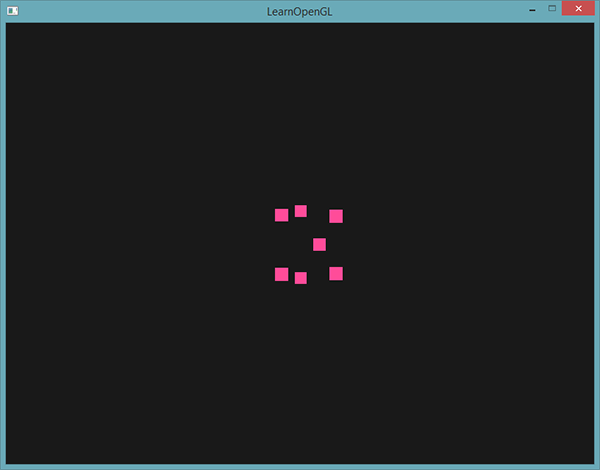
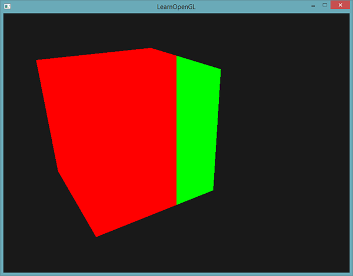
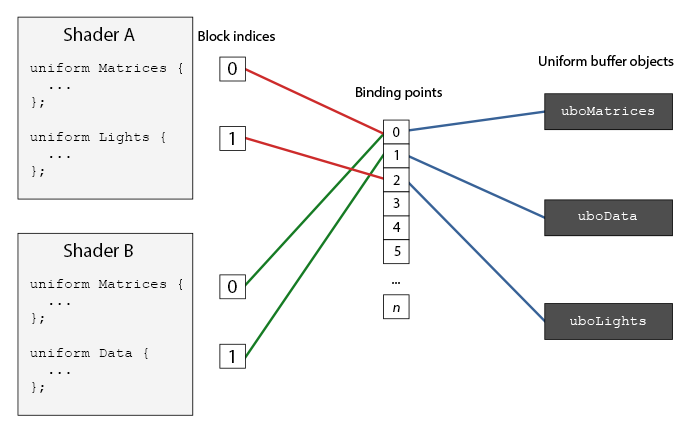
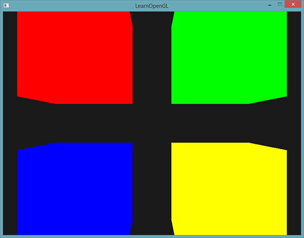

# 高级GLSL

原文     | [Advanced GLSL](http://learnopengl.com/#!Advanced-OpenGL/Advanced-GLSL)
      ---|---
作者     | JoeyDeVries
翻译     | Krasjet
校对     | 暂未校对

这一小节并不会向你展示非常先进非常酷的新特性，也不会对场景的视觉质量有显著的提高。但是，这一节会或多或少涉及GLSL的一些有趣的地方以及一些很棒的技巧，它们可能在今后会帮助到你。简单来说，它们就是在组合使用OpenGL和GLSL创建程序时的一些**最好要知道的东西**，和一些**会让你生活更加轻松的特性**。

我们将会讨论一些有趣的<def>内建变量</def>(Built-in Variable)，管理着色器输入和输出的新方式以及一个叫做<def>Uniform缓冲对象</def>(Uniform Buffer Object)的有用工具。

# GLSL的内建变量

着色器都是最简化的，如果需要当前着色器以外地方的数据的话，我们必须要将数据传进来。我们已经学会使用顶点属性、uniform和采样器来完成这一任务了。然而，除此之外，GLSL还定义了另外几个以`gl_`为前缀的变量，它们能提供给我们更多的方式来读取/写入数据。我们已经在前面教程中接触过其中的两个了：顶点着色器的输出向量<var>gl_Position</var>，和片段着色器的<var>gl_FragCoord</var>。

我们将会讨论几个有趣的GLSL内建输入和输出变量，并会解释它们能够怎样帮助你。注意，我们将不会讨论GLSL中存在的所有内建变量，如果你想知道所有的内建变量的话，请查看OpenGL的[wiki](http://www.opengl.org/wiki/Built-in_Variable_(GLSL))。

## 顶点着色器变量

我们已经见过<var>gl_Position</var>了，它是顶点着色器的裁剪空间输出位置向量。如果你想在屏幕上显示任何东西，在顶点着色器中设置<var>gl_Position</var>是必须的步骤。这已经是它的全部功能了。

### gl_PointSize

我们能够选用的其中一个图元是<var>GL_POINTS</var>，如果使用它的话，每一个顶点都是一个图元，都会被渲染为一个点。我们可以通过OpenGL的<fun>glPointSize</fun>函数来设置渲染出来的点的大小，但我们也可以在顶点着色器中修改这个值。

GLSL定义了一个叫做<var>gl_PointSize</var>输出变量，它是一个<fun>float</fun>变量，你可以使用它来设置点的宽高（像素）。在顶点着色器中修改点的大小的话，你就能对每个顶点设置不同的值了。

在顶点着色器中修改点大小的功能默认是禁用的，如果你需要启用它的话，你需要启用OpenGL的<var>GL_PROGRAM_POINT_SIZE</var>：

```c++
glEnable(GL_PROGRAM_POINT_SIZE);
```

一个简单的例子就是将点的大小设置为裁剪空间位置的z值，也就是顶点距观察者的距离。点的大小会随着观察者距顶点距离变远而增大。

```c++
void main()
{
    gl_Position = projection * view * model * vec4(aPos, 1.0);    
    gl_PointSize = gl_Position.z;    
}
```

结果就是，当我们远离这些点的时候，它们会变得更大：



你可以想到，对每个顶点使用不同的点大小，会在粒子生成之类的技术中很有意思。

### gl_VertexID

<var>gl_Position</var>和<var>gl_PointSize</var>都是**输出变量**，因为它们的值是作为顶点着色器的输出被读取的。我们可以对它们进行写入，来改变结果。顶点着色器还为我们提供了一个有趣的**输入变量**，我们只能对它进行读取，它叫做<var>gl_VertexID</var>。

整型变量<var>gl_VertexID</var>储存了正在绘制顶点的当前ID。当（使用<fun>glDrawElements</fun>）进行索引渲染的时候，这个变量会存储正在绘制顶点的当前索引。当（使用<fun>glDrawArrays</fun>）不使用索引进行绘制的时候，这个变量会储存从渲染调用开始的已处理顶点数量。

虽然现在它没有什么具体的用途，但知道我们能够访问这个信息总是好的。

## 片段着色器变量

在片段着色器中，我们也能访问到一些有趣的变量。GLSL提供给我们两个有趣的输入变量：<var>gl_FragCoord</var>和<var>gl_FrontFacing</var>。

### gl_FragCoord

在讨论深度测试的时候，我们已经见过<var>gl_FragCoord</var>很多次了，因为<var>gl_FragCoord</var>的z分量等于对应片段的深度值。然而，我们也能使用它的x和y分量来实现一些有趣的效果。

<var>gl_FragCoord</var>的x和y分量是片段的窗口空间(Window-space)坐标，其原点为窗口的左下角。我们已经使用<fun>glViewport</fun>设定了一个800x600的窗口了，所以片段窗口空间坐标的x分量将在0到800之间，y分量在0到600之间。

通过利用片段着色器，我们可以根据片段的窗口坐标，计算出不同的颜色。<var>gl_FragCoord</var>的一个常见用处是用于对比不同片段计算的视觉输出效果，这在技术演示中可以经常看到。比如说，我们能够将屏幕分成两部分，在窗口的左侧渲染一种输出，在窗口的右侧渲染另一种输出。下面这个例子片段着色器会根据窗口坐标输出不同的颜色：

```c++
void main()
{             
    if(gl_FragCoord.x < 400)
        FragColor = vec4(1.0, 0.0, 0.0, 1.0);
    else
        FragColor = vec4(0.0, 1.0, 0.0, 1.0);        
}
```

因为窗口的宽度是800。当一个像素的x坐标小于400时，它一定在窗口的左侧，所以我们给它一个不同的颜色。



我们现在会计算出两个完全不同的片段着色器结果，并将它们显示在窗口的两侧。举例来说，你可以将它用于测试不同的光照技巧。

### gl_FrontFacing

片段着色器另外一个很有意思的输入变量是<var>gl_FrontFacing</var>。在[面剔除](04 Face culling.md)教程中，我们提到OpenGL能够根据顶点的环绕顺序来决定一个面是正向还是背向面。如果我们不（启用<var>GL_FACE_CULL</var>来）使用面剔除，那么<var>gl_FrontFacing</var>将会告诉我们当前片段是属于正向面的一部分还是背向面的一部分。举例来说，我们能够对正向面计算出不同的颜色。

<var>gl_FrontFacing</var>变量是一个<fun>bool</fun>，如果当前片段是正向面的一部分那么就是`true`，否则就是`false`。比如说，我们可以这样子创建一个立方体，在内部和外部使用不同的纹理：

```c++
#version 330 core
out vec4 FragColor;
  
in vec2 TexCoords;

uniform sampler2D frontTexture;
uniform sampler2D backTexture;

void main()
{             
    if(gl_FrontFacing)
        FragColor = texture(frontTexture, TexCoords);
    else
        FragColor = texture(backTexture, TexCoords);
}
```

如果我们往箱子里面看，就能看到使用的是不同的纹理。


注意，如果你开启了面剔除，你就看不到箱子内部的面了，所以现在再使用<var>gl_FrontFacing</var>就没有意义了。

### gl_FragDepth

输入变量<var>gl_FragCoord</var>能让我们读取当前片段的窗口空间坐标，并获取它的深度值，但是它是一个<def>只读</def>(Read-only)变量。我们不能修改片段的窗口空间坐标，但实际上修改片段的深度值还是可能的。GLSL提供给我们一个叫做<var>gl_FragDepth</var>的输出变量，我们可以使用它来在着色器内设置片段的深度值。

要想设置深度值，我们直接写入一个0.0到1.0之间的<fun>float</fun>值到输出变量就可以了：

```c++
gl_FragDepth = 0.0; // 这个片段现在的深度值为 0.0
```

如果着色器没有写入值到<var>gl_FragDepth</var>，它会自动取用`gl_FragCoord.z`的值。

然而，由我们自己设置深度值有一个很大的缺点，只要我们在片段着色器中对<var>gl_FragDepth</var>进行写入，OpenGL就会（像[深度测试](01 Depth testing.md)小节中讨论的那样）禁用所有的<def>提前深度测试</def>(Early Depth Testing)。它被禁用的原因是，OpenGL无法在片段着色器运行**之前**得知片段将拥有的深度值，因为片段着色器可能会完全修改这个深度值。

在写入<var>gl_FragDepth</var>时，你就需要考虑到它所带来的性能影响。然而，从OpenGL 4.2起，我们仍可以对两者进行一定的调和，在片段着色器的顶部使用<def>深度条件</def>(Depth Condition)重新声明<var>gl_FragDepth</var>变量：

```c++
layout (depth_<condition>) out float gl_FragDepth;
```

`condition`可以为下面的值：

 条件       | 描述
         ---|---
`any`	    | 默认值。提前深度测试是禁用的，你会损失很多性能
`greater`   | 你只能让深度值比`gl_FragCoord.z`更大
`less`	    | 你只能让深度值比`gl_FragCoord.z`更小
`unchanged`	| 如果你要写入`gl_FragDepth`，你将只能写入`gl_FragCoord.z`的值

通过将深度条件设置为`greater`或者`less`，OpenGL就能假设你只会写入比当前片段深度值更大或者更小的值了。这样子的话，当深度值比片段的深度值要小的时候，OpenGL仍是能够进行提前深度测试的。

下面这个例子中，我们对片段的深度值进行了递增，但仍然也保留了一些提前深度测试：

```c++
#version 420 core // 注意GLSL的版本！
out vec4 FragColor;
layout (depth_greater) out float gl_FragDepth;

void main()
{             
    FragColor = vec4(1.0);
    gl_FragDepth = gl_FragCoord.z + 0.1;
}  
```

注意这个特性只在OpenGL 4.2版本或以上才提供。

# 接口块

到目前为止，每当我们希望从顶点着色器向片段着色器发送数据时，我们都声明了几个对应的输入/输出变量。将它们一个一个声明是着色器间发送数据最简单的方式了，但当程序变得更大时，你希望发送的可能就不只是几个变量了，它还可能包括数组和结构体。

为了帮助我们管理这些变量，GLSL为我们提供了一个叫做<def>接口块</def>(Interface Block)的东西，来方便我们组合这些变量。接口块的声明和<fun>struct</fun>的声明有点相像，不同的是，现在根据它是一个输入还是输出块(Block)，使用<fun>in</fun>或<fun>out</fun>关键字来定义的。

```c++
#version 330 core
layout (location = 0) in vec3 aPos;
layout (location = 1) in vec2 aTexCoords;

uniform mat4 model;
uniform mat4 view;
uniform mat4 projection;

out VS_OUT
{
    vec2 TexCoords;
} vs_out;

void main()
{
    gl_Position = projection * view * model * vec4(aPos, 1.0);    
    vs_out.TexCoords = aTexCoords;
}  
```

这次我们声明了一个叫做<var>vs_out</var>的接口块，它打包了我们希望发送到下一个着色器中的所有输出变量。这只是一个很简单的例子，但你可以想象一下，它能够帮助你管理着色器的输入和输出。当我们希望将着色器的输入或输出打包为数组时，它也会非常有用，我们将在[下一节](09 Geometry Shader.md)讨论几何着色器(Geometry Shader)时见到。

之后，我们还需要在下一个着色器，即片段着色器，中定义一个输入接口块。<def>块名</def>(Block Name)应该是和着色器中一样的（<fun>VS_OUT</fun>），但<var>实例名</var>(Instance Name)（顶点着色器中用的是<var>vs_out</var>）可以是随意的，但要避免使用误导性的名称，比如对实际上包含输入变量的接口块命名为<var>vs_out</var>。

```c++
#version 330 core
out vec4 FragColor;

in VS_OUT
{
    vec2 TexCoords;
} fs_in;

uniform sampler2D texture;

void main()
{             
    FragColor = texture(texture, fs_in.TexCoords);   
}
```

只要两个接口块的名字一样，它们对应的输入和输出将会匹配起来。这是帮助你管理代码的又一个有用特性，它在几何着色器这样穿插特定着色器阶段的场景下会很有用。

# Uniform缓冲对象

我们已经使用OpenGL很长时间了，学会了一些很酷的技巧，但也遇到了一些很麻烦的地方。比如说，当使用多于一个的着色器时，尽管大部分的uniform变量都是相同的，我们还是需要不断地设置它们，所以为什么要这么麻烦地重复设置它们呢？

OpenGL为我们提供了一个叫做<def>Uniform缓冲对象</def>(Uniform Buffer Object)的工具，它允许我们定义一系列在多个着色器中相同的**全局**Uniform变量。当使用Uniform缓冲对象的时候，我们只需要设置相关的uniform**一次**。当然，我们仍需要手动设置每个着色器中不同的uniform。并且创建和配置Uniform缓冲对象会有一点繁琐。

因为Uniform缓冲对象仍是一个缓冲，我们可以使用<fun>glGenBuffers</fun>来创建它，将它绑定到<var>GL_UNIFORM_BUFFER</var>缓冲目标，并将所有相关的uniform数据存入缓冲。在Uniform缓冲对象中储存数据是有一些规则的，我们将会在之后讨论它。首先，我们将使用一个简单的顶点着色器，将<var>projection</var>和<var>view</var>矩阵存储到所谓的<def>Uniform块</def>(Uniform Block)中：

```c++
#version 330 core
layout (location = 0) in vec3 aPos;

layout (std140) uniform Matrices
{
    mat4 projection;
    mat4 view;
};

uniform mat4 model;

void main()
{
    gl_Position = projection * view * model * vec4(aPos, 1.0);
}
```

在我们大多数的例子中，我们都会在每个渲染迭代中，对每个着色器设置<var>projection</var>和<var>view</var> Uniform矩阵。这是利用Uniform缓冲对象的一个非常完美的例子，因为现在我们只需要存储这些矩阵一次就可以了。

这里，我们声明了一个叫做<var>Matrices</var>的Uniform块，它储存了两个4x4矩阵。Uniform块中的变量可以直接访问，不需要加块名作为前缀。接下来，我们在OpenGL代码中将这些矩阵值存入缓冲中，每个声明了这个Uniform块的着色器都能够访问这些矩阵。

你现在可能会在想`layout (std140)`这个语句是什么意思。它的意思是说，当前定义的Uniform块对它的内容使用一个特定的内存布局。这个语句设置了<def>Uniform块布局</def>(Uniform Block Layout)。

## Uniform块布局

Uniform块的内容是储存在一个缓冲对象中的，它实际上只是一块预留内存。因为这块内存并不会保存它具体保存的是什么类型的数据，我们还需要告诉OpenGL内存的哪一部分对应着着色器中的哪一个uniform变量。

假设着色器中有以下的这个Uniform块：

```c++
layout (std140) uniform ExampleBlock
{
    float value;
    vec3  vector;
    mat4  matrix;
    float values[3];
    bool  boolean;
    int   integer;
};
```

我们需要知道的是每个变量的大小（字节）和（从块起始位置的）偏移量，来让我们能够按顺序将它们放进缓冲中。每个元素的大小都是在OpenGL中有清楚地声明的，而且直接对应C++数据类型，其中向量和矩阵都是大的float数组。OpenGL没有声明的是这些变量间的<def>间距</def>(Spacing)。这允许硬件能够在它认为合适的位置放置变量。比如说，一些硬件可能会将一个<fun>vec3</fun>放置在<fun>float</fun>边上。不是所有的硬件都能这样处理，可能会在附加这个<fun>float</fun>之前，先将<fun>vec3</fun>填充(Pad)为一个4个float的数组。这个特性本身很棒，但是会对我们造成麻烦。

默认情况下，GLSL会使用一个叫做<def>共享</def>(Shared)布局的Uniform内存布局，共享是因为一旦硬件定义了偏移量，它们在多个程序中是**共享**并一致的。使用共享布局时，GLSL是可以为了优化而对uniform变量的位置进行变动的，只要变量的顺序保持不变。因为我们无法知道每个uniform变量的偏移量，我们也就不知道如何准确地填充我们的Uniform缓冲了。我们能够使用像是<fun>glGetUniformIndices</fun>这样的函数来查询这个信息，但这超出本节的范围了。

虽然共享布局给了我们很多节省空间的优化，但是我们需要查询每个uniform变量的偏移量，这会产生非常多的工作量。通常的做法是，不使用共享布局，而是使用<def>std140</def>布局。std140布局声明了每个变量的偏移量都是由一系列规则所决定的，这**显式地**声明了每个变量类型的内存布局。由于这是显式提及的，我们可以手动计算出每个变量的偏移量。

每个变量都有一个<def>基准对齐量</def>(Base Alignment)，它等于一个变量在Uniform块中所占据的空间（包括填充量(Padding)），这个基准对齐量是使用std140布局的规则计算出来的。接下来，对每个变量，我们再计算它的<def>对齐偏移量</def>(Aligned Offset)，它是一个变量从块起始位置的字节偏移量。一个变量的对齐字节偏移量**必须**等于基准对齐量的倍数。

布局规则的原文可以在OpenGL的Uniform缓冲规范[这里](http://www.opengl.org/registry/specs/ARB/uniform_buffer_object.txt)找到，但我们将会在下面列出最常见的规则。GLSL中的每个变量，比如说<fun>int</fun>、<fun>float</fun>和<fun>bool</fun>，都被定义为4字节量。每4个字节将会用一个`N`来表示。

类型	    | 布局规则
         ---|---
标量，比如<fun>int</fun>和<fun>bool</fun> |	每个标量的基准对齐量为N。
向量      |	2N或者4N。这意味着<fun>vec3</fun>的基准对齐量为4N。
标量或向量的数组	| 每个元素的基准对齐量与<fun>vec4</fun>的相同。
矩阵  | 储存为列向量的数组，每个向量的基准对齐量与<fun>vec4</fun>的相同。
结构体 | 等于所有元素根据规则计算后的大小，但会填充到<fun>vec4</fun>大小的倍数。

和OpenGL大多数的规范一样，使用例子就能更容易地理解。我们会使用之前引入的那个叫做<var>ExampleBlock</var>的Uniform块，并使用std140布局计算出每个成员的对齐偏移量：

```c++
layout (std140) uniform ExampleBlock
{
                     // 基准对齐量       // 对齐偏移量
    float value;     // 4               // 0 
    vec3 vector;     // 16              // 16  (必须是16的倍数，所以 4->16)
    mat4 matrix;     // 16              // 32  (列 0)
                     // 16              // 48  (列 1)
                     // 16              // 64  (列 2)
                     // 16              // 80  (列 3)
    float values[3]; // 16              // 96  (values[0])
                     // 16              // 112 (values[1])
                     // 16              // 128 (values[2])
    bool boolean;    // 4               // 144
    int integer;     // 4               // 148
}; 
```

作为练习，尝试去自己计算一下偏移量，并和表格进行对比。使用计算后的偏移量值，根据std140布局的规则，我们就能使用像是<fun>glBufferSubData</fun>的函数将变量数据按照偏移量填充进缓冲中了。虽然std140布局不是最高效的布局，但它保证了内存布局在每个声明了这个Uniform块的程序中是一致的。

通过在Uniform块定义之前添加`layout (std140)`语句，我们告诉OpenGL这个Uniform块使用的是std140布局。除此之外还可以选择两个布局，但它们都需要我们在填充缓冲之前先查询每个偏移量。我们已经见过`shared`布局了，剩下的一个布局是`packed`。当使用紧凑(Packed)布局时，是不能保证这个布局在每个程序中保持不变的（即非共享），因为它允许编译器去将uniform变量从Uniform块中优化掉，这在每个着色器中都可能是不同的。

## 使用Uniform缓冲

我们已经讨论了如何在着色器中定义Uniform块，并设定它们的内存布局了，但我们还没有讨论该如何使用它们。

首先，我们需要调用<fun>glGenBuffers</fun>，创建一个Uniform缓冲对象。一旦我们有了一个缓冲对象，我们需要将它绑定到<var>GL_UNIFORM_BUFFER</var>目标，并调用<fun>glBufferData</fun>，分配足够的内存。

```c++
unsigned int uboExampleBlock;
glGenBuffers(1, &uboExampleBlock);
glBindBuffer(GL_UNIFORM_BUFFER, uboExampleBlock);
glBufferData(GL_UNIFORM_BUFFER, 152, NULL, GL_STATIC_DRAW); // 分配152字节的内存
glBindBuffer(GL_UNIFORM_BUFFER, 0);
```

现在，每当我们需要对缓冲更新或者插入数据，我们都会绑定到<var>uboExampleBlock</var>，并使用<fun>glBufferSubData</fun>来更新它的内存。我们只需要更新这个Uniform缓冲一次，所有使用这个缓冲的着色器就都使用的是更新后的数据了。但是，如何才能让OpenGL知道哪个Uniform缓冲对应的是哪个Uniform块呢？

在OpenGL上下文中，定义了一些<def>绑定点</def>(Binding Point)，我们可以将一个Uniform缓冲链接至它。在创建Uniform缓冲之后，我们将它绑定到其中一个绑定点上，并将着色器中的Uniform块绑定到相同的绑定点，把它们连接到一起。下面的这个图示展示了这个：



你可以看到，我们可以绑定多个Uniform缓冲到不同的绑定点上。因为着色器A和着色器B都有一个链接到绑定点0的Uniform块，它们的Uniform块将会共享相同的uniform数据，<var>uboMatrices</var>，前提条件是两个着色器都定义了相同的<var>Matrices</var> Uniform块。

为了将Uniform块绑定到一个特定的绑定点中，我们需要调用<fun>glUniformBlockBinding</fun>函数，它的第一个参数是一个程序对象，之后是一个Uniform块索引和链接到的绑定点。<def>Uniform块索引</def>(Uniform Block Index)是着色器中已定义Uniform块的位置值索引。这可以通过调用<fun>glGetUniformBlockIndex</fun>来获取，它接受一个程序对象和Uniform块的名称。我们可以用以下方式将图示中的<var>Lights</var> Uniform块链接到绑定点2：

```c++
unsigned int lights_index = glGetUniformBlockIndex(shaderA.ID, "Lights");   
glUniformBlockBinding(shaderA.ID, lights_index, 2);
```

注意我们需要对**每个**着色器重复这一步骤。

!!! important

	从OpenGL 4.2版本起，你也可以添加一个布局标识符，显式地将Uniform块的绑定点储存在着色器中，这样就不用再调用<fun>glGetUniformBlockIndex</fun>和<fun>glUniformBlockBinding</fun>了。下面的代码显式地设置了<var>Lights</var> Uniform块的绑定点。

		layout(std140, binding = 2) uniform Lights { ... };

接下来，我们还需要绑定Uniform缓冲对象到相同的绑定点上，这可以使用<fun>glBindBufferBase</fun>或<fun>glBindBufferRange</fun>来完成。

```c++
glBindBufferBase(GL_UNIFORM_BUFFER, 2, uboExampleBlock); 
// 或
glBindBufferRange(GL_UNIFORM_BUFFER, 2, uboExampleBlock, 0, 152);
```

<fun>glBindbufferBase</fun>需要一个目标，一个绑定点索引和一个Uniform缓冲对象作为它的参数。这个函数将<var>uboExampleBlock</var>链接到绑定点2上，自此，绑定点的两端都链接上了。你也可以使用<fun>glBindBufferRange</fun>函数，它需要一个附加的偏移量和大小参数，这样子你可以绑定Uniform缓冲的特定一部分到绑定点中。通过使用<fun>glBindBufferRange</fun>函数，你可以让多个不同的Uniform块绑定到同一个Uniform缓冲对象上。

现在，所有的东西都配置完毕了，我们可以开始向Uniform缓冲中添加数据了。只要我们需要，就可以使用<fun>glBufferSubData</fun>函数，用一个字节数组添加所有的数据，或者更新缓冲的一部分。要想更新uniform变量<var>boolean</var>，我们可以用以下方式更新Uniform缓冲对象：

```c++
glBindBuffer(GL_UNIFORM_BUFFER, uboExampleBlock);
int b = true; // GLSL中的bool是4字节的，所以我们将它存为一个integer
glBufferSubData(GL_UNIFORM_BUFFER, 144, 4, &b); 
glBindBuffer(GL_UNIFORM_BUFFER, 0);
```

同样的步骤也能应用到Uniform块中其它的uniform变量上，但需要使用不同的范围参数。

## 一个简单的例子

所以，我们来展示一个真正使用Uniform缓冲对象的例子。如果我们回头看看之前所有的代码例子，我们不断地在使用3个矩阵：投影、观察和模型矩阵。在所有的这些矩阵中，只有模型矩阵会频繁变动。如果我们有多个着色器使用了这同一组矩阵，那么使用Uniform缓冲对象可能会更好。

我们会将投影和模型矩阵存储到一个叫做<var>Matrices</var>的Uniform块中。我们不会将模型矩阵存在这里，因为模型矩阵在不同的着色器中会不断改变，所以使用Uniform缓冲对象并不会带来什么好处。

```c++
#version 330 core
layout (location = 0) in vec3 aPos;

layout (std140) uniform Matrices
{
    mat4 projection;
    mat4 view;
};
uniform mat4 model;

void main()
{
    gl_Position = projection * view * model * vec4(aPos, 1.0);
}
```

这里没什么特别的，除了我们现在使用的是一个std140布局的Uniform块。我们将在例子程序中，显示4个立方体，每个立方体都是使用不同的着色器程序渲染的。这4个着色器程序将使用相同的顶点着色器，但使用的是不同的片段着色器，每个着色器会输出不同的颜色。

首先，我们将顶点着色器的Uniform块设置为绑定点0。注意我们需要对每个着色器都设置一遍。

```c++
unsigned int uniformBlockIndexRed    = glGetUniformBlockIndex(shaderRed.ID, "Matrices");
unsigned int uniformBlockIndexGreen  = glGetUniformBlockIndex(shaderGreen.ID, "Matrices");
unsigned int uniformBlockIndexBlue   = glGetUniformBlockIndex(shaderBlue.ID, "Matrices");
unsigned int uniformBlockIndexYellow = glGetUniformBlockIndex(shaderYellow.ID, "Matrices");  
  
glUniformBlockBinding(shaderRed.ID,    uniformBlockIndexRed, 0);
glUniformBlockBinding(shaderGreen.ID,  uniformBlockIndexGreen, 0);
glUniformBlockBinding(shaderBlue.ID,   uniformBlockIndexBlue, 0);
glUniformBlockBinding(shaderYellow.ID, uniformBlockIndexYellow, 0);
```

接下来，我们创建Uniform缓冲对象本身，并将其绑定到绑定点0：

```c++
unsigned int uboMatrices
glGenBuffers(1, &uboMatrices);
  
glBindBuffer(GL_UNIFORM_BUFFER, uboMatrices);
glBufferData(GL_UNIFORM_BUFFER, 2 * sizeof(glm::mat4), NULL, GL_STATIC_DRAW);
glBindBuffer(GL_UNIFORM_BUFFER, 0);
  
glBindBufferRange(GL_UNIFORM_BUFFER, 0, uboMatrices, 0, 2 * sizeof(glm::mat4));
```

首先我们为缓冲分配了足够的内存，它等于<fun>glm::mat4</fun>大小的两倍。GLM矩阵类型的大小直接对应于GLSL中的<fun>mat4</fun>。接下来，我们将缓冲中的特定范围（在这里是整个缓冲）链接到绑定点0。

剩余的就是填充这个缓冲了。如果我们将投影矩阵的**视野**(Field of View)值保持不变（所以摄像机就没有缩放了），我们只需要将其在程序中定义一次——这也意味着我们只需要将它插入到缓冲中一次。因为我们已经为缓冲对象分配了足够的内存，我们可以使用<fun>glBufferSubData</fun>在进入渲染循环之前存储投影矩阵：

```c++
glm::mat4 projection = glm::perspective(glm::radians(45.0f), (float)width/(float)height, 0.1f, 100.0f);
glBindBuffer(GL_UNIFORM_BUFFER, uboMatrices);
glBufferSubData(GL_UNIFORM_BUFFER, 0, sizeof(glm::mat4), glm::value_ptr(projection));
glBindBuffer(GL_UNIFORM_BUFFER, 0);
```

这里我们将投影矩阵储存在Uniform缓冲的前半部分。在每次渲染迭代中绘制物体之前，我们会将观察矩阵更新到缓冲的后半部分：

```c++
glm::mat4 view = camera.GetViewMatrix();	       
glBindBuffer(GL_UNIFORM_BUFFER, uboMatrices);
glBufferSubData(GL_UNIFORM_BUFFER, sizeof(glm::mat4), sizeof(glm::mat4), glm::value_ptr(view));
glBindBuffer(GL_UNIFORM_BUFFER, 0);
```

Uniform缓冲对象的部分就结束了。每个包含了<var>Matrices</var>这个Uniform块的顶点着色器将会包含储存在<var>uboMatrices</var>中的数据。所以，如果我们现在要用4个不同的着色器绘制4个立方体，它们的投影和观察矩阵都会是一样的。

```c++
glBindVertexArray(cubeVAO);
shaderRed.use();
glm::mat4 model;
model = glm::translate(model, glm::vec3(-0.75f, 0.75f, 0.0f));	// 移动到左上角
shaderRed.setMat4("model", model);
glDrawArrays(GL_TRIANGLES, 0, 36);        
// ... 绘制绿色立方体
// ... 绘制蓝色立方体
// ... 绘制黄色立方体 
```

唯一需要设置的uniform只剩<var>model</var> uniform了。在像这样的场景中使用Uniform缓冲对象会让我们在每个着色器中都剩下一些uniform调用。最终的结果会是这样的：



因为修改了模型矩阵，每个立方体都移动到了窗口的一边，并且由于使用了不同的片段着色器，它们的颜色也不同。这只是一个很简单的情景，我们可能会需要使用Uniform缓冲对象，但任何大型的渲染程序都可能同时激活有上百个着色器程序，这时候Uniform缓冲对象的优势就会很大地体现出来了。

你可以在[这里](https://learnopengl.com/code_viewer_gh.php?code=src/4.advanced_opengl/8.advanced_glsl_ubo/advanced_glsl_ubo.cpp)找到uniform例子程序的完整源代码。

Uniform缓冲对象比起独立的uniform有很多好处。第一，一次设置很多uniform会比一个一个设置多个uniform要快很多。第二，比起在多个着色器中修改同样的uniform，在Uniform缓冲中修改一次会更容易一些。最后一个好处可能不会立即显现，如果使用Uniform缓冲对象的话，你可以在着色器中使用更多的uniform。OpenGL限制了它能够处理的uniform数量，这可以通过<var>GL_MAX_VERTEX_UNIFORM_COMPONENTS</var>来查询。当使用Uniform缓冲对象时，最大的数量会更高。所以，当你达到了uniform的最大数量时（比如再做骨骼动画(Skeletal Animation)的时候），你总是可以选择使用Uniform缓冲对象。