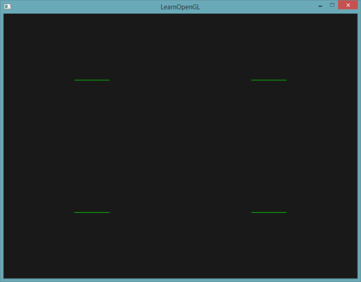
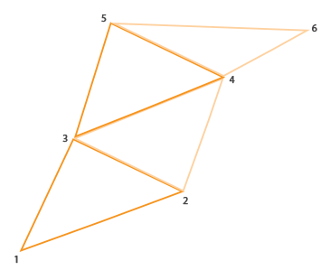
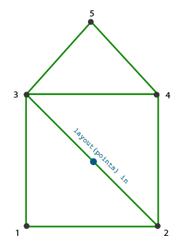
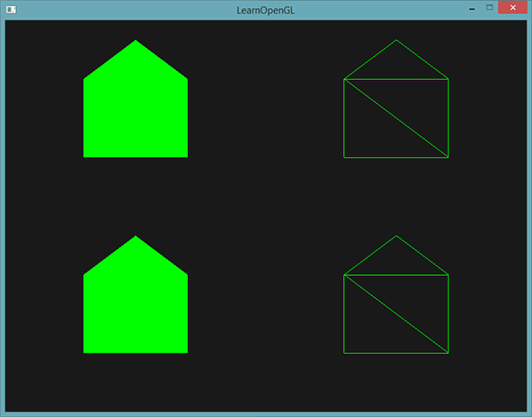
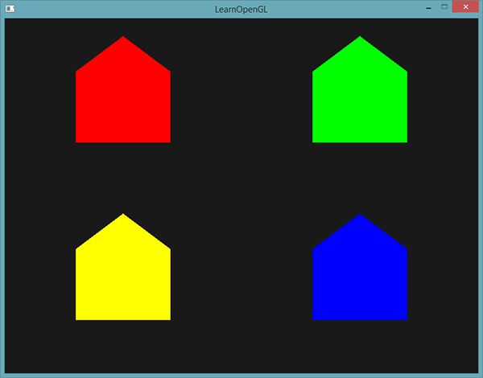
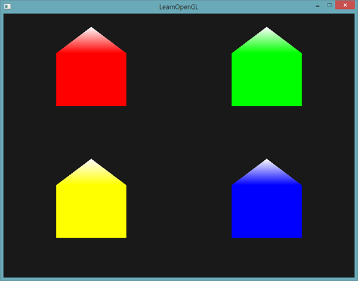
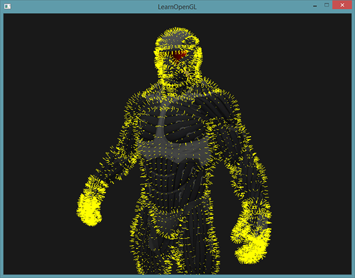

# 几何着色器

原文     | [Geometry Shader](http://learnopengl.com/#!Advanced-OpenGL/Geometry-Shader)
      ---|---
作者     | JoeyDeVries
翻译     | Krasjet
校对     | 暂未校对

在顶点和片段着色器之间有一个可选的<def>几何着色器</def>(Geometry Shader)，几何着色器的输入是一个图元（如点或三角形）的一组顶点。几何着色器可以在顶点发送到下一着色器阶段之前对它们随意变换。然而，几何着色器最有趣的地方在于，它能够将（这一组）顶点变换为完全不同的图元，并且还能生成比原来更多的顶点。

废话不多说，我们直接先看一个几何着色器的例子：

```c++
#version 330 core
layout (points) in;
layout (line_strip, max_vertices = 2) out;

void main() {    
    gl_Position = gl_in[0].gl_Position + vec4(-0.1, 0.0, 0.0, 0.0); 
    EmitVertex();

    gl_Position = gl_in[0].gl_Position + vec4( 0.1, 0.0, 0.0, 0.0);
    EmitVertex();
    
    EndPrimitive();
}
```

在几何着色器的顶部，我们需要声明从顶点着色器输入的图元类型。这需要在<fun>in</fun>关键字前声明一个布局修饰符(Layout Qualifier)。这个输入布局修饰符可以从顶点着色器接收下列任何一个图元值：

- `points`：绘制<var>GL_POINTS</var>图元时（1）。
- `lines`：绘制<var>GL_LINES</var>或<var>GL_LINE_STRIP</var>时（2）
- `lines_adjacency`：<var>GL_LINES_ADJACENCY</var>或<var>GL_LINE_STRIP_ADJACENCY</var>（4）
- `triangles`：<var>GL_TRIANGLES</var>、<var>GL_TRIANGLE_STRIP</var>或<var>GL_TRIANGLE_FAN</var>（3）
- `triangles_adjacency`：<var>GL_TRIANGLES_ADJACENCY</var>或<var>GL_TRIANGLE_STRIP_ADJACENCY</var>（6）

以上是能提供给<fun>glDrawArrays</fun>渲染函数的几乎所有图元了。如果我们想要将顶点绘制为<var>GL_TRIANGLES</var>，我们就要将输入修饰符设置为`triangles`。括号内的数字表示的是一个图元所包含的最小顶点数。

接下来，我们还需要指定几何着色器输出的图元类型，这需要在<fun>out</fun>关键字前面加一个布局修饰符。和输入布局修饰符一样，输出布局修饰符也可以接受几个图元值：

- `points`
- `line_strip`
- `triangle_strip`

有了这3个输出修饰符，我们就可以使用输入图元创建几乎任意的形状了。要生成一个三角形的话，我们将输出定义为`triangle_strip`，并输出3个顶点。

几何着色器同时希望我们设置一个它最大能够输出的顶点数量（如果你超过了这个值，OpenGL将不会绘制**多出的**顶点），这个也可以在<fun>out</fun>关键字的布局修饰符中设置。在这个例子中，我们将输出一个`line_strip`，并将最大顶点数设置为2个。

如果你不知道什么是线条(Line Strip)：线条连接了一组点，形成一条连续的线，它最少要由两个点来组成。在渲染函数中每多加一个点，就会在这个点与前一个点之间形成一条新的线。在下面这张图中，我们有5个顶点：


如果使用的是上面定义的着色器，那么这将只能输出一条线段，因为最大顶点数等于2。

为了生成更有意义的结果，我们需要某种方式来获取前一着色器阶段的输出。GLSL提供给我们一个<def>内建</def>(Built-in)变量，在内部看起来（可能）是这样的：

```c++
in gl_Vertex
{
    vec4  gl_Position;
    float gl_PointSize;
    float gl_ClipDistance[];
} gl_in[];
```

这里，它被声明为一个<def>接口块</def>（Interface Block，我们在[上一节](08 Advanced GLSL.md)已经讨论过），它包含了几个很有意思的变量，其中最有趣的一个是<var>gl_Position</var>，它是和顶点着色器输出非常相似的一个向量。

要注意的是，它被声明为一个数组，因为大多数的渲染图元包含多于1个的顶点，而几何着色器的输入是一个图元的**所有**顶点。

有了之前顶点着色器阶段的顶点数据，我们就可以使用2个几何着色器函数，<fun>EmitVertex</fun>和<fun>EndPrimitive</fun>，来生成新的数据了。几何着色器希望你能够生成并输出至少一个定义为输出的图元。在我们的例子中，我们需要至少生成一个线条图元。

```c++
void main() {
    gl_Position = gl_in[0].gl_Position + vec4(-0.1, 0.0, 0.0, 0.0); 
    EmitVertex();

    gl_Position = gl_in[0].gl_Position + vec4( 0.1, 0.0, 0.0, 0.0);
    EmitVertex();
    
    EndPrimitive();
}
```

每次我们调用<fun>EmitVertex</fun>时，<var>gl_Position</var>中的向量会被添加到图元中来。当<fun>EndPrimitive</fun>被调用时，所有发射出的(Emitted)顶点都会合成为指定的输出渲染图元。在一个或多个<fun>EmitVertex</fun>调用之后重复调用<fun>EndPrimitive</fun>能够生成多个图元。在这个例子中，我们发射了两个顶点，它们从原始顶点位置平移了一段距离，之后调用了<fun>EndPrimitive</fun>，将这两个顶点合成为一个包含两个顶点的线条。

现在你（大概）了解了几何着色器的工作方式，你可能已经猜出这个几何着色器是做什么的了。它接受一个点图元作为输入，以这个点为中心，创建一条水平的线图元。如果我们渲染它，看起来会是这样的：



目前还并没有什么令人惊叹的效果，但考虑到这个输出是通过调用下面的渲染函数来生成的，它还是很有意思的：

```c++
glDrawArrays(GL_POINTS, 0, 4);
```

虽然这是一个比较简单的例子，它的确向你展示了如何能够使用几何着色器来（动态地）生成新的形状。在之后我们会利用几何着色器创建出更有意思的效果，但现在我们仍将从创建一个简单的几何着色器开始。

## 使用几何着色器

为了展示几何着色器的用法，我们将会渲染一个非常简单的场景，我们只会在标准化设备坐标的z平面上绘制四个点。这些点的坐标是：

```c++
float points[] = {
	-0.5f,  0.5f, // 左上
	 0.5f,  0.5f, // 右上
	 0.5f, -0.5f, // 右下
	-0.5f, -0.5f  // 左下
};
```

顶点着色器只需要在z平面绘制点就可以了，所以我们将使用一个最基本顶点着色器：

```c++
#version 330 core
layout (location = 0) in vec2 aPos;

void main()
{
    gl_Position = vec4(aPos.x, aPos.y, 0.0, 1.0); 
}
```

直接在片段着色器中硬编码，将所有的点都输出为绿色：

```c++
#version 330 core
out vec4 FragColor;

void main()
{
    FragColor = vec4(0.0, 1.0, 0.0, 1.0);   
}
```

为点的顶点数据生成一个VAO和一个VBO，然后使用<fun>glDrawArrays</fun>进行绘制：

```c++
shader.use();
glBindVertexArray(VAO);
glDrawArrays(GL_POINTS, 0, 4);
```

结果是在黑暗的场景中有四个（很难看见的）绿点：


但我们之前不是学过这些吗？是的，但是现在我们将会添加一个几何着色器，为场景添加活力。

出于学习目的，我们将会创建一个<def>传递</def>(Pass-through)几何着色器，它会接收一个点图元，并直接将它**传递**(Pass)到下一个着色器：

```c++
#version 330 core
layout (points) in;
layout (points, max_vertices = 1) out;

void main() {    
    gl_Position = gl_in[0].gl_Position; 
    EmitVertex();
    EndPrimitive();
}
```

现在这个几何着色器应该很容易理解了，它只是将它接收到的顶点位置不作修改直接发射出去，并生成一个点图元。

和顶点与片段着色器一样，几何着色器也需要编译和链接，但这次在创建着色器时我们将会使用<var>GL_GEOMETRY_SHADER</var>作为着色器类型：

```c++
geometryShader = glCreateShader(GL_GEOMETRY_SHADER);
glShaderSource(geometryShader, 1, &gShaderCode, NULL);
glCompileShader(geometryShader);  
...
glAttachShader(program, geometryShader);
glLinkProgram(program);
```

着色器编译的代码和顶点与片段着色器代码都是一样的。记得要检查编译和链接错误！

如果你现在编译并运行程序，会看到和下面类似的结果：


这和没使用几何着色器时是完全一样的！我承认这是有点无聊，但既然我们仍然能够绘制这些点，所以几何着色器是正常工作的，现在是时候做点更有趣的东西了！

## 造几个房子

绘制点和线并没有那么有趣，所以我们会使用一点创造力，利用几何着色器在每个点的位置上绘制一个房子。要实现这个，我们可以将几何着色器的输出设置为<def>triangle_strip</def>，并绘制三个三角形：其中两个组成一个正方形，另一个用作房顶。

OpenGL中，三角形带(Triangle Strip)是绘制三角形更高效的方式，它使用顶点更少。在第一个三角形绘制完之后，每个后续顶点将会在上一个三角形边上生成另一个三角形：每3个临近的顶点将会形成一个三角形。如果我们一共有6个构成三角形带的顶点，那么我们会得到这些三角形：(1, 2, 3)、(2, 3, 4)、(3, 4, 5)和(4, 5, 6)，共形成4个三角形。一个三角形带至少需要3个顶点，并会生成N-2个三角形。使用6个顶点，我们创建了6-2 = 4个三角形。下面这幅图展示了这点：



通过使用三角形带作为几何着色器的输出，我们可以很容易创建出需要的房子形状，只需要以正确的顺序生成3个相连的三角形就行了。下面这幅图展示了顶点绘制的顺序，蓝点代表的是输入点：



变为几何着色器是这样的：

```c++
#version 330 core
layout (points) in;
layout (triangle_strip, max_vertices = 5) out;

void build_house(vec4 position)
{    
    gl_Position = position + vec4(-0.2, -0.2, 0.0, 0.0);    // 1:左下
    EmitVertex();   
    gl_Position = position + vec4( 0.2, -0.2, 0.0, 0.0);    // 2:右下
    EmitVertex();
    gl_Position = position + vec4(-0.2,  0.2, 0.0, 0.0);    // 3:左上
    EmitVertex();
    gl_Position = position + vec4( 0.2,  0.2, 0.0, 0.0);    // 4:右上
    EmitVertex();
    gl_Position = position + vec4( 0.0,  0.4, 0.0, 0.0);    // 5:顶部
    EmitVertex();
    EndPrimitive();
}

void main() {    
    build_house(gl_in[0].gl_Position);
}
```

这个几何着色器生成了5个顶点，每个顶点都是原始点的位置加上一个偏移量，来组成一个大的三角形带。最终的图元会被光栅化，然后片段着色器会处理整个三角形带，最终在每个绘制的点处生成一个绿色房子：



你可以看到，每个房子实际上是由3个三角形组成的——全部都是使用空间中一点来绘制的。这些绿房子看起来是有点无聊，所以我们会再给每个房子分配一个不同的颜色。为了实现这个，我们需要在顶点着色器中添加一个额外的顶点属性，表示颜色信息，将它传递至几何着色器，并再次发送到片段着色器中。

下面是更新后的顶点数据：

```c++
float points[] = {
    -0.5f,  0.5f, 1.0f, 0.0f, 0.0f, // 左上
     0.5f,  0.5f, 0.0f, 1.0f, 0.0f, // 右上
     0.5f, -0.5f, 0.0f, 0.0f, 1.0f, // 右下
    -0.5f, -0.5f, 1.0f, 1.0f, 0.0f  // 左下
};
```

然后我们更新顶点着色器，使用一个接口块将颜色属性发送到几何着色器中：

```c++
#version 330 core
layout (location = 0) in vec2 aPos;
layout (location = 1) in vec3 aColor;

out VS_OUT {
    vec3 color;
} vs_out;

void main()
{
    gl_Position = vec4(aPos.x, aPos.y, 0.0, 1.0); 
    vs_out.color = aColor;
}
```

接下来我们还需要在几何着色器中声明相同的接口块（使用一个不同的接口名）：

```c++
in VS_OUT {
    vec3 color;
} gs_in[];
```

因为几何着色器是作用于输入的一组顶点的，从顶点着色器发来输入数据总是会以数组的形式表示出来，即便我们现在只有一个顶点。

!!! Important

	我们并不是必须要用接口块来向几何着色器传递数据。如果顶点着色器发送的颜色向量是`out vec3 vColor`，我们也可以这样写：

		in vec3 vColor[];

	然而，接口块在几何着色器这样的着色器中会更容易处理一点。实际上，几何着色器的输入能够变得非常大，将它们合并为一个大的接口块数组会更符合逻辑一点。

接下来我们还需要为下个片段着色器阶段声明一个输出颜色向量：

```c++
out vec3 fColor;
```

因为片段着色器只需要一个（插值的）颜色，发送多个颜色并没有什么意义。所以，<var>fColor</var>向量就不是一个数组，而是一个单独的向量。当发射一个顶点的时候，每个顶点将会使用最后在<var>fColor</var>中储存的值，来用于片段着色器的运行。对我们的房子来说，我们只需要在第一个顶点发射之前，使用顶点着色器中的颜色填充<var>fColor</var>一次就可以了。

因为片段着色器只需要一个（已进行了插值的）颜色，传送多个颜色没有意义。fColor向量这样就不是一个数组，而是一个单一的向量。当发射一个顶点时，为了它的片段着色器运行，每个顶点都会储存最后在fColor中储存的值。对于这些房子来说，我们可以在第一个顶点被发射，对整个房子上色前，只使用来自顶点着色器的颜色填充fColor一次：

```c++
fColor = gs_in[0].color; // gs_in[0] 因为只有一个输入顶点
gl_Position = position + vec4(-0.2, -0.2, 0.0, 0.0);    // 1:左下  
EmitVertex();   
gl_Position = position + vec4( 0.2, -0.2, 0.0, 0.0);    // 2:右下
EmitVertex();
gl_Position = position + vec4(-0.2,  0.2, 0.0, 0.0);    // 3:左上
EmitVertex();
gl_Position = position + vec4( 0.2,  0.2, 0.0, 0.0);    // 4:右上
EmitVertex();
gl_Position = position + vec4( 0.0,  0.4, 0.0, 0.0);    // 5:顶部
EmitVertex();
EndPrimitive();  
```

所有发射出的顶点都将嵌有最后储存在<var>fColor</var>中的值，即顶点的颜色属性值。所有的房子都会有它们自己的颜色了：



仅仅是为了有趣，我们也可以假装这是冬天，将最后一个顶点的颜色设置为白色，给屋顶落上一些雪。

```c++
fColor = gs_in[0].color; 
gl_Position = position + vec4(-0.2, -0.2, 0.0, 0.0);    // 1:左下 
EmitVertex();   
gl_Position = position + vec4( 0.2, -0.2, 0.0, 0.0);    // 2:右下
EmitVertex();
gl_Position = position + vec4(-0.2,  0.2, 0.0, 0.0);    // 3:左上
EmitVertex();
gl_Position = position + vec4( 0.2,  0.2, 0.0, 0.0);    // 4:右上
EmitVertex();
gl_Position = position + vec4( 0.0,  0.4, 0.0, 0.0);    // 5:顶部
fColor = vec3(1.0, 1.0, 1.0);
EmitVertex();
EndPrimitive();  
```

最终结果看起来是这样的：



你可以将你的代码与[这里](https://learnopengl.com/code_viewer_gh.php?code=src/4.advanced_opengl/9.1.geometry_shader_houses/geometry_shader_houses.cpp)的OpenGL代码进行比对。

你可以看到，有了几何着色器，你甚至可以将最简单的图元变得十分有创意。因为这些形状是在GPU的超快硬件中动态生成的，这会比在顶点缓冲中手动定义图形要高效很多。因此，几何缓冲对简单而且经常重复的形状来说是一个很好的优化工具，比如体素(Voxel)世界中的方块和室外草地的每一根草。

# 爆破物体

尽管绘制房子非常有趣，但我们不会经常这么做。这也是为什么我们接下来要继续深入，来爆破(Explode)物体！虽然这也是一个不怎么常用的东西，但是它能向你展示几何着色器的强大之处。

当我们说**爆破**一个物体时，我们并不是指要将宝贵的顶点集给炸掉，我们是要将每个三角形沿着法向量的方向移动一小段时间。效果就是，整个物体看起来像是沿着每个三角形的法线向量**爆炸**一样。爆炸三角形的效果在纳米装模型上看起来像是这样的：


这样的几何着色器效果的一个好处就是，无论物体有多复杂，它都能够应用上去。

因为我们想要沿着三角形的法向量位移每个顶点，我们首先需要计算这个法向量。我们所要做的是计算垂直于三角形表面的向量，仅使用我们能够访问的3个顶点。你可能还记得在[变换](../01 Getting started/07 Transformations.md)小节中，我们使用<def>叉乘</def>来获取垂直于其它两个向量的一个向量。如果我们能够获取两个平行于三角形表面的向量<var>a</var>和<var>b</var>，我们就能够对这两个向量进行叉乘来获取法向量了。下面这个几何着色器函数做的正是这个，来使用3个输入顶点坐标来获取法向量：

```c++
vec3 GetNormal()
{
   vec3 a = vec3(gl_in[0].gl_Position) - vec3(gl_in[1].gl_Position);
   vec3 b = vec3(gl_in[2].gl_Position) - vec3(gl_in[1].gl_Position);
   return normalize(cross(a, b));
}
```

这里我们使用减法获取了两个平行于三角形表面的向量<var>a</var>和<var>b</var>。因为两个向量相减能够得到这两个向量之间的差值，并且三个点都位于三角平面上，对任意两个向量相减都能够得到一个平行于平面的向量。注意，如果我们交换了<fun>cross</fun>函数中<var>a</var>和<var>b</var>的位置，我们会得到一个指向相反方向的法向量——这里的顺序很重要！

既然知道了如何计算法向量了，我们就能够创建一个<fun>explode</fun>函数了，它使用法向量和顶点位置向量作为参数。这个函数会返回一个新的向量，它是位置向量沿着法线向量进行位移之后的结果：

```c++
vec4 explode(vec4 position, vec3 normal)
{
    float magnitude = 2.0;
    vec3 direction = normal * ((sin(time) + 1.0) / 2.0) * magnitude; 
    return position + vec4(direction, 0.0);
}
```

函数本身应该不是非常复杂。<fun>sin</fun>函数接收一个<var>time</var>参数，它根据时间返回一个-1.0到1.0之间的值。因为我们不想让物体**向内爆炸**(Implode)，我们将sin值变换到了[0, 1]的范围内。最终的结果会乘以<var>normal</var>向量，并且最终的<var>direction</var>向量会被加到位置向量上。

当使用我们的[模型加载器](../03 Model Loading/01 Assimp.md)绘制一个模型时，<def>爆破</def>(Explode)效果的完整片段着色器是这样的：

```c++
#version 330 core
layout (triangles) in;
layout (triangle_strip, max_vertices = 3) out;

in VS_OUT {
    vec2 texCoords;
} gs_in[];

out vec2 TexCoords; 

uniform float time;

vec4 explode(vec4 position, vec3 normal) { ... }

vec3 GetNormal() { ... }

void main() {    
    vec3 normal = GetNormal();

    gl_Position = explode(gl_in[0].gl_Position, normal);
    TexCoords = gs_in[0].texCoords;
    EmitVertex();
    gl_Position = explode(gl_in[1].gl_Position, normal);
    TexCoords = gs_in[1].texCoords;
    EmitVertex();
    gl_Position = explode(gl_in[2].gl_Position, normal);
    TexCoords = gs_in[2].texCoords;
    EmitVertex();
    EndPrimitive();
}
```

注意我们在发射顶点之前输出了对应的纹理坐标。

而且别忘了在OpenGL代码中设置<var>time</var>变量：

```c++
shader.setFloat("time", glfwGetTime());
```

最终的效果是，3D模型看起来随着时间不断在爆破它的顶点，在这之后又回到正常状态。虽然这并不是非常有用，它的确向你展示了几何着色器更高级的用法。你可以将你的代码和[这里](https://learnopengl.com/code_viewer_gh.php?code=src/4.advanced_opengl/9.2.geometry_shader_exploding/geometry_shader_exploding.cpp)完整的源码进行比较。

# 法向量可视化

在这一部分中，我们将使用几何着色器来实现一个真正有用的例子：显示任意物体的法向量。当编写光照着色器时，你可能会最终会得到一些奇怪的视觉输出，但又很难确定导致问题的原因。光照错误很常见的原因就是法向量错误，这可能是由于不正确加载顶点数据、错误地将它们定义为顶点属性或在着色器中不正确地管理所导致的。我们想要的是使用某种方式来检测提供的法向量是正确的。检测法向量是否正确的一个很好的方式就是对它们进行可视化，几何着色器正是实现这一目的非常有用的工具。

思路是这样的：我们首先不使用几何着色器正常绘制场景。然后再次绘制场景，但这次只显示通过几何着色器生成法向量。几何着色器接收一个三角形图元，并沿着法向量生成三条线——每个顶点一个法向量。伪代码看起来会像是这样：

```c++
shader.use();
DrawScene();
normalDisplayShader.use();
DrawScene();
```

这次在几何着色器中，我们会使用模型提供的顶点法线，而不是自己生成，为了适配（观察和模型矩阵的）缩放和旋转，我们在将法线变换到裁剪空间坐标之前，先使用法线矩阵变换一次（几何着色器接受的位置向量是剪裁空间坐标，所以我们应该将法向量变换到相同的空间中）。这可以在顶点着色器中完成：

```c++
#version 330 core
layout (location = 0) in vec3 aPos;
layout (location = 1) in vec3 aNormal;

out VS_OUT {
    vec3 normal;
} vs_out;

uniform mat4 projection;
uniform mat4 view;
uniform mat4 model;

void main()
{
    gl_Position = projection * view * model * vec4(aPos, 1.0); 
    mat3 normalMatrix = mat3(transpose(inverse(view * model)));
    vs_out.normal = normalize(vec3(projection * vec4(normalMatrix * aNormal, 0.0)));
}
```

变换后的裁剪空间法向量会以接口块的形式传递到下个着色器阶段。接下来，几何着色器会接收每一个顶点（包括一个位置向量和一个法向量），并在每个位置向量处绘制一个法线向量：

```c++
#version 330 core
layout (triangles) in;
layout (line_strip, max_vertices = 6) out;

in VS_OUT {
    vec3 normal;
} gs_in[];

const float MAGNITUDE = 0.4;

void GenerateLine(int index)
{
    gl_Position = gl_in[index].gl_Position;
    EmitVertex();
    gl_Position = gl_in[index].gl_Position + vec4(gs_in[index].normal, 0.0) * MAGNITUDE;
    EmitVertex();
    EndPrimitive();
}

void main()
{
    GenerateLine(0); // 第一个顶点法线
    GenerateLine(1); // 第二个顶点法线
    GenerateLine(2); // 第三个顶点法线
}
```

像这样的几何着色器应该很容易理解了。注意我们将法向量乘以了一个<var>MAGNITUDE</var>向量，来限制显示出的法向量大小（否则它们就有点大了）。

因为法线的可视化通常都是用于调试目的，我们可以使用片段着色器，将它们显示为单色的线（如果你愿意也可以是非常好看的线）：

```c++
#version 330 core
out vec4 FragColor;

void main()
{
    FragColor = vec4(1.0, 1.0, 0.0, 1.0);
}
```

现在，首先使用普通着色器渲染模型，再使用特别的**法线可视化**着色器渲染，你将看到这样的效果：



尽管我们的纳米装现在看起来像是一个体毛很多而且带着隔热手套的人，它能够很有效地帮助我们判断模型的法线是否正确。你可以想象到，这样的几何着色器也经常用于给物体添加<def>毛发</def>(Fur)。

你可以在[这里](https://learnopengl.com/code_viewer_gh.php?code=src/4.advanced_opengl/9.3.geometry_shader_normals/normal_visualization.cpp)找到源码。