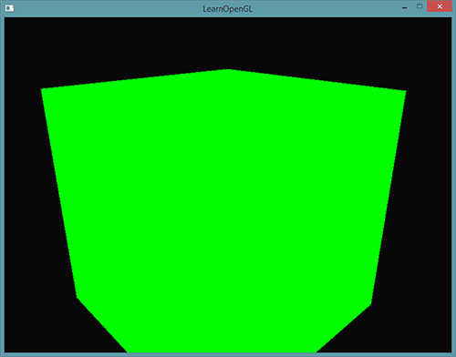
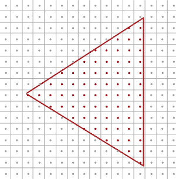
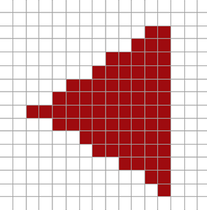
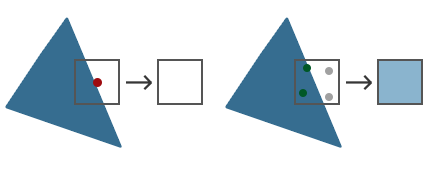
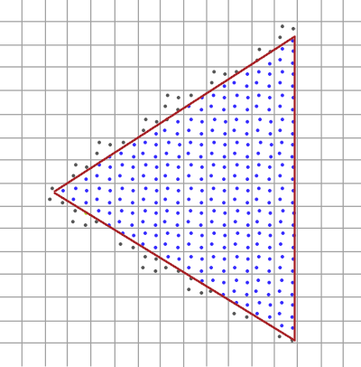
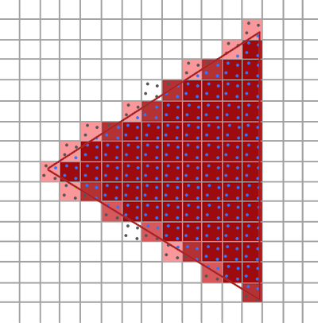
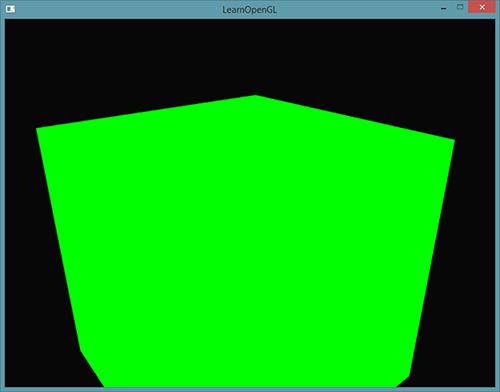
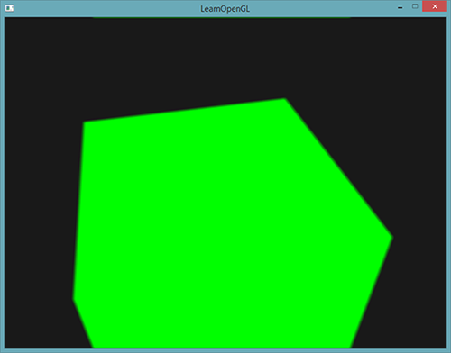

# 抗锯齿

原文     | [Anti Aliasing](http://learnopengl.com/#!Advanced-OpenGL/Anti-Aliasing)
      ---|---
作者     | JoeyDeVries
翻译     | [Django](http://bullteacher.com/)
校对     | [Geequlim](http://geequlim.com),[KenLee](https://hellokenlee.github.io/)

在你的渲染大冒险中，你可能会遇到模型边缘有锯齿的问题。**锯齿边缘(Jagged Edge)**出现的原因是由顶点数据光栅化成为片元(fragment)的方式所引起的。举个例子，我们随手绘制一个简单的正方体就已经能很清楚地看到锯齿边缘的效果：



尽管可能不会被立刻察觉到，如果你更近的看看立方体的边，你就会发现锯齿状的图案。如果我们放大就会看到下面的情境：


这当然不是我们在实际应用中想要的效果。这个效果，我们很明显能看到边缘像素的形态，这种现象被称之为**走样(Aliasing)**。有很多技术能够减少走样现象，产生更平滑的边缘，这些技术叫做**抗锯齿技术**(Anti-aliasing，也被称为反走样技术)。

最开始我们有一个叫做**超采样抗锯齿技术(Super Sample Anti-aliasing, SSAA)**，它暂时使用一个更高的分辨率（以超采样方式）来渲染场景，当输出图像在帧缓冲中被更新时，图像的分辨率会被下采样(down sample)回原来的分辨率。它使用额外的分辨率来防止锯齿边缘。虽然它确实为我们提供了一种解决走样问题的方案，但却由于必须绘制比平时更多的片段而降低了性能。所以这个技术只流行了一段时间。

这个技术的基础上诞生了更为现代的技术，叫做**多采样抗锯齿(Multisample Anti-aliasing)**或叫**MSAA**，虽然它借用了SSAA的理念，但却以更加高效的方式实现了它。这节教程我们会展开讨论这个OpenGL内建的MSAA技术。

## 多重采样

为了理解什么是多重采样(Multisampling)，以及它是如何解决锯齿问题的，我们先要更深入了解一下OpenGL光栅化的工作方式。

光栅化表示在我们输出的顶点(Vertices)和片元着色器(fragment shader)中间的所有算法和处理过程的集合(译者注： 在OpenGL中，光栅化步骤在几何着色器后，片元着色器前)。光栅化将属于一个基本图形的所有顶点转化为一系列片元。顶点坐标理论上可以是任意值，但片元却不是这样，这是因为它们受你的窗口的分辨率限制。几乎永远都不会有顶点坐标和片元的一对一映射，所以光栅化必须以某种方式决定每个顶点最终位于哪个片元/屏幕坐标上。



这里我们看到一个屏幕像素网格，每个像素中心包含一个采样点（sample point），它被用来决定一个像素是否被三角形所覆盖。红色的采样点表示该点被三角形所覆盖，片元着色器会给该屏幕像素着色。不过即使三角形覆盖了某一个屏幕像素的一部分，但是中心的采样点没被覆盖到，这个像素仍然不会受到片段着色器的影响。

你可能现在已经明白走样的原因是什么了。上述三角形渲染后在你的屏幕上会是这样的：



由于屏幕像素总量的限制，有些边上的像素能被渲染出来，而有些则不会。结果就是我们渲染出的基本图形的边缘产生了上图的锯齿。

多采样所做的正是不再使用单一采样点来决定三角形的覆盖范围，而是采用多个采样点(这大概就是它名字的由来)。我们不再使用每个像素中心的采样点，取而代之的是4个子采样（subsample），用它们来决定像素是否被覆盖。这意味着颜色缓冲的大小也由于每个像素的子样本的增加而增加了。



上图的左侧显示了我们普通决定一个三角形是否覆盖屏幕像素的方式(译者注： 中心点，单采样)。这个像素并不会被一个片元着色器着色（因此它保持空白），因为它的采样点没有被三角形所覆盖。右边示了多采样的版本，每个像素包含4个采样点。这里我们可以看到只有2个采样点被三角形覆盖。

!!! Important

    采样点的数量是任意的，更多的采样点能带来更精确的覆盖率。

从这儿开始我们的多重采样变得有趣起来了。我们知道了只有2个子采样被三角覆盖，下一步就是决定这个像素的颜色。我们可以猜测一下，我们会为每个被覆盖的子采样运行片元着色器，然后对每个像素的所有子采样的颜色进行平均化。在这种情况下，我们需要为每一个被插值后的顶点数据的每一个子采样运行两次两次片元着色器，然后把采样点的颜色储存起来。幸好，它不是这么运作的，因为这等于说我们必须运行更多的片段着色器，会明显降低性能。

MSAA的真正工作方式是，每个像素只运行一次片元着色器，无论该像素有多少子样本被三角形所覆盖。片元着色器接受的顶点数据是被插值到每一个像素的**中心**坐标，而其着色的颜色会被每个被三角形覆盖的子采样储存。一旦一个我们绘制的基本图形的子采样颜色缓冲被填满了，每个像素对应的所有颜色将会被平均化，这使得每个像素最终有了一个唯一颜色。比如在前面的图片中4个子采样中只有2个被三角形覆盖，像素的颜色事实上是一个均值，该均值由三角形的颜色和其他2个子采样的颜色(aka. 背景色)平均化而成，最后该像素被着色为一种浅蓝色。

结果是，颜色缓冲中所有基本图形的边变得更加平滑了。让我们看看多重采样对前面的一个三角形来说是怎样做的：



这里每个像素包含着4个子采样（不相关采样点的没有被标注出来）蓝色的子采样是被三角形覆盖了的，灰色的则没有被覆盖。三角形内部区域中的所有像素都会运行一次片元着色器，它输出的颜色由4个子采样决定。三角形的边缘并不是所有的子采样都会被覆盖，所以片段着色器的结果仅由部分的子采样决定。根据被覆盖子采样的数量，最终的像素颜色由三角形颜色和其他子采样所储存的颜色所决定。(译者注： 其实有点类似于Blending的原理。)

大致上来说，如果更多的采样点被覆盖，那么像素的颜色就会更接近于三角形。如果我们用这种方去给我们前面的三角形的填充像素颜色，我们会获得这样的结果：



对于每个像素来说，被三角形覆盖的子采样越少，像素受到三角形的颜色的影响也越少。现在原本三角形不平滑的边被比实际颜色浅一些的颜色像素所包围，因此观察者从远处看上去就比较平滑了。

不仅颜色值会被多重采样技术影响，深度测试和模板测试也同样使用了多重采样技术。比如深度测试，顶点的深度值在运行深度测试前被插值到每个子采样中，对于模板测试，我们为每个子采样储存模板值，而不是每个像素。这意味着深度和模板缓冲的大小随着像素子样本的增加也增加了。

到目前为止我们所讨论的不过是多重采样技术的工作原理。光栅化背后实际的逻辑要比我们讨论的复杂，但你现在可以理解MSAA背后的概念和逻辑了。
(译者注： 如果看到这里还是对原理似懂非懂，可以简单看看知乎上[@文刀秋二](https://www.zhihu.com/people/edliu/answers) 对抗锯齿技术的[精彩介绍](https://www.zhihu.com/question/20236638/answer/14438218))


## OpenGL中的MSAA

如果我们打算在OpenGL中使用MSAA，那么我们必须使用一个可以为每个像素储存一个以上的颜色值的颜色缓冲(因为多采样需要我们为每个采样点储存一个颜色)。我们这就需要一个新的缓冲类型，它可以储存要求数量的多重采样样本，它叫做**多样本缓冲(Multisample Buffer)**。

多数窗口系统可以为我们提供一个多样本缓冲，以代替默认的颜色缓冲。GLFW同样给了我们这个功能，我们所要作的就是提示GLFW，我们希望使用一个带有N个样本的多样本缓冲，而不是普通的颜色缓冲，这要在创建窗口前调用`glfwWindowHint`来完成：

```c++
glfwWindowHint(GLFW_SAMPLES, 4);
```

当我们现在调用`glfwCreateWindow`，用于渲染的窗口就被创建了，这次每个屏幕坐标使用一个包含4个子样本的颜色缓冲。这意味着所有缓冲的大小都增长4倍。

现在我们请求GLFW提供了多样本缓冲，我们还要调用`glEnable`来开启多采样，参数是 `GL_MULTISAMPLE`。大多数OpenGL驱动，多采样默认是开启的，所以这个调用有点多余，但通常记得开启它是个好主意。这样所有OpenGL实现的多采样都开启了。

```c++
glEnable(GL_MULTISAMPLE);
```

当默认帧缓冲有了多采样缓冲附件的时候，我们所要做的全部就是调用 `glEnable`开启多采样。因为实际的多采样算法在OpenGL驱动光栅化里已经实现了，所以我们无需再做什么了。如果我们现在来渲染教程开头的那个绿色立方体，我们会看到边缘变得平滑了：



这个箱子看起来平滑多了，在场景中绘制任何物体都可以利用这个技术。可以[从这里找到](http://learnopengl.com/code_viewer.php?code=advanced/anti_aliasing_multisampling)这个简单的例子。

## 离屏MSAA

因为GLFW负责创建多采样缓冲，开启MSAA非常简单。如果我们打算使用我们自己的帧缓冲，来进行离屏渲染，那么我们就必须自己生成多采样缓冲了；现在我们需要自己负责创建多采样缓冲。

有两种方式可以创建多采样缓冲，并使其成为帧缓冲的附件：纹理附件和渲染缓冲附件，和[帧缓冲教程](05 Framebuffers.md)里讨论过的普通的附件很相似。

### 多采样纹理附件

为了创建一个支持储存多采样点的纹理，我们使用 `glTexImage2DMultisample`来替代 `glTexImage2D`，它的纹理目标是**`GL_TEXTURE_2D_MULTISAMPLE`**：

```c++
glBindTexture(GL_TEXTURE_2D_MULTISAMPLE, tex);
glTexImage2DMultisample(GL_TEXTURE_2D_MULTISAMPLE, samples, GL_RGB, width, height, GL_TRUE);
glBindTexture(GL_TEXTURE_2D_MULTISAMPLE, 0);
```

第二个参数现在设置了我们打算让纹理拥有的样本数。如果最后一个参数等于 **`GL_TRUE`**，图像上的每一个纹理像素（texel）将会使用相同的样本位置，以及同样的子样本数量。

为将多采样纹理附加到帧缓冲上，我们使用`glFramebufferTexture2D`，不过这次纹理类型是**`GL_TEXTURE_2D_MULTISAMPLE`**：

```c++
glFramebufferTexture2D(GL_FRAMEBUFFER, GL_COLOR_ATTACHMENT0, GL_TEXTURE_2D_MULTISAMPLE, tex, 0);
```

当前绑定的帧缓冲现在有了一个纹理图像形式的多采样颜色缓冲。

### 多采样渲染缓冲对象

和纹理一样，创建一个多采样渲染缓冲对象(Multisampled Renderbuffer Objects)不难。而且还很简单，因为我们所要做的全部就是当我们指定渲染缓冲的内存的时候将`glRenderbuffeStorage`改为`glRenderbufferStorageMuiltisample`：

```c++
glRenderbufferStorageMultisample(GL_RENDERBUFFER, 4, GL_DEPTH24_STENCIL8, width, height);
```

有一样东西在这里有变化，就是缓冲目标后面那个额外的参数，我们将其设置为样本数量，当前的例子中应该是4.

### 渲染到多采样帧缓冲

渲染到多采样帧缓冲对象是自动的。当我们绘制任何东西时，帧缓冲对象就绑定了，光栅化会对负责所有多采样操作。我们接着得到了一个多采样颜色缓冲，以及深度和模板缓冲。因为多采样缓冲有点特别，我们不能为其他操作直接使用它们的缓冲图像，比如在着色器中进行采样。

一个多采样图像包含了比普通图像更多的信息，所以我们需要做的是压缩或还原图像。还原一个多采样帧缓冲，通常用`glBlitFramebuffer`来完成，它从一个帧缓冲中复制一个区域粘贴另一个里面，同时也将任何多采样缓冲还原。

`glBlitFramebuffer`把一个4屏幕坐标源区域传递到一个也是4空间坐标的目标区域。你可能还记得帧缓冲教程中，如果我们绑定到`GL_FRAMEBUFFER`，我们实际上就同时绑定到了读和写的帧缓冲目标。我们还可以通过`GL_READ_FRAMEBUFFER`和`GL_DRAW_FRAMEBUFFER`绑定到各自的目标上。`glBlitFramebuffer`函数从这两个目标读取，并决定哪一个是源哪一个是目标帧缓冲。接着我们就可以通过把图像位块传送(Blitting)到默认帧缓冲里，将多采样帧缓冲输出传递到实际的屏幕了：

```c++
glBindFramebuffer(GL_READ_FRAMEBUFFER, multisampledFBO);
glBindFramebuffer(GL_DRAW_FRAMEBUFFER, 0);
glBlitFramebuffer(0, 0, width, height, 0, 0, width, height, GL_COLOR_BUFFER_BIT, GL_NEAREST);
```

如果我们渲染应用，我们将得到和没用帧缓冲一样的结果：一个绿色立方体，它使用MSAA显示出来，但边缘锯齿明显少了：


你可以[在这里找到源代码](http://learnopengl.com/code_viewer.php?code=advanced/anti_aliasing_framebuffers)。

但是如果我们打算使用一个多采样帧缓冲的纹理结果来做这件事，就像后处理一样会怎样？我们不能在片段着色器中直接使用多采样纹理。我们可以做的事情是把多缓冲位块传送(Blit)到另一个带有非多采样纹理附件的FBO中。之后我们使用这个普通的颜色附件纹理进行后处理，通过多采样来对一个图像渲染进行后处理效率很高。这意味着我们必须生成一个新的FBO，它仅作为一个将多采样缓冲还原为一个我们可以在片段着色器中使用的普通2D纹理中介。伪代码是这样的：

```c++
GLuint msFBO = CreateFBOWithMultiSampledAttachments();
// Then create another FBO with a normal texture color attachment
...
glFramebufferTexture2D(GL_FRAMEBUFFER, GL_COLOR_ATTACHMENT0, GL_TEXTURE_2D, screenTexture, 0);
...
while(!glfwWindowShouldClose(window))
{
    ...

    glBindFramebuffer(msFBO);
    ClearFrameBuffer();
    DrawScene();
    // Now resolve multisampled buffer(s) into intermediate FBO
    glBindFramebuffer(GL_READ_FRAMEBUFFER, msFBO);
    glBindFramebuffer(GL_DRAW_FRAMEBUFFER, intermediateFBO);
    glBlitFramebuffer(0, 0, width, height, 0, 0, width, height, GL_COLOR_BUFFER_BIT, GL_NEAREST);
    // Now scene is stored as 2D texture image, so use that image for post-processing
    glBindFramebuffer(GL_FRAMEBUFFER, 0);
    ClearFramebuffer();
    glBindTexture(GL_TEXTURE_2D, screenTexture);
    DrawPostProcessingQuad();  

    ...
}
```

如果我们实现帧缓冲教程中讲的后处理代码，我们就能创造出没有锯齿边的所有效果很酷的后处理特效。使用模糊kernel过滤器，看起来会像这样：



你可以[在这里找到所有MSAA版本的后处理源码](http://learnopengl.com/code_viewer.php?code=advanced/anti_aliasing_post_processing)。

!!! Important

    因为屏幕纹理重新变回了只有一个采样点的普通纹理，有些后处理过滤器，比如边检测（edge-detection）将会再次导致锯齿边问题。为了修正此问题，之后你应该对纹理进行模糊处理，或者创建你自己的抗锯齿算法。

当我们希望将多采样和离屏渲染结合起来时，我们需要自己负责一些细节。所有细节都是值得付出这些额外努力的，因为多采样可以明显提升场景视频输出的质量。要注意，开启多采样会明显降低性能，样本越多越明显。本文写作时，MSAA4样本很常用。

## 自定义抗锯齿算法

可以直接把一个多采样纹理图像传递到着色器中，以取代必须先还原的方式。GLSL给我们一个选项来为每个子样本进行纹理图像采样，所以我们可以创建自己的抗锯齿算法，在比较大的图形应用中，通常这么做。

为获取每个子样本的颜色值，你必须将纹理uniform采样器定义为sampler2DMS，而不是使用sampler2D：

```c++
uniform sampler2DMS screenTextureMS;
```

使用texelFetch函数，就可以获取每个样本的颜色值了：

```c++
vec4 colorSample = texelFetch(screenTextureMS, TexCoords, 3);  // 4th subsample
```

我们不会深究自定义抗锯齿技术的创建细节，但是会给你自己去实现它提供一些提示。
