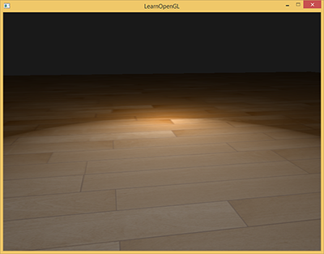
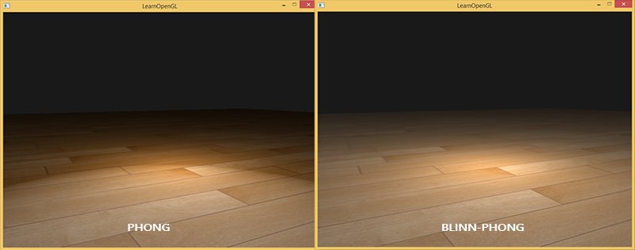
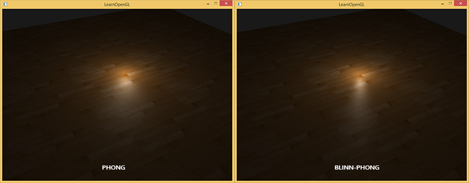

# 高级光照

原文     | [Advanced Lighting](http://learnopengl.com/#!Advanced-Lighting/Advanced-Lighting)
      ---|---
作者     | JoeyDeVries
翻译     | Krasjet
校对     | 暂未校对


在[光照](../02 Lighting/02 Basic Lighting.md)小节中，我们简单地介绍了冯氏光照模型，它让我们的场景有了一定的真实感。虽然冯氏模型看起来已经很不错了，但是使用它的时候仍然存在一些细节问题，我们将在这一节里讨论它们。

## Blinn-Phong

冯氏光照不仅对真实光照有很好的近似，而且性能也很高。但是它的镜面反射会在一些情况下出现问题，特别是物体反光度很低时，会导致大片（粗糙的）高光区域。下面这张图展示了当反光度为1.0时地板会出现的效果：



可以看到，在镜面高光区域的边缘出现了一道很明显的断层。出现这个问题的原因是观察向量和反射向量间的夹角不能大于90度。如果点积的结果为负数，镜面光分量会变为0.0。你可能会觉得，当光线与视线夹角大于90度时你应该不会接收到任何光才对，所以这不是什么问题。

然而，这种想法仅仅只适用于漫反射分量。当考虑漫反射光的时候，如果法线和光源夹角大于90度，光源会处于被照表面的下方，这个时候光照的漫反射分量的确是为0.0。但是，在考虑镜面高光时，我们测量的角度并不是光源与法线的夹角，而是视线与反射光线向量的夹角。看一下下面这两张图：


现在问题就应该很明显了。左图中是我们熟悉的冯氏光照中的反射向量，其中$\theta$角小于90度。而右图中，视线与反射方向之间的夹角明显大于90度，这种情况下镜面光分量会变为0.0。这在大多数情况下都不是什么问题，因为观察方向离反射方向都非常远。然而，当物体的反光度非常小时，它产生的镜面高光半径足以让这些相反方向的光线对亮度产生足够大的影响。在这种情况下就不能忽略它们对镜面光分量的贡献了。

1977年，James F. Blinn在冯氏着色模型上加以拓展，引入了<def>Blinn-Phong</def>着色模型。Blinn-Phong模型与冯氏模型非常相似，但是它对镜面光模型的处理上有一些不同，让我们能够解决之前提到的问题。Blinn-Phong模型不再依赖于反射向量，而是采用了所谓的<def>半程向量</def>(Halfway Vector)，即光线与视线夹角一半方向上的一个单位向量。当半程向量与法线向量越接近时，镜面光分量就越大。


当视线正好与（现在不需要的）反射向量对齐时，半程向量就会与法线完美契合。所以当观察者视线越接近于原本反射光线的方向时，镜面高光就会越强。

现在，不论观察者向哪个方向看，半程向量与表面法线之间的夹角都不会超过90度（除非光源在表面以下）。它产生的效果会与冯氏光照有些许不同，但是大部分情况下看起来会更自然一点，特别是低高光的区域。Blinn-Phong着色模型正是早期固定渲染管线时代时OpenGL所采用的光照模型。

获取半程向量的方法很简单，只需要将光线的方向向量和观察向量加到一起，并将结果正规化(Normalize)就可以了：

$$
\bar{H} = \frac{\bar{L} + \bar{V}}{||\bar{L} + \bar{V}||}
$$

翻译成GLSL代码如下：

```c++
vec3 lightDir   = normalize(lightPos - FragPos);
vec3 viewDir    = normalize(viewPos - FragPos);
vec3 halfwayDir = normalize(lightDir + viewDir);
```

接下来，镜面光分量的实际计算只不过是对表面法线和半程向量进行一次约束点乘(Clamped Dot Product)，让点乘结果不为负，从而获取它们之间夹角的余弦值，之后我们对这个值取反光度次方：

```c++
float spec = pow(max(dot(normal, halfwayDir), 0.0), shininess);
vec3 specular = lightColor * spec;
```

除此之外Blinn-Phong模型就没什么好说的了，Blinn-Phong与冯氏模型唯一的区别就是，Blinn-Phong测量的是法线与半程向量之间的夹角，而冯氏模型测量的是观察方向与反射向量间的夹角。

在引入半程向量之后，我们现在应该就不会再看到冯氏光照中高光断层的情况了。下面两个图片展示的是两种方法在镜面光分量为0.5时的对比：



除此之外，冯氏模型与Blinn-Phong模型也有一些细微的差别：半程向量与表面法线的夹角通常会小于观察与反射向量的夹角。所以，如果你想获得和冯氏着色类似的效果，就必须在使用Blinn-Phong模型时将镜面反光度设置更高一点。通常我们会选择冯氏着色时反光度分量的2到4倍。

下面是冯氏着色反光度为8.0，Blinn-Phong着色反光度为32.0时的一个对比：



你可以看到，Blinn-Phong的镜面光分量会比冯氏模型更锐利一些。为了得到与冯氏模型类似的结果，你可能会需要不断进行一些微调，但Blinn-Phong模型通常会产出更真实的结果。

这里，我们使用了一个简单的片段着色器，让我们能够在冯氏反射与Blinn-Phong反射间进行切换：

```c++
void main()
{
    [...]
    float spec = 0.0;
    if(blinn)
    {
        vec3 halfwayDir = normalize(lightDir + viewDir);  
        spec = pow(max(dot(normal, halfwayDir), 0.0), 16.0);
    }
    else
    {
        vec3 reflectDir = reflect(-lightDir, normal);
        spec = pow(max(dot(viewDir, reflectDir), 0.0), 8.0);
    }
``` 

你可以在[这里](https://learnopengl.com/code_viewer_gh.php?code=src/5.advanced_lighting/1.advanced_lighting/advanced_lighting.cpp)找到这个Demo的源代码。你可以按下`B`键来切换冯氏光照与Blinn-Phong光照。
