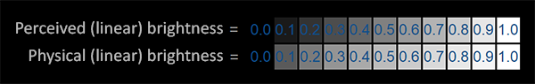
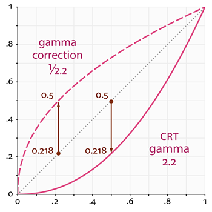
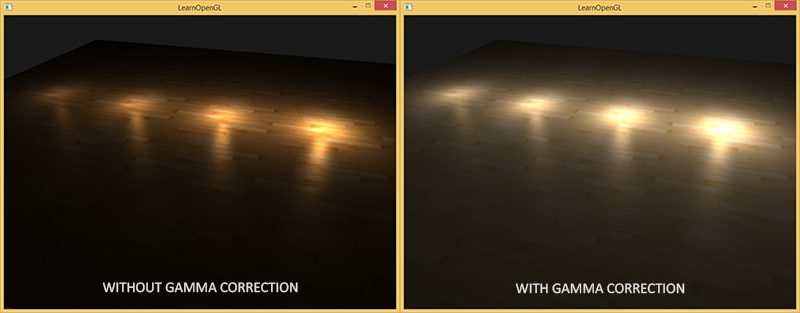
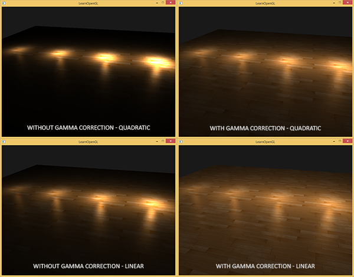

# Gamma校正

原文     | [Gamma Correction](http://learnopengl.com/#!Advanced-Lighting/Gamma-Correction)
      ---|---
作者     | JoeyDeVries
翻译     | [Django](http://bullteacher.com/)
校对     | [AoZhang](https://github.com/SuperAoao)

!!! note

	本节暂未进行完全的重写，错误可能会很多。如果可能的话，请对照原文进行阅读。如果有报告本节的错误，将会延迟至重写之后进行处理。

当我们计算出场景中所有像素的最终颜色以后，我们就必须把它们显示在显示器上。过去，大多数显示器是阴极射线管显示器（CRT）。这些显示器有一个物理特性就是两倍的输入电压并不能产生两倍的亮度。将输入电压加倍产生的亮度约为输入电压的2.2次幂，这叫做显示器Gamma。

!!! note "译注"

	Gamma也叫灰度系数，每种显示设备都有自己的Gamma值，都不相同，有一个公式：设备输出亮度 = 电压的Gamma次幂，任何设备Gamma基本上都不会等于1，等于1是一种理想的线性状态，这种理想状态是：如果电压和亮度都是在0到1的区间，那么多少电压就等于多少亮度。对于CRT，Gamma通常为2.2，因而，输出亮度 = 输入电压的2.2次幂，你可以从本节第二张图中看到Gamma2.2实际显示出来的总会比预期暗，相反Gamma0.45就会比理想预期亮，如果你讲Gamma0.45叠加到Gamma2.2的显示设备上，便会对偏暗的显示效果做到校正，这个简单的思路就是本节的核心

人类所感知的亮度恰好和CRT所显示出来相似的指数关系非常匹配。为了更好的理解所有含义，请看下面的图片：



第一行是人眼所感知到的正常的灰阶，亮度要增加一倍（比如从0.1到0.2）你才会感觉比原来变亮了一倍（译注：我们在看颜色值从0到1（从黑到白）的过程中，亮度要增加一倍，我们才会感受到明显的颜色变化（变亮一倍）。打个比方：颜色值从0.1到0.2，我们会感受到一倍的颜色变化，而从0.4到0.8我们才能感受到相同程度（变亮一倍）的颜色变化。如果还是不理解，可以参考知乎的[答案](https://www.zhihu.com/question/27467127/answer/37602200)）。然而，当我们谈论光的物理亮度，比如光源发射光子的数量的时候，底部（第二行）的灰阶显示出的才是物理世界真实的亮度。如底部的灰阶显示，亮度加倍时返回的也是真实的物理亮度（译注：这里亮度是指光子数量和正相关的亮度，即物理亮度，前面讨论的是人的感知亮度；物理亮度和感知亮度的区别在于，物理亮度基于光子数量，感知亮度基于人的感觉，比如第二个灰阶里亮度0.1的光子数量是0.2的二分之一），但是由于这与我们的眼睛感知亮度不完全一致（对比较暗的颜色变化更敏感），所以它看起来有差异。

因为人眼看到颜色的亮度更倾向于顶部的灰阶，显示器使用的也是一种指数关系（电压的2.2次幂），所以物理亮度通过显示器能够被映射到顶部的非线性亮度；因此看起来效果不错。

显示器的这个非线性映射的确可以让亮度在我们眼中看起来更好，但当渲染图像时，会产生一个问题：我们在应用中配置的亮度和颜色是基于我们从显示器所看到的，这样所有的配置实际上是非线性的亮度/颜色配置。请看下图：



点线代表线性颜色/亮度值（译注：这表示的是理想状态，Gamma为1），实线代表显示器器显示的颜色。如果我们把一个点线线性的颜色翻一倍，结果就是这个值的两倍。比如，光的颜色向量\(\bar{L} = (0.5, 0.0, 0.0)\)代表的是半暗红色。如果我们在线性空间中把它翻倍，就会变成\((1.0, 0.0, 0.0)\)，就像你在图中看到的那样。然而，由于我们定义的颜色仍然需要输出的显示器上，显示器上显示的实际颜色就会是\((0.218, 0.0, 0.0)\)。在这儿问题就出现了：当我们将理想中直线上的那个半暗红色翻一倍时，在显示器上实际上亮度翻了4.5倍以上！

直到现在，我们还一直假设我们所有的工作都是在线性空间中进行的（译注：Gamma为1），但实际上我们一直在显示器的输出空间中工作，所以我们配置的所有颜色和照明变量在物理上都不正确，但在显示器上看起来(有点)正确。出于这个原因，我们（以及艺术家）通常将光照值设置得比本来更亮一些（由于显示器会将其亮度显示的更暗一些），这导致大多数在线性空间里的计算不正确。同时，还要记住，显示器所显示出来的图像和线性图像的最小亮度是相同的，它们最大的亮度也是相同的；只是中间亮度部分会被压暗。

因为颜色是根据显示器的输出配置的，所以线性空间中的所有中间(照明)计算在物理上都是不正确的。随着更多先进的照明算法的引入，这一点变得更加明显，如下图所示：


你可以看到，通过伽玛校正，(更新的)颜色值可以很好地结合在一起，较暗的区域显示更多的细节。总的来说，一个更好的图像质量与一些小的修改。

如果没有适当地纠正这个显示器伽马，照明看起来是错误的，艺术家将很难获得逼真和好看的结果。解决方案正是应用<def>伽马校正</def>。

## Gamma校正

Gamma校正(Gamma Correction)的思路是在最终的颜色输出到显示器之前先将Gamma的倒数作用到颜色上。回顾本章前面的伽马曲线图，我们看到另一条虚线，它与显示器的伽马曲线相反。我们将每个线性输出颜色乘以这个逆伽马曲线(使它们更亮)，一旦颜色显示在显示器上，显示器的伽马曲线就被应用，结果颜色就变成线性的。我们有效地使中间颜色变亮，这样一旦显示器变暗，它们就会平衡。

我们来看另一个例子。还是那个暗红色\((0.5, 0.0, 0.0)\)。在将颜色显示到显示器之前，我们先对颜色应用Gamma校正曲线。线性的颜色显示在显示器上相当于降低了\(2.2\)次幂的亮度，所以倒数就是\(1/2.2\)次幂。Gamma校正后的暗红色就会成为\((0.5, 0.0, 0.0)^{1/2.2} = (0.5, 0.0, 0.0)^{0.45} = (0.73, 0.0, 0.0)\)。校正后的颜色接着被发送给显示器，最终显示出来的颜色是\((0.73, 0.0, 0.0)^{2.2} = (0.5, 0.0, 0.0)\)。你会发现使用了Gamma校正，显示器最终会显示出我们在应用中设置的那种线性的颜色。

!!! Important

    2.2通常是是大多数显示设备的大概平均gamma值。基于gamma2.2的颜色空间叫做sRGB颜色空间。每个显示器的gamma曲线都有所不同，但是gamma2.2在大多数显示器上表现都不错。出于这个原因，游戏经常都会为玩家提供改变游戏gamma设置的选项，以适应每个显示器（译注：现在Gamma2.2相当于一个标准，后文中你会看到。但现在你可能会问，前面不是说Gamma2.2的曲线不是和人眼识别亮度的特点相同吗，为何还需要校正。其实我们不需要考虑人眼识别亮度的特点，我们重点需要关注保持亮度的线性变化特点。你在程序中设置的颜色，比如光照都是基于线性Gamma，即Gamma1，比如1.0的亮度应该是0.5的二倍，如果不进行gamma矫正，线性0.5的亮度会输出为0.22，线性1.0的亮度会被输出为1.0，亮度相差了很多倍，和你的预期会很不一样）。
    
有两种在你的场景中应用gamma校正的方式：

* 使用OpenGL内建的sRGB帧缓冲。
* 自己在像素着色器中进行gamma校正。

第一个选项也许是最简单的方式，但是我们也会丧失一些控制权。开启GL_FRAMEBUFFER_SRGB，可以告诉OpenGL每个后续的绘制命令里，在颜色储存到颜色缓冲之前先校正sRGB颜色。sRGB这个颜色空间大致对应于gamma2.2，它也是大多数设备的一个标准。开启GL_FRAMEBUFFER_SRGB以后，每次像素着色器运行后续帧缓冲，OpenGL将自动执行gamma校正，包括默认帧缓冲。

开启GL_FRAMEBUFFER_SRGB简单的调用glEnable就行：

```c++
glEnable(GL_FRAMEBUFFER_SRGB);
```

自此，你渲染的图像就被进行gamma校正处理，你不需要做任何事情硬件就帮你处理了。使用这种方法(和其他方法)你应该记住的重点是，伽马校正(也)将颜色从线性空间转换为非线性空间，所以只在最后一步进行伽马校正。如果你在最后输出之前就进行gamma校正，所有的后续操作都是在操作不正确的颜色值。例如，如果你使用多个帧缓冲，你可能打算让两个帧缓冲之间传递的中间结果仍然保持线性空间颜色，只是给发送给显示器的最后的那个帧缓冲应用gamma校正。

第二种方法需要更多的工作，但也让我们完全控制伽马操作。我们在每个相关的像素着色器运行结束时应用伽玛校正，因此最终的颜色在发送到显示器之前结束伽玛校正。

```c++
void main()
{
    // 在线性空间做炫酷的光照效果
    [...]
    // 应用伽马矫正
    float gamma = 2.2;
    fragColor.rgb = pow(fragColor.rgb, vec3(1.0/gamma));
}
```

最后一行代码，将fragColor的每个颜色元素应用有一个1.0/gamma的幂运算，校正像素着色器的颜色输出。

这种方法的一个问题是，为了保持一致性，你必须对每个有助于最终输出的片段着色器应用伽玛校正。如果你有多个对象的十几个片段着色器，你必须为每个着色器添加伽马校正代码。一个更简单的解决方案是在你的渲染循环中引入一个后处理阶段，并在后处理的四边形上应用伽马校正作为最后一步，这样你只需要做一次伽马矫正即可。

这句单行代码代表了gamma校正的实现。不那么令人印象深刻，但当你进行gamma校正的时候有一些额外的事情别忘了考虑。

### sRGB纹理

因为显示器总是在sRGB空间中显示应用了gamma的颜色，无论什么时候当你在计算机上绘制、编辑或者绘制一个图片的时候，你所选的颜色都是根据你在显示器上看到的那种。这实际意味着所有你创建或编辑的图片并不是在线性空间，而是在sRGB空间中（译注：sRGB空间定义的gamma接近于2.2），假如在你的屏幕上对暗红色翻一倍，便是根据你所感知到的亮度进行的，并不等于将红色元素加倍。

结果就是纹理编辑者，所创建的所有纹理都是在sRGB空间中的纹理，所以如果我们在渲染应用中使用这些纹理，我们必须考虑到这点。在我们不知道gamma校正之前，这不是个问题，因为纹理在sRGB空间创建和展示，同样我们还是在sRGB空间中使用，从而不必gamma校正纹理显示也没问题。然而，现在我们是把所有东西都放在线性空间中展示的，纹理颜色就会变坏，如下图展示的那样：



纹理图像太亮了，这是因为它实际上被伽玛校正了两次!想想看，当我们根据在显示器上看到的创建图像时，我们有效地对图像的颜色值进行伽玛校正，使其在显示器上看起来正确。因为我们在渲染器中再次进行伽玛校正，图像最终变得太亮了。

为了解决这个问题，我们必须确保纹理美工在线性空间中工作。然而，因为在sRGB空间中工作更容易，而且大多数工具甚至不支持线性纹理，所以这可能不是首选的解决方案。

另一个解决方案是在对其颜色值进行任何计算之前重新校正或将这些sRGB纹理转换为线性空间。我们可以这样做

```c++
float gamma = 2.2;
vec3 diffuseColor = pow(texture(diffuse, texCoords).rgb, vec3(gamma));
```

为每个sRGB空间的纹理做这件事非常烦人。幸好，OpenGL给我们提供了另一个方案来解决我们的麻烦，这就是GL_SRGB和GL_SRGB_ALPHA内部纹理格式。

如果我们在OpenGL中创建了一个纹理，把它指定为以上两种sRGB纹理格式其中之一，OpenGL将自动把颜色校正到线性空间中，这样我们所使用的所有颜色值都是在线性空间中的了。我们可以这样把一个纹理指定为一个sRGB纹理：

```c++
glTexImage2D(GL_TEXTURE_2D, 0, GL_SRGB, width, height, 0, GL_RGB, GL_UNSIGNED_BYTE, image);
```

如果你还打算在你的纹理中引入alpha元素，你必须将纹理的内部格式指定为GL_SRGB_ALPHA。

因为不是所有纹理都是在sRGB空间中的所以当你把纹理指定为sRGB纹理时要格外小心。比如diffuse纹理，这种为物体上色的纹理几乎都是在sRGB空间中的。而为了获取光照参数的纹理，像specular贴图和法线贴图几乎都在线性空间中，所以如果你把它们也配置为sRGB纹理的话，光照就坏掉了。指定sRGB纹理时要当心。

将diffuse纹理定义为sRGB纹理之后，你将获得你所期望的视觉输出，但这次每个物体都会只进行一次gamma校正。


## 衰减

伽马校正的另一个不同之处在于光照衰减。在真实的物理世界中，光衰减与光源距离的平方成反比。在正常的英语中，它只是意味着光强度随着距离光源的平方而减少，如下图所示

```c++
float attenuation = 1.0 / (distance * distance);
```

然而，当我们使用这个衰减公式的时候，衰减效果总是过于强烈，光只能照亮一小圈，看起来并不真实。出于这个原因，我们使用在基本光照教程中所讨论的那种衰减方程，它给了我们更大的控制权，此外我们还可以使用双曲线函数：

```c++
float attenuation = 1.0 / distance;
```

双曲线比使用二次函数变体在不用gamma校正的时候看起来更真实，不过但我们开启gamma校正以后线性衰减看起来太弱了，符合物理的二次函数突然出现了更好的效果。下图显示了其中的不同：



这种差异产生的原因是，光的衰减方程改变了亮度值，而且屏幕上显示出来的也不是线性空间，在显示器上效果最好的衰减方程，并不是符合物理的。想想平方衰减方程，如果我们使用这个方程，而且不进行gamma校正，显示在监视器上的衰减方程实际上将变成\((1.0 / distance^2)^{2.2}\)。若不进行gamma校正，将产生更强烈的衰减。这也解释了为什么双曲线不用gamma校正时看起来更真实，因为它实际变成了\((1.0 / distance)^{2.2} = 1.0 / distance^{2.2}\)。这和物理公式是很相似的。

!!! Important

    我们在基础光照教程中讨论的更高级的那个衰减方程在有gamma校正的场景中也仍然有用，因为它可以让我们对衰减拥有更多准确的控制权（不过，在进行gamma校正的场景中当然需要不同的参数）。
    
我创建的这个简单的demo场景，你可以在[这里](https://learnopengl.com/code_viewer_gh.php?code=src/5.advanced_lighting/2.gamma_correction/gamma_correction.cpp)找到源码。按下空格就能在有gamma校正和无gamma校正的场景进行切换，两个场景使用的是相同的纹理和衰减。这不是效果最好的demo，不过它能展示出如何应用所有这些技术。

总而言之，gamma校正使你可以在线性空间中进行操作。因为线性空间更符合物理世界，大多数物理公式现在都可以获得较好效果，比如真实的光的衰减。你的光照越真实，使用gamma校正获得漂亮的效果就越容易。这也正是为什么当引进gamma校正时，建议只去调整光照参数的原因。

## 附加资源

- [What every coder should know about gamma](https://blog.johnnovak.net/2016/09/21/what-every-coder-should-know-about-gamma/)John Novak写的一篇关于伽马校正的深度文章。
- [cambridgeincolour.com](http://www.cambridgeincolour.com/tutorials/gamma-correction.htm):更多关于gamma和gamma校正的内容。
- [blog.wolfire.com](http://blog.wolfire.com/2010/02/Gamma-correct-lighting): 这是David Rosen的一篇关于伽马校正在图形渲染中的好处的博客。
- [renderwonk.com](http://renderwonk.com/blog/index.php/archive/adventures-with-gamma-correct-rendering/): 一些额外的实践上的思考。
