# 阴影映射

原文     | [Shadow Mapping](http://learnopengl.com/#!Advanced-Lighting/Shadows/Shadow-Mapping)
      ---|---
作者     | JoeyDeVries
翻译     | [Django](http://bullteacher.com/)
校对     | gjy_1992

!!! note

	本节暂未进行完全的重写，错误可能会很多。如果可能的话，请对照原文进行阅读。如果有报告本节的错误，将会延迟至重写之后进行处理。

阴影是光线被阻挡的结果；当一个光源的光线由于其他物体的阻挡不能够达到一个物体的表面的时候，那么这个物体就在阴影中了。阴影能够使场景看起来真实得多，并且可以让观察者获得物体之间的空间位置关系。场景和物体的深度感因此能够得到极大提升，下图展示了有阴影和没有阴影的情况下的不同：

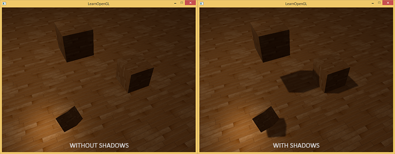

你可以看到，有阴影的时候你能更容易地区分出物体之间的位置关系，例如，当使用阴影的时候浮在地板上的立方体的事实更加清晰。

阴影还是比较不好实现的，因为当前实时渲染领域还没找到一种完美的阴影算法。目前有几种近似阴影技术，但它们都有自己的弱点和不足，这点我们必须要考虑到。

视频游戏中较多使用的一种技术是阴影贴图（shadow mapping），效果不错，而且相对容易实现。阴影贴图并不难以理解，性能也不会太低，而且非常容易扩展成更高级的算法（比如 [Omnidirectional Shadow Maps](http://learnopengl.com/#!Advanced-Lighting/Shadows/Point-Shadows)和 [Cascaded Shadow Maps](http://learnopengl.com/#!Advanced-Lighting/Shadows/CSM)）。

## 阴影映射

阴影映射(Shadow Mapping)背后的思路非常简单：我们以光的位置为视角进行渲染，我们能看到的东西都将被点亮，看不见的一定是在阴影之中了。假设有一个地板，在光源和它之间有一个大盒子。由于光源处向光线方向看去，可以看到这个盒子，但看不到地板的一部分，这部分就应该在阴影中了。

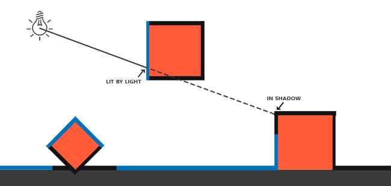

这里的所有蓝线代表光源可以看到的fragment。黑线代表被遮挡的fragment：它们应该渲染为带阴影的。如果我们绘制一条从光源出发，到达最右边盒子上的一个片段上的线段或射线，那么射线将先击中悬浮的盒子，随后才会到达最右侧的盒子。结果就是悬浮的盒子被照亮，而最右侧的盒子将处于阴影之中。

我们希望得到射线第一次击中的那个物体，然后用这个最近点和射线上其他点进行对比。然后我们将测试一下看看射线上的其他点是否比最近点更远，如果是的话，这个点就在阴影中。对从光源发出的射线上的成千上万个点进行遍历是个极端消耗性能的举措，实时渲染上基本不可取。我们可以采取相似举措，不用投射出光的射线。我们所使用的是非常熟悉的东西：深度缓冲。

你可能记得在[深度测试](http://learnopengl.com/#!Advanced-OpenGL/Depth-testing)教程中，在深度缓冲里的一个值是摄像机视角下，对应于一个片段的一个0到1之间的深度值。如果我们从光源的透视图来渲染场景，并把深度值的结果储存到纹理中会怎样？通过这种方式，我们就能对光源的透视图所见的最近的深度值进行采样。最终，深度值就会显示从光源的透视图下见到的第一个片段了。我们管储存在纹理中的所有这些深度值，叫做深度贴图（depth map）或阴影贴图。

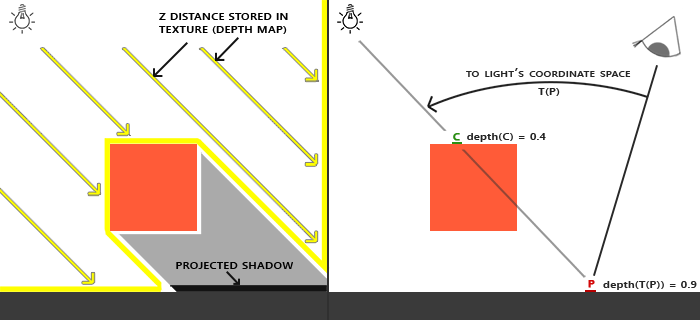

左侧的图片展示了一个定向光源（所有光线都是平行的）在立方体下的表面投射的阴影。通过储存到深度贴图中的深度值，我们就能找到最近点，用以决定片段是否在阴影中。我们使用一个来自光源的视图和投影矩阵来渲染场景就能创建一个深度贴图。这个投影和视图矩阵结合在一起成为一个\(T\)变换，它可以将任何三维位置转变到光源的可见坐标空间。

!!! Important

    定向光并没有位置，因为它被规定为无穷远。然而，为了实现阴影贴图，我们得从一个光的透视图渲染场景，这样就得在光的方向的某一点上渲染场景。

在右边的图中我们显示出同样的平行光和观察者。我们渲染一个点\(\bar{\color{red}{P}}\)处的片段，需要决定它是否在阴影中。我们先得使用\(T\)把\(\bar{\color{red}{P}}\)变换到光源的坐标空间里。既然点\(\bar{\color{red}{P}}\)是从光的透视图中看到的，它的z坐标就对应于它的深度，例子中这个值是0.9。使用点\(\bar{\color{red}{P}}\)在光源的坐标空间的坐标，我们可以索引深度贴图，来获得从光的视角中最近的可见深度，结果是点\(\bar{\color{green}{C}}\)，最近的深度是0.4。因为索引深度贴图的结果是一个小于点\(\bar{\color{red}{P}}\)的深度，我们可以断定\(\bar{\color{red}{P}}\)被挡住了，它在阴影中了。

阴影映射由两个步骤组成：首先，我们渲染深度贴图，然后我们像往常一样渲染场景，使用生成的深度贴图来计算片段是否在阴影之中。听起来有点复杂，但随着我们一步一步地讲解这个技术，就能理解了。

## 深度贴图

第一步我们需要生成一张深度贴图(Depth Map)。深度贴图是从光的透视图里渲染的深度纹理，用它计算阴影。因为我们需要将场景的渲染结果储存到一个纹理中，我们将再次需要帧缓冲。

首先，我们要为渲染的深度贴图创建一个帧缓冲对象：

```c++
GLuint depthMapFBO;
glGenFramebuffers(1, &depthMapFBO);
```

然后，创建一个2D纹理，提供给帧缓冲的深度缓冲使用：

```c++
const GLuint SHADOW_WIDTH = 1024, SHADOW_HEIGHT = 1024;
 
GLuint depthMap;
glGenTextures(1, &depthMap);
glBindTexture(GL_TEXTURE_2D, depthMap);
glTexImage2D(GL_TEXTURE_2D, 0, GL_DEPTH_COMPONENT, 
             SHADOW_WIDTH, SHADOW_HEIGHT, 0, GL_DEPTH_COMPONENT, GL_FLOAT, NULL);
glTexParameteri(GL_TEXTURE_2D, GL_TEXTURE_MIN_FILTER, GL_NEAREST);
glTexParameteri(GL_TEXTURE_2D, GL_TEXTURE_MAG_FILTER, GL_NEAREST);
glTexParameteri(GL_TEXTURE_2D, GL_TEXTURE_WRAP_S, GL_REPEAT); 
glTexParameteri(GL_TEXTURE_2D, GL_TEXTURE_WRAP_T, GL_REPEAT);
```

生成深度贴图不太复杂。因为我们只关心深度值，我们要把纹理格式指定为GL_DEPTH_COMPONENT。我们还要把纹理的高宽设置为1024：这是深度贴图的分辨率。

把我们把生成的深度纹理作为帧缓冲的深度缓冲：

```c++
glBindFramebuffer(GL_FRAMEBUFFER, depthMapFBO);
glFramebufferTexture2D(GL_FRAMEBUFFER, GL_DEPTH_ATTACHMENT, GL_TEXTURE_2D, depthMap, 0);
glDrawBuffer(GL_NONE);
glReadBuffer(GL_NONE);
glBindFramebuffer(GL_FRAMEBUFFER, 0);
```

我们需要的只是在从光的透视图下渲染场景的时候深度信息，所以颜色缓冲没有用。然而，不包含颜色缓冲的帧缓冲对象是不完整的，所以我们需要显式告诉OpenGL我们不适用任何颜色数据进行渲染。我们通过将调用glDrawBuffer和glReadBuffer把读和绘制缓冲设置为GL_NONE来做这件事。

合理配置将深度值渲染到纹理的帧缓冲后，我们就可以开始第一步了：生成深度贴图。两个步骤的完整的渲染阶段，看起来有点像这样：

```c++
// 1. 首选渲染深度贴图
glViewport(0, 0, SHADOW_WIDTH, SHADOW_HEIGHT);
glBindFramebuffer(GL_FRAMEBUFFER, depthMapFBO);
glClear(GL_DEPTH_BUFFER_BIT);
ConfigureShaderAndMatrices();
RenderScene();
glBindFramebuffer(GL_FRAMEBUFFER, 0);
// 2. 像往常一样渲染场景，但这次使用深度贴图
glViewport(0, 0, SCR_WIDTH, SCR_HEIGHT);
glClear(GL_COLOR_BUFFER_BIT | GL_DEPTH_BUFFER_BIT);
ConfigureShaderAndMatrices();
glBindTexture(GL_TEXTURE_2D, depthMap);
RenderScene();
```

这段代码隐去了一些细节，但它表达了阴影映射的基本思路。这里一定要记得调用glViewport。因为阴影贴图经常和我们原来渲染的场景（通常是窗口分辨率）有着不同的分辨率，我们需要改变视口（viewport）的参数以适应阴影贴图的尺寸。如果我们忘了更新视口参数，最后的深度贴图要么太小要么就不完整。

### 光源空间的变换

前面那段代码中一个不清楚的函数是`ConfigureShaderAndMatrices`。它是用来在第二个步骤确保为每个物体设置了合适的投影和视图矩阵，以及相关的模型矩阵。然而，第一个步骤中，我们从光的位置的视野下使用了不同的投影和视图矩阵来渲染的场景。

因为我们使用的是一个所有光线都平行的定向光。出于这个原因，我们将为光源使用正交投影矩阵，透视图将没有任何变形：

```c++
GLfloat near_plane = 1.0f, far_plane = 7.5f;
glm::mat4 lightProjection = glm::ortho(-10.0f, 10.0f, -10.0f, 10.0f, near_plane, far_plane);
```

这里有个本节教程的demo场景中使用的正交投影矩阵的例子。因为投影矩阵间接决定可视区域的范围，以及哪些东西不会被裁切，你需要保证投影视锥（frustum）的大小，以包含打算在深度贴图中包含的物体。当物体和片段不在深度贴图中时，它们就不会产生阴影。

为了创建一个视图矩阵来变换每个物体，把它们变换到从光源视角可见的空间中，我们将使用glm::lookAt函数；这次从光源的位置看向场景中央。

```c++
glm::mat4 lightView = glm::lookAt(glm::vec(-2.0f, 4.0f, -1.0f), glm::vec3(0.0f, 0.0f, 0.0f), glm::vec3(0.0f, 1.0f, 0.0f));
```

二者相结合为我们提供了一个光空间的变换矩阵，它将每个世界空间坐标变换到光源处所见到的那个空间；这正是我们渲染深度贴图所需要的。

```c++
glm::mat4 lightSpaceMatrix = lightProjection * lightView;
```

这个lightSpaceMatrix正是前面我们称为\(T\)的那个变换矩阵。有了lightSpaceMatrix只要给shader提供光空间的投影和视图矩阵，我们就能像往常那样渲染场景了。然而，我们只关心深度值，并非所有片段计算都在我们的着色器中进行。为了提升性能，我们将使用一个与之不同但更为简单的着色器来渲染出深度贴图。

### 渲染至深度贴图

当我们以光的透视图进行场景渲染的时候，我们会用一个比较简单的着色器，这个着色器除了把顶点变换到光空间以外，不会做得更多了。这个简单的着色器叫做`simpleDepthShader`，就是使用下面的这个着色器：

```c++
#version 330 core
layout (location = 0) in vec3 position;
 
uniform mat4 lightSpaceMatrix;
uniform mat4 model;
 
void main()
{
    gl_Position = lightSpaceMatrix * model * vec4(position, 1.0f);
}
```

这个顶点着色器将一个单独模型的一个顶点，使用lightSpaceMatrix变换到光空间中。

由于我们没有颜色缓冲，最后的片段不需要任何处理，所以我们可以简单地使用一个空片段着色器：

```c++
#version 330 core
 
void main()
{             
    // gl_FragDepth = gl_FragCoord.z;
}
```

这个空片段着色器什么也不干，运行完后，深度缓冲会被更新。我们可以取消那行的注释，来显式设置深度，但是这个（指注释掉那行之后）是更有效率的，因为底层无论如何都会默认去设置深度缓冲。

渲染深度缓冲现在成了：

```c++
simpleDepthShader.Use();
glUniformMatrix4fv(lightSpaceMatrixLocation, 1, GL_FALSE, glm::value_ptr(lightSpaceMatrix));
 
glViewport(0, 0, SHADOW_WIDTH, SHADOW_HEIGHT);
glBindFramebuffer(GL_FRAMEBUFFER, depthMapFBO);
glClear(GL_DEPTH_BUFFER_BIT);
RenderScene(simpleDepthShader);
glBindFramebuffer(GL_FRAMEBUFFER, 0);
```

这里的RenderScene函数的参数是一个着色器程序（shader program），它调用所有相关的绘制函数，并在需要的地方设置相应的模型矩阵。

最后，在光的透视图视角下，很完美地用每个可见片段的最近深度填充了深度缓冲。通过将这个纹理投射到一个2D四边形上（和我们在帧缓冲一节做的后处理过程类似），就能在屏幕上显示出来，我们会获得这样的东西：

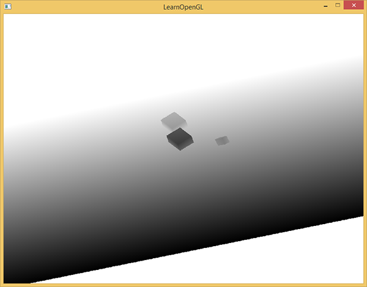

将深度贴图渲染到四边形上的片段着色器：

```c++
#version 330 core
out vec4 color;
in vec2 TexCoords;
 
uniform sampler2D depthMap;
 
void main()
{             
    float depthValue = texture(depthMap, TexCoords).r;
    color = vec4(vec3(depthValue), 1.0);
}
```

要注意的是当用透视投影矩阵取代正交投影矩阵来显示深度时，有一些轻微的改动，因为使用透视投影时，深度是非线性的。本节教程的最后，我们会讨论这些不同之处。

你可以在[这里](https://learnopengl.com/code_viewer_gh.php?code=src/5.advanced_lighting/3.1.1.shadow_mapping_depth/shadow_mapping_depth.cpp)获得把场景渲染成深度贴图的源码。

## 渲染阴影

正确地生成深度贴图以后我们就可以开始生成阴影了。这段代码在片段着色器中执行，用来检验一个片段是否在阴影之中，不过我们在顶点着色器中进行光空间的变换：

```c++
#version 330 core
layout (location = 0) in vec3 position;
layout (location = 1) in vec3 normal;
layout (location = 2) in vec2 texCoords;
 
out vec2 TexCoords;
 
out VS_OUT {
    vec3 FragPos;
    vec3 Normal;
    vec2 TexCoords;
    vec4 FragPosLightSpace;
} vs_out;
 
uniform mat4 projection;
uniform mat4 view;
uniform mat4 model;
uniform mat4 lightSpaceMatrix;
 
void main()
{
    gl_Position = projection * view * model * vec4(position, 1.0f);
    vs_out.FragPos = vec3(model * vec4(position, 1.0));
    vs_out.Normal = transpose(inverse(mat3(model))) * normal;
    vs_out.TexCoords = texCoords;
    vs_out.FragPosLightSpace = lightSpaceMatrix * vec4(vs_out.FragPos, 1.0);
}
``` 

这儿的新的地方是FragPosLightSpace这个输出向量。我们用同一个lightSpaceMatrix，把世界空间顶点位置转换为光空间。顶点着色器传递一个普通的经变换的世界空间顶点位置vs_out.FragPos和一个光空间的vs_out.FragPosLightSpace给片段着色器。

片段着色器使用Blinn-Phong光照模型渲染场景。我们接着计算出一个shadow值，当fragment在阴影中时是1.0，在阴影外是0.0。然后，diffuse和specular颜色会乘以这个阴影元素。由于阴影不会是全黑的（由于散射），我们把ambient分量从乘法中剔除。

```c++
#version 330 core
out vec4 FragColor;
 
in VS_OUT {
    vec3 FragPos;
    vec3 Normal;
    vec2 TexCoords;
    vec4 FragPosLightSpace;
} fs_in;
 
uniform sampler2D diffuseTexture;
uniform sampler2D shadowMap;
 
uniform vec3 lightPos;
uniform vec3 viewPos;
 
float ShadowCalculation(vec4 fragPosLightSpace)
{
    [...]
}
 
void main()
{           
    vec3 color = texture(diffuseTexture, fs_in.TexCoords).rgb;
    vec3 normal = normalize(fs_in.Normal);
    vec3 lightColor = vec3(1.0);
    // Ambient
    vec3 ambient = 0.15 * color;
    // Diffuse
    vec3 lightDir = normalize(lightPos - fs_in.FragPos);
    float diff = max(dot(lightDir, normal), 0.0);
    vec3 diffuse = diff * lightColor;
    // Specular
    vec3 viewDir = normalize(viewPos - fs_in.FragPos);
    vec3 reflectDir = reflect(-lightDir, normal);
    float spec = 0.0;
    vec3 halfwayDir = normalize(lightDir + viewDir);  
    spec = pow(max(dot(normal, halfwayDir), 0.0), 64.0);
    vec3 specular = spec * lightColor;    
    // 计算阴影
    float shadow = ShadowCalculation(fs_in.FragPosLightSpace);       
    vec3 lighting = (ambient + (1.0 - shadow) * (diffuse + specular)) * color;    
    
    FragColor = vec4(lighting, 1.0f);
}
```

片段着色器大部分是从高级光照教程中复制过来，只不过加上了个阴影计算。我们声明一个shadowCalculation函数，用它计算阴影。片段着色器的最后，我们我们把diffuse和specular乘以(1-阴影元素)，这表示这个片段有多大成分不在阴影中。这个片段着色器还需要两个额外输入，一个是光空间的片段位置和第一个渲染阶段得到的深度贴图。

首先要检查一个片段是否在阴影中，把光空间片段位置转换为裁切空间的标准化设备坐标。当我们在顶点着色器输出一个裁切空间顶点位置到gl_Position时，OpenGL自动进行一个透视除法，将裁切空间坐标的范围-w到w转为-1到1，这要将x、y、z元素除以向量的w元素来实现。由于裁切空间的FragPosLightSpace并不会通过gl_Position传到片段着色器里，我们必须自己做透视除法：

```c++
float ShadowCalculation(vec4 fragPosLightSpace)
{
    // 执行透视除法
    vec3 projCoords = fragPosLightSpace.xyz / fragPosLightSpace.w;
    [...]
}
```

返回了片段在光空间的-1到1的范围。

!!! Important

    当使用正交投影矩阵，顶点w元素仍保持不变，所以这一步实际上毫无意义。可是，当使用透视投影的时候就是必须的了，所以为了保证在两种投影矩阵下都有效就得留着这行。

因为来自深度贴图的深度在0到1的范围，我们也打算使用projCoords从深度贴图中去采样，所以我们将NDC坐标变换为0到1的范围。
（译者注：这里的意思是，上面的projCoords的xyz分量都是[-1,1]（下面会指出这对于远平面之类的点才成立），而为了和深度贴图的深度相比较，z分量需要变换到[0,1]；为了作为从深度贴图中采样的坐标，xy分量也需要变换到[0,1]。所以整个projCoords向量都需要变换到[0,1]范围。）

```c++
projCoords = projCoords * 0.5 + 0.5;
```

有了这些投影坐标，我们就能从深度贴图中采样得到0到1的结果，从第一个渲染阶段的projCoords坐标直接对应于变换过的NDC坐标。我们将得到光的位置视野下最近的深度：

```c++
float closestDepth = texture(shadowMap, projCoords.xy).r;
```

为了得到片段的当前深度，我们简单获取投影向量的z坐标，它等于来自光的透视视角的片段的深度。

```c++
float currentDepth = projCoords.z;
```

实际的对比就是简单检查currentDepth是否高于closetDepth，如果是，那么片段就在阴影中。

```c++
float shadow = currentDepth > closestDepth  ? 1.0 : 0.0;
```

完整的shadowCalculation函数是这样的：

```c++
float ShadowCalculation(vec4 fragPosLightSpace)
{
    // 执行透视除法
    vec3 projCoords = fragPosLightSpace.xyz / fragPosLightSpace.w;
    // 变换到[0,1]的范围
    projCoords = projCoords * 0.5 + 0.5;
    // 取得最近点的深度(使用[0,1]范围下的fragPosLight当坐标)
    float closestDepth = texture(shadowMap, projCoords.xy).r; 
    // 取得当前片段在光源视角下的深度
    float currentDepth = projCoords.z;
    // 检查当前片段是否在阴影中
    float shadow = currentDepth > closestDepth  ? 1.0 : 0.0;
 
    return shadow;
}
```

激活这个着色器，绑定合适的纹理，激活第二个渲染阶段默认的投影以及视图矩阵，结果如下图所示：

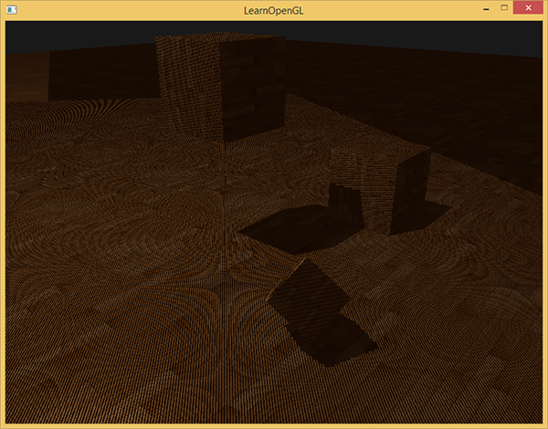

如果你做对了，你会看到地板和上有立方体的阴影。你可以从这里找到demo程序的[源码](https://learnopengl.com/code_viewer_gh.php?code=src/5.advanced_lighting/3.1.2.shadow_mapping_base/shadow_mapping_base.cpp)。

## 改进阴影贴图

我们试图让阴影映射工作，但是你也看到了，阴影映射还是有点不真实，我们修复它才能获得更好的效果，这是下面的部分所关注的焦点。

### 阴影失真

前面的图片中明显有不对的地方。放大看会发现明显的线条样式：

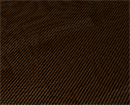

我们可以看到地板四边形渲染出很大一块交替黑线。这种阴影贴图的不真实感叫做**阴影失真(Shadow Acne)**，下图解释了成因：

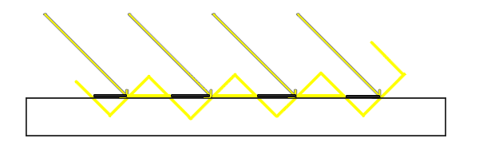

因为阴影贴图受限于分辨率，在距离光源比较远的情况下，多个片段可能从深度贴图的同一个值中去采样。图片每个斜坡代表深度贴图一个单独的纹理像素。你可以看到，多个片段从同一个深度值进行采样。

虽然很多时候没问题，但是当光源以一个角度朝向表面的时候就会出问题，这种情况下深度贴图也是从一个角度下进行渲染的。多个片段就会从同一个斜坡的深度纹理像素中采样，有些在地板上面，有些在地板下面；这样我们所得到的阴影就有了差异。因为这个，有些片段被认为是在阴影之中，有些不在，由此产生了图片中的条纹样式。

我们可以用一个叫做**阴影偏移**（shadow bias）的技巧来解决这个问题，我们简单的对表面的深度（或深度贴图）应用一个偏移量，这样片段就不会被错误地认为在表面之下了。

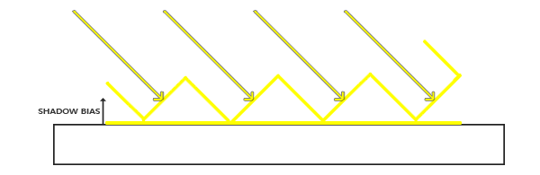

使用了偏移量后，所有采样点都获得了比表面深度更小的深度值，这样整个表面就正确地被照亮，没有任何阴影。我们可以这样实现这个偏移：

```c++
float bias = 0.005;
float shadow = currentDepth - bias > closestDepth  ? 1.0 : 0.0;
```

一个0.005的偏移就能帮到很大的忙，但是有些表面坡度很大，仍然会产生阴影失真。有一个更加可靠的办法能够根据表面朝向光线的角度更改偏移量：使用点乘：

```c++
float bias = max(0.05 * (1.0 - dot(normal, lightDir)), 0.005);
```

这里我们有一个偏移量的最大值0.05，和一个最小值0.005，它们是基于表面法线和光照方向的。这样像地板这样的表面几乎与光源垂直，得到的偏移就很小，而比如立方体的侧面这种表面得到的偏移就更大。下图展示了同一个场景，但使用了阴影偏移，效果的确更好：

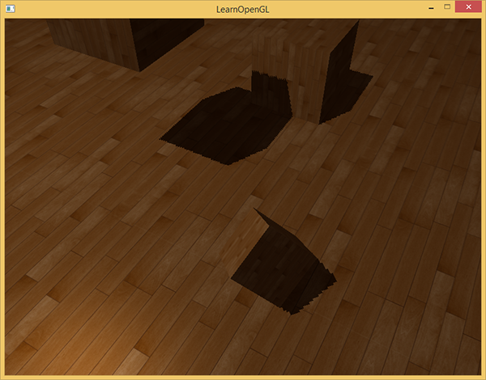

选用正确的偏移数值，在不同的场景中需要一些像这样的轻微调校，但大多情况下，实际上就是增加偏移量直到所有失真都被移除的问题。

### 悬浮

使用阴影偏移的一个缺点是你对物体的实际深度应用了平移。偏移有可能足够大，以至于可以看出阴影相对实际物体位置的偏移，你可以从下图看到这个现象（这是一个夸张的偏移值）：


这个阴影失真叫做悬浮(Peter Panning)，因为物体看起来轻轻悬浮在表面之上（译注Peter Pan就是童话彼得潘，而panning有平移、悬浮之意，而且彼得潘是个会飞的男孩…）。我们可以使用一个叫技巧解决大部分的Peter panning问题：当渲染深度贴图时候使用正面剔除（front face culling）你也许记得在面剔除教程中OpenGL默认是背面剔除。我们要告诉OpenGL我们要剔除正面。

因为我们只需要深度贴图的深度值，对于实体物体无论我们用它们的正面还是背面都没问题。使用背面深度不会有错误，因为阴影在物体内部有错误我们也看不见。

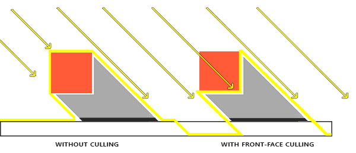

为了修复peter游移，我们要进行正面剔除，先必须开启GL_CULL_FACE：

```c++
glCullFace(GL_FRONT);
RenderSceneToDepthMap();
glCullFace(GL_BACK); // 不要忘记设回原先的culling face
```

这十分有效地解决了peter panning的问题，但只对内部不会对外开口的实体物体有效。我们的场景中，在立方体上工作的很好，但在地板上无效，因为正面剔除完全移除了地板。地面是一个单独的平面，不会被完全剔除。如果有人打算使用这个技巧解决peter panning必须考虑到只有剔除物体的正面才有意义。

另一个要考虑到的地方是接近阴影的物体仍然会出现不正确的效果。必须考虑到何时使用正面剔除对物体才有意义。不过使用普通的偏移值通常就能避免peter panning。

### 采样过多

无论你喜不喜欢还有一个视觉差异，就是光的视锥不可见的区域一律被认为是处于阴影中，不管它真的处于阴影之中。出现这个状况是因为超出光的视锥的投影坐标比1.0大，这样采样的深度纹理就会超出他默认的0到1的范围。根据纹理环绕方式，我们将会得到不正确的深度结果，它不是基于真实的来自光源的深度值。

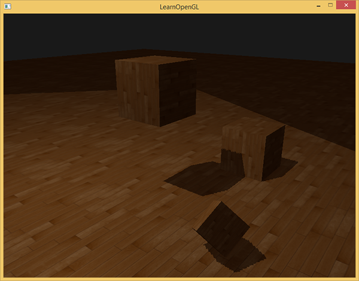

你可以在图中看到，光照有一个区域，超出该区域就成为了阴影；这个区域实际上代表着深度贴图的大小，这个贴图投影到了地板上。发生这种情况的原因是我们之前将深度贴图的环绕方式设置成了GL_REPEAT。

我们宁可让所有超出深度贴图的坐标的深度范围是1.0，这样超出的坐标将永远不在阴影之中。我们可以储存一个边框颜色，然后把深度贴图的纹理环绕选项设置为GL_CLAMP_TO_BORDER：

```c++
glTexParameteri(GL_TEXTURE_2D, GL_TEXTURE_WRAP_S, GL_CLAMP_TO_BORDER);
glTexParameteri(GL_TEXTURE_2D, GL_TEXTURE_WRAP_T, GL_CLAMP_TO_BORDER);
GLfloat borderColor[] = { 1.0, 1.0, 1.0, 1.0 };
glTexParameterfv(GL_TEXTURE_2D, GL_TEXTURE_BORDER_COLOR, borderColor);
```

现在如果我们采样深度贴图0到1坐标范围以外的区域，纹理函数总会返回一个1.0的深度值，阴影值为0.0。结果看起来会更真实：

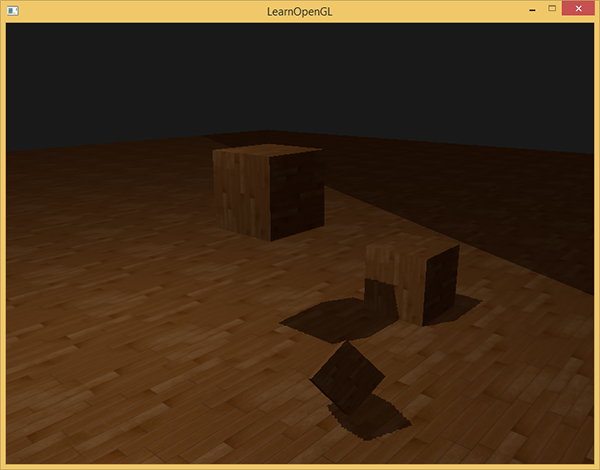

仍有一部分是黑暗区域。那里的坐标超出了光的正交视锥的远平面。你可以看到这片黑色区域总是出现在光源视锥的极远处。

当一个点比光的远平面还要远时，它的投影坐标的z坐标大于1.0。这种情况下，GL_CLAMP_TO_BORDER环绕方式不起作用，因为我们把坐标的z元素和深度贴图的值进行了对比；它总是为大于1.0的z返回true。

解决这个问题也很简单，只要投影向量的z坐标大于1.0，我们就把shadow的值强制设为0.0：

```c++
float ShadowCalculation(vec4 fragPosLightSpace)
{
    [...]
    if(projCoords.z > 1.0)
        shadow = 0.0;
    
    return shadow;
}
```

检查远平面，并将深度贴图限制为一个手工指定的边界颜色，就能解决深度贴图采样超出的问题，我们最终会得到下面我们所追求的效果：

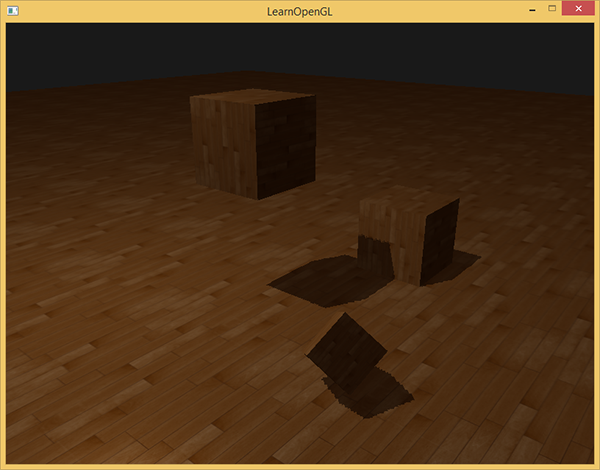

这些结果意味着，只有在深度贴图范围以内的被投影的fragment坐标才有阴影，所以任何超出范围的都将会没有阴影。由于在游戏中通常这只发生在远处，就会比我们之前的那个明显的黑色区域效果更真实。

## PCF

阴影现在已经附着到场景中了，不过这仍不是我们想要的。如果你放大看阴影，阴影映射对分辨率的依赖很快变得很明显。

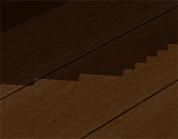

因为深度贴图有一个固定的分辨率，多个片段对应于一个纹理像素。结果就是多个片段会从深度贴图的同一个深度值进行采样，这几个片段便得到的是同一个阴影，这就会产生锯齿边。

你可以通过增加深度贴图的分辨率的方式来降低锯齿块，也可以尝试尽可能的让光的视锥接近场景。

另一个（并不完整的）解决方案叫做PCF（percentage-closer filtering），这是一种多个不同过滤方式的组合，它产生柔和阴影，使它们出现更少的锯齿块和硬边。核心思想是从深度贴图中多次采样，每一次采样的纹理坐标都稍有不同。每个独立的样本可能在也可能不再阴影中。所有的次生结果接着结合在一起，进行平均化，我们就得到了柔和阴影。

一个简单的PCF的实现是简单的从纹理像素四周对深度贴图采样，然后把结果平均起来：

```c++
float shadow = 0.0;
vec2 texelSize = 1.0 / textureSize(shadowMap, 0);
for(int x = -1; x <= 1; ++x)
{
    for(int y = -1; y <= 1; ++y)
    {
        float pcfDepth = texture(shadowMap, projCoords.xy + vec2(x, y) * texelSize).r; 
        shadow += currentDepth - bias > pcfDepth ? 1.0 : 0.0;        
    }    
}
shadow /= 9.0;
```

这个textureSize返回一个给定采样器纹理的0级mipmap的vec2类型的宽和高。用1除以它返回一个单独纹理像素的大小，我们用以对纹理坐标进行偏移，确保每个新样本，来自不同的深度值。这里我们采样得到9个值，它们在投影坐标的x和y值的周围，为阴影阻挡进行测试，并最终通过样本的总数目将结果平均化。

使用更多的样本，更改texelSize变量，你就可以增加阴影的柔和程度。下面你可以看到应用了PCF的阴影：

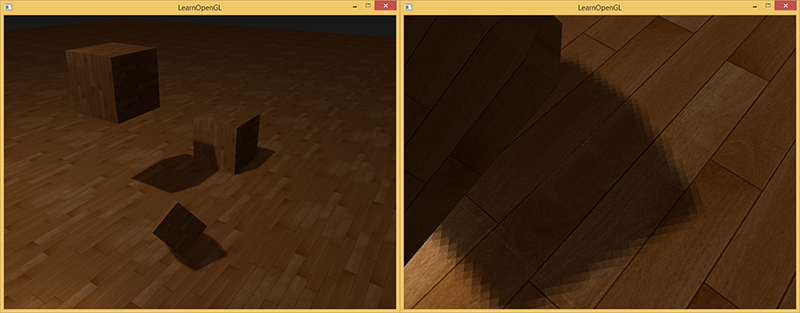

从稍微远一点的距离看去，阴影效果好多了，也不那么生硬了。如果你放大，仍会看到阴影贴图分辨率的不真实感，但通常对于大多数应用来说效果已经很好了。

你可以从[这里](http://learnopengl.com/code_viewer.php?code=advanced-lighting/shadow_mapping)找到这个例子的全部源码和第二个阶段的[顶点](http://learnopengl.com/code_viewer.php?code=advanced-lighting/shadow_mapping&type=vertex)和[片段](http://learnopengl.com/code_viewer.php?code=advanced-lighting/shadow_mapping&type=fragment)着色器。

实际上PCF还有更多的内容，以及很多技术要点需要考虑以提升柔和阴影的效果，但处于本章内容长度考虑，我们将留在以后讨论。

 
### 正交 vs 投影

在渲染深度贴图的时候，正交(Orthographic)和投影(Projection)矩阵之间有所不同。正交投影矩阵并不会将场景用透视图进行变形，所有视线/光线都是平行的，这使它对于定向光来说是个很好的投影矩阵。然而透视投影矩阵，会将所有顶点根据透视关系进行变形，结果因此而不同。下图展示了两种投影方式所产生的不同阴影区域：

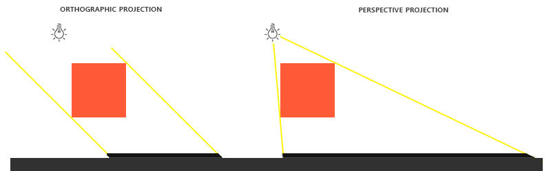

透视投影对于光源来说更合理，不像定向光，它是有自己的位置的。透视投影因此更经常用在点光源和聚光灯上，而正交投影经常用在定向光上。

另一个细微差别是，透视投影矩阵，将深度缓冲视觉化经常会得到一个几乎全白的结果。发生这个是因为透视投影下，深度变成了非线性的深度值，它的大多数可辨范围都位于近平面附近。为了可以像使用正交投影一样合适地观察深度值，你必须先将非线性深度值转变为线性的，如我们在深度测试教程中已经讨论过的那样。

```c++
#version 330 core
out vec4 color;
in vec2 TexCoords;
 
uniform sampler2D depthMap;
uniform float near_plane;
uniform float far_plane;
 
float LinearizeDepth(float depth)
{
    float z = depth * 2.0 - 1.0; // Back to NDC 
    return (2.0 * near_plane * far_plane) / (far_plane + near_plane - z * (far_plane - near_plane));
}
 
void main()
{             
    float depthValue = texture(depthMap, TexCoords).r;
    color = vec4(vec3(LinearizeDepth(depthValue) / far_plane), 1.0); // perspective
    // color = vec4(vec3(depthValue), 1.0); // orthographic
}
```

这个深度值与我们见到的用正交投影的很相似。需要注意的是，这个只适用于调试；正交或投影矩阵的深度检查仍然保持原样，因为相关的深度并没有改变。

## 附加资源

- [Tutorial 16 : Shadow mapping](http://www.opengl-tutorial.org/intermediate-tutorials/tutorial-16-shadow-mapping/)：提供的类似的阴影映射教程，里面有一些额外的解释。
- [Shadow Mapping – Part 1：ogldev](http://ogldev.atspace.co.uk/www/tutorial23/tutorial23.html)：提供的另一个阴影映射教程。
- [How Shadow Mapping Works](https://www.youtube.com/watch?v=EsccgeUpdsM)：的一个第三方YouTube视频教程，里面解释了阴影映射及其实现。
- [Common Techniques to Improve Shadow Depth Maps](https://msdn.microsoft.com/en-us/library/windows/desktop/ee416324%28v=vs.85%29.aspx)：微软的一篇好文章，其中理出了很多提升阴影贴图质量的技术。
