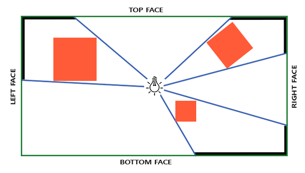
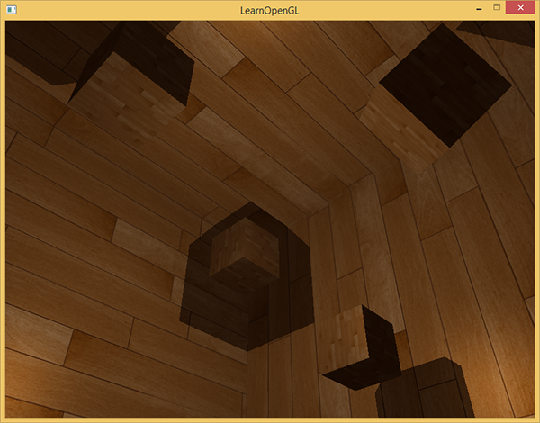
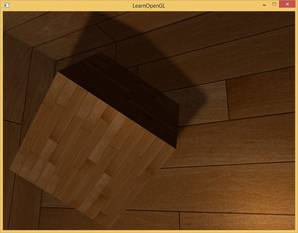
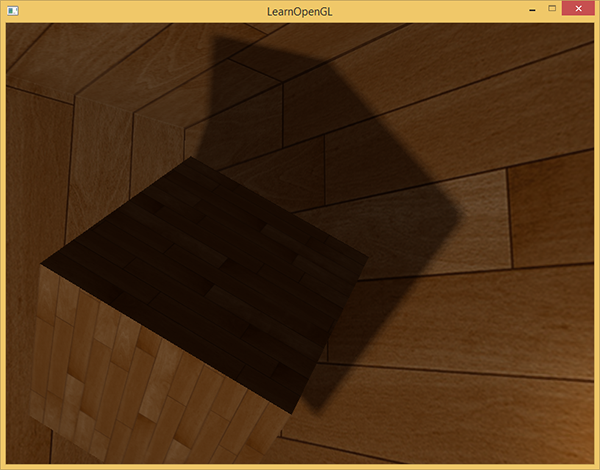

# 点光源阴影

原文     | [Point Shadows](http://learnopengl.com/#!Advanced-Lighting/Shadows/Point-Shadows)
      ---|---
作者     | JoeyDeVries
翻译     | [Django](http://bullteacher.com/)
校对     | 暂无

!!! note

	本节暂未进行完全的重写，错误可能会很多。如果可能的话，请对照原文进行阅读。如果有报告本节的错误，将会延迟至重写之后进行处理。

上个教程我们学到了如何使用阴影映射技术创建动态阴影。效果不错，但它只适合定向光，因为阴影只是在单一定向光源下生成的。所以它也叫定向阴影映射，深度（阴影）贴图生成自定向光的视角。

!!! Important

    本节我们的焦点是在各种方向生成动态阴影。这个技术可以适用于点光源，生成所有方向上的阴影。

这个技术叫做点光阴影，过去的名字是万向阴影贴图（omnidirectional shadow maps）技术。

本节代码基于前面的阴影映射教程，所以如果你对传统阴影映射不熟悉，还是建议先读一读阴影映射教程。
算法和定向阴影映射差不多：我们从光的透视图生成一个深度贴图，基于当前fragment位置来对深度贴图采样，然后用储存的深度值和每个fragment进行对比，看看它是否在阴影中。定向阴影映射和万向阴影映射的主要不同在于深度贴图的使用上。

对于深度贴图，我们需要从一个点光源的所有渲染场景，普通2D深度贴图不能工作；如果我们使用立方体贴图会怎样？因为立方体贴图可以储存6个面的环境数据，它可以将整个场景渲染到立方体贴图的每个面上，把它们当作点光源四周的深度值来采样。



生成后的深度立方体贴图被传递到光照像素着色器，它会用一个方向向量来采样立方体贴图，从而得到当前的fragment的深度（从光的透视图）。大部分复杂的事情已经在阴影映射教程中讨论过了。算法只是在深度立方体贴图生成上稍微复杂一点。

## 生成深度立方体贴图

为创建一个光周围的深度值的立方体贴图，我们必须渲染场景6次：每次一个面。显然渲染场景6次需要6个不同的视图矩阵，每次把一个不同的立方体贴图面附加到帧缓冲对象上。这看起来是这样的：

```c++
for(int i = 0; i < 6; i++)
{
    GLuint face = GL_TEXTURE_CUBE_MAP_POSITIVE_X + i;
    glFramebufferTexture2D(GL_FRAMEBUFFER, GL_DEPTH_ATTACHMENT, face, depthCubemap, 0);
    BindViewMatrix(lightViewMatrices[i]);
    RenderScene();  
}
```

这会很耗费性能因为一个深度贴图下需要进行很多渲染调用。这个教程中我们将转而使用另外的一个小技巧来做这件事，几何着色器允许我们使用一次渲染过程来建立深度立方体贴图。

首先，我们需要创建一个立方体贴图：

```c++
GLuint depthCubemap;
glGenTextures(1, &depthCubemap);
```

然后生成立方体贴图的每个面，将它们作为2D深度值纹理图像：

```c++
const GLuint SHADOW_WIDTH = 1024, SHADOW_HEIGHT = 1024;
glBindTexture(GL_TEXTURE_CUBE_MAP, depthCubemap);
for (GLuint i = 0; i < 6; ++i)
        glTexImage2D(GL_TEXTURE_CUBE_MAP_POSITIVE_X + i, 0, GL_DEPTH_COMPONENT, 
                     SHADOW_WIDTH, SHADOW_HEIGHT, 0, GL_DEPTH_COMPONENT, GL_FLOAT, NULL);
```

不要忘记设置合适的纹理参数：

```c++
glTexParameteri(GL_TEXTURE_CUBE_MAP, GL_TEXTURE_MAG_FILTER, GL_NEAREST);
glTexParameteri(GL_TEXTURE_CUBE_MAP, GL_TEXTURE_MIN_FILTER, GL_NEAREST);
glTexParameteri(GL_TEXTURE_CUBE_MAP, GL_TEXTURE_WRAP_S, GL_CLAMP_TO_EDGE);
glTexParameteri(GL_TEXTURE_CUBE_MAP, GL_TEXTURE_WRAP_T, GL_CLAMP_TO_EDGE);
glTexParameteri(GL_TEXTURE_CUBE_MAP, GL_TEXTURE_WRAP_R, GL_CLAMP_TO_EDGE);
```

正常情况下，我们把立方体贴图纹理的一个面附加到帧缓冲对象上，渲染场景6次，每次将帧缓冲的深度缓冲目标改成不同立方体贴图面。由于我们将使用一个几何着色器，它允许我们把所有面在一个过程渲染，我们可以使用glFramebufferTexture直接把立方体贴图附加成帧缓冲的深度附件：

```c++
glBindFramebuffer(GL_FRAMEBUFFER, depthMapFBO);
glFramebufferTexture(GL_FRAMEBUFFER, GL_DEPTH_ATTACHMENT, depthCubemap, 0);
glDrawBuffer(GL_NONE);
glReadBuffer(GL_NONE);
glBindFramebuffer(GL_FRAMEBUFFER, 0);
```

还要记得调用glDrawBuffer和glReadBuffer：当生成一个深度立方体贴图时我们只关心深度值，所以我们必须显式告诉OpenGL这个帧缓冲对象不会渲染到一个颜色缓冲里。

万向阴影贴图有两个渲染阶段：首先我们生成深度贴图，然后我们正常使用深度贴图渲染，在场景中创建阴影。帧缓冲对象和立方体贴图的处理看起是这样的：

```c++
// 1. first render to depth cubemap
glViewport(0, 0, SHADOW_WIDTH, SHADOW_HEIGHT);
glBindFramebuffer(GL_FRAMEBUFFER, depthMapFBO);
glClear(GL_DEPTH_BUFFER_BIT);
ConfigureShaderAndMatrices();
RenderScene();
glBindFramebuffer(GL_FRAMEBUFFER, 0);
// 2. then render scene as normal with shadow mapping (using depth cubemap)
glViewport(0, 0, SCR_WIDTH, SCR_HEIGHT);
glClear(GL_COLOR_BUFFER_BIT | GL_DEPTH_BUFFER_BIT);
ConfigureShaderAndMatrices();
glBindTexture(GL_TEXTURE_CUBE_MAP, depthCubemap);
RenderScene();
```

这个过程和默认的阴影映射一样，尽管这次我们渲染和使用的是一个立方体贴图深度纹理，而不是2D深度纹理。在我们实际开始从光的视角的所有方向渲染场景之前，我们先得计算出合适的变换矩阵。

### 光空间的变换

设置了帧缓冲和立方体贴图，我们需要一些方法来讲场景的所有几何体变换到6个光的方向中相应的光空间。与阴影映射教程类似，我们将需要一个光空间的变换矩阵T，但是这次是每个面都有一个。

每个光空间的变换矩阵包含了投影和视图矩阵。对于投影矩阵来说，我们将使用一个透视投影矩阵；光源代表一个空间中的点，所以透视投影矩阵更有意义。每个光空间变换矩阵使用同样的投影矩阵：

```c++
GLfloat aspect = (GLfloat)SHADOW_WIDTH/(GLfloat)SHADOW_HEIGHT;
GLfloat near = 1.0f;
GLfloat far = 25.0f;
glm::mat4 shadowProj = glm::perspective(glm::radians(90.0f), aspect, near, far);
```

非常重要的一点是，这里glm::perspective的视野参数，设置为90度。90度我们才能保证视野足够大到可以合适地填满立方体贴图的一个面，立方体贴图的所有面都能与其他面在边缘对齐。

因为投影矩阵在每个方向上并不会改变，我们可以在6个变换矩阵中重复使用。我们要为每个方向提供一个不同的视图矩阵。用glm::lookAt创建6个观察方向，每个都按顺序注视着立方体贴图的的一个方向：右、左、上、下、近、远：

```c++
std::vector<glm::mat4> shadowTransforms;
shadowTransforms.push_back(shadowProj * 
                 glm::lookAt(lightPos, lightPos + glm::vec3(1.0,0.0,0.0), glm::vec3(0.0,-1.0,0.0));
shadowTransforms.push_back(shadowProj * 
                 glm::lookAt(lightPos, lightPos + glm::vec3(-1.0,0.0,0.0), glm::vec3(0.0,-1.0,0.0));
shadowTransforms.push_back(shadowProj * 
                 glm::lookAt(lightPos, lightPos + glm::vec3(0.0,1.0,0.0), glm::vec3(0.0,0.0,1.0));
shadowTransforms.push_back(shadowProj * 
                 glm::lookAt(lightPos, lightPos + glm::vec3(0.0,-1.0,0.0), glm::vec3(0.0,0.0,-1.0));
shadowTransforms.push_back(shadowProj * 
                 glm::lookAt(lightPos, lightPos + glm::vec3(0.0,0.0,1.0), glm::vec3(0.0,-1.0,0.0));
shadowTransforms.push_back(shadowProj * 
                 glm::lookAt(lightPos, lightPos + glm::vec3(0.0,0.0,-1.0), glm::vec3(0.0,-1.0,0.0));
```

这里我们创建了6个视图矩阵，把它们乘以投影矩阵，来得到6个不同的光空间变换矩阵。glm::lookAt的target参数是它注视的立方体贴图的面的一个方向。

这些变换矩阵发送到着色器渲染到立方体贴图里。

### 深度着色器

为了把值渲染到深度立方体贴图，我们将需要3个着色器：顶点和像素着色器，以及一个它们之间的几何着色器。

几何着色器是负责将所有世界空间的顶点变换到6个不同的光空间的着色器。因此顶点着色器简单地将顶点变换到世界空间，然后直接发送到几何着色器：

```c++
#version 330 core
layout (location = 0) in vec3 position;
 
uniform mat4 model;
 
void main()
{
    gl_Position = model * vec4(position, 1.0);
}
```

紧接着几何着色器以3个三角形的顶点作为输入，它还有一个光空间变换矩阵的uniform数组。几何着色器接下来会负责将顶点变换到光空间；这里它开始变得有趣了。

几何着色器有一个内建变量叫做gl_Layer，它指定发散出基本图形送到立方体贴图的哪个面。当不管它时，几何着色器就会像往常一样把它的基本图形发送到输送管道的下一阶段，但当我们更新这个变量就能控制每个基本图形将渲染到立方体贴图的哪一个面。当然这只有当我们有了一个附加到激活的帧缓冲的立方体贴图纹理才有效：

```c++
#version 330 core
layout (triangles) in;
layout (triangle_strip, max_vertices=18) out;
 
uniform mat4 shadowMatrices[6];
 
out vec4 FragPos; // FragPos from GS (output per emitvertex)
 
void main()
{
    for(int face = 0; face < 6; ++face)
    {
        gl_Layer = face; // built-in variable that specifies to which face we render.
        for(int i = 0; i < 3; ++i) // for each triangle's vertices
        {
            FragPos = gl_in[i].gl_Position;
            gl_Position = shadowMatrices[face] * FragPos;
            EmitVertex();
        }    
        EndPrimitive();
    }
}
```

几何着色器相对简单。我们输入一个三角形，输出总共6个三角形（6*3顶点，所以总共18个顶点）。在main函数中，我们遍历立方体贴图的6个面，我们每个面指定为一个输出面，把这个面的interger（整数）存到gl_Layer。然后，我们通过把面的光空间变换矩阵乘以FragPos，将每个世界空间顶点变换到相关的光空间，生成每个三角形。注意，我们还要将最后的FragPos变量发送给像素着色器，我们需要计算一个深度值。

上个教程，我们使用的是一个空的像素着色器，让OpenGL配置深度贴图的深度值。这次我们将计算自己的深度，这个深度就是每个fragment位置和光源位置之间的线性距离。计算自己的深度值使得之后的阴影计算更加直观。

```c++
#version 330 core
in vec4 FragPos;

uniform vec3 lightPos;
uniform float far_plane;

void main()
{
    // get distance between fragment and light source
    float lightDistance = length(FragPos.xyz - lightPos);
    
    // map to [0;1] range by dividing by far_plane
    lightDistance = lightDistance / far_plane;
    
    // write this as modified depth
    gl_FragDepth = lightDistance;
}
``` 

像素着色器将来自几何着色器的FragPos、光的位置向量和视锥的远平面值作为输入。这里我们把fragment和光源之间的距离，映射到0到1的范围，把它写入为fragment的深度值。

使用这些着色器渲染场景，立方体贴图附加的帧缓冲对象激活以后，你会得到一个完全填充的深度立方体贴图，以便于进行第二阶段的阴影计算。

## 万向阴影贴图

所有事情都做好了，是时候来渲染万向阴影(Omnidirectional Shadow)了。这个过程和定向阴影映射教程相似，尽管这次我们绑定的深度贴图是一个立方体贴图，而不是2D纹理，并且将光的投影的远平面发送给了着色器。

```c++
glViewport(0, 0, SCR_WIDTH, SCR_HEIGHT);
glClear(GL_COLOR_BUFFER_BIT | GL_DEPTH_BUFFER_BIT);
shader.Use();  
// ... send uniforms to shader (including light's far_plane value)
glActiveTexture(GL_TEXTURE0);
glBindTexture(GL_TEXTURE_CUBE_MAP, depthCubemap);
// ... bind other textures
RenderScene();
``` 

这里的renderScene函数在一个大立方体房间中渲染一些立方体，它们散落在大立方体各处，光源在场景中央。

顶点着色器和像素着色器和原来的阴影映射着色器大部分都一样：不同之处是在光空间中像素着色器不再需要一个fragment位置，现在我们可以使用一个方向向量采样深度值。

因为这个顶点着色器不再需要将他的位置向量变换到光空间，所以我们可以去掉FragPosLightSpace变量：

```c++
#version 330 core
layout (location = 0) in vec3 position;
layout (location = 1) in vec3 normal;
layout (location = 2) in vec2 texCoords;
 
out vec2 TexCoords;
 
out VS_OUT {
    vec3 FragPos;
    vec3 Normal;
    vec2 TexCoords;
} vs_out;
 
uniform mat4 projection;
uniform mat4 view;
uniform mat4 model;
 
void main()
{
    gl_Position = projection * view * model * vec4(position, 1.0f);
    vs_out.FragPos = vec3(model * vec4(position, 1.0));
    vs_out.Normal = transpose(inverse(mat3(model))) * normal;
    vs_out.TexCoords = texCoords;
}
```

片段着色器的Blinn-Phong光照代码和我们之前阴影相乘的结尾部分一样：

```c++
#version 330 core
out vec4 FragColor;
 
in VS_OUT {
    vec3 FragPos;
    vec3 Normal;
    vec2 TexCoords;
} fs_in;
 
uniform sampler2D diffuseTexture;
uniform samplerCube depthMap;
 
uniform vec3 lightPos;
uniform vec3 viewPos;
 
uniform float far_plane;
 
float ShadowCalculation(vec3 fragPos)
{
    [...]
}
 
void main()
{           
    vec3 color = texture(diffuseTexture, fs_in.TexCoords).rgb;
    vec3 normal = normalize(fs_in.Normal);
    vec3 lightColor = vec3(0.3);
    // Ambient
    vec3 ambient = 0.3 * color;
    // Diffuse
    vec3 lightDir = normalize(lightPos - fs_in.FragPos);
    float diff = max(dot(lightDir, normal), 0.0);
    vec3 diffuse = diff * lightColor;
    // Specular
    vec3 viewDir = normalize(viewPos - fs_in.FragPos);
    vec3 reflectDir = reflect(-lightDir, normal);
    float spec = 0.0;
    vec3 halfwayDir = normalize(lightDir + viewDir);  
    spec = pow(max(dot(normal, halfwayDir), 0.0), 64.0);
    vec3 specular = spec * lightColor;    
    // Calculate shadow
    float shadow = ShadowCalculation(fs_in.FragPos);                      
    vec3 lighting = (ambient + (1.0 - shadow) * (diffuse + specular)) * color;    
    
    FragColor = vec4(lighting, 1.0f);
}
```

有一些细微的不同：光照代码一样，但我们现在有了一个uniform变量samplerCube，shadowCalculation函数用fragment的位置作为它的参数，取代了光空间的fragment位置。我们现在还要引入光的视锥的远平面值，后面我们会需要它。像素着色器的最后，我们计算出阴影元素，当fragment在阴影中时它是1.0，不在阴影中时是0.0。我们使用计算出来的阴影元素去影响光照的diffuse和specular元素。

在ShadowCalculation函数中有很多不同之处，现在是从立方体贴图中进行采样，不再使用2D纹理了。我们来一步一步的讨论一下的它的内容。

我们需要做的第一件事是获取立方体贴图的深度。你可能已经从教程的立方体贴图部分想到，我们已经将深度储存为fragment和光位置之间的距离了；我们这里采用相似的处理方式：

```c++
float ShadowCalculation(vec3 fragPos)
{
    vec3 fragToLight = fragPos - lightPos; 
    float closestDepth = texture(depthMap, fragToLight).r;
}
```

在这里，我们得到了fragment的位置与光的位置之间的不同的向量，使用这个向量作为一个方向向量去对立方体贴图进行采样。方向向量不需要是单位向量，所以无需对它进行标准化。最后的closestDepth是光源和它最接近的可见fragment之间的标准化的深度值。

closestDepth值现在在0到1的范围内了，所以我们先将其转换回0到far_plane的范围，这需要把他乘以far_plane：

```c++
closestDepth *= far_plane;
```

下一步我们获取当前fragment和光源之间的深度值，我们可以简单的使用fragToLight的长度来获取它，这取决于我们如何计算立方体贴图中的深度值：

```c++
float currentDepth = length(fragToLight);
```

返回的是和closestDepth范围相同的深度值。

现在我们可以将两个深度值对比一下，看看哪一个更接近，以此决定当前的fragment是否在阴影当中。我们还要包含一个阴影偏移，所以才能避免阴影失真，这在前面教程中已经讨论过了。

```c++
float bias = 0.05; 
float shadow = currentDepth -  bias > closestDepth ? 1.0 : 0.0;
```

完整的ShadowCalculation现在变成了这样：

```c++
float ShadowCalculation(vec3 fragPos)
{
    // Get vector between fragment position and light position
    vec3 fragToLight = fragPos - lightPos;
    // Use the light to fragment vector to sample from the depth map    
    float closestDepth = texture(depthMap, fragToLight).r;
    // It is currently in linear range between [0,1]. Re-transform back to original value
    closestDepth *= far_plane;
    // Now get current linear depth as the length between the fragment and light position
    float currentDepth = length(fragToLight);
    // Now test for shadows
    float bias = 0.05; 
    float shadow = currentDepth -  bias > closestDepth ? 1.0 : 0.0;
 
    return shadow;
}
```

有了这些着色器，我们已经能得到非常好的阴影效果了，这次从一个点光源所有周围方向上都有阴影。有一个位于场景中心的点光源，看起来会像这样：



你可以从这里找到这个[demo的源码](http://www.learnopengl.com/code_viewer.php?code=advanced-lighting/point_shadows)、[顶点](http://www.learnopengl.com/code_viewer.php?code=advanced-lighting/point_shadows&type=vertex)和[片段](http://www.learnopengl.com/code_viewer.php?code=advanced-lighting/point_shadows&type=fragment)着色器。

### 显示立方体贴图深度缓冲

如果你想我一样第一次并没有做对，那么就要进行调试排错，将深度贴图显示出来以检查其是否正确。因为我们不再用2D深度贴图纹理，深度贴图的显示不会那么显而易见。

一个简单的把深度缓冲显示出来的技巧是，在ShadowCalculation函数中计算标准化的closestDepth变量，把变量显示为：

```c++
FragColor = vec4(vec3(closestDepth / far_plane), 1.0);
```

结果是一个灰度场景，每个颜色代表着场景的线性深度值：


你可能也注意到了带阴影部分在墙外。如果看起来和这个差不多，你就知道深度立方体贴图生成的没错。否则你可能做错了什么，也许是closestDepth仍然还在0到far_plane的范围。

## PCF

由于万向阴影贴图基于传统阴影映射的原则，它便也继承了由解析度产生的非真实感。如果你放大就会看到锯齿边了。PCF或称Percentage-closer filtering允许我们通过对fragment位置周围过滤多个样本，并对结果平均化。

如果我们用和前面教程同样的那个简单的PCF过滤器，并加入第三个维度，就是这样的：

```c+++
float shadow = 0.0;
float bias = 0.05; 
float samples = 4.0;
float offset = 0.1;
for(float x = -offset; x < offset; x += offset / (samples * 0.5))
{
    for(float y = -offset; y < offset; y += offset / (samples * 0.5))
    {
        for(float z = -offset; z < offset; z += offset / (samples * 0.5))
        {
            float closestDepth = texture(depthMap, fragToLight + vec3(x, y, z)).r; 
            closestDepth *= far_plane;   // Undo mapping [0;1]
            if(currentDepth - bias > closestDepth)
                shadow += 1.0;
        }
    }
}
shadow /= (samples * samples * samples);
```

这段代码和我们传统的阴影映射没有多少不同。这里我们根据样本的数量动态计算了纹理偏移量，我们在三个轴向采样三次，最后对子样本进行平均化。

现在阴影看起来更加柔和平滑了，由此得到更加真实的效果：



然而，samples设置为4.0，每个fragment我们会得到总共64个样本，这太多了！

大多数这些采样都是多余的，与其在原始方向向量附近处采样，不如在采样方向向量的垂直方向进行采样更有意义。可是，没有（简单的）方式能够指出哪一个子方向是多余的，这就难了。有个技巧可以使用，用一个偏移量方向数组，它们差不多都是分开的，每一个指向完全不同的方向，剔除彼此接近的那些子方向。下面就是一个有着20个偏移方向的数组：

```c++
vec3 sampleOffsetDirections[20] = vec3[]
(
   vec3( 1,  1,  1), vec3( 1, -1,  1), vec3(-1, -1,  1), vec3(-1,  1,  1), 
   vec3( 1,  1, -1), vec3( 1, -1, -1), vec3(-1, -1, -1), vec3(-1,  1, -1),
   vec3( 1,  1,  0), vec3( 1, -1,  0), vec3(-1, -1,  0), vec3(-1,  1,  0),
   vec3( 1,  0,  1), vec3(-1,  0,  1), vec3( 1,  0, -1), vec3(-1,  0, -1),
   vec3( 0,  1,  1), vec3( 0, -1,  1), vec3( 0, -1, -1), vec3( 0,  1, -1)
);
```

然后我们把PCF算法与从sampleOffsetDirections得到的样本数量进行适配，使用它们从立方体贴图里采样。这么做的好处是与之前的PCF算法相比，我们需要的样本数量变少了。

```c++
float shadow = 0.0;
float bias = 0.15;
int samples = 20;
float viewDistance = length(viewPos - fragPos);
float diskRadius = 0.05;
for(int i = 0; i < samples; ++i)
{
    float closestDepth = texture(depthMap, fragToLight + sampleOffsetDirections[i] * diskRadius).r;
    closestDepth *= far_plane;   // Undo mapping [0;1]
    if(currentDepth - bias > closestDepth)
        shadow += 1.0;
}
shadow /= float(samples);
```

这里我们把一个偏移量添加到指定的diskRadius中，它在fragToLight方向向量周围从立方体贴图里采样。

另一个在这里可以应用的有意思的技巧是，我们可以基于观察者里一个fragment的距离来改变diskRadius；这样我们就能根据观察者的距离来增加偏移半径了，当距离更远的时候阴影更柔和，更近了就更锐利。

```c++
float diskRadius = (1.0 + (viewDistance / far_plane)) / 25.0;
```

PCF算法的结果如果没有变得更好，也是非常不错的，这是柔和的阴影效果：



当然了，我们添加到每个样本的bias（偏移）高度依赖于上下文，总是要根据场景进行微调的。试试这些值，看看怎样影响了场景。
这里是最终版本的顶点和像素着色器。

我还要提醒一下使用几何着色器来生成深度贴图不会一定比每个面渲染场景6次更快。使用几何着色器有它自己的性能局限，在第一个阶段使用它可能获得更好的性能表现。这取决于环境的类型，以及特定的显卡驱动等等，所以如果你很关心性能，就要确保对两种方法有大致了解，然后选择对你场景来说更高效的那个。我个人还是喜欢使用几何着色器来进行阴影映射，原因很简单，因为它们使用起来更简单。

## 附加资源

- [Shadow Mapping for point light sources in OpenGL](http://www.sunandblackcat.com/tipFullView.php?l=eng&topicid=36)：sunandblackcat的万向阴影映射教程。
- [Multipass Shadow Mapping With Point Lights](http://ogldev.atspace.co.uk/www/tutorial43/tutorial43.html)：ogldev的万向阴影映射教程。
- [Omni-directional Shadows](http://www.cg.tuwien.ac.at/~husky/RTR/OmnidirShadows-whyCaps.pdf)：Peter Houska的关于万向阴影映射的一组很好的ppt。
