# 法线贴图

原文     | [Normal Mapping](http://learnopengl.com/#!Advanced-Lighting/Normal-Mapping)
      ---|---
作者     | JoeyDeVries
翻译     | [Django](http://bullteacher.com/)
校对     | [KenLee](https://hellokenlee.github.io/)

!!! note

	本节暂未进行完全的重写，错误可能会很多。如果可能的话，请对照原文进行阅读。如果有报告本节的错误，将会延迟至重写之后进行处理。

我们的场景中已经充满了多边形物体，其中每个都可能由成百上千平坦的三角形组成。我们以向三角形上附加纹理的方式来增加额外细节，提升真实感，隐藏多边形几何体是由无数三角形组成的事实。纹理确有助益，然而当你近看它们时，这个事实便隐藏不住了。现实中的物体表面并非是平坦的，而是表现出无数（凹凸不平的）细节。

例如，砖块的表面。砖块的表面非常粗糙，显然不是完全平坦的：它包含着接缝处水泥凹痕，以及非常多的细小的空洞。如果我们在一个有光的场景中看这样一个砖块的表面，问题就出来了。下图中我们可以看到砖块纹理应用到了平坦的表面，并被一个点光源照亮。

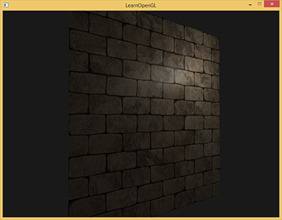

光照并没有呈现出任何裂痕和孔洞，完全忽略了砖块之间凹进去的线条；表面看起来完全就是平的。我们可以使用specular贴图根据深度或其他细节阻止部分表面被照的更亮，以此部分地解决问题，但这并不是一个好方案。我们需要的是某种可以告知光照系统给所有有关物体表面类似深度这样的细节的方式。

如果我们以光的视角来看这个问题：是什么使表面被视为完全平坦的表面来照亮？答案会是表面的法线向量。以光照算法的视角考虑的话，只有一件事决定物体的形状，这就是垂直于它的法线向量。砖块表面只有一个法线向量，表面完全根据这个法线向量被以一致的方式照亮。如果每个fragment都是用自己的不同的法线会怎样？这样我们就可以根据表面细微的细节对法线向量进行改变；这样就会获得一种表面看起来要复杂得多的幻觉：


每个fragment使用了自己的法线，我们就可以让光照相信一个表面由很多微小的（垂直于法线向量的）平面所组成，物体表面的细节将会得到极大提升。这种每个fragment使用各自的法线，替代一个面上所有fragment使用同一个法线的技术叫做法线贴图（normal mapping）或凹凸贴图（bump mapping）。应用到砖墙上，效果像这样：

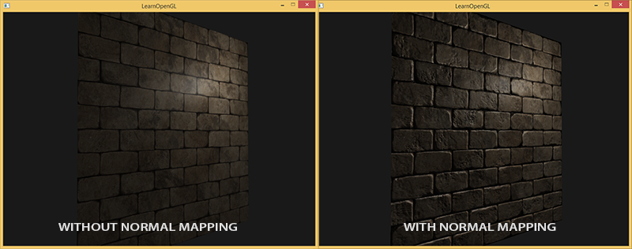

你可以看到细节获得了极大提升，开销却不大。因为我们只需要改变每个fragment的法线向量，并不需要改变所有光照公式。现在我们是为每个fragment传递一个法线，不再使用插值表面法线。这样光照使表面拥有了自己的细节。

## 法线贴图

为使法线贴图工作，我们需要为每个fragment提供一个法线。像diffuse贴图和specular贴图一样，我们可以使用一个2D纹理来储存法线数据。2D纹理不仅可以储存颜色和光照数据，还可以储存法线向量。这样我们可以从2D纹理中采样得到特定纹理的法线向量。

由于法线向量是个几何工具，而纹理通常只用于储存颜色信息，用纹理储存法线向量不是非常直接。如果你想一想，就会知道纹理中的颜色向量用r、g、b元素代表一个3D向量。类似的我们也可以将法线向量的x、y、z元素储存到纹理中，代替颜色的r、g、b元素。法线向量的范围在-1到1之间，所以我们先要将其映射到0到1的范围：


```c++
vec3 rgb_normal = normal * 0.5 + 0.5; // 从 [-1,1] 转换至 [0,1]
```

将法线向量变换为像这样的RGB颜色元素，我们就能把根据表面的形状的fragment的法线保存在2D纹理中。教程开头展示的那个砖块的例子的法线贴图如下所示：


这会是一种偏蓝色调的纹理（你在网上找到的几乎所有法线贴图都是这样的）。这是因为所有法线的指向都偏向z轴（0, 0, 1）这是一种偏蓝的颜色。法线向量从z轴方向也向其他方向轻微偏移，颜色也就发生了轻微变化，这样看起来便有了一种深度。例如，你可以看到在每个砖块的顶部，颜色倾向于偏绿，这是因为砖块的顶部的法线偏向于指向正y轴方向（0, 1, 0），这样它就是绿色的了。

在一个简单的朝向正z轴的平面上，我们可以用[这个diffuse纹理](https://learnopengl.com/img/textures/brickwall.jpg)和[这个法线贴图](https://learnopengl.com/img/textures/brickwall_normal.jpg)来渲染前面部分的图片。要注意的是这个链接里的法线贴图和上面展示的那个不一样。原因是OpenGL读取的纹理的y（或V）坐标和纹理通常被创建的方式相反。链接里的法线贴图的y（或绿色）元素是相反的（你可以看到绿色现在在下边）；如果你没考虑这个，光照就不正确了（译注：如果你现在不再使用SOIL了，那就不要用链接里的那个法线贴图，这个问题是SOIL载入纹理上下颠倒所致，它也会把法线在y方向上颠倒）。加载纹理，把它们绑定到合适的纹理单元，然后使用下面的改变了的像素着色器来渲染一个平面：

```c++
uniform sampler2D normalMap;  
 
void main()
{           
    // 从法线贴图范围[0,1]获取法线
    normal = texture(normalMap, fs_in.TexCoords).rgb;
    // 将法线向量转换为范围[-1,1]
    normal = normalize(normal * 2.0 - 1.0);   
  
    [...]
    // 像往常那样处理光照
}
```

这里我们将被采样的法线颜色从0到1重新映射回-1到1，便能将RGB颜色重新处理成法线，然后使用采样出的法线向量应用于光照的计算。在例子中我们使用的是Blinn-Phong着色器。

通过慢慢随着时间慢慢移动光源，你就能明白法线贴图是什么意思了。运行这个例子你就能得到本教程开始的那个效果：

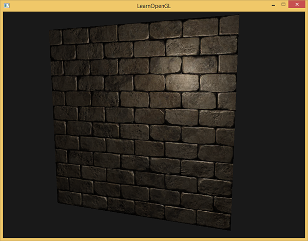

你可以在这里找到这个简单demo的源代码及其顶点和像素着色器。

然而有个问题限制了刚才讲的那种法线贴图的使用。我们使用的那个法线贴图里面的所有法线向量都是指向正z方向的。上面的例子能用，是因为那个平面的表面法线也是指向正z方向的。可是，如果我们在表面法线指向正y方向的平面上使用同一个法线贴图会发生什么？

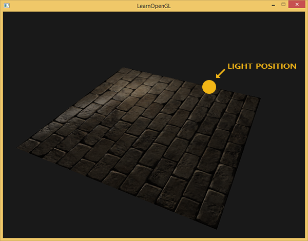

光照看起来完全不对！发生这种情况是平面的表面法线现在指向了y，而采样得到的法线仍然指向的是z。结果就是光照仍然认为表面法线和之前朝向正z方向时一样；这样光照就不对了。下面的图片展示了这个表面上采样的法线的近似情况：

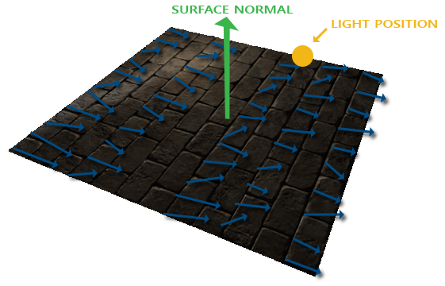

你可以看到所有法线都指向z方向，它们本该朝着表面法线指向y方向的。一个可行方案是为每个表面制作一个单独的法线贴图。如果是一个立方体的话我们就需要6个法线贴图，但是如果模型上有无数的朝向不同方向的表面，这就不可行了（译注：实际上对于复杂模型可以把朝向各个方向的法线储存在同一张贴图上，你可能看到过不只是蓝色的法线贴图，不过用那样的法线贴图有个问题是你必须记住模型的起始朝向，如果模型运动了还要记录模型的变换，这是非常不方便的；此外就像作者所说的，如果把一个diffuse纹理应用在同一个物体的不同表面上，就像立方体那样的，就需要做6个法线贴图，这也不可取）。

另一个稍微有点难的解决方案是，在一个不同的坐标空间中进行光照，这个坐标空间里，法线贴图向量总是指向这个坐标空间的正z方向；所有的光照向量都相对与这个正z方向进行变换。这样我们就能始终使用同样的法线贴图，不管朝向问题。这个坐标空间叫做切线空间（tangent space）。

## 切线空间

法线贴图中的法线向量定义在切线空间中，在切线空间中，法线永远指着正z方向。切线空间是位于三角形表面之上的空间：法线相对于单个三角形的本地参考框架。它就像法线贴图向量的本地空间；它们都被定义为指向正z方向，无论最终变换到什么方向。使用一个特定的矩阵我们就能将本地/切线空间中的法线向量转成世界或视图空间下，使它们转向到最终的贴图表面的方向。

我们可以说，上个部分那个朝向正y的法线贴图错误的贴到了表面上。法线贴图被定义在切线空间中，所以一种解决问题的方式是计算出一种矩阵，把法线从切线空间变换到一个不同的空间，这样它们就能和表面法线方向对齐了：法线向量都会指向正y方向。切线空间的一大好处是我们可以为任何类型的表面计算出一个这样的矩阵，由此我们可以把切线空间的z方向和表面的法线方向对齐。

这种矩阵叫做TBN矩阵这三个字母分别代表tangent、bitangent和normal向量。这是建构这个矩阵所需的向量。要建构这样一个把切线空间转变为不同空间的变异矩阵，我们需要三个相互垂直的向量，它们沿一个表面的法线贴图对齐于：上、右、前；这和我们在[摄像机教程](../01 Getting started/09 Camera.md)中做的类似。

已知上向量是表面的法线向量。右和前向量是切线(Tagent)和副切线(Bitangent)向量。下面的图片展示了一个表面的三个向量：

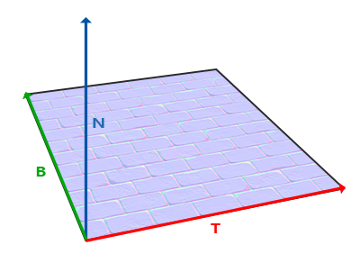

计算出切线和副切线并不像法线向量那么容易。从图中可以看到法线贴图的切线和副切线与纹理坐标的两个方向对齐。我们就是用到这个特性计算每个表面的切线和副切线的。需要用到一些数学才能得到它们；请看下图：

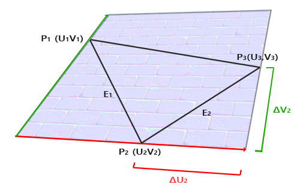

注意上图中边\(E_2\)与纹理坐标的差\(\Delta U_2\)、\(\Delta V_2\)构成一个三角形。\(\Delta U_2\)与切线向量\(T\)方向相同，而\(\Delta V_2\)与副切线向量\(B\)方向相同。这也就是说，所以我们可以将三角形的边\(E_1\)与\(E_2\)写成切线向量\(\T\)和副切线向量\(B\)的线性组合：

$$
E_1 = \Delta U_1T + \Delta V_1B
$$

$$
E_2 = \Delta U_2T + \Delta V_2B
$$

我们也可以写成这样：

$$
(E_{1x}, E_{1y}, E_{1z}) = \Delta U_1(T_x, T_y, T_z) + \Delta V_1(B_x, B_y, B_z)
$$

$$
(E_{2x}, E_{2y}, E_{2z}) = \Delta U_2(T_x, T_y, T_z) + \Delta V_2(B_x, B_y, B_z)
$$

\(E\)是两个向量位置的差，\(\Delta U\)和\(\Delta V\)是纹理坐标的差。然后我们得到两个未知数（切线\(T\)和副切线\(B\)）和两个等式。你可能想起你的代数课了，这是让我们去解\(T\)和\(B\)。

上面的方程允许我们把它们写成另一种格式：矩阵乘法

$$
\begin{bmatrix} E_{1x} & E_{1y} & E_{1z} \\ E_{2x} & E_{2y} & E_{2z} \end{bmatrix} = \begin{bmatrix} \Delta U_1 & \Delta V_1 \\ \Delta U_2 & \Delta V_2 \end{bmatrix} \begin{bmatrix} T_x & T_y & T_z \\ B_x & B_y & B_z \end{bmatrix}
$$

尝试会意一下矩阵乘法，它们确实是同一种等式。把等式写成矩阵形式的好处是，解\(T\)和\(B\)会因此变得很容易。两边都乘以\(\Delta U \Delta V\)的逆矩阵等于：

$$
\begin{bmatrix} \Delta U_1 & \Delta V_1 \\ \Delta U_2 & \Delta V_2 \end{bmatrix}^{-1} \begin{bmatrix} E_{1x} & E_{1y} & E_{1z} \\ E_{2x} & E_{2y} & E_{2z} \end{bmatrix} = \begin{bmatrix} T_x & T_y & T_z \\ B_x & B_y & B_z \end{bmatrix}
$$

这样我们就可以解出\(T\)和\(B\)了。这需要我们计算出delta纹理坐标矩阵的逆矩阵。我不打算讲解计算逆矩阵的细节，但大致是把它变化为，1除以矩阵的行列式，再乘以它的伴随矩阵(Adjugate Matrix)。

$$
\begin{bmatrix} T_x & T_y & T_z \\ B_x & B_y & B_z \end{bmatrix}  = \frac{1}{\Delta U_1 \Delta V_2 - \Delta U_2 \Delta V_1} \begin{bmatrix} \Delta V_2 & -\Delta V_1 \\ -\Delta U_2 & \Delta U_1 \end{bmatrix} \begin{bmatrix} E_{1x} & E_{1y} & E_{1z} \\ E_{2x} & E_{2y} & E_{2z} \end{bmatrix}
$$

有了最后这个等式，我们就可以用公式、三角形的两条边以及纹理坐标计算出切线向量\(T\)和副切线\(B\)。

如果你对这些数学内容不理解也不用担心。当你知道我们可以用一个三角形的顶点和纹理坐标（因为纹理坐标和切线向量在同一空间中）计算出切线和副切线你就已经部分地达到目的了（译注：上面的推导已经很清楚了，如果你不明白可以参考任意线性代数教材，就像作者所说的记住求得切线空间的公式也行，不过不管怎样都得理解切线空间的含义）。

### 手工计算切线和副切线

这个教程的demo场景中有一个简单的2D平面，它朝向正z方向。这次我们会使用切线空间来实现法线贴图，所以我们可以使平面朝向任意方向，法线贴图仍然能够工作。使用前面讨论的数学方法，我们来手工计算出表面的切线和副切线向量。

假设平面使用下面的向量建立起来（1、2、3和1、3、4，它们是两个三角形）：

```c++
// positions
glm::vec3 pos1(-1.0,  1.0, 0.0);
glm::vec3 pos2(-1.0, -1.0, 0.0);
glm::vec3 pos3(1.0, -1.0, 0.0);
glm::vec3 pos4(1.0, 1.0, 0.0);
// texture coordinates
glm::vec2 uv1(0.0, 1.0);
glm::vec2 uv2(0.0, 0.0);
glm::vec2 uv3(1.0, 0.0);
glm::vec2 uv4(1.0, 1.0);
// normal vector
glm::vec3 nm(0.0, 0.0, 1.0);
```

我们先计算第一个三角形的边和deltaUV坐标：

```c++
glm::vec3 edge1 = pos2 - pos1;
glm::vec3 edge2 = pos3 - pos1;
glm::vec2 deltaUV1 = uv2 - uv1;
glm::vec2 deltaUV2 = uv3 - uv1;
```

有了计算切线和副切线的必备数据，我们就可以开始写出来自于前面部分中的下列等式：

```c++
GLfloat f = 1.0f / (deltaUV1.x * deltaUV2.y - deltaUV2.x * deltaUV1.y);
 
tangent1.x = f * (deltaUV2.y * edge1.x - deltaUV1.y * edge2.x);
tangent1.y = f * (deltaUV2.y * edge1.y - deltaUV1.y * edge2.y);
tangent1.z = f * (deltaUV2.y * edge1.z - deltaUV1.y * edge2.z);
tangent1 = glm::normalize(tangent1);
 
bitangent1.x = f * (-deltaUV2.x * edge1.x + deltaUV1.x * edge2.x);
bitangent1.y = f * (-deltaUV2.x * edge1.y + deltaUV1.x * edge2.y);
bitangent1.z = f * (-deltaUV2.x * edge1.z + deltaUV1.x * edge2.z);
bitangent1 = glm::normalize(bitangent1);  
  
[...] // 对平面的第二个三角形采用类似步骤计算切线和副切线
```

我们预先计算出等式的分数部分`f`，然后把它和每个向量的元素进行相应矩阵乘法。如果你把代码和最终的等式对比你会发现，这就是直接套用。最后我们还要进行标准化，来确保切线/副切线向量最后是单位向量。

因为一个三角形永远是平坦的形状，我们只需为每个三角形计算一个切线/副切线，它们对于每个三角形上的顶点都是一样的。要注意的是大多数实现通常三角形和三角形之间都会共享顶点。这种情况下开发者通常将每个顶点的法线和切线/副切线等顶点属性平均化，以获得更加柔和的效果。我们的平面的三角形之间分享了一些顶点，但是因为两个三角形相互并行，因此并不需要将结果平均化，但无论何时只要你遇到这种情况记住它就是件好事。

最后的切线和副切线向量的值应该是(1, 0, 0)和(0, 1, 0)，它们和法线(0, 0, 1)组成相互垂直的TBN矩阵。在平面上显示出来TBN应该是这样的：

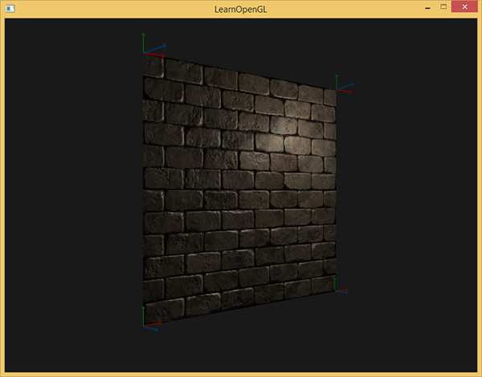

每个顶点定义了切线和副切线向量，我们就可以开始实现正确的法线贴图了。


### 切线空间法线贴图

为让法线贴图工作，我们先得在着色器中创建一个TBN矩阵。我们先将前面计算出来的切线和副切线向量传给顶点着色器，作为它的属性：

```c++
#version 330 core
layout (location = 0) in vec3 position;
layout (location = 1) in vec3 normal;
layout (location = 2) in vec2 texCoords;
layout (location = 3) in vec3 tangent;
layout (location = 4) in vec3 bitangent;
```

在顶点着色器的main函数中我们创建TBN矩阵：

```c++
void main()
{
   [...]
   vec3 T = normalize(vec3(model * vec4(tangent,   0.0)));
   vec3 B = normalize(vec3(model * vec4(bitangent, 0.0)));
   vec3 N = normalize(vec3(model * vec4(normal,    0.0)));
   mat3 TBN = mat3(T, B, N)
}
```

我们先将所有TBN向量变换到我们所操作的坐标系中，现在是世界空间，我们可以乘以model矩阵。然后我们创建实际的TBN矩阵，直接把相应的向量应用到mat3构造器就行。注意，如果我们希望更精确的话就不要将TBN向量乘以model矩阵，而是使用法线矩阵，因为我们只关心向量的方向，不关心平移和缩放。

!!! Important

	从技术上讲，顶点着色器中无需副切线。所有的这三个TBN向量都是相互垂直的所以我们可以在顶点着色器中用T和N向量的叉乘，自己计算出副切线：vec3 B = cross(T, N);
	
现在我们有了TBN矩阵，如果来使用它呢？通常来说有两种方式使用它，我们会把这两种方式都说明一下：

1. 我们直接使用TBN矩阵，这个矩阵可以把切线坐标空间的向量转换到世界坐标空间。因此我们把它传给片段着色器中，把通过采样得到的法线坐标左乘上TBN矩阵，转换到世界坐标空间中，这样所有法线和其他光照变量就在同一个坐标系中了。
2. 我们也可以使用TBN矩阵的逆矩阵，这个矩阵可以把世界坐标空间的向量转换到切线坐标空间。因此我们使用这个矩阵左乘其他光照变量，把他们转换到切线空间，这样法线和其他光照变量再一次在一个坐标系中了。


**我们来看看第一种情况。**我们从法线贴图采样得来的法线向量，是在切线空间表示的，尽管其他光照向量都是在世界空间表示的。把TBN传给像素着色器，我们就能将采样得来的切线空间的法线乘以这个TBN矩阵，将法线向量变换到和其他光照向量一样的参考空间中。这种方式随后所有光照计算都可以简单的理解。

把TBN矩阵发给像素着色器很简单：


```c++
out VS_OUT {
    vec3 FragPos;
    vec2 TexCoords;
    mat3 TBN;
} vs_out;  
  
void main()
{
    [...]
    vs_out.TBN = mat3(T, B, N);
}
```

在像素着色器中我们用mat3作为输入变量：

```c++
in VS_OUT {
    vec3 FragPos;
    vec2 TexCoords;
    mat3 TBN;
} fs_in;
```

有了TBN矩阵我们现在就可以更新法线贴图代码，引入切线到世界空间变换：

```c++
normal = texture(normalMap, fs_in.TexCoords).rgb;
normal = normalize(normal * 2.0 - 1.0);   
normal = normalize(fs_in.TBN * normal);
```

因为最后的normal现在在世界空间中了，就不用改变其他像素着色器的代码了，因为光照代码就是假设法线向量在世界空间中。

**我们同样看看第二种情况。**我们用TBN矩阵的逆矩阵将所有相关的世界空间向量转变到采样所得法线向量的空间：切线空间。TBN的建构还是一样，但我们在将其发送给像素着色器之前先要求逆矩阵：

```c++
vs_out.TBN = transpose(mat3(T, B, N));
```

注意，这里我们使用transpose函数，而不是inverse函数。正交矩阵（每个轴既是单位向量同时相互垂直）的一大属性是一个正交矩阵的置换矩阵与它的逆矩阵相等。这个属性和重要因为逆矩阵的求得比求置换开销大；结果却是一样的。

在像素着色器中我们不用对法线向量变换，但我们要把其他相关向量转换到切线空间，它们是lightDir和viewDir。这样每个向量还是在同一个空间（切线空间）中了。


```c++
void main()
{           
    vec3 normal = texture(normalMap, fs_in.TexCoords).rgb;
    normal = normalize(normal * 2.0 - 1.0);   
   
    vec3 lightDir = fs_in.TBN * normalize(lightPos - fs_in.FragPos);
    vec3 viewDir  = fs_in.TBN * normalize(viewPos - fs_in.FragPos);    
    [...]
}
```

第二种方法看似要做的更多，它还需要在像素着色器中进行更多的乘法操作，所以为何还用第二种方法呢？

将向量从世界空间转换到切线空间有个额外好处，我们可以把所有相关向量在顶点着色器中转换到切线空间，不用在像素着色器中做这件事。这是可行的，因为lightPos和viewPos不是每个fragment运行都要改变，对于fs_in.FragPos，我们也可以在顶点着色器计算它的切线空间位置。基本上，不需要把任何向量在像素着色器中进行变换，而第一种方法中就是必须的，因为采样出来的法线向量对于每个像素着色器都不一样。

所以现在不是把TBN矩阵的逆矩阵发送给像素着色器，而是将切线空间的光源位置，观察位置以及顶点位置发送给像素着色器。这样我们就不用在像素着色器里进行矩阵乘法了。这是一个极佳的优化，因为顶点着色器通常比像素着色器运行的少。这也是为什么这种方法是一种更好的实现方式的原因。

```c++
out VS_OUT {
    vec3 FragPos;
    vec2 TexCoords;
    vec3 TangentLightPos;
    vec3 TangentViewPos;
    vec3 TangentFragPos;
} vs_out;
 
uniform vec3 lightPos;
uniform vec3 viewPos;
 
[...]
  
void main()
{    
    [...]
    mat3 TBN = transpose(mat3(T, B, N));
    vs_out.TangentLightPos = TBN * lightPos;
    vs_out.TangentViewPos  = TBN * viewPos;
    vs_out.TangentFragPos  = TBN * vec3(model * vec4(position, 0.0));
}
```

在像素着色器中我们使用这些新的输入变量来计算切线空间的光照。因为法线向量已经在切线空间中了，光照就有意义了。

将法线贴图应用到切线空间上，我们会得到混合教程一开始那个例子相似的结果，但这次我们可以将平面朝向各个方向，光照一直都会是正确的：

```c++
glm::mat4 model;
model = glm::rotate(model, (GLfloat)glfwGetTime() * -10, glm::normalize(glm::vec3(1.0, 0.0, 1.0)));
glUniformMatrix4fv(modelLoc 1, GL_FALSE, glm::value_ptr(model));
RenderQuad();
```

看起来是正确的法线贴图：

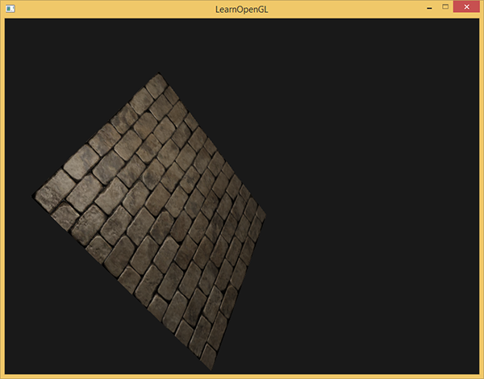

你可以在这里找到[源代码](http://www.learnopengl.com/code_viewer.php?code=advanced-lighting/normal_mapping)、[顶点](http://www.learnopengl.com/code_viewer.php?code=advanced-lighting/normal_mapping&type=vertex)和[像素](http://www.learnopengl.com/code_viewer.php?code=advanced-lighting/normal_mapping&type=fragment)着色器。

### 复杂物体

我们已经说明了如何通过手工计算切线和副切线向量，来使用切线空间和法线贴图。幸运的是，计算这些切线和副切线向量对于你来说不是经常能遇到的事；大多数时候，在模型加载器中实现了一次就行了，我们是在使用了Assimp的那个加载器中实现的。

Assimp有个很有用的配置，在我们加载模型的时候调用aiProcess_CalcTangentSpace。当aiProcess_CalcTangentSpace应用到Assimp的ReadFile函数时，Assimp会为每个加载的顶点计算出柔和的切线和副切线向量，它所使用的方法和我们本教程使用的类似。

```c++
const aiScene* scene = importer.ReadFile(
    path, aiProcess_Triangulate | aiProcess_FlipUVs | aiProcess_CalcTangentSpace
);
```
 

我们可以通过下面的代码用Assimp获取计算出来的切线空间：

```c++
vector.x = mesh->mTangents[i].x;
vector.y = mesh->mTangents[i].y;
vector.z = mesh->mTangents[i].z;
vertex.Tangent = vector;
```

然后，你还必须更新模型加载器，用以从带纹理模型中加载法线贴图。wavefront的模型格式（.obj）导出的法线贴图有点不一样，Assimp的aiTextureType_NORMAL并不会加载它的法线贴图，而aiTextureType_HEIGHT却能，所以我们经常这样加载它们：

```c++
vector<Texture> specularMaps = this->loadMaterialTextures(
    material, aiTextureType_HEIGHT, "texture_normal"
);
```
 

当然，对于每个模型的类型和文件格式来说都是不同的。同样了解aiProcess_CalcTangentSpace并不能总是很好的工作也很重要。计算切线是需要根据纹理坐标的，有些模型制作者使用一些纹理小技巧比如镜像一个模型上的纹理表面时也镜像了另一半的纹理坐标；这样当不考虑这个镜像的特别操作的时候（Assimp就不考虑）结果就不对了。

运行程序，用新的模型加载器，加载一个有specular和法线贴图的模型，看起来会像这样：

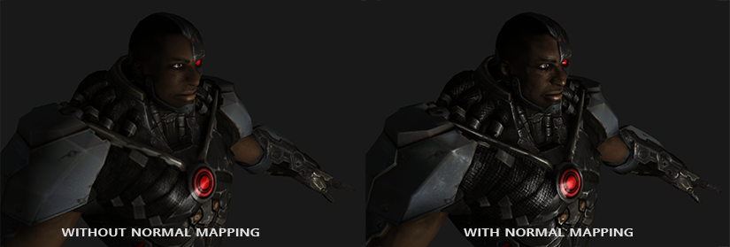

你可以看到在没有太多点的额外开销的情况下法线贴图难以置信地提升了物体的细节。

使用法线贴图也是一种提升你的场景的表现的重要方式。在使用法线贴图之前你不得不使用相当多的顶点才能表现出一个更精细的网格，但使用了法线贴图我们可以使用更少的顶点表现出同样丰富的细节。下图来自Paolo Cignoni，图中对比了两种方式：

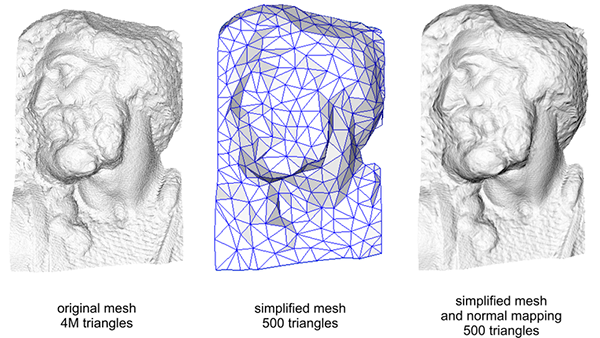

高精度网格和使用法线贴图的低精度网格几乎区分不出来。所以法线贴图不仅看起来漂亮，它也是一个将高精度多边形转换为低精度多边形而不失细节的重要工具。

## 最后一件事

关于法线贴图还有最后一个技巧要讨论，它可以在不必花费太多性能开销的情况下稍稍提升画质表现。

当在更大的网格上计算切线向量的时候，它们往往有很大数量的共享顶点，当法向贴图应用到这些表面时将切线向量平均化通常能获得更好更平滑的结果。这样做有个问题，就是TBN向量可能会不能互相垂直，这意味着TBN矩阵不再是正交矩阵了。法线贴图可能会稍稍偏移，但这仍然可以改进。

使用叫做*格拉姆-施密特*正交化过程（Gram-Schmidt process）的数学技巧，我们可以对TBN向量进行重正交化，这样每个向量就又会重新垂直了。在顶点着色器中我们这样做：

```c++
vec3 T = normalize(vec3(model * vec4(tangent, 0.0)));
vec3 N = normalize(vec3(model * vec4(normal, 0.0)));
// re-orthogonalize T with respect to N
T = normalize(T - dot(T, N) * N);
// then retrieve perpendicular vector B with the cross product of T and N
vec3 B = cross(T, N);
 
mat3 TBN = mat3(T, B, N)
```

这样稍微花费一些性能开销就能对法线贴图进行一点提升。看看最后的那个附加资源： Normal Mapping Mathematics视频，里面有对这个过程的解释。

## 附加资源

- [Tutorial 26: Normal Mapping](http://ogldev.atspace.co.uk/www/tutorial26/tutorial26.html)：ogldev的法线贴图教程。
- [How Normal Mapping Works](https://www.youtube.com/watch?v=LIOPYmknj5Q)：TheBennyBox的讲述法线贴图如何工作的视频。
- [Normal Mapping Mathematics](https://www.youtube.com/watch?v=4FaWLgsctqY)：TheBennyBox关于法线贴图的数学原理的教程。
- [Tutorial 13: Normal Mapping](http://www.opengl-tutorial.org/intermediate-tutorials/tutorial-13-normal-mapping/)：opengl-tutorial.org提供的法线贴图教程。
