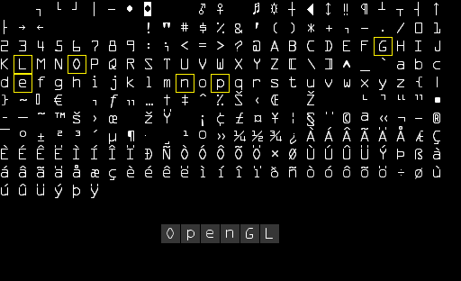
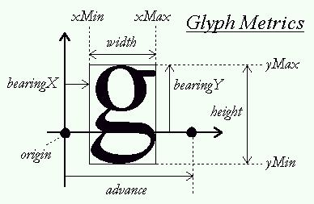
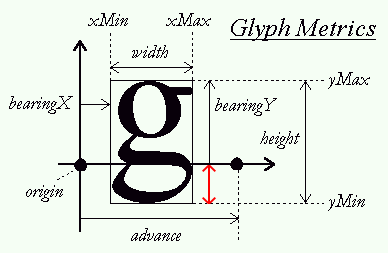
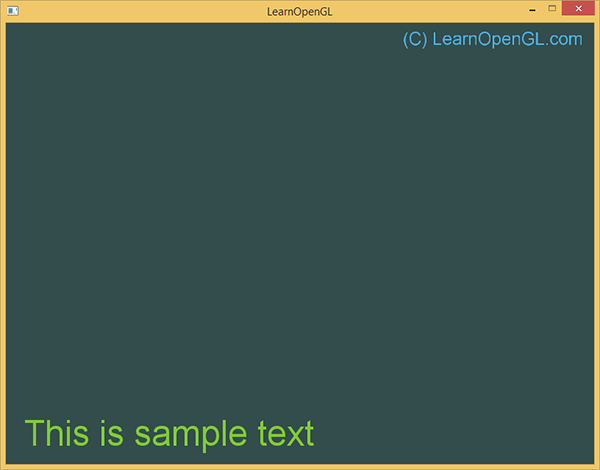
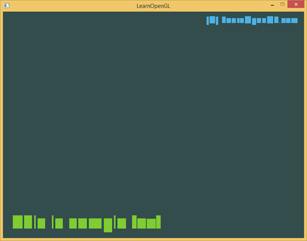

# 文字渲染

原文     | [Text Rendering](http://learnopengl.com/#!In-Practice/Text-Rendering)
      ---|---
作者     | JoeyDeVries
翻译     | [Geequlim](http://geequlim.com)
校对     | gjy_1992, [BLumia](https://github.com/blumia/)

当你在图形计算领域冒险到了一定阶段以后你可能会想使用OpenGL来绘制文字。然而，可能与你想象的并不一样，使用像OpenGL这样的底层库来把文字渲染到屏幕上并不是一件简单的事情。如果你你只需要绘制128种字符，那么事情可能会简单一些。但是当我们要绘制的字符有着不同的宽、高和边距；如果你使用的语言中不止包含128个字符；当你要绘制音乐符、数学符号；以及考虑把如何处理文本自动转行等等情况考虑进来的时候...事情马上就会变得复杂得多，你甚至觉得这些工作并不属于像OpenGL这样的底层图形库该讨论的范畴。

由于OpenGL本身并没有定义如何渲染文字到屏幕，也没有用于表示文字的基本图形，我们必须自己定义一套全新的方式才能让OpenGL来绘制文字。目前一些技术包括：通过**`GL_LINES`**来绘制字形、创建文字的3D网格、将带有文字的纹理渲染到一个2D方块中。

开发者最常用的一种方式是将字符纹理绘制到矩形方块上。绘制这些纹理方块其实并不是很复杂，然而检索要绘制的文字的纹理却变成了一项挑战性的工作。本教程将探索多种文字渲染的实现方法，并且着重对更加现代而且灵活的渲染技术(使用FreeType库)进行讲解。

## 经典文字渲染：位图字体

在早期渲染文字时，选择你应用程序的字体(或者创建你自己的字体)来绘制文字是通过将所有用到的文字加载在一张大纹理图中来实现的。这张纹理贴图我们把它叫做**位图字体(Bitmap Font)**，它包含了所有我们想要使用的字符。这些字符被称为**字形(Glyph)**。每个字形根据他们的编号被放到位图字体中的确切位置，在渲染这些字形的时候根据这些排列规则将他们取出并贴到指定的2D方块中。



上图展示了我们如何从一张位图字体的纹理中通过对字形的合理取样(通过小心地选择字形的纹理坐标)来实现绘制文字“OpenGL”到2D方块中的原理。通过对OpenGL启用混合并让位图字体的纹理背景保持透明，这样就能实现使用OpenGL绘制你想要文字到屏幕的功能。上图的这张位图字体是使用[Codehead的位图字体生成器](http://www.codehead.co.uk/cbfg/)生成的。

使用这种途径来绘制文字有许多优势也有很多缺点。首先，它相对来说很容易实现，并且因为位图字体被预渲染好，使得这种方法效率很高。然而，这种途径并不够灵活。当你想要使用不同的字体时，你不得不重新生成位图字体，以及你的程序会被限制在一个固定的分辨率：如果你对这些文字进行放大的话你会看到文字的像素边缘。此外，这种方式仅局限于用来绘制很少的字符，如果你想让它来扩展支持Unicode文字的话就很不现实了。

这种绘制文字的方式曾经得益于它的高速和可移植性而非常流行，然而现在已经存在更加灵活的方式了。其中一个是我们即将展开讨论的使用FreeType库来加载TrueType字体的方式。

## 现代文字渲染：FreeType

FreeType是一个能够用于加载字体并将他们渲染到位图以及提供多种字体相关的操作的软件开发库。它是一个非常受欢迎的跨平台字体库，被用于 Mac OSX、Java、PlayStation主机、Linux、Android等。FreeType的真正吸引力在于它能够加载TrueType字体。

TrueType字体不采用像素或其他不可缩放的方式来定义，而是一些通过数学公式(曲线的组合)。这些字形，类似于矢量图像，可以根据你需要的字体大小来生成像素图像。通过使用TrueType字体可以轻易呈现不同大小的字符符号并且没有任何质量损失。

FreeType可以在他们的[官方网站](http://www.freetype.org/)中下载到。你可以选择自己编译他们提供的源代码或者使用他们已编译好的针对你的平台的链接库。请确认你将freetype.lib添加到你项目的链接库中，同时你还要添加它的头文件目录到项目的搜索目录中。

然后请确认包含合适的头文件：

```c++
#include <ft2build.h>
#include FT_FREETYPE_H  
```

!!! Attention
    
    由于FreeType开发得比较早（至少在我写这篇文章以前就已经开发好了），你不能将它们的头文件放到一个新的目录下，它们应该保存在你包含目录的根目录下。通过使用像 `#include <FreeType/ft2build.h>` 这样的方式导入FreeType可能会出现各种头文件冲突的问题。

FreeType要做的事就是加载TrueType字体并为每一个字形生成位图和几个度量值。我们可以取出它生成的位图作为字形的纹理，将这些度量值用作字形纹理的位置、偏移等描述。

要加载一个字体，我们需要做的是初始化FreeType并且将这个字体加载为FreeType称之为面(Face)的东西。这里为我们加载一个从Windows/Fonts目录中拷贝来的TrueType字体文件arial.ttf。

```c++
FT_Library ft;
if (FT_Init_FreeType(&ft))
    std::cout << "ERROR::FREETYPE: Could not init FreeType Library" << std::endl;

FT_Face face;
if (FT_New_Face(ft, "fonts/arial.ttf", 0, &face))
    std::cout << "ERROR::FREETYPE: Failed to load font" << std::endl;  
```

这些FreeType函数在出现错误的情况下返回一个非零整数值。

一旦我们加载字体面完成，我们还要定义文字大小，这表示着我们要从字体面中生成多大的字形：

```c++
FT_Set_Pixel_Sizes(face, 0, 48);  
```
此函数设置了字体面的宽度和高度，将宽度值设为0表示我们要从字体面通过给出的高度中动态计算出字形的宽度。

一个字体面中包含了所有字形的集合。我们可以通过调用`FT_Load_Char`函数来激活当前要表示的字形。这里我们选在加载字母字形'X'：

```c++
if (FT_Load_Char(face, 'X', FT_LOAD_RENDER))
    std::cout << "ERROR::FREETYTPE: Failed to load Glyph" << std::endl;  
```

通过将**`FT_LOAD_RENDER`**设为一个加载标识，我们告诉FreeType去创建一个8位的灰度位图，我们可以通过`face->glyph->bitmap`来取得这个位图。

使用FreeType加载的字形位图并不像我们使用位图字体那样持有相同的尺寸大小。使用FreeType生产的字形位图的大小是恰好能包含这个字形的尺寸。例如生产用于表示'.'的位图的尺寸要比表示'X'的小得多。因此，FreeType在加载字形的时候还生产了几个度量值来描述生成的字形位图的大小和位置。下图展示了FreeType的所有度量值的涵义。



每一个字形都放在一个水平的基线(Baseline)上，上图中被描黑的水平箭头表示该字形的基线。这条基线类似于拼音四格线中的第二根水平线，一些字形被放在基线以上(如'x'或'a')，而另一些则会超过基线以下(如'g'或'p')。FreeType的这些度量值中包含了字形在相对于基线上的偏移量用来描述字形相对于此基线的位置，字形的大小，以及与下一个字符之间的距离。下面列出了我们在渲染字形时所需要的度量值的属性：


属性|获取方式|生成位图描述
---|---
width   | face->glyph->bitmap.width | 宽度，单位:像素
height  | face->glyph->bitmap.rows  | 高度，单位:像素
bearingX| face->glyph->bitmap_left| 水平位置(相对于起点origin)，单位:像素
bearingY| face->glyph->bitmap_top | 垂直位置(相对于基线Baseline)，单位:像素
advance | face->glyph->advance.x  | 起点到下一个字形的起点间的距离(单位:1/64像素)

在我们想要渲染字符到屏幕的时候就能根据这些度量值来生成对应字形的纹理了，然而每次渲染都这样做显然不是高效的。我们应该将这些生成的数据储存在应用程序中，在渲染过程中再去取。方便起见，我们需要定义一个用来储存这些属性的结构体,并创建一个字符表来存储这些字形属性。

```c++
struct Character {
    GLuint     TextureID;  // 字形纹理ID
    glm::ivec2 Size;       // 字形大大小
    glm::ivec2 Bearing;    // 字形基于基线和起点的位置
    GLuint     Advance;    // 起点到下一个字形起点的距离
};

std::map<GLchar, Character> Characters;
```

本教程本着让一切简单的目的，我们只生成表示128个ASCII字符的字符表。并为每一个字符储存纹理和一些度量值。这样，所有需要的字符就被存下来备用了。

```c++
glPixelStorei(GL_UNPACK_ALIGNMENT, 1); //禁用byte-alignment限制
for (GLubyte c = 0; c < 128; c++)
{
    // 加载字符的字形 
    if (FT_Load_Char(face, c, FT_LOAD_RENDER))
    {
        std::cout << "ERROR::FREETYTPE: Failed to load Glyph" << std::endl;
        continue;
    }
    // 生成字形纹理
    GLuint texture;
    glGenTextures(1, &texture);
    glBindTexture(GL_TEXTURE_2D, texture);
    glTexImage2D(
        GL_TEXTURE_2D,
        0,
        GL_RED,
        face->glyph->bitmap.width,
        face->glyph->bitmap.rows,
        0,
        GL_RED,
        GL_UNSIGNED_BYTE,
        face->glyph->bitmap.buffer
    );
    // 设置纹理选项
    glTexParameteri(GL_TEXTURE_2D, GL_TEXTURE_WRAP_S, GL_CLAMP_TO_EDGE);
    glTexParameteri(GL_TEXTURE_2D, GL_TEXTURE_WRAP_T, GL_CLAMP_TO_EDGE);
    glTexParameteri(GL_TEXTURE_2D, GL_TEXTURE_MIN_FILTER, GL_LINEAR);
    glTexParameteri(GL_TEXTURE_2D, GL_TEXTURE_MAG_FILTER, GL_LINEAR);
    // 将字符存储到字符表中备用
    Character character = {
        texture, 
        glm::ivec2(face->glyph->bitmap.width, face->glyph->bitmap.rows),
        glm::ivec2(face->glyph->bitmap_left, face->glyph->bitmap_top),
        face->glyph->advance.x
    };
    Characters.insert(std::pair<GLchar, Character>(c, character));
}
```

在这个for循环中我们将所有ASCII中的128个字符设置合适的字形。为每一个字符创建纹理并存储它们的部分度量值。有趣的是我们这里将纹理的格式设置为**GL_RED**。通过字形生成的位图是8位灰度图，他的每一个颜色表示为一个字节。因此我们需要将每一位都作为纹理的颜色值。我们通过创建每一个字节表示一个颜色的红色分量(颜色分量的第一个字节)来创建字形纹理。我们想用一个字节来表示纹理颜色，这需要提前通知OpenGL

```c++
glPixelStorei(GL_UNPACK_ALIGNMENT, 1);   
```

OpenGL要求所有的纹理颜都必须是4字节队列，这样纹理的内存大小就一定是4字节的整数倍。通常这并不会出现什么问题，因为通常的纹理都有4或者4的整数被的储存大小，但是现在我们只用一位来表示每一个像素颜色，此时的纹理可能有任意内存长度。通过将纹理解压参数设为1，这样才能确保不会有内存对齐的解析问题。

当你处理完字形后同样不要忘记清理FreeType的资源。

```c++
FT_Done_Face(face);
FT_Done_FreeType(ft);
```

### 着色器

我们需要使用下面的顶点着色器来渲染字形：

```c++
#version 330 core
layout (location = 0) in vec4 vertex; // <vec2 pos, vec2 tex>
out vec2 TexCoords;

uniform mat4 projection;

void main()
{
    gl_Position = projection * vec4(vertex.xy, 0.0, 1.0);
    TexCoords = vertex.zw;
}  
```

我们将位置和纹理纹理坐标的数据合起来存在一个`vec4`中。顶点着色器将会将位置坐标与投影矩阵相乘，并将纹理坐标转发给片段着色器:

```c++
#version 330 core
in vec2 TexCoords;
out vec4 color;

uniform sampler2D text;
uniform vec3 textColor;

void main()
{    
    vec4 sampled = vec4(1.0, 1.0, 1.0, texture(text, TexCoords).r);
    color = vec4(textColor, 1.0) * sampled;
}  
```

片段着色器有两个uniform变量：一个是单颜色通道的字形位图纹理，另一个是文字的颜色，我们可以同调整它来改变最终输出的字体颜色。我们首先从位图纹理中采样，由于纹理数据中仅存储着红色分量，我们就通过**`r`**分量来作为取样颜色的aplpha值。结果值是一个字形背景为纯透明，而字符部分为不透明的白色的颜色。我们将此颜色与字体颜色uniform值相乘就得到了要输出的字符颜色了。

当然我们必需开启混合才能让这一切行之有效：

```c++
glEnable(GL_BLEND);
glBlendFunc(GL_SRC_ALPHA, GL_ONE_MINUS_SRC_ALPHA);  
```
至于投影矩阵我们将使用一个正交投影矩阵。对于文字渲染我们通常都不需要进行透视，使用正交投影也能保证我们所有的顶点坐标设置有效：

```c++
glm::mat4 projection = glm::ortho(0.0f, 800.0f, 0.0f, 600.0f);
```

我们设置投影矩阵的底部参数为0.0f并将顶部参数设置为窗口的高度。这样做的结果是我们可以通过设置0.0f~600.0f的纵坐标来表示顶点在窗口中的垂直位置。这意味着现在点(0.0,0.0)表示左下角而不再是窗口正中间。

最后要做的事是创建一个VBO和VAO用来渲染方块。现在我们分配足够的内存来初始化VBO然后在我们渲染字符的时候再来更新VBO的内存。

```c++
GLuint VAO, VBO;
glGenVertexArrays(1, &VAO);
glGenBuffers(1, &VBO);
glBindVertexArray(VAO);
glBindBuffer(GL_ARRAY_BUFFER, VBO);
glBufferData(GL_ARRAY_BUFFER, sizeof(GLfloat) * 6 * 4, NULL, GL_DYNAMIC_DRAW);
glEnableVertexAttribArray(0);
glVertexAttribPointer(0, 4, GL_FLOAT, GL_FALSE, 4 * sizeof(GLfloat), 0);
glBindBuffer(GL_ARRAY_BUFFER, 0);
glBindVertexArray(0);      
```

每个2D方块需要6个顶点，每个顶点又是由一个4维向量（一个纹理坐标和一个顶点坐标）组成，因此我们将VBO的内存分配为6*4个float的大小。由于我们会在绘制字符时更新这断内存，所以我们将内存类型设置为`GL_DYNAMIC_DRAW`

### 渲染一行文字

要渲染一个字符，我们从之前创建的字符表中取出一个字符结构体，根据字符的度量值来计算方块的大小。根据方块的大小我们就能计算出6个描述方块的顶点，并使用`glBufferSubData`函数将其更新到VBO所在内内存中。

我们创建一个函数用来渲染一行文字:

```c++
void RenderText(Shader &s, std::string text, GLfloat x, GLfloat y, GLfloat scale, glm::vec3 color)
{
    // 激活合适的渲染状态
    s.Use();
    glUniform3f(glGetUniformLocation(s.Program, "textColor"), color.x, color.y, color.z);
    glActiveTexture(GL_TEXTURE0);
    glBindVertexArray(VAO);

    // 对文本中的所有字符迭代
    std::string::const_iterator c;
    for (c = text.begin(); c != text.end(); c++)
    {
        Character ch = Characters[*c];

        GLfloat xpos = x + ch.Bearing.x * scale;
        GLfloat ypos = y - (ch.Size.y - ch.Bearing.y) * scale;

        GLfloat w = ch.Size.x * scale;
        GLfloat h = ch.Size.y * scale;
        // 当前字符的VBO
        GLfloat vertices[6][4] = {
            { xpos,     ypos + h,   0.0, 0.0 },            
            { xpos,     ypos,       0.0, 1.0 },
            { xpos + w, ypos,       1.0, 1.0 },

            { xpos,     ypos + h,   0.0, 0.0 },
            { xpos + w, ypos,       1.0, 1.0 },
            { xpos + w, ypos + h,   1.0, 0.0 }           
        };
        // 在方块上绘制字形纹理
        glBindTexture(GL_TEXTURE_2D, ch.textureID);
        // 更新当前字符的VBO
        glBindBuffer(GL_ARRAY_BUFFER, VBO);
        glBufferSubData(GL_ARRAY_BUFFER, 0, sizeof(vertices), vertices); 
        glBindBuffer(GL_ARRAY_BUFFER, 0);
        // 绘制方块
        glDrawArrays(GL_TRIANGLES, 0, 6);
        // 更新位置到下一个字形的原点，注意单位是1/64像素
        x += (ch.Advance >> 6) * scale; //(2^6 = 64)
    }
    glBindVertexArray(0);
    glBindTexture(GL_TEXTURE_2D, 0);
}
```

这个函数的内容注释的比较详细了：我们首先计算出方块的起点坐标（即`xpos`和`ypos`）和它的大小（即`w`和`h`），并为该方块生成6个顶点；注意我们在缩放的同时会将部分度量值也进行缩放。接着我们更新方块的VBO、绑定字形纹理来渲染它。

其中这行代码需要加倍留意：

```c++
GLfloat ypos = y - (ch.Size.y - ch.Bearing.y);   
```

一些字符(诸如'p'或'q')需要被渲染到基线以下，因此字形方块也应该讲y位置往下调整。调整的量就是便是字形度量值中字形的高度和BearingY的差：



要计算这段偏移量的距离，我们需要指出是字形在基线以下的部分最底断到基线的距离。在上图中这段距离用红色双向箭头标出。如你所见，在字形度量值中，我们可以通过用字形的高度减去bearingY来计算这段向量的长度。这段距离有可能是0.0f(如'x'字符)
，或是超出基线底部的距离的长度(如'g'或'j')。

如果你每件事都做对了，那么你现在已经可以使用下面的句子成功地渲染字符串了：

```c++
RenderText(shader, "This is sample text", 25.0f, 25.0f, 1.0f, glm::vec3(0.5, 0.8f, 0.2f));
RenderText(shader, "(C) LearnOpenGL.com", 540.0f, 570.0f, 0.5f, glm::vec3(0.3, 0.7f, 0.9f));
```

渲染效果看上去像这样：



你可以从这里获取这个例子的[源代码](http://learnopengl.com/code_viewer.php?code=in-practice/text_rendering)。

通过关闭字形纹理的绑定，能够给你对文字方块的顶点计算更好的理解，它看上去像这样：



可以看出，对应'p'和'('等字形的方块明显向下偏移了一些，通过这些你就能清楚地看到那条传说中的基线了。

## 关于未来

本教程演示了如何使用FreeType绘制TrueType文字。这种方式灵活、可缩放并支持多种字符编码。然而，你的应用程序可能并不需要这么强大的功能，性能更好的点阵字体也许是更可取的。当然你可以结合这两种方法通过动态生成位图字体中所有字符字形。这节省了从大量的纹理渲染器开关和基于每个字形紧密包装可以节省相当的一些性能。

另一个使用FreeType字体的问题是字形纹理是对应着一个固定的字体大小的，因此直接对其放大就会出现锯齿边缘。此外，对字形进行旋转还会使它们看上去变得模糊。通过将每个像素设为最近的字形轮廓的像素，而不是直接设为实际栅格化的像素，可以减轻这些问题。这项技术被称为**有向距离场(Signed Distance Fields)**，Valve在几年前发表过一篇了[论文](http://www.valvesoftware.com/publications/2007/SIGGRAPH2007_AlphaTestedMagnification.pdf)，探讨了他们通过这项技术来获得好得惊人的3D渲染效果。