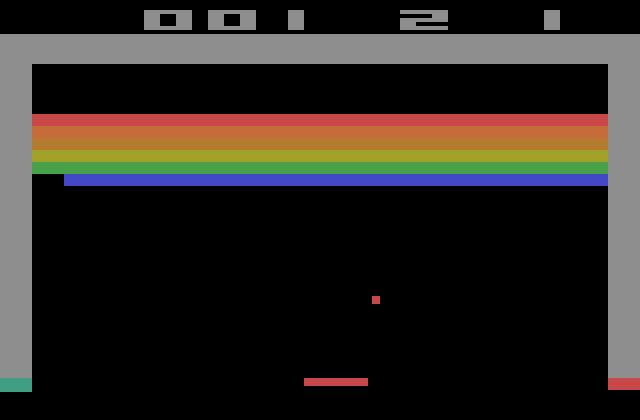
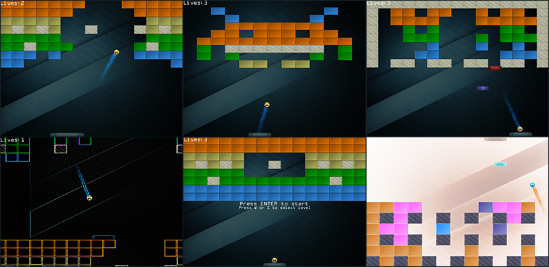

# Breakout

原文     | [Breakout](http://www.learnopengl.com/#!In-Practice/2D-Game/Breakout)
      ---|---
作者     | JoeyDeVries
翻译     | HHz(qq:1158332489)
校对     | Krasjet

看完前面的教程之后我们已经了解了非常多的OpenGL内部工作原理，并且我们已经能够用这些知识绘制一些复杂的图形。然而，除了之前的几个技术演示之外，我们还没有真正利用OpenGL开发一个实际应用。这篇教程为OpenGL 2D游戏制作系列教程的入门篇。这个系列教程将展示我们该如何将OpenGL应用到更大，更复杂的环境中。注意这个系列教程不一定会引入新的OpenGL概念，但会或多或少地向我们展示如何将所学的概念应用到更大的程序中去。

由于我们希望事情能够简单一点，我们会以别人开发过的一个2D街机游戏为基础，开发我们自己的2D游戏。这就是<def>Breakout</def>，一个于1976年发布的运行在Atari 2600主机上的经典2D游戏。游戏要求玩家通过操控一个挡板反弹小球，以破坏所有的砖块，而不能让小球到达屏幕底端。当玩家破坏了所有砖块的时候即为完成了游戏。

下面我们可以看到Breakout原本在Atari 2600上是什么样子的：

游戏有以下几个机制：

- 玩家能够控制一个小挡板，它只能在屏幕范围内左右移动。
- 球在屏幕上运动，每一次碰撞都会使球根据碰撞位置改变运动方向。对屏幕边框，砖块，挡板都需要有碰撞判定。
- 当球运动到屏幕底部边界的时候，游戏结束或者玩家丧失一点生命值。
- 球碰到砖块的时候，砖块会被破坏。
- 当所有砖块都被破坏，玩家获胜。
- 球的方向可以通过球碰撞在挡板上的位置（即到挡板中心的距离）来操控。

由于小球会不时通过缝隙到达砖墙的上方，它会在顶部边缘与砖块层的上边缘之间不断弹跳。小球会一直持续这种状态直到最终再次进入缝隙掉下来。这也是这个游戏名字的来源，小球必须要从缝隙中逃脱(Break out)出来。

# OpenGL Breakout

我们将把这个经典的街机游戏作为我们之后要完全使用OpenGL实现的这个游戏的基础。这个版本的Breakout将会运行在显卡上，所以我们能够改进经典的Breakout游戏，给它加一些很棒的特性。

除了以上这些经典的机制，我们的Breakout还将拥有：

- 你见过最棒的画质
- 粒子系统
- 高级文字渲染
- 道具
- 后期处理特效
- 多个（可自定义的）关卡

为了引起大家的兴趣，你可以看看游戏完成之后的样子：

这些教程将会结合之前教程中的大量概念，并且会展示如何让它们以一个整体工作。所以，在你开始这个系列教程的学习之前，请至少完成[「入门」](../../01 Getting started/01 OpenGL.md)章节。

而且，有些教程会需求其它一些教程的概念（比如说在[「高级OpenGL」](../../04 Advanced OpenGL/05 Framebuffers.md)章节中的帧缓冲），所以当必要的时候我会列出需求的教程。

如果你已准备好开发这个游戏，可以开始[下一节](02 Setting up.md)的学习了。