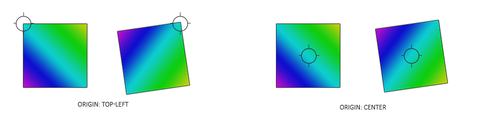

# 渲染精灵

原文   | [Rendering Sprites](http://learnopengl.com/#!In-Practice/2D-Game/Rendering-Sprites)
   ---|---
作者   | JoeyDeVires
翻译   | [ZMANT](https://github.com/Itanq)
校对   |  Krasjet

!!! note

	本节暂未进行完全的重写，错误可能会很多。如果可能的话，请对照原文进行阅读。如果有报告本节的错误，将会延迟至重写之后进行处理。

为了给我们当前这个黑漆漆的游戏世界带来一点生机，我们将会渲染一些精灵(Sprite)来填补这些空虚。<def>精灵</def>有很多种定义，但这里主要是指一个2D图片，它通常是和一些摆放相关的属性数据一起使用，比如位置、旋转角度以及二维的大小。简单来说，精灵就是那些可以在2D游戏中渲染的图像/纹理对象。

我们可以像前面大多数教程里做的那样，用顶点数据创建2D形状，将所有数据传进GPU并手动变换图形。然而，在我们这样的大型应用中，我们最好是对2D形状渲染做一些抽象化。如果我们要对每一个对象手动定义形状和变换的话，很快就会变得非常凌乱了。

在这个教程中，我们将会定义一个渲染类，让我们用最少的代码渲染大量的精灵。这样，我们就可以从散沙一样的OpenGL渲染代码中抽象出游戏代码，这也是在一个大型工程中常用的做法。虽然我们首先还要去配置一个合适的投影矩阵。

## 2D投影矩阵

从这个[坐标系统](../../01 Getting started/08 Coordinate Systems.md)教程中，我们明白了投影矩阵的作用是把观察空间坐标转化为标准化设备坐标。通过生成合适的投影矩阵，我们就可以在不同的坐标系下计算，这可能比把所有的坐标都指定为标准化设备坐标（再计算）要更容易处理。

我们不需要对坐标系应用透视，因为这个游戏完全是2D的，所以一个正射投影矩阵(Orthographic Projection Matrix)就可以了。由于正射投影矩阵几乎直接变换所有的坐标至裁剪空间，我们可以定义如下的投影矩阵指定世界坐标为屏幕坐标：

```c++
glm::mat4 projection = glm::ortho(0.0f, 800.0f, 600.0f, 0.0f, -1.0f, 1.0f);
```

前面的四个参数依次指定了投影平截头体的左、右、下、上边界。这个投影矩阵把所有在0到800之间的x坐标变换到-1到1之间，并把所有在0到600之间的y坐标变换到-1到1之间。这里我们指定了平截头体顶部的y坐标值为0，底部的y坐标值为600。所以，这个场景的左上角坐标为(0,0)，右下角坐标为(800,600)，就像屏幕坐标那样。观察空间坐标直接对应最终像素的坐标。


这样我们就可以指定所有的顶点坐标为屏幕上的像素坐标了，这对2D游戏来说相当直观。

## 渲染精灵

渲染一个实际的精灵应该不会太复杂。我们创建一个有纹理的四边形，它在之后可以使用一个模型矩阵来变换，然后我们会用之前定义的正射投影矩阵来投影它。

!!! important

	由于Breakout是一个静态的游戏，这里不需要观察/摄像机矩阵，我们可以直接使用投影矩阵把世界空间坐标变换到裁剪空间坐标。

为了变换精灵我们会使用下面这个顶点着色器：

```c++
#version 330 core
layout (location = 0) in vec4 vertex; // <vec2 position, vec2 texCoords>

out vec2 TexCoords;

uniform mat4 model;
uniform mat4 projection;

void main()
{
    TexCoords = vertex.zw;
    gl_Position = projection * model * vec4(vertex.xy, 0.0, 1.0);
}
```

注意，我们仅用了一个<fun>vec4</fun>变量来存储位置和纹理坐标数据。因为位置和纹理坐标数据都只包含了两个float，所以我们可以把他们组合在一起作为一个单一的顶点属性。

片段着色器也比较直观。我们会在这里获取一个纹理和一个颜色向量，它们都会影响片段的最终颜色。我们设置了一个纹理和颜色向量，她们两个都会对像素最后的颜色产生影响。有了这个uniform颜色向量，我们就可以很方便地在游戏代码中改变精灵的颜色了。

```c++
#version 330 core
in vec2 TexCoords;
out vec4 color;

uniform sampler2D image;
uniform vec3 spriteColor;

void main()
{
    color = vec4(spriteColor, 1.0) * texture(image, TexCoords);
}
```

为了让精灵的渲染更加有条理，我们定义了一个<fun>SpriteRenderer</fun>类，有了它只需要一个函数就可以渲染精灵了。它的定义如下：

```c++
class SpriteRenderer
{
    public:
        SpriteRenderer(Shader &shader);
        ~SpriteRenderer();

        void DrawSprite(Texture2D &texture, glm::vec2 position, 
            glm::vec2 size = glm::vec2(10, 10), GLfloat rotate = 0.0f, 
            glm::vec3 color = glm::vec3(1.0f));
    private:
        Shader shader; 
        GLuint quadVAO;

        void initRenderData();
};
```

<fun>SpriteRenderer</fun>类封装了一个着色器对象，一个顶点数组对象以及一个渲染和初始化函数。它的构造函数接受一个着色器对象用于之后的渲染。

### 初始化

首先，让我们深入研究一下负责配置<var>quadVAO</var>的<fun>initRenderData</fun>函数：

```c++
void SpriteRenderer::initRenderData()
{
    // 配置 VAO/VBO
    GLuint VBO;
    GLfloat vertices[] = { 
        // 位置     // 纹理
        0.0f, 1.0f, 0.0f, 1.0f,
        1.0f, 0.0f, 1.0f, 0.0f,
        0.0f, 0.0f, 0.0f, 0.0f, 
    
        0.0f, 1.0f, 0.0f, 1.0f,
        1.0f, 1.0f, 1.0f, 1.0f,
        1.0f, 0.0f, 1.0f, 0.0f
    };

    glGenVertexArrays(1, &this->quadVAO);
    glGenBuffers(1, &VBO);
    
    glBindBuffer(GL_ARRAY_BUFFER, VBO);
    glBufferData(GL_ARRAY_BUFFER, sizeof(vertices), vertices, GL_STATIC_DRAW);

    glBindVertexArray(this->quadVAO);
    glEnableVertexAttribArray(0);
    glVertexAttribPointer(0, 4, GL_FLOAT, GL_FALSE, 4 * sizeof(GLfloat), (GLvoid*)0);
    glBindBuffer(GL_ARRAY_BUFFER, 0);  
    glBindVertexArray(0);
}
```

这里，我们首先定义了一组以四边形的左上角为(0,0)坐标的顶点。这意味着当我们在四边形上应用一个位移或缩放变换的时候，它们会从四边形的左上角开始进行变换。这在2D图形以及/或GUI系统中广为接受，元素的位置定义为元素左上角的位置。

接下来我们简单地向GPU传递顶点数据，并且配置顶点属性，当然在这里仅有一个顶点属性。因为所有的精灵共享着同样的顶点数据，我们只需要为这个精灵渲染器定义一个VAO就行了。

### 渲染

渲染精灵并不是太难；我们使用精灵渲染器的着色器，配置一个模型矩阵并且设置相关的uniform。这里最重要的就是变换的顺序：

```c++

void SpriteRenderer::DrawSprite(Texture2D &texture, glm::vec2 position, 
  glm::vec2 size, GLfloat rotate, glm::vec3 color)
{
    // 准备变换
    this->shader.Use();
    glm::mat4 model;
    model = glm::translate(model, glm::vec3(position, 0.0f));  

    model = glm::translate(model, glm::vec3(0.5f * size.x, 0.5f * size.y, 0.0f)); 
    model = glm::rotate(model, rotate, glm::vec3(0.0f, 0.0f, 1.0f)); 
    model = glm::translate(model, glm::vec3(-0.5f * size.x, -0.5f * size.y, 0.0f));

    model = glm::scale(model, glm::vec3(size, 1.0f)); 
  
    this->shader.SetMatrix4("model", model);
    this->shader.SetVector3f("spriteColor", color);
  
    glActiveTexture(GL_TEXTURE0);
    texture.Bind();

    glBindVertexArray(this->quadVAO);
    glDrawArrays(GL_TRIANGLES, 0, 6);
    glBindVertexArray(0);
}  
```

当试图在一个场景中用旋转矩阵和缩放矩阵放置一个对象的时候，建议是首先做缩放变换，再旋转，最后才是位移变换。因为矩阵乘法是从右向左执行的，所以我们变换的矩阵顺序是相反的：移动，旋转，缩放。

旋转变换可能看起来稍微有点让人望而却步。我们从[变换](../../01 Getting started/07 Transformations.md)教程里面知道旋转总是围绕原点(0,0)转动的。因为我们指定了四边形的左上角为(0,0)，所有的旋转都会围绕这个(0,0)。简单来说，在四边形左上角的<def>旋转原点</def>(Origin of Rotation)会产生不想要的结果。我们想要做的是把旋转原点移到四边形的中心，这样旋转就会围绕四边形中心而不是左上角了。我们会在旋转之前把旋转原点移动到四边形中心来解决这个问题。



因为我们首先会缩放这个四边形，我们在位移精灵的中心时还需要把精灵的大小考虑进来（这也是为什么我们乘以了精灵的<var>size</var>向量）。在旋转变换应用之后，我们会反转之前的平移操作。

把所有变换组合起来我们就能以任何想要的方式放置、缩放并平移每个精灵了。下面你可以找到精灵渲染器完整的源代码：

- **精灵渲染器**：[头文件](http://learnopengl.com/code_viewer.php?code=in-practice/breakout/sprite_renderer.h)，[代码](http://learnopengl.com/code_viewer.php?code=in-practice/breakout/sprite_renderer)

## 你好，精灵

有了<fun>SpriteRenderer</fun>类，我们终于能够渲染实际的图像到屏幕上了！让我们来在游戏代码里面初始化一个精灵并且加载我们最喜爱的[纹理](../../img/06/Breakout/03/awesomeface.png)：

```c++
SpriteRenderer  *Renderer;
  
void Game::Init()
{
    // 加载着色器
    ResourceManager::LoadShader("shaders/sprite.vs", "shaders/sprite.frag", nullptr, "sprite");
    // 配置着色器
    glm::mat4 projection = glm::ortho(0.0f, static_cast<GLfloat>(this->Width), 
        static_cast<GLfloat>(this->Height), 0.0f, -1.0f, 1.0f);
    ResourceManager::GetShader("sprite").Use().SetInteger("image", 0);
    ResourceManager::GetShader("sprite").SetMatrix4("projection", projection);
    // 设置专用于渲染的控制
    Renderer = new SpriteRenderer(ResourceManager::GetShader("sprite"));
    // 加载纹理
    ResourceManager::LoadTexture("textures/awesomeface.png", GL_TRUE, "face");
}
```

然后，在渲染函数里面我们就可以渲染一下我们心爱的吉祥物来检测是否一切都正常工作了：

```c++
void Game::Render()
{
    Renderer->DrawSprite(ResourceManager::GetTexture("face"), 
        glm::vec2(200, 200), glm::vec2(300, 400), 45.0f, glm::vec3(0.0f, 1.0f, 0.0f));
}
```

这里我们把精灵放置在靠近屏幕中心的位置，它的高度会比宽度大一点。我们同样也把它旋转了45度并把它设置为绿色。注意，我们设定的精灵的位置是精灵四边形左上角的位置。

如果你一切都做对了你应该可以看到下面的结果：


你可以在[这里](http://learnopengl.com/code_viewer.php?code=in-practice/breakout/game_rendering-sprites)找到更新后的游戏类源代码。

现在我们已经让渲染系统正常工作了，我们可以在[下一节]()教程中用它来构建游戏的关卡。