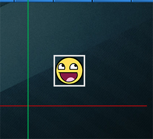
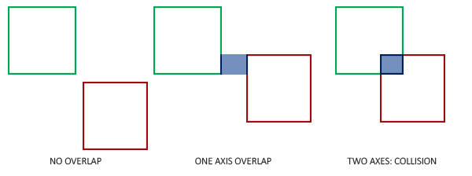
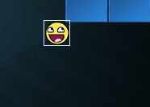
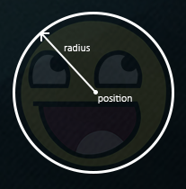
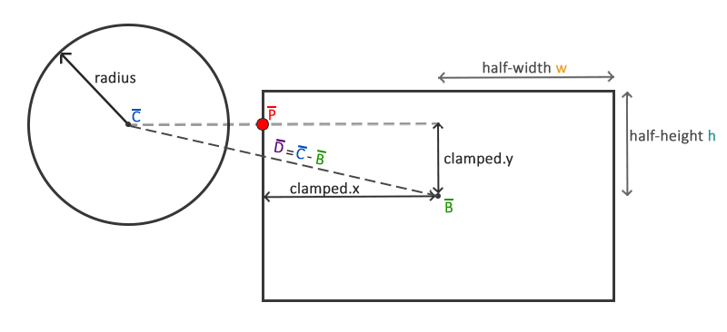
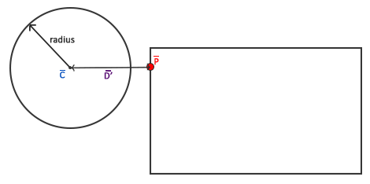

# 碰撞检测

原文     | [Collision detection](https://learnopengl.com/#!In-Practice/2D-Game/Collisions/Collision-detection)
      ---|---
作者     | JoeyDeVries
翻译     | [aillieo](https://github.com/aillieo)
校对     | 暂未校对

!!! note

	本节暂未进行完全的重写，错误可能会很多。如果可能的话，请对照原文进行阅读。如果有报告本节的错误，将会延迟至重写之后进行处理。

当试图判断两个物体之间是否有碰撞发生时，我们通常不使用物体本身的数据，因为这些物体常常会很复杂，这将导致碰撞检测变得很复杂。正因这一点，使用**重叠**在物体上的更简单的外形（通常有较简单明确的数学定义）来进行碰撞检测成为常用的方法。我们基于这些简单的外形来检测碰撞，这样代码会变得更简单且节省了很多性能。这些<def>碰撞外形</def>例如圆、球体、长方形和立方体等，与拥有上百个三角形的网格相比简单了很多。

虽然它们确实提供了更简单更高效的碰撞检测算法，但这些简单的碰撞外形拥有一个共同的缺点，这些外形通常无法完全包裹物体。产生的影响就是当检测到碰撞时，实际的物体并没有真正的碰撞。必须记住的是这些外形仅仅是真实外形的近似。

## AABB - AABB 碰撞

AABB代表的是<def>轴对齐碰撞箱</def>(Axis-aligned Bounding Box)，碰撞箱是指与场景基础坐标轴（2D中的是x和y轴）对齐的长方形的碰撞外形。与坐标轴对齐意味着这个长方形没有经过旋转并且它的边线和场景中基础坐标轴平行（例如，左右边线和y轴平行）。这些碰撞箱总是和场景的坐标轴平行，这使得所有的计算都变得更简单。下边是我们用一个AABB包裹一个球对象（物体）：



Breakout中几乎所有的物体都是基于长方形的物体，因此很理所应当地使用轴对齐碰撞箱来进行碰撞检测。这就是我们接下来要做的。

有多种方式来定义与坐标轴对齐的碰撞箱。其中一种定义AABB的方式是获取左上角点和右下角点的位置。我们定义的<fun>GameObject</fun>类已经包含了一个左上角点位置（它的Position vector）并且我们可以通过把左上角点的矢量加上它的尺寸（<fun>Position</fun> + <fun>Size</fun>）很容易地计算出右下角点。每个<fun>GameObject</fun>都包含一个AABB我们可以高效地使用它们碰撞。

那么我们如何判断碰撞呢？当两个碰撞外形进入对方的区域时就会发生碰撞，例如定义了第一个物体的碰撞外形以某种形式进入了第二个物体的碰撞外形。对于AABB来说很容易判断，因为它们是与坐标轴对齐的：对于每个轴我们要检测两个物体的边界在此轴向是否有重叠。因此我们只是简单地检查两个物体的水平边界是否重合以及垂直边界是否重合。如果水平边界**和**垂直边界都有重叠那么我们就检测到一次碰撞。



将这一概念转化为代码也是很直白的。我们对两个轴都检测是否重叠，如果都重叠就返回碰撞：

```c++
GLboolean CheckCollision(GameObject &one, GameObject &two) // AABB - AABB collision
{
    // x轴方向碰撞？
    bool collisionX = one.Position.x + one.Size.x >= two.Position.x &&
        two.Position.x + two.Size.x >= one.Position.x;
    // y轴方向碰撞？
    bool collisionY = one.Position.y + one.Size.y >= two.Position.y &&
        two.Position.y + two.Size.y >= one.Position.y;
    // 只有两个轴向都有碰撞时才碰撞
    return collisionX && collisionY;
}  
```

我们检查第一个物体的最右侧是否大于第二个物体的最左侧**并且**第二个物体的最右侧是否大于第一个物体的最左侧；垂直的轴向与此相似。如果您无法顺利地将这一过程可视化，可以尝试在纸上画边界线/长方形来自行判断。

为更好地组织碰撞的代码，我们在<fun>Game</fun>类中加入一个额外的函数：

```c++
class Game
{
    public:
        [...]
        void DoCollisions();
};
```

我们可以使用<fun>DoCollisions</fun>来检查球与关卡中的砖块是否发生碰撞。如果检测到碰撞，就将砖块的<fun>Destroyed</fun>属性设为<var>true</var>，此举会停止关卡中对此砖块的渲染。

```c++
void Game::DoCollisions()
{
    for (GameObject &box : this->Levels[this->Level].Bricks)
    {
        if (!box.Destroyed)
        {
            if (CheckCollision(*Ball, box))
            {
                if (!box.IsSolid)
                    box.Destroyed = GL_TRUE;
            }
        }
    }
}  
```

接下来我们需要更新<fun>Game</fun>的<fun>Update</fun>函数：

```c++
void Game::Update(GLfloat dt)
{
    // 更新对象
    Ball->Move(dt, this->Width);
    // 检测碰撞
    this->DoCollisions();
}  
```

此时如果我们运行代码，球会与每个砖块进行碰撞检测，如果砖块不是实心的，则表示砖块被销毁。如果运行游戏以下是你会看到的：

<video src="../../../../img/06/Breakout/05/02/collisions.mp4" controls="controls"></video>

虽然碰撞检测确实生效，但并不是非常准确，因为球会在不直接接触到大多数砖块时与它们发生碰撞。我们来实现另一种碰撞检测技术。

## AABB - 圆碰撞检测

由于球是一个圆形的物体，AABB或许不是球的最佳碰撞外形。碰撞的代码中将球视为长方形框，因此常常会出现球碰撞了砖块但此时球精灵还没有接触到砖块。



使用圆形碰撞外形而不是AABB来代表球会更合乎常理。因此我们在球对象中包含了<var>Radius</var>变量，为了定义圆形碰撞外形，我们需要的是一个位置矢量和一个半径。



这意味着我们不得不修改检测算法，因为当前的算法只适用于两个AABB的碰撞。检测圆和AABB碰撞的算法会稍稍复杂，关键点如下：我们会找到AABB上距离圆最近的一个点，如果圆到这一点的距离小于它的半径，那么就产生了碰撞。

难点在于获取AABB上的最近点\(\bar{P}\)。下图展示了对于任意的AABB和圆我们如何计算该点：



首先我们要获取球心\(\bar{C}\)与AABB中心\(\bar{B}\)的矢量差\(\bar{D}\)。接下来用AABB的半边长(half-extents)\(w\)和\(\bar{h}\)来<def>限制(clamp)</def>矢量\(\bar{D}\)。长方形的半边长是指长方形的中心到它的边的距离；简单的说就是它的尺寸除以2。这一过程返回的是一个总是位于AABB的边上的位置矢量（除非圆心在AABB内部）。

!!! Important

	限制运算把一个值**限制**在给定范围内，并返回限制后的值。通常可以表示为：

		float clamp(float value, float min, float max) {
		    return std::max(min, std::min(max, value));
		}  

	例如，值<var>42.0f</var>被限制到<var>6.0f</var>和<var>3.0f</var>之间会得到<var>6.0f</var>；而<var>4.20f</var>会被限制为<var>4.20f</var>。  
	限制一个2D的矢量表示将其<var>x</var>和<var>y</var>分量都限制在给定的范围内。

这个限制后矢量\(\bar{P}\)就是AABB上距离圆最近的点。接下来我们需要做的就是计算一个新的差矢量\(\bar{D'}\)，它是圆心\(\bar{C}\)和\(\bar{P}\)的差矢量。



既然我们已经有了矢量\(\bar{D'}\)，我们就可以比较它的长度和圆的半径以判断是否发生了碰撞。

这一过程通过下边的代码来表示：

```c++
GLboolean CheckCollision(BallObject &one, GameObject &two) // AABB - Circle collision
{
    // 获取圆的中心 
    glm::vec2 center(one.Position + one.Radius);
    // 计算AABB的信息（中心、半边长）
    glm::vec2 aabb_half_extents(two.Size.x / 2, two.Size.y / 2);
    glm::vec2 aabb_center(
        two.Position.x + aabb_half_extents.x, 
        two.Position.y + aabb_half_extents.y
    );
    // 获取两个中心的差矢量
    glm::vec2 difference = center - aabb_center;
    glm::vec2 clamped = glm::clamp(difference, -aabb_half_extents, aabb_half_extents);
    // AABB_center加上clamped这样就得到了碰撞箱上距离圆最近的点closest
    glm::vec2 closest = aabb_center + clamped;
    // 获得圆心center和最近点closest的矢量并判断是否 length <= radius
    difference = closest - center;
    return glm::length(difference) < one.Radius;
}      
```

我们创建了<fun>CheckCollision</fun>的一个重载函数用于专门处理一个<fun>BallObject</fun>和一个<fun>GameObject</fun>的情况。因为我们并没有在对象中保存碰撞外形的信息，因此我们必须为其计算：首先计算球心，然后是AABB的半边长及中心。

使用这些碰撞外形的参数，我们计算出<var>difference</var>\(\bar{D}\)然后得到限制后的值<var>clamped</var>，并与AABB中心相加得到<var>closest</var>\(\bar{P}\)。然后计算出<var>center</var>和<var>closest</var>的矢量差\(\bar{D'}\)并返回两个外形是否碰撞。

之前我们调用<fun>CheckCollision</fun>时将球对象作为其第一个参数，因此现在<fun>CheckCollision</fun>的重载变量会自动生效，我们无需修改任何代码。现在的结果会比之前的碰撞检测算法更准确。

<video src="../../../../img/06/Breakout/05/02/collisions_circle.mp4" controls="controls"></video>

看起来生效了，但仍缺少一些东西。我们准确地检测了所有碰撞，但碰撞并没有对球产生任何反作用。我们需要在碰撞时产生一些**反作用**，例如当碰撞发生时，更新球的位置和/或速度。这将是[下一个](./03 Collision resolution.md)教程的主题。