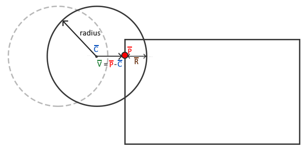

# 碰撞处理

原文     | [Collision resolution](https://learnopengl.com/#!In-Practice/2D-Game/Collisions/Collision-resolution)
      ---|---
作者     | JoeyDeVries
翻译     | [aillieo](https://github.com/aillieo)
校对     | 暂未校对

!!! note

	本节暂未进行完全的重写，错误可能会很多。如果可能的话，请对照原文进行阅读。如果有报告本节的错误，将会延迟至重写之后进行处理。

上个教程的最后，我们得到了一种有效的碰撞检测方案。但是球对检测到的碰撞不会有反作用；它仅仅是径直穿过所有的砖块。我们希望球会从撞击到的砖块**反弹**。此教程将讨论如何使用AABB-圆碰撞方案实现这项称为<def>碰撞处理</def>(Collision Resolution)的功能。

当碰撞发生时，我们希望出现两个现象：重新定位球，以免它进入另一个物体，其次是改变球的速度方向，使它看起来像是物体的反弹。

### 碰撞重定位

为了把球对象定位到碰撞的AABB的外部，我们必须明确球侵入碰撞框的距离。为此我们要回顾上一节教程中的示意图：



此时球少量进入了AABB，所以检测到了碰撞。我们现在希望将球从移出AABB的外形使其仅仅碰触到AABB，像是没有碰撞一样。为了确定需要将球从AABB中移出多少距离，我们需要找回矢量\(\bar{R}\)，它代表的是侵入AABB的程度。为得到\(\bar{R}\)我们用球的半径减去\(\bar{V}\)。矢量\(\bar{V}\)是最近点\(\bar{P}\)和球心\(\bar{C}\)的差矢量。

有了\(\bar{R}\)之后我们将球的位置偏移\(\bar{R}\)就将球直接放置在与AABB紧邻的位置；此时球已经被重定位到合适的位置。

### 碰撞方向

下一步我们需要确定碰撞之后如何更新球的速度。对于Breakout我们使用以下规则来改变球的速度：

1. 如果球撞击AABB的右侧或左侧，它的水平速度（<var>x</var>）将会反转。
2. 如果球撞击AABB的上侧或下侧，它的垂直速度（<var>y</var>）将会反转。

但是如何判断球撞击AABB的方向呢？解决这一问题有很多种方法，其中之一是对于每个砖块使用4个AABB而不是1个AABB，并把它们放置到砖块的每个边上。使用这种方法我们可以确定被碰撞的是哪个AABB和哪个边。但是有一种使用点乘(dot product)的更简单的方法。

您或许还记得[变换](../../../01 Getting started/07 Transformations.md)教程中点乘可以得到两个正交化的矢量的夹角。如果我们定义指向北、南、西和东的四个矢量，然后计算它们和给定矢量的夹角会怎么样？由这四个方向矢量和给定的矢量点乘积的结果中的最高值（点乘积的最大值为`1.0f`，代表`0`度角）即是矢量的方向。

这一过程如下代码所示：

```c++
Direction VectorDirection(glm::vec2 target)
{
    glm::vec2 compass[] = {
        glm::vec2(0.0f, 1.0f),	// 上
        glm::vec2(1.0f, 0.0f),	// 右
        glm::vec2(0.0f, -1.0f),	// 下
        glm::vec2(-1.0f, 0.0f)	// 左
    };
    GLfloat max = 0.0f;
    GLuint best_match = -1;
    for (GLuint i = 0; i < 4; i++)
    {
        GLfloat dot_product = glm::dot(glm::normalize(target), compass[i]);
        if (dot_product > max)
        {
            max = dot_product;
            best_match = i;
        }
    }
    return (Direction)best_match;
}    
```

此函数比较了<var>target</var>矢量和<var>compass</var>数组中各方向矢量。<var>compass</var>数组中与<var>target</var>角度最接近的矢量，即是返回给函数调用者的<var>Direction</var>。这里的<var>Direction</var>是一个<fun>Game</fun>类的头文件中定义的枚举类型：

```c++
enum Direction {
	UP,
	RIGHT,
	DOWN,
	LEFT
};    
```

既然我们已经知道了如何获得\(\bar{R}\)以及如何判断球撞击AABB的方向，我们开始编写碰撞处理的代码。

### AABB - 圆碰撞检测

为了计算碰撞处理所需的数值我们要从碰撞的函数中获取更多的信息而不只只是一个<var>true</var>或<var>false</var>，因此我们要返回一个包含更多信息的<def>tuple</def>，这些信息即是碰撞发生时的方向及差矢量（\(\bar{R}\)）。你可以在头文件<var><tuple></var>中找到<var>tuple</var>。

为了更好组织代码，我们把碰撞相关的数据使用typedef定义为<fun>Collision</fun>：

```c++
typedef std::tuple<GLboolean, Direction, glm::vec2> Collision;    
```

接下来我们还需要修改<fun>CheckCollision</fun>函数的代码，使其不仅仅返回<var>true</var>或<var>false</var>而是还包含方向和差矢量：

```c++
Collision CheckCollision(BallObject &one, GameObject &two) // AABB - AABB 碰撞
{
    [...]
    if (glm::length(difference) <= one.Radius)
        return std::make_tuple(GL_TRUE, VectorDirection(difference), difference);
    else
        return std::make_tuple(GL_FALSE, UP, glm::vec2(0, 0));
}
```

<fun>Game</fun>类的<fun>DoCollision</fun>函数现在不仅仅只检测是否出现了碰撞，而且在碰撞发生时会有适当的动作。此函数现在会计算碰撞侵入的程度（如本教程一开始计时的示意图中所示）并且基于碰撞方向使球的位置矢量与其相加或相减。

```c++
void Game::DoCollisions()
{
    for (GameObject &box : this->Levels[this->Level].Bricks)
    {
        if (!box.Destroyed)
        {
            Collision collision = CheckCollision(*Ball, box);
            if (std::get<0>(collision)) // 如果collision 是 true
            {
                // 如果砖块不是实心就销毁砖块
                if (!box.IsSolid)
                    box.Destroyed = GL_TRUE;
                // 碰撞处理
                Direction dir = std::get<1>(collision);
                glm::vec2 diff_vector = std::get<2>(collision);
                if (dir == LEFT || dir == RIGHT) // 水平方向碰撞
                {
                    Ball->Velocity.x = -Ball->Velocity.x; // 反转水平速度
                    // 重定位
                    GLfloat penetration = Ball->Radius - std::abs(diff_vector.x);
                    if (dir == LEFT)
                        Ball->Position.x += penetration; // 将球右移
                    else
                        Ball->Position.x -= penetration; // 将球左移
                }
                else // 垂直方向碰撞
                {
                    Ball->Velocity.y = -Ball->Velocity.y; // 反转垂直速度
                    // 重定位
                    GLfloat penetration = Ball->Radius - std::abs(diff_vector.y);
                    if (dir == UP)
                        Ball->Position.y -= penetration; // 将球上移
                    else
                        Ball->Position.y += penetration; // 将球下移
                }
            }
        }
    }
}    
```

不要被函数的复杂度给吓到，因为它仅仅是我们目前为止的概念的直接转化。首先我们会检测碰撞如果发生了碰撞且砖块不是实心的那么就销毁砖块。然后我们从tuple中获取到了碰撞的方向<var>dir</var>以及表示\(\bar{V}\)的差矢量<var>diff_vector</var>，最终完成碰撞处理。

我们首先检查碰撞方向是水平还是垂直，并据此反转速度。如果是水平方向，我们从<var>diff_vector</var>的x分量计算侵入量RR并根据碰撞方向用球的位置矢量加上或减去它。垂直方向的碰撞也是如此，但是我们要操作各矢量的y分量。

现在运行你的应用程序，应该会向你展示一套奏效的碰撞方案，但可能会很难真正看到它的效果，因为一旦球碰撞到了一个砖块就会弹向底部并永远丢失。我们可以通过处理玩家挡板的碰撞来修复这一问题。

## 玩家 - 球碰撞

球和玩家之间的碰撞与我们之前讨论的碰撞稍有不同，因为这里应当基于撞击挡板的点与（挡板）中心的距离来改变球的水平速度。撞击点距离挡板的中心点越远，则水平方向的速度就会越大。

```c++
void Game::DoCollisions()
{
    [...]
    Collision result = CheckCollision(*Ball, *Player);
    if (!Ball->Stuck && std::get<0>(result))
    {
        // 检查碰到了挡板的哪个位置，并根据碰到哪个位置来改变速度
        GLfloat centerBoard = Player->Position.x + Player->Size.x / 2;
        GLfloat distance = (Ball->Position.x + Ball->Radius) - centerBoard;
        GLfloat percentage = distance / (Player->Size.x / 2);
        // 依据结果移动
        GLfloat strength = 2.0f;
        glm::vec2 oldVelocity = Ball->Velocity;
        Ball->Velocity.x = INITIAL_BALL_VELOCITY.x * percentage * strength; 
        Ball->Velocity.y = -Ball->Velocity.y;
        Ball->Velocity = glm::normalize(Ball->Velocity) * glm::length(oldVelocity);
    } 
}
```

在我们完成了球和各砖块的碰撞检测之后，我们来检测球和玩家挡板是否发生碰撞。如果有碰撞（并且球不是被固定在挡板上）我们要计算球的中心与挡板中心的距离和挡板的半边长的百分比。之后球的水平速度会依据它撞击挡板的点到挡板中心的距离来更新。除了更新水平速度之外我们还需要反转它的y方向速度。

注意旧的速度被存储为<var>oldVelocity</var>。之所以要存储旧的速度是因为我们只更新球的速度矢量中水平方向的速度并保持它的y速度不变。这将意味着矢量的长度会持续变化，其产生的影响是如果球撞击到挡板的边缘则会比撞击到挡板中心有更大(也因此更强)的速度矢量。为此新的速度矢量会正交化然后乘以旧速度矢量的长度。这样一来，球的力量和速度将总是一一致的，无论它撞击到挡板的哪个地方。

### 粘板

无论你有没有注意到，但当运行代码时，球和玩家挡板的碰撞处理仍旧有一个大问题。以下的视频清楚地展示了将会出现的现象：

<video src="../../../../img/06/Breakout/05/03/collisions_sticky_paddle.mp4" controls="controls"></video>

这种问题称为<def>粘板问题</def>(Sticky Paddle Issue)，出现的原因是玩家挡板以较高的速度移向球，导致球的中心进入玩家挡板。由于我们没有考虑球的中心在AABB内部的情况，游戏会持续试图对所有的碰撞做出响应，当球最终脱离时，已经对`y`向速度翻转了多次，以至于无法确定球在脱离后是向上还是向下运动。

我们可以引入一个小的特殊处理来很容易地修复这种行为，这个处理之所以成为可能是基于我们可以假设碰撞总是发生在挡板顶部的事实。我们总是简单地返回正的<var>y</var>速度而不是反转<var>y</var>速度，这样当它被卡住时也可以立即脱离。

```c++
 //Ball->Velocity.y = -Ball->Velocity.y;
Ball->Velocity.y = -1 * abs(Ball->Velocity.y);  
```

如果你足够仔细就会觉得这一影响仍然是可以被注意到的，但是我个人将此方法当作一种可接受的折衷处理。

### 底部边界

与经典的Breakout内容相比唯一缺少的就是失败条件了，失败会重置关卡和玩家。在<fun>Game</fun>类的<fun>Update</fun>函数中，我们要检查球是否接触到了底部边界，如果接触到就重置游戏。

```c++
void Game::Update(GLfloat dt)
{
    [...]
    if (Ball->Position.y >= this->Height) // 球是否接触底部边界？
    {
        this->ResetLevel();
        this->ResetPlayer();
    }
}  
```

<fun>ResetLevel</fun>和<fun>ResetPlayer</fun>函数直接重新加载关卡并重置对象的各变量值为原始的值。现在游戏看起来应该是这样的：

<video src="../../../../img/06/Breakout/05/03/collisions_complete.mp4" controls="controls"></video>

就是这样了，我们创建完成了一个有相似机制的经典Breakout游戏的复制版。这里你可以找到Game类的源代码：[header](https://learnopengl.com/code_viewer.php?code=in-practice/breakout/game_collisions.h)，[code](https://learnopengl.com/code_viewer.php?code=in-practice/breakout/game_collisions)。

## 一些注意事项

在视频游戏的发展过程中，碰撞检测是一个困难的话题甚至可能是最大的挑战。大多数的碰撞检测和处理方案是和物理引擎合并在一起的，正如多数现代的游戏中看到的那样。我们在Breakout游戏中使用的碰撞方案是一个非常简单的方案并且是专门给这类游戏所专用的。

需要强调的是这类碰撞检测和处理方式是不完美的。它只能计算每帧内可能发生的碰撞并且只能计算在该时间步时物体所在的各位置；这意味着如果一个物体拥有一个很大的速度以致于在一帧内穿过了另一个物体，它将看起来像是从来没有与另一个物体碰撞过。因此如果出现掉帧或出现了足够高的速度，这一碰撞检测方案将无法应对。

（我们使用的碰撞方案）仍然会出现这几个问题：

- 如果球运动得足够快，它可能在一帧内完整地穿过一个物体，而不会检测到碰撞。
- 如果球在一帧内同时撞击了一个以上的物体，它将会检测到两次碰撞并两次反转速度；这样不改变它的原始速度。
- 撞击到砖块的角时会在错误的方向反转速度，这是因为它在一帧内穿过的距离会引发<fun>VectorDirection</fun>返回水平方向还是垂直方向的差别。

但是，本教程目的在于教会读者们图形学和游戏开发的基础知识。因此，这里的碰撞方案可以服务于此目的；它更容易理解且在正常的场景中可以较好地运作。需要记住的是存在有更好的（更复杂）碰撞方案，在几乎所有的场景中都可以很好地运作（包括可移动的物体）如<def>分离轴定理</def>(Separating Axis Theorem)。

值得庆幸的是，有大量实用并且常常很高效的物理引擎（使用时间步无关的碰撞方案）可供您在游戏中使用。如果您希望在这一系统中有更深入的探索或需要更高级的物理系统又不理解其中的数学机理，[Box2D](http://box2d.org/about/)是一个实现了物理系统和碰撞检测的可以用在您的应用程序中的完美的2D物理库。