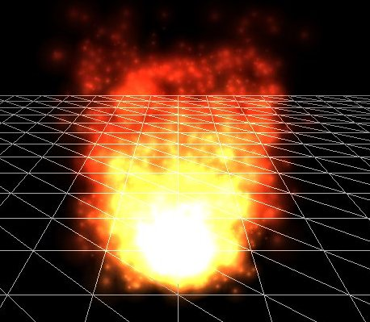

# 粒子

原文    | [Particles](http://learnopengl.com/#!In-Practice/2D-Game/Particles)
-----   |  ----
作者    | JoeydeVries
翻译    | [ZMANT](https://github.com/Itanq)
校对    | 暂无

!!! note

	本节暂未进行完全的重写，错误可能会很多。如果可能的话，请对照原文进行阅读。如果有报告本节的错误，将会延迟至重写之后进行处理。

一个微粒,从OpenGL的角度看就是一个总是面向摄像机方向且(通常)包含一个大部分区域是透明的纹理的小四边形。一个微粒本身主要就是一个精灵(sprite),前面我们已经早就使用过了，但是当你把成千上万个这些微粒放在一起的时候,就可以创造出令人疯狂的效果.

当处理这些微粒的时候，通常是由一个叫做粒子发射器或粒子生成器的东西完成的，从这个地方,持续不断的产生新的微粒并且旧的微粒随着时间逐渐消亡。如果这个粒子发射器产生一个带着类似烟雾纹理的微粒的时候，它的颜色亮度同时又随着与发射器距离的增加而变暗，那么就会产生出灼热的火焰的效果:



一个单一的微粒通常有一个生命值变量，并且从它产生开始就一直在缓慢的减少。一旦它的生命值少于某个极限值（通常是0）我们就会杀掉这个粒子,这样下一个粒子产生时就可以让它来替换那个被杀掉的粒子。一个粒子发射器控制它产生的所有粒子并且根据它们的属性来改变它们的行为。一个粒子通常有下面的属性：

```c++
struct Particle {
    glm::vec2 Position, Velocity;
    glm::vec4 Color;
    GLfloat Life;
  
    Particle() 
      : Position(0.0f), Velocity(0.0f), Color(1.0f), Life(0.0f) { }
};
```

看上面那个火焰的例子，那个粒子发射器可能在靠近发射器的地方产生每一个粒子，并且有一个向上的速度，这样每个粒子都是朝着正$y$轴方向移动。那似乎有3个不同区域，只是可能相比其他的区域，给了某个区域内的粒子更快的速度。我们也可以看到，$y$轴方向越高的粒子，它们的黄色或者说亮度就越低。一旦某个粒子到达某个高度的时候，它的生命值就会耗尽然后被杀掉；绝不可能直冲云霄。

你可以想象到用这样一个系统，我们就可以创造一些有趣的效果比如火焰，青烟，烟雾，魔法效果，炮火残渣等等。在Breakout游戏里，我们将会使用下面那个小球来创建一个简单的粒子生成器来制作一些有趣的效果，结果看起来就像这样：

<video src="../../../img/06/Breakout/06/particles.mp4" controls="controls"></video>

上面那个粒子生成器在这个球的位置产生无数的粒子，根据球移动的速度给了粒子相应的速度，并且根据它们的生命值来改变他们的颜色亮度。

为了渲染这些粒子，我们将会用到有不同实现的着色器：

```c++
#version 330 core
layout (location = 0) in vec4 vertex; // <vec2 position, vec2 texCoords>

out vec2 TexCoords;
out vec4 ParticleColor;

uniform mat4 projection;
uniform vec2 offset;
uniform vec4 color;

void main()
{
    float scale = 10.0f;
    TexCoords = vertex.zw;
    ParticleColor = color;
    gl_Position = projection * vec4((vertex.xy * scale) + offset, 0.0, 1.0);
}
```

以及像素着色器:

```c++
#version 330 core
in vec2 TexCoords;
in vec4 ParticleColor;
out vec4 color;

uniform sampler2D sprite;

void main()
{
    color = (texture(sprite, TexCoords) * ParticleColor);
}
```

我们获取每个粒子的位置和纹理属性并且设置两个uniform变量：$offset$和$color$来改变每个粒子的输出状态。注意到，在顶点着色器里，我们把这个四边形的粒子缩小了10倍；你也可以把这个缩放变量设置成uniform类型的变量从而控制一些个别的粒子。

首先,我们需要一个粒子数组，然后用Particle结构体的默认构造函数来实例化。

```c++
GLuint nr_particles = 500;
std::vector<Particle> particles;
  
for (GLuint i = 0; i < nr_particles; ++i)
    particles.push_back(Particle());
```

然后在每一帧里面，我们都会用一个起始变量来产生一些新的粒子并且对每个粒子（还活着的）更新它们的值。

```c++
GLuint nr_new_particles = 2;
// Add new particles
for (GLuint i = 0; i < nr_new_particles; ++i)
{
    int unusedParticle = FirstUnusedParticle();
    RespawnParticle(particles[unusedParticle], object, offset);
}
// Update all particles
for (GLuint i = 0; i < nr_particles; ++i)
{
    Particle &p = particles[i];
    p.Life -= dt; // reduce life
    if (p.Life > 0.0f)
    {	// particle is alive, thus update
        p.Position -= p.Velocity * dt;
        p.Color.a -= dt * 2.5;
    }
}
```

第一个循环看起来可能有点吓人。因为这些粒子会随着时间消亡，我们就想在每一帧里面产生`nr_new_particles`个新粒子。但是一开始我们就知道了总的粒子数量是`nr_partiles`，所以我们不能简单的往粒子数组里面添加新的粒子。否则的话我们很快就会得到一个装满成千上万个粒子的数组，考虑到这个粒子数组里面其实只有一小部分粒子是存活的，这样就太浪费效率了。

我们要做的就是找到第一个消亡的粒子然后用一个新产生的粒子来更新它。函数`FirstUnuseParticle`就是试图找到第一个消亡的粒子并且返回它的索引值给调用者。

```c++
GLuint lastUsedParticle = 0;
GLuint FirstUnusedParticle()
{
    // Search from last used particle, this will usually return almost instantly
    for (GLuint i = lastUsedParticle; i < nr_particles; ++i){
        if (particles[i].Life <= 0.0f){
            lastUsedParticle = i;
            return i;
        }
    }
    // Otherwise, do a linear search
    for (GLuint i = 0; i < lastUsedParticle; ++i){
        if (particles[i].Life <= 0.0f){
            lastUsedParticle = i;
            return i;
        }
    }
    // Override first particle if all others are alive
    lastUsedParticle = 0;
    return 0;
}
```

这个函数存储了它找到的上一个消亡的粒子的索引值，由于下一个消亡的粒子索引值总是在上一个消亡的粒子索引值的右边，所以我们首先从它存储的上一个消亡的粒子索引位置开始查找，如果我们没有任何消亡的粒子，我们就简单的做一个线性查找，如果没有粒子消亡就返回索引值`0`，结果就是第一个粒子被覆盖，需要注意的是，如果是最后一种情况，就意味着你粒子的生命值太长了，在每一帧里面需要产生更少的粒子，或者你只是没有保留足够的粒子，

之后，一旦粒子数组中第一个消亡的粒子被发现的时候，我们就通过调用`RespawnParticle`函数更新它的值，函数接受一个`Particle`对象，一个`GameObject`对象和一个`offset`向量:

```c++
void RespawnParticle(Particle &particle, GameObject &object, glm::vec2 offset)
{
    GLfloat random = ((rand() % 100) - 50) / 10.0f;
    GLfloat rColor = 0.5 + ((rand() % 100) / 100.0f);
    particle.Position = object.Position + random + offset;
    particle.Color = glm::vec4(rColor, rColor, rColor, 1.0f);
    particle.Life = 1.0f;
    particle.Velocity = object.Velocity * 0.1f;
}
```

这个函数简单的重置这个粒子的生命值为1.0f，随机的给一个大于`0.5`的颜色值(经过颜色向量)并且(在物体周围)分配一个位置和速度基于游戏里的物体。

对于更新函数里的第二个循环遍历了所有粒子，并且对于每个粒子的生命值都减去一个时间差；这样每个粒子的生命值就精确到了秒。然后再检查这个粒子是否是还活着的，若是,则更新它的位置和颜色属性。这里我们缓慢的减少粒子颜色值的`alpha`值，以至于它看起来就是随着时间而缓慢的消亡。

最后保留下来就是实际需要渲染的粒子：

```c++
glBlendFunc(GL_SRC_ALPHA, GL_ONE);
particleShader.Use();
for (Particle particle : particles)
{
    if (particle.Life > 0.0f)
    {
        particleShader.SetVector2f("offset", particle.Position);
        particleShader.SetVector4f("color", particle.Color);
        particleTexture.Bind();
        glBindVertexArray(particleVAO);
        glDrawArrays(GL_TRIANGLES, 0, 6);
        glBindVertexArray(0);
    } 
} 
glBlendFunc(GL_SRC_ALPHA, GL_ONE_MINUS_SRC_ALPHA);
```

在这，对于每个粒子，我们一一设置他们的`uniform`变量`offse`和`color`，绑定纹理，然后渲染`2D`四边形的粒子。有趣的是我们在这看到了两次调用函数`glBlendFunc`。当要渲染这些粒子的时候，我们使用`GL_ONE`替换默认的目的因子模式`GL_ONE_MINUS_SRC_ALPHA`，这样，这些粒子叠加在一起的时候就会产生一些平滑的发热效果，就像在这个教程前面那样使用混合模式来渲染出火焰的效果也是可以的，这样在有大多数粒子的中心就会产生更加灼热的效果。

因为我们(就像这个系列教程的其他部分一样)喜欢让事情变得有条理，所以我们就创建了另一个类`ParticleGenerator`来封装我们刚刚谈到的所有功能。你可以在下面的链接里找到源码：
>* [header](http://www.learnopengl.com/code_viewer.php?code=in-practice/breakout/particle_generator.h)，[code](http://www.learnopengl.com/code_viewer.php?code=in-practice/breakout/particle_generator)

然后在游戏代码里,我们创建这样一个粒子发射器并且用[这个](../../img/06/Breakout/06/particle.png)纹理初始化。

```c++
ParticleGenerator   *Particles; 

void Game::Init()
{
    [...]
    ResourceManager::LoadShader("shaders/particle.vs", "shaders/particle.frag", nullptr, "particle");
    [...]
    ResourceManager::LoadTexture("textures/particle.png", GL_TRUE, "particle"); 
    [...]
    Particles = new ParticleGenerator(
        ResourceManager::GetShader("particle"), 
        ResourceManager::GetTexture("particle"), 
        500
    );
}
```

然后我们在`Game`类的`Updata`函数里为粒子生成器添加一条更新语句：

```c++
void Game::Update(GLfloat dt)
{
    [...]
    // Update particles
    Particles->Update(dt, *Ball, 2, glm::vec2(Ball->Radius / 2));
    [...]
}
```

每个粒子都将使用球的游戏对象属性对象，每帧产生两个粒子并且他们都是偏向球得中心，最后是渲染粒子：

```c++
void Game::Render()
{
    if (this->State == GAME_ACTIVE)
    {
        [...]
        // Draw player
        Player->Draw(*Renderer);
        // Draw particles	
        Particles->Draw();
        // Draw ball
        Ball->Draw(*Renderer);
    }
}
```

注意到，我们是在渲染球体之前且在渲染其他物体之后渲染粒子的，这样，粒子就会在所有其他物体面前，但报纸在球体之后，你可以在[这里](http://learnopengl.com/code_viewer.php?code=in-practice/breakout/game_particles)找到更新的`game`类的源码。

如果你现在编译并运行你的程序，你可能会看到在球体之后有一条小尾巴。就像这个教程开始的那样，给了这个游戏更加现代化的面貌。这个系统还可以很容易的扩展到更高级效果的主体上，就用这个粒子生成器自由的去实验吧，看看你是否可以创建出你自己的特效。


