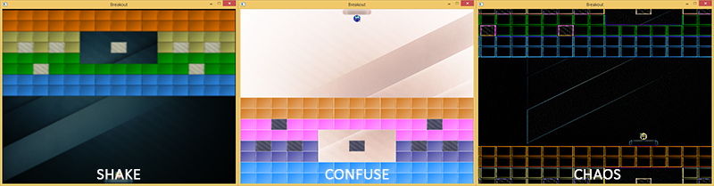

# 后期处理

原文    | [Postprocessing](https://learnopengl.com/#!In-Practice/2D-Game/Postprocessing)
-----   |  ----
作者    | JoeydeVries
翻译    | [包纸](https://github.com/ShirokoSama)
校对    | 暂无

!!! note

	本节暂未进行完全的重写，错误可能会很多。如果可能的话，请对照原文进行阅读。如果有报告本节的错误，将会延迟至重写之后进行处理。

如果我们可以通过几个后期处理(Postprocess)特效丰富Breakout游戏的视觉效果的话，会不会是一件很有趣的事情？利用OpenGL的帧缓冲，我们可以相对容易地创造出模糊的抖动效果、反转场景里的所有颜色、做一些“疯狂”的顶点运动、或是使用一些其他有趣的特效。

!!! important

    这章教程广泛运用了之前[帧缓冲](../../04 Advanced OpenGL/05 Framebuffers.md)与[抗锯齿](../../04 Advanced OpenGL/11 Anti Aliasing.md)章节的概念。

在教程的帧缓冲章节里，我们演示了如何使用单个纹理，通过后期处理特效实现有趣的效果（反相、灰度、模糊、锐化、边缘检测）。在Breakout中我们将做一些类似的事情：我们会创建一个帧缓冲对象，并附带一个多重采样的渲染缓冲对象作为其颜色附件。游戏中所有的渲染相关代码都应该渲染至这个多重采样的帧缓冲，然后将其内容传输([Bit blit](https://en.wikipedia.org/wiki/Bit_blit))至一个不同的帧缓冲中，该帧缓冲用一个纹理作为其颜色附件。这个纹理会包含游戏的渲染后的抗锯齿图像，我们对它应用零或多个后期处理特效后渲染至一个大的2D四边形。（译注：这段表述的复杂流程与教程帧缓冲章节的内容相似，原文中包含大量易混淆的名词与代词，建议读者先仔细理解帧缓冲章节的内容与流程）。

总结一下这些渲染步骤：

1. 绑定至多重采样的帧缓冲
2. 和往常一样渲染游戏
3. 将多重采样的帧缓冲内容传输至一个普通的帧缓冲中（这个帧缓冲使用了一个纹理作为其颜色缓冲附件）
4. 解除绑定（绑定回默认的帧缓冲）
5. 在后期处理着色器中使用来自普通帧缓冲的颜色缓冲纹理
6. 渲染屏幕大小的四边形作为后期处理着色器的输出

我们的后期处理着色器允许使用三种特效：**shake**, **confuse**和**chaos**。

- **shake**：轻微晃动场景并附加一个微小的模糊效果。
- **shake**：反转场景中的颜色并颠倒x轴和y轴。
- **chaos**: 利用边缘检测卷积核创造有趣的视觉效果，并以圆形旋转动画的形式移动纹理图片，实现“混沌”特效。

以下是这些效果的示例：



在2D四边形上操作的顶点着色器如下所示：

```c++
#version 330 core
layout (location = 0) in vec4 vertex; // <vec2 position, vec2 texCoords>

out vec2 TexCoords;

uniform bool  chaos;
uniform bool  confuse;
uniform bool  shake;
uniform float time;

void main()
{
    gl_Position = vec4(vertex.xy, 0.0f, 1.0f); 
    vec2 texture = vertex.zw;
    if(chaos)
    {
        float strength = 0.3;
        vec2 pos = vec2(texture.x + sin(time) * strength, texture.y + cos(time) * strength);        
        TexCoords = pos;
    }
    else if(confuse)
    {
        TexCoords = vec2(1.0 - texture.x, 1.0 - texture.y);
    }
    else
    {
        TexCoords = texture;
    }
    if (shake)
    {
        float strength = 0.01;
        gl_Position.x += cos(time * 10) * strength;        
        gl_Position.y += cos(time * 15) * strength;        
    }
}  
```

基于uniform是否被设置为true，顶点着色器可以执行不同的分支。如果<var>chaos</var>或<var>confuse</var>被设置为true，顶点着色器将操纵纹理坐标来移动场景（以圆形动画变换纹理坐标或反转纹理坐标）。因为我们将纹理环绕方式设置为了<var>GL_REPEAT</var>，所以**chaos**特效会导致场景在四边形的各个部分重复。除此之外，如果**shake**被设置为true，它将微量移动顶点位置。需要注意的是，<var>chaos</var>与<var>confuse</var>不应同时为true，而<var>shake</var>则可以与其他特效一起生效。

当任意特效被激活时，除了偏移顶点的位置和纹理坐标，我们也希望创造显著的视觉效果。我们可以在片段着色器中实现这一点：

```c++
#version 330 core
in  vec2  TexCoords;
out vec4  color;
  
uniform sampler2D scene;
uniform vec2      offsets[9];
uniform int       edge_kernel[9];
uniform float     blur_kernel[9];

uniform bool chaos;
uniform bool confuse;
uniform bool shake;

void main()
{
    color = vec4(0.0f);
    vec3 sample[9];
    // 如果使用卷积矩阵，则对纹理的偏移像素进行采样
    if(chaos || shake)
        for(int i = 0; i < 9; i++)
            sample[i] = vec3(texture(scene, TexCoords.st + offsets[i]));

    // 处理特效
    if(chaos)
    {           
        for(int i = 0; i < 9; i++)
            color += vec4(sample[i] * edge_kernel[i], 0.0f);
        color.a = 1.0f;
    }
    else if(confuse)
    {
        color = vec4(1.0 - texture(scene, TexCoords).rgb, 1.0);
    }
    else if(shake)
    {
        for(int i = 0; i < 9; i++)
            color += vec4(sample[i] * blur_kernel[i], 0.0f);
        color.a = 1.0f;
    }
    else
    {
        color =  texture(scene, TexCoords);
    }
}
```

这个着色器几乎直接构建自帧缓冲教程的片段着色器，并根据被激活的特效类型进行相应的后期处理。这一次，偏移矩阵(offset matrix)和卷积核作为uniform变量，由应用程序中的代码定义。好处是我们只需要设置这些内容一次，而不必在每个片段着色器执行时重新计算这些矩阵。例如，偏移矩阵的配置如下所示：

```c++
GLfloat offset = 1.0f / 300.0f;
GLfloat offsets[9][2] = {
    { -offset,  offset  },  // 左上
    {  0.0f,    offset  },  // 中上
    {  offset,  offset  },  // 右上
    { -offset,  0.0f    },  // 左中
    {  0.0f,    0.0f    },  // 正中
    {  offset,  0.0f    },  // 右中
    { -offset, -offset  },  // 左下
    {  0.0f,   -offset  },  // 中下
    {  offset, -offset  }   // 右下
};
glUniform2fv(glGetUniformLocation(shader.ID, "offsets"), 9, (GLfloat*)offsets);  
```

由于所有管理帧缓冲器的概念已经在之前的教程中有过广泛的讨论，所以这次我不会深入其细节。下面是<fun>PostProcessor</fun>类的代码，它管理初始化，读写帧缓冲并将一个四边形渲染至屏幕。如果你理解了帧缓冲与反锯齿章节的教程，你应该可以完全它的代码。

- **PostProcessor**：[头文件](https://learnopengl.com/code_viewer.php?code=in-practice/breakout/post_processor.h)，[代码](https://learnopengl.com/code_viewer.php?code=in-practice/breakout/post_processor)

有趣的是<fun>BeginRender</fun>和<fun>EndRender</fun>函数。由于我们必须将整个游戏场景渲染至帧缓冲中，因此我们可以在场景的渲染代码之前和之后分别调用<fun>BeginRender</fun>和<fun>EndRender</fun>。接着，这个类将处理幕后的帧缓冲操作。在游戏的渲染函数中使用<fun>PostProcessor</fun>类如下所示：

```c++
PostProcessor   *Effects;

void Game::Render()
{
    if (this->State == GAME_ACTIVE)
    {
        Effects->BeginRender();
            // 绘制背景
            // 绘制关卡
            // 绘制挡板
            // 绘制粒子
            // 绘制小球
        Effects->EndRender();
        Effects->Render(glfwGetTime());
    }
}
```

无论我们需要什么，我们只需要将需要的<fun>PostProcessor</fun>类中的特效属性设置为true，其效果就可以立即可见。

## Shake it

作为这些效果的演示，我们将模拟球击中坚固的混凝土块时的视觉冲击。无论在哪里发生碰撞，只要在短时间内实现晃动(shake)效果，便能增强撞击的冲击感。

我们只想允许晃动效果持续一小段时间。我们可以通过声明一个持有晃动效果持续时间的变量<var>ShakeTime</var>来实现这个功能。无论碰撞何时发生，我们将这个变量重置为一个特定的持续时间:

```c++
GLfloat ShakeTime = 0.0f;  

void Game::DoCollisions()
{
    for (GameObject &box : this->Levels[this->Level].Bricks)
    {
        if (!box.Destroyed)
        {
            Collision collision = CheckCollision(*Ball, box);
            if (std::get<0>(collision)) // 如果发生了碰撞
            {
                // 如果不是实心的砖块则摧毁
                if (!box.IsSolid)
                    box.Destroyed = GL_TRUE;
                else
                {   // 如果是实心的砖块则激活shake特效
                    ShakeTime = 0.05f;
                    Effects->Shake = true;
                }
                [...]
            }
        }    
    }
    [...]
}  
```

然后在游戏的<fun>Update</fun>函数中，我们减少<var>ShakeTime</var>变量的值直到其为0.0，并停用shake特效。

```c++
void Game::Update(GLfloat dt)
{
    [...]
    if (ShakeTime > 0.0f)
    {
        ShakeTime -= dt;
        if (ShakeTime <= 0.0f)
            Effects->Shake = false;
    }
}  
```

这样，每当我们碰到一个实心砖块时，屏幕会短暂地抖动与模糊，给玩家一些小球与坚固物体碰撞的视觉反馈。

<video src="https://learnopengl.com/video/in-practice/breakout/postprocessing_shake.mp4" controls="controls"></video>

你可以在[这里](https://learnopengl.com/code_viewer.php?code=in-practice/breakout/game_postprocessing)找到更新后的<fun>Game</fun>类。

在[下一章](./08 Powerups.md)关于“道具”的教程中我们将带来另外两种的特效的使用。