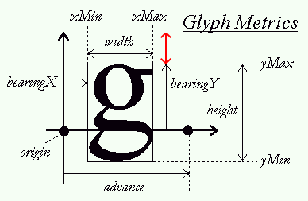
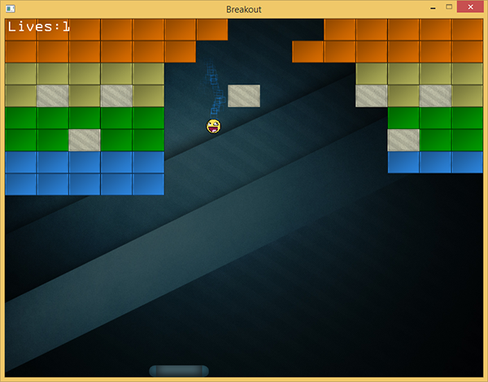
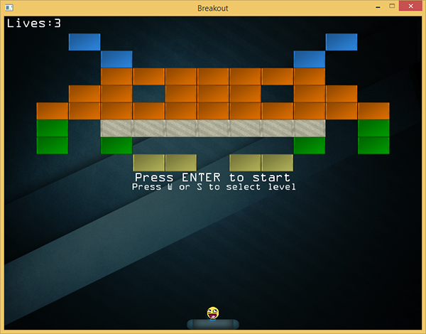
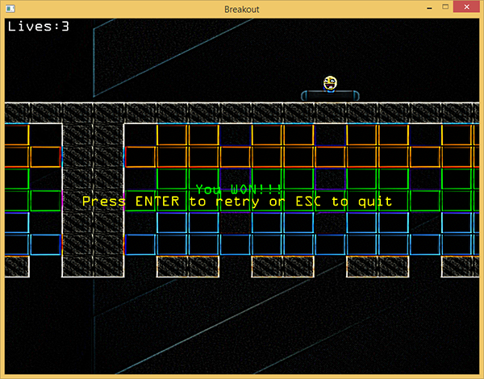

# 渲染文本

| 原文   | [Render text](https://learnopengl.com/#!In-Practice/2D-Game/Render-text) |
| ---- | ---------------------------------------- |
| 作者   | JoeydeVries                              |
| 翻译   | [aillieo](https://github.com/aillieo)    |
| 校对   | 暂无                                       |

!!! note

	本节暂未进行完全的重写，错误可能会很多。如果可能的话，请对照原文进行阅读。如果有报告本节的错误，将会延迟至重写之后进行处理。

本教程中将通过增加生命值系统、获胜条件和渲染文本形式的反馈来对游戏做最后的完善。本教程很大程度上是建立在之前的教程[文本渲染](../02 Text Rendering.md)基础之上，因此如果没有看过的话，强烈建议您先一步一步学习之前的教程。

在Breakout中，所有的文本渲染代码都封装在一个名为<fun>TextRenderer</fun>的类中，其中包含FreeType库的初始化、渲染配置和实际渲染代码等重要组成部分。以下是<fun>TextRenderer</fun>类的代码：

- **TextRenderer**: [header](https://learnopengl.com/code_viewer.php?code=in-practice/breakout/text_renderer.h), [code](https://learnopengl.com/code_viewer.php?code=in-practice/breakout/text_renderer).
- **Text shaders**: [vertex](https://learnopengl.com/code_viewer.php?code=in-practice/text_rendering&type=vertex), [fragment](https://learnopengl.com/code_viewer.php?code=in-practice/text_rendering&type=fragment).

文本渲染器中函数的内容几乎与文本渲染教程中的代码完全一样。但用于向屏幕渲染字形的代码稍有不同：

```C++
void TextRenderer::RenderText(std::string text, GLfloat x, GLfloat y, GLfloat scale,glm::vec3 color)
{
    [...]
    for (c = text.begin(); c != text.end(); c++)
    {
        GLfloat xpos = x + ch.Bearing.x * scale;
        GLfloat ypos = y + (this->Characters['H'].Bearing.y - ch.Bearing.y) * scale;

        GLfloat w = ch.Size.x * scale;
        GLfloat h = ch.Size.y * scale;
        // 为每个字符更新VBO
        GLfloat vertices[6][4] = {
            { xpos,     ypos + h,   0.0, 1.0 },
            { xpos + w, ypos,       1.0, 0.0 },
            { xpos,     ypos,       0.0, 0.0 },

            { xpos,     ypos + h,   0.0, 1.0 },
            { xpos + w, ypos + h,   1.0, 1.0 },
            { xpos + w, ypos,       1.0, 0.0 }
        };
        [...]
    }
}
```

之所以会稍有不同，是因为相比于文本渲染教程我们此处使用了一个不同的正交投影矩阵。在文本渲染教程中，所有的<var>y</var>值取值从底部向顶部递增，但在游戏Breakout中，<var>y</var>值取值从顶部到底部递增，值为<var>0.0</var>的<var>y</var>值对应屏幕顶端。这意味着我们需要稍微改变计算垂直方向偏移的方法。

由于现在我们将<fun>RenderText</fun>的<var>y</var>坐标参数从上向下渲染，我们将垂直偏移计算为一个字形从字形空间顶部向下推进的距离。回顾FreeType的字形矩阵图片，此垂直偏移用红色箭头标记。



为计算垂直偏移，我们需要获取字形空间的顶部（基本上是原点发出的黑色垂直箭头的长度）。不幸的是，FreeType并不向我们提供这样的机制。我们已知的是有一些字形直接与顶部接触，如字符'H'、'T'或'X'。那么我们通过**接触顶部的**字形的<var>bearingY</var>减去顶部不确定字形的<var>bearingY</var>来计算红色矢量的长度。使用这种方法，我们依据字形顶部的点与顶部边差异的距离来向下推进字形。

```C++
GLfloat ypos = y + (this->Characters['H'].Bearing.y - ch.Bearing.y) * scale;

```

除了更新<var>ypos</var>的计算之外，我们还调换了一些顶点的顺序，用以确保所有的顶点在与现在的正交投影矩阵相乘后仍为正方向（详见教程[面剔除](../../04 Advanced OpenGL/04 Face culling.md)）。

向游戏中加入<fun>TextRenderer</fun>并不难：

```C++
TextRenderer  *Text;

void Game::Init()
{
    [...]
    Text = new TextRenderer(this->Width, this->Height);
    Text->Load("fonts/ocraext.TTF", 24);
}

```

使用一个名为OCR A Extended的字体来初始化文本渲染器，该字体可以从[这里](http://fontzone.net/font-details/ocr-a-extended)下载。您可以使用任意不同的字体，如果不很喜欢这个字体。

现在我们已经有了一个文本渲染器，接下来我们来完成游戏机制。

## 玩家生命值

当球碰到底部边界时，我们会给玩家额外的几次机会，而不是立即重置游戏。我们使用玩家生命值的形式来实现，玩家开始时会有初始数量的生命值（比如<var>3</var>），每当球碰到底部边界，玩家的生命值总数会减<var>1</var>。只有当玩家生命值变为<var>0</var>时才会重置游戏。这样对玩家来说完成关卡会稍容易一点，同时也会感受到难度。

我们向game类中增加玩家的生命值以记录它（在构造函数中将其初始化为<var>3</var>）。

```C++
class Game
{
    [...]
    public:
        GLuint Lives;
}
```

接下来我们修改game类的<fun>update</fun>函数，不再重置游戏，而是减少玩家生命值，只有当生命值为<var>0</var>时重置游戏。

```C++
void Game::Update(GLfloat dt)
{
    [...]
    if (Ball->Position.y >= this->Height) // 球是否接触到底部边界?
    {
        --this->Lives;
        // 玩家是否已失去所有生命值? : 游戏结束
        if (this->Lives == 0)
        {
            this->ResetLevel();
            this->State = GAME_MENU;
        }
        this->ResetPlayer();
    }
}
```

一旦玩家游戏结束（<var>lives</var>等于<var>0</var>），我们会重置关卡，并将游戏状态改变为<var>GAME_MENU</var>，稍后会详细讲。

注意不要忘了在重置游戏/关卡时重置玩家生命值：

```C++
void Game::ResetLevel()
{
    [...]
    this->Lives = 3;
}
```

此时玩家生命值已可以运作，但玩家在游戏时却无法看到自己当前有多少生命值。这时就需要加入文本渲染器。

```C++
void Game::Render()
{
    if (this->State == GAME_ACTIVE)
    {
        [...]
        std::stringstream ss; ss << this->Lives;
        Text->RenderText("Lives:" + ss.str(), 5.0f, 5.0f, 1.0f);
    }
}

```

这里我们将生命值数量转化为一个字符串，并将其显示在屏幕左上角。看起来将会是像这样：



一旦球接触到底部边界，玩家的生命值会减少，这会在屏幕左上角直接可见。

## 关卡选择

当玩家所处游戏状态为<var>GAME_MENU</var>时，我们希望玩家可以控制选择他想玩的关卡。玩家应该可以使用'w'或's'键在我们加载的所有关卡中滚动选择。当玩家感觉选中的是他想玩的关卡时，他可以按回车键将游戏状态从<var>GAME_MENU</var>切换到<var>GAME_ACTIVE</var>。

允许玩家选择关卡并不难。我们要做的就是当玩家按下'w'或's'键时分别增加或减小game类中的变量<var>Level</var>的值：

```C++
if (this->State == GAME_MENU)
{
    if (this->Keys[GLFW_KEY_ENTER])
        this->State = GAME_ACTIVE;
    if (this->Keys[GLFW_KEY_W])
        this->Level = (this->Level + 1) % 4;
    if (this->Keys[GLFW_KEY_S])
    {
        if (this->Level > 0)
            --this->Level;
        else
            this->Level = 3;
    }
}
```

我们使用取模运算(<fun>%</fun>)以保证变量<var>Level</var>在可接受的关卡值范围内（<var>0</var>和<var>3</var>之间）。除了变换关卡之外，在菜单状态时我们还需要将其渲染出来。我们要给玩家一些文本形式的指示，并在背景中展示出选中的关卡。

```C++
void Game::Render()
{
    if (this->State == GAME_ACTIVE || this->State == GAME_MENU)
    {
        [...] // 游戏状态渲染代码
    }
    if (this->State == GAME_MENU)
    {
        Text->RenderText("Press ENTER to start", 250.0f, Height / 2, 1.0f);
        Text->RenderText("Press W or S to select level", 245.0f, Height / 2 + 20.0f, 0.75f);
    }
}
```

这里无论游戏处在<var>GAME_ACTIVE</var>状态还是<var>GAME_MENU</var>状态，都会渲染游戏，当游戏处在<var>GAME_MENU</var>状态需要渲染两行文本用于告知玩家选择一个关卡并且/或者确认选择。注意，为此必须在启动游戏时将游戏状态默认设置为<var>GAME_MENU</var>。



看起来很棒，但当你试图运行代码你很可能会注意到，当按下'w'或's'键时，游戏会在关卡之前快速滚动，很难选中你想玩的关卡。这是因为game会在多帧记录按键直到按键松开。这将导致<fun>ProcessInput</fun>函数处理按下的键不止一次。

我们可以使用GUI系统中常见的一个小技巧来解决这一问题。这一小技巧就是：不仅记录当前按下的键，并且存储已经被按下的键，直到再次松开。然后我们会检查（在处理之前）是否还没有被处理，如果没有被处理的话，处理该按键并将其存储为正在被处理。一旦我们要在未松开时再次处理相同的按键，我们将不会处理该按键。这听起来让人稍微迷惑，但当你在实际应用中见到它，（很可能）就会明白它的意义。

首先我们需要创建另一个布尔数组用来表示处理过的按键。我们在game类定义如下：

```C++
class Game
{
    [...]
    public:
        GLboolean KeysProcessed[1024];
}
```

当相对应的按键被处理时，我们将其设置为<var>true</var>	，以确保按键只在之前没有被处理过（直到松开）时将其处理。

```C++
void Game::ProcessInput(GLfloat dt)
{
    if (this->State == GAME_MENU)
    {
        if (this->Keys[GLFW_KEY_ENTER] && !this->KeysProcessed[GLFW_KEY_ENTER])
        {
            this->State = GAME_ACTIVE;
            this->KeysProcessed[GLFW_KEY_ENTER] = GL_TRUE;
        }
        if (this->Keys[GLFW_KEY_W] && !this->KeysProcessed[GLFW_KEY_W])
        {
            this->Level = (this->Level + 1) % 4;
            this->KeysProcessed[GLFW_KEY_W] = GL_TRUE;
        }
        if (this->Keys[GLFW_KEY_S] && !this->KeysProcessed[GLFW_KEY_S])
        {
            if (this->Level > 0)
                --this->Level;
            else
                this->Level = 3;
            this->KeysProcessed[GLFW_KEY_S] = GL_TRUE;
        }
    }
    [...]
}

```

现在，当<var>KeysProcessed</var>数组中按键的值未被设置时，我们会处理按键并将其值设为<var>true</var>。下一次当到达同一按键的`if`条件时，它已经被处理过了所以我们会假装并没有按下此键，直到它被松开。

之后，我们需要在松开按键时通过GLFW的按键回调函数，重置按键处理后的值，以便于下次再处理：

```C++
void key_callback(GLFWwindow* window, int key, int scancode, int action, int mode)
{
    [...]
    if (key >= 0 && key < 1024)
    {
        if (action == GLFW_PRESS)
            Breakout.Keys[key] = GL_TRUE;
        else if (action == GLFW_RELEASE)
        {
            Breakout.Keys[key] = GL_FALSE;
            Breakout.KeysProcessed[key] = GL_FALSE;
        }
    }
}

```

启动游戏会展示一个整洁的关卡选择界面，现在可以每次按键清晰地选择一个关卡，无论按键被按下多久。

## 获胜

现在玩家可以选择关卡、玩游戏和游戏失败。有些不幸的是玩家在消除了所有的砖块之后会发现无法获得游戏胜利。现在来修复此问题。

在所有实体砖块被消除之后玩家会取得胜利。我们已经在<fun>GameLevel</fun>类创建了一个函数用于检查这一条件：

```C++
GLboolean GameLevel::IsCompleted()
{
    for (GameObject &tile : this->Bricks)
        if (!tile.IsSolid && !tile.Destroyed)
            return GL_FALSE;
    return GL_TRUE;
}

```

我们会检查游戏关卡所有的砖块，如果有一个非实体砖块未被消除则返回<var>false</var>。我们所要做的就是在<fun>Update</fun>函数中检查此条件，一旦返回<var>true</var>，我们就将游戏状态改变为<var>GAME_WIN</var>：

```C++
void Game::Update(GLfloat dt)
{
    [...]
    if (this->State == GAME_ACTIVE && this->Levels[this->Level].IsCompleted())
    {
        this->ResetLevel();
        this->ResetPlayer();
        Effects->Chaos = GL_TRUE;
        this->State = GAME_WIN;
    }
}

```

在游戏激活状态，当关卡完成时，我们会重置游戏并且在<var>GAME_WIN</var>状态展示一条小的胜利的消息。为了增加趣味性我们会在<var>GAME_WIN</var>界面启用混沌效应。在函数<fun>Render</fun>中我们会祝贺玩家并询问其重新开始还是退出游戏。

```C++
void Game::Render()
{
    [...]
    if (this->State == GAME_WIN)
    {
        Text->RenderText(
            "You WON!!!", 320.0, Height / 2 - 20.0, 1.0, glm::vec3(0.0, 1.0, 0.0)
        );
        Text->RenderText(
            "Press ENTER to retry or ESC to quit", 130.0, Height / 2, 1.0, glm::vec3(1.0, 1.0, 0.0)
        );
    }
}

```

之后我们当然也要处理之前提到的按键：

```C++
void Game::ProcessInput(GLfloat dt)
{
    [...]
    if (this->State == GAME_WIN)
    {
        if (this->Keys[GLFW_KEY_ENTER])
        {
            this->KeysProcessed[GLFW_KEY_ENTER] = GL_TRUE;
            Effects->Chaos = GL_FALSE;
            this->State = GAME_MENU;
        }
    }
}
```

之后如果你真的可以赢得游戏，你将会看到以下图片：



就是这样！这是游戏Breakout我们要处理的最后一块拼图。尝试按照自己的意愿自定义并把它展示给你的家人和朋友！

以下是最终版的游戏代码：

- **Game**: [header](https://learnopengl.com/code_viewer.php?code=in-practice/breakout/game.h), [code](https://learnopengl.com/code_viewer.php?code=in-practice/breakout/game).

