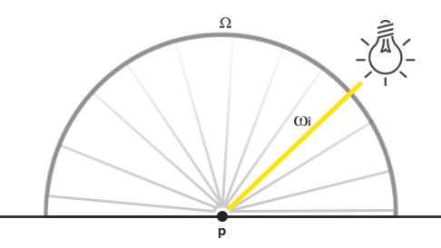
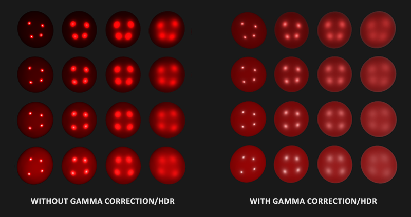
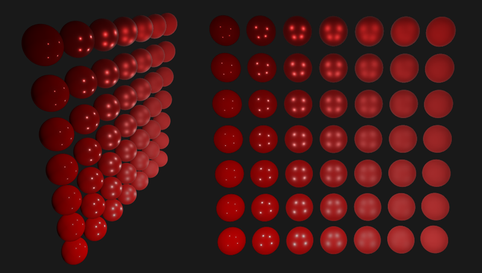
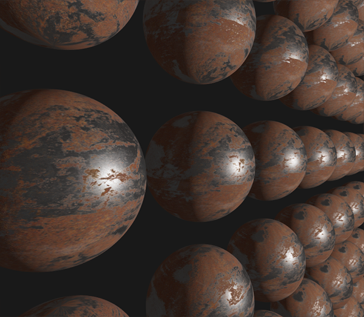

# 光照

原文     | [Lighting](https://learnopengl.com/#!PBR/Lighting)
      ---|---
作者     | JoeyDeVries
翻译     | [KenLee](https://hellokenlee.github.io/)
校对     | 暂无


!!! note

	本节暂未进行完全的重写，错误可能会很多。如果可能的话，请对照原文进行阅读。如果有报告本节的错误，将会延迟至重写之后进行处理。

!!! Important

	译者注： 
	<br>
	阅读本节请熟悉上一节提到的几个名词：
	<br>
	- 辐射通量(Radiant flux)<br>
	- 辐射率(Radiance)<br>
	- 辐照度(Irradiance)<br>
	- 辐射强度(Radiant Intensity)
	
在[上一个教程](https://learnopengl-cn.github.io/07%20PBR/01%20Theory/)中，我们讨论了一些PBR渲染的基础知识。 在本章节中，我们将重点放在把以前讨论过的理论转化为实际的渲染器，这个渲染器将使用直接的（或解析的）光源：比如点光源，定向灯或聚光灯。

我们先来看看上一个章提到的反射方程的最终版：

$$
L_o(p,\omega_o) = \int\limits_{\Omega} 
    	(k_d\frac{c}{\pi} + k_s\frac{DFG}{4(\omega_o \cdot n)(\omega_i \cdot n)})
    	L_i(p,\omega_i) n \cdot \omega_i  d\omega_i
$$

我们大致上清楚这个反射方程在干什么，但我们仍然留有一些迷雾尚未揭开。比如说我们究竟将怎样表示场景上的辐照度(Irradiance), 辐射率(Radiance) \(L\)? 我们知道辐射率\(L\)（在计算机图形领域中）表示在给定立体角\(\omega\)的情况下光源的辐射通量(Radiant flux)\(\phi\)或光源在角度\(\omega\)下发送出来的光能。 在我们的情况下，不妨假设立体角\(\omega\)无限小，这样辐射度就表示光源在一条光线或单个方向向量上的辐射通量。

基于以上的知识，我们如何将其转化为以前的教程中积累的一些光照知识呢？ 那么想象一下，我们有一个点光源（一个光源在所有方向具有相同的亮度），它的辐射通量为用RBG表示为**（23.47,21.31,20.79）**。该光源的辐射强度(Radiant Intensity)等于其在所有出射光线的辐射通量。 然而，当我们为一个表面上的特定的点\(p\)着色时，在其半球领域\(\Omega\)的所有可能的入射方向上，只有一个入射方向向量\(\omega_i\)直接来自于该点光源。 假设我们在场景中只有一个光源，位于空间中的某一个点，因而对于\(p\)点的其他可能的入射光线方向上的辐射率为0：



如果从一开始，我们就假设点光源不受光线衰减（光照强度会随着距离变暗）的影响，那么无论我们把光源放在哪，入射光线的辐射率总是一样的（除去入射角\(cos\theta\)对辐射率的影响之外）。 正正是因为无论我们从哪个角度观察它，点光源总具有相同的辐射强度，我们可以有效地将其辐射强度建模为其辐射通量: 一个常量向量**（23.47,21.31,20.79）**。

然而，辐射率也需要将位置\(p\)作为输入，正如所有现实的点光源都会受光线衰减影响一样，点光源的辐射强度应该根据点\(p\)所在的位置和光源的位置以及他们之间的距离而做一些缩放。 因此，根据原始的辐射方程，我们会根据表面法向量\(n\)和入射角度\(w_i\)来缩放光源的辐射强度。

在实现上来说：对于直接点光源的情况，辐射率函数\(L\)先获取光源的颜色值， 然后光源和某点\(p\)的距离衰减，接着按照\(n \cdot w_i\)缩放，但是仅仅有一条入射角为\(w_i\)的光线打在点\(p\)上， 这个\(w_i\)同时也等于在\(p\)点光源的方向向量。写成代码的话会是这样：
```glsl
vec3  lightColor  = vec3(23.47, 21.31, 20.79);
vec3  wi          = normalize(lightPos - fragPos);
float cosTheta    = max(dot(N, Wi), 0.0);
float attenuation = calculateAttenuation(fragPos, lightPos);
float radiance    = lightColor * attenuation * cosTheta;
```

除了一些叫法上的差异以外，这段代码对你们来说应该很TM熟悉：这正是我们一直以来怎么计算(漫反射(diffuse))光照的！当涉及到直接照明(direct lighting)时，辐射率的计算方式和我们之前计算当只有一个光源照射在物体表面的时候非常相似。

!!! Important

	请注意，这个假设是成立的条件是点光源体积无限小，相当于在空间中的一个点。如果我们认为该光源是具有体积的，它的辐射会在一个以上的入射光的方向不等于零。

对于其它类型的从单点发出来的光源我们类似地计算出辐射率。比如，定向光(directional light)拥有恒定的\(w_i\)而不会有衰减因子；而一个聚光灯光源则没有恒定的辐射强度，其辐射强度是根据聚光灯的方向向量来缩放的。

这也让我们回到了对于表面的半球领域(hemisphere)\(\Omega\)的积分\(\int\)上。由于我们事先知道的所有贡献光源的位置，因此对物体表面上的一个点着色并不需要我们尝试去求解积分。我们可以直接拿光源的（已知的）数目，去计算它们的总辐照度，因为每个光源仅仅只有一个方向上的光线会影响物体表面的辐射率。这使得PBR对直接光源的计算相对简单，因为我们只需要有效地遍历所有有贡献的光源。而当我们后来把环境照明也考虑在内的[IBL]()教程中，我们就必须采取积分去计算了，这是因为光线可能会在任何一个方向入射。

# 一个PBR表面模型

现在让我们开始写片段着色器来实现上述的PBR模型吧~ 首先我们需要把PBR相关的输入放进片段着色器。

```glsl
#version 330 core
out vec4 FragColor;
in vec2 TexCoords;
in vec3 WorldPos;
in vec3 Normal;
  
uniform vec3 camPos;
  
uniform vec3  albedo;
uniform float metallic;
uniform float roughness;
uniform float ao;
```

我们把通用的顶点着色器的输出作为输入的一部分。另一部分输入则是物体表面模型的一些材质参数。

然后再片段着色器的开始部分我们做一下任何光照算法都需要做的计算:

```glsl
void main()
{
    vec3 N = normalize(Normal); 
    vec3 V = normalize(camPos - WorldPos);
    [...]
}
```

## 直接光照明

在本教程的例子中我们会采用总共4个点光源来直接表示场景的辐照度。为了满足反射率方程，我们循环遍历每一个光源，计算他们独立的辐射率然后求和，接着根据BRDF和光源的入射角来缩放该辐射率。我们可以把循环当作在对物体的半球领域对所以直接光源求积分。首先我们来计算一些可以预计算的光照变量：

```glsl
vec3 Lo = vec3(0.0);
for(int i = 0; i < 4; ++i) 
{
    vec3 L = normalize(lightPositions[i] - WorldPos);
    vec3 H = normalize(V + L);
  
    float distance    = length(lightPositions[i] - WorldPos);
    float attenuation = 1.0 / (distance * distance);
    vec3 radiance     = lightColors[i] * attenuation; 
    [...]  
```

由于我们线性空间内计算光照（我们会在着色器的尾部进行Gamma校正），我们使用在物理上更为准确的平方倒数作为衰减。

!!! Important

	相对于物理上正确来说，你可能仍然想使用常量，线性或者二次衰减方程（他们在物理上相对不准确），却可以为您提供在光的能量衰减更多的控制。

然后，对于每一个光源我们都想计算完整的 Cook-Torrance specular BRDF项：

$$
\frac{DFG}{4(\omega_o \cdot n)(\omega_i \cdot n)}
$$

首先我们想计算的是镜面反射和漫反射的系数， 或者说发生表面反射和折射的光线的比值。 我们从[上一个教程]()知道可以使用菲涅尔方程计算：

```glsl
vec3 fresnelSchlick(float cosTheta, vec3 F0)
{
    return F0 + (1.0 - F0) * pow(1.0 - cosTheta, 5.0);
}  
```

菲涅尔方程返回的是一个物体表面光线被反射的百分比， 也就是我们反射方程中的参数\(k_s\)。Fresnel-Schlick近似接受一个参数`F0`，被称为0°入射角的反射(surface reflection at zero incidence)表示如果直接(垂直)观察表面的时候有多少光线会被反射。 这个参数`F0`会因为材料不同而不同，而且会因为材质是金属而发生变色。在PBR金属流中我们简单地认为大多数的绝缘体在`F0`为0.04的时候看起来视觉上是正确的，我们同时会特别指定`F0`当我们遇到金属表面并且给定反射率的时候。 因此代码上看起来会像是这样：

```glsl
vec3 F0 = vec3(0.04); 
F0      = mix(F0, albedo, metallic);
vec3 F  = fresnelSchlick(max(dot(H, V), 0.0), F0);
```

你可以看到，对于非金属材质来说`F0`永远保持0.04这个值，我们会根据表面的金属性来改变`F0`这个值， 并且在原来的`F0`和反射率中插值计算`F0`。

我们已经算出\(F\)， 剩下的项就是计算正态分布函数\(D\)和几何遮蔽函数\(G\)了。

因此一个直接PBR光照着色器中\(D\)和\(G\)的计算代码类似于：

```glsl
float DistributionGGX(vec3 N, vec3 H, float roughness)
{
    float a      = roughness*roughness;
    float a2     = a*a;
    float NdotH  = max(dot(N, H), 0.0);
    float NdotH2 = NdotH*NdotH;
	
    float nom   = a2;
    float denom = (NdotH2 * (a2 - 1.0) + 1.0);
    denom = PI * denom * denom;
	
    return nom / denom;
}

float GeometrySchlickGGX(float NdotV, float roughness)
{
    float r = (roughness + 1.0);
    float k = (r*r) / 8.0;

    float nom   = NdotV;
    float denom = NdotV * (1.0 - k) + k;
	
    return nom / denom;
}
float GeometrySmith(vec3 N, vec3 V, vec3 L, float roughness)
{
    float NdotV = max(dot(N, V), 0.0);
    float NdotL = max(dot(N, L), 0.0);
    float ggx2  = GeometrySchlickGGX(NdotV, roughness);
    float ggx1  = GeometrySchlickGGX(NdotL, roughness);
	
    return ggx1 * ggx2;
}
```

这里比较重要的是和[上一个教程]()不同的是，我们直接传了粗糙度(roughness)参数给上述的函数；通过这种方式，我们可以针对每一个不同的项对粗糙度做一些修改。根据迪士尼公司给出的观察以及后来被Epic Games公司采用的光照模型，光照在几何遮蔽函数和正太分布函数中采用粗糙度的平方会让光照看起来更加自然。

现在两个函数都给出了定义，在计算反射的循环中计算NDF和G项变得非常自然：

```glsl
float NDF = DistributionGGX(N, H, roughness);       
float G   = GeometrySmith(N, V, L, roughness);       
```

这样我们就凑够了足够的项来计算Cook-Torrance BRDF:

```glsl
vec3 nominator    = NDF * G * F;
float denominator = 4.0 * max(dot(N, V), 0.0) * max(dot(N, L), 0.0) + 0.001; 
vec3 specular     = nominator / denominator;  
```

注意我们在分母项中加了一个0.001为了避免出现除零错误。

现在我们终于可以计算每个光源在反射率方程中的贡献值了！因为菲涅尔方程直接给出了\(k_S\)， 我们可以使用`F`表示镜面反射在所有打在物体表面上的光线的贡献。 从\(k_S\)我们很容易计算折射的比值\(k_D\)：

```glsl
vec3 kS = F;
vec3 kD = vec3(1.0) - kS;
  
kD *= 1.0 - metallic;	
```

我们可以看作\(k_S\)表示光能中被反射的能量的比例， 而剩下的光能会被折射， 比值即为\(k_D\)。更进一步来说，因为金属不会折射光线，因此不会有漫反射。所以如果表面是金属的，我们会把系数\(k_D\)变为0。 这样，我们终于集齐所有变量来计算我们出射光线的值：

```glsl
    const float PI = 3.14159265359;
  
    float NdotL = max(dot(N, L), 0.0);        
    Lo += (kD * albedo / PI + specular) * radiance * NdotL;
}
```

最终的结果`Lo`，或者说是出射光线的辐射率，实际上是反射率方程的在半球领域\(\Omega\)的积分的结果。但是我们实际上不需要去求积，因为对于所有可能的入射光线方向我们知道只有4个方向的入射光线会影响片段(像素)的着色。因为这样，我们可以直接循环N次计算这些入射光线的方向(N也就是场景中光源的数目)。

比较重要的是我们没有把`kS`乘进去我们的反射率方程中，这是因为我们已经在specualr BRDF中乘了菲涅尔系数`F`了，因为`kS`等于`F`，因此我们不需要再乘一次。

剩下的工作就是加一个环境光照项给`Lo`，然后我们就拥有了片段的最后颜色：

```glsl
vec3 ambient = vec3(0.03) * albedo * ao;
vec3 color   = ambient + Lo;  
```

## 线性空间和HDR渲染

直到现在，我们假设的所有计算都在线性的颜色空间中进行的，因此我们需要在着色器最后做[伽马矫正]()。 在线性空间中计算光照是非常重要的，因为PBR要求所有输入都是线性的，如果不是这样，我们就会得到不正常的光照。另外，我们希望所有光照的输入都尽可能的接近他们在物理上的取值，这样他们的反射率或者说颜色值就会在色谱上有比较大的变化空间。`Lo`作为结果可能会变大得很快(超过1)，但是因为默认的LDR输入而取值被截断。所以在伽马矫正之前我们采用色调映射使`Lo`从LDR的值映射为HDR的值。

```glsl
color = color / (color + vec3(1.0));
color = pow(color, vec3(1.0/2.2)); 
```

这里我们采用的色调映射方法为Reinhard 操作，使得我们在伽马矫正后可以保留尽可能多的辐照度变化。 我们没有使用一个独立的帧缓冲或者采用后期处理，所以我们需要直接在每一步光照计算后采用色调映射和伽马矫正。



采用线性颜色空间和HDR在PBR渲染管线中非常重要。如果没有这些操作，几乎是不可能正确地捕获到因光照强度变化的细节，这最终会导致你的计算变得不正确，在视觉上看上去非常不自然。

## 完整的直接光照PBR着色器

现在剩下的事情就是把做好色调映射和伽马矫正的颜色值传给片段着色器的输出，然后我们就拥有了自己的直接光照PBR着色器。 为了完整性，这里给出了完整的代码：

```glsl
#version 330 core
out vec4 FragColor;
in vec2 TexCoords;
in vec3 WorldPos;
in vec3 Normal;

// material parameters
uniform vec3  albedo;
uniform float metallic;
uniform float roughness;
uniform float ao;

// lights
uniform vec3 lightPositions[4];
uniform vec3 lightColors[4];

uniform vec3 camPos;

const float PI = 3.14159265359;
  
float DistributionGGX(vec3 N, vec3 H, float roughness);
float GeometrySchlickGGX(float NdotV, float roughness);
float GeometrySmith(vec3 N, vec3 V, vec3 L, float roughness);
vec3 fresnelSchlickRoughness(float cosTheta, vec3 F0, float roughness);

void main()
{		
    vec3 N = normalize(Normal);
    vec3 V = normalize(camPos - WorldPos);

    vec3 F0 = vec3(0.04); 
    F0 = mix(F0, albedo, metallic);
	           
    // reflectance equation
    vec3 Lo = vec3(0.0);
    for(int i = 0; i < 4; ++i) 
    {
        // calculate per-light radiance
        vec3 L = normalize(lightPositions[i] - WorldPos);
        vec3 H = normalize(V + L);
        float distance    = length(lightPositions[i] - WorldPos);
        float attenuation = 1.0 / (distance * distance);
        vec3 radiance     = lightColors[i] * attenuation;        
        
        // cook-torrance brdf
        float NDF = DistributionGGX(N, H, roughness);        
        float G   = GeometrySmith(N, V, L, roughness);      
        vec3 F    = fresnelSchlick(max(dot(H, V), 0.0), F0);       
        
        vec3 kS = F;
        vec3 kD = vec3(1.0) - kS;
        kD *= 1.0 - metallic;	  
        
        vec3 nominator    = NDF * G * F;
        float denominator = 4.0 * max(dot(N, V), 0.0) * max(dot(N, L), 0.0) + 0.001; 
        vec3 specular     = nominator / denominator;
            
        // add to outgoing radiance Lo
        float NdotL = max(dot(N, L), 0.0);                
        Lo += (kD * albedo / PI + specular) * radiance * NdotL; 
    }   
  
    vec3 ambient = vec3(0.03) * albedo * ao;
    vec3 color = ambient + Lo;
	
    color = color / (color + vec3(1.0));
    color = pow(color, vec3(1.0/2.2));  
   
    FragColor = vec4(color, 1.0);
}  
```

希望经过上一个教程的[理论知识]()以及学习过关于渲染方程的一些知识后，这个着色器看起来不会太可怕。如果我们采用这个着色器，加上4个点光源和一些球体，同时我们令这些球体的金属性(metallic)和粗糙度(roughness)沿垂直方向和水平方向分别变化，我们会得到这样的结果：



(上述图片)从下往上球体的金属性从0.0变到1.0， 从左到右球体的粗糙度从0.0变到1.0。你可以看到仅仅改变这两个值，显示的效果会发生巨大的改变！

你可以在[这里](https://learnopengl.com/code_viewer_gh.php?code=src/6.pbr/1.1.lighting/lighting.cpp)找到整个demo的完整代码。

# 带贴图的PBR

把我们系统扩展成可以接受纹理作为参数可以让我们对物体的材质有更多的自定义空间：

```glsl
[...]
uniform sampler2D albedoMap;
uniform sampler2D normalMap;
uniform sampler2D metallicMap;
uniform sampler2D roughnessMap;
uniform sampler2D aoMap;
  
void main()
{
    vec3 albedo     = pow(texture(albedoMap, TexCoords).rgb, 2.2);
    vec3 normal     = getNormalFromNormalMap();
    float metallic  = texture(metallicMap, TexCoords).r;
    float roughness = texture(roughnessMap, TexCoords).r;
    float ao        = texture(aoMap, TexCoords).r;
    [...]
}
```

不过需要注意的是一般来说反射率(albedo)纹理在美术人员创建的时候就已经在sRGB空间了，因此我们需要在光照计算之前先把他们转换到线性空间。一般来说，环境光遮蔽贴图(ambient occlusion maps)也需要我们转换到线性空间。不过金属性(Metallic)和粗糙度(Roughness)贴图大多数时间都会保证在线性空间中。

只是把之前的球体的材质性质换成纹理属性，就在视觉上有巨大的提升：



你可以在这里找到纹理贴图过的全部[代码](https://learnopengl.com/code_viewer_gh.php?code=src/6.pbr/1.2.lighting_textured/lighting_textured.cpp)， 以及我用的[纹理](http://freepbr.com/materials/rusted-iron-pbr-metal-material-alt/)(记得加上一张全白色的ao Map)。注意金属表面会在场景中看起来有点黑，因为他们没有漫反射。它们会在考虑环境镜面光照的时候看起来更加自然，不过这是我们下一个教程的事情了。

相比起在网上找到的其他PBR渲染结果来说，尽管在视觉上不算是非常震撼，因为我们还没考虑到[基于图片的关照,IBL]()。我们现在也算是有了一个基于物理的渲染器了(虽然还没考虑IBL)！你会发现你的光照看起来更加真实了。

!!! Important

	译者注： 
	<br>
	本章教程有几个小坑原作者没有说清楚，可能是希望读者自己思考，在这译者稍稍提醒一下：
	<br>
	- 首先是球体的生成，主流的球体顶点生成有两种方法，作者源码采用的是UVSphere方法， IcoSpher方法可以参考[这里](http://blog.andreaskahler.com/2009/06/creating-icosphere-mesh-in-code.html)
	<br>
	- 对于贴图的PBR来说，我们需要TBN矩阵做坐标转换(切线空间-> 世界空间 或者 世界空间 -> 切线空间，参考 法线贴图 章节。)。这有两种方法，一种是在片段着色器中使用叉乘计算TBN矩阵(作者采用的方法)；另外一种是在根据顶点预计算TBN然后VAO中传入TBN矩阵，理论上来说后者会比较快(但是比较麻烦)，不过在译者的实际测试中两者速度差距不大。
