# 镜面反射 IBL

原文     | [Specular IBL](https://learnopengl.com/PBR/IBL/Specular-IBL)
      ---|---
作者     | JoeyDeVries
翻译     | [flyingSnow](https://github.com/flyingSnow-hu)
校对     |  

在[上一节教程](https://learnopengl-cn.github.io/07%20PBR/03%20IBL/01%20Diffuse%20irradiance/)中，我们预计算了辐照度图作为光照的间接漫反射部分，以将 PBR 与基于图像的照明相结合。在本教程中，我们将重点关注反射方程的镜面部分：

$$
L_o(p,\omega_o) = \int\limits_{\Omega} 
    	(k_d\frac{c}{\pi} + k_s\frac{DFG}{4(\omega_o \cdot n)(\omega_i \cdot n)})
    	L_i(p,\omega_i) n \cdot \omega_i  d\omega_i
$$

你会注意到 Cook-Torrance 镜面部分（乘以\(k_s\)）在整个积分上不是常数，不仅受入射光方向影响，**还**受视角影响。如果试图解算所有入射光方向加所有可能的视角方向的积分，二者组合数会极其庞大，实时计算太昂贵。Epic Games 提出了一个解决方案，他们预计算镜面部分的卷积，为实时计算作了一些妥协，这种方案被称为<def>分割求和近似法</def>（split sum approximation）。
分割求和近似将方程的镜面部分分割成两个独立的部分，我们可以单独求卷积，然后在 PBR 着色器中求和，以用于间接镜面反射部分 IBL。分割求和近似法类似于我们之前求辐照图预卷积的方法，需要 HDR 环境贴图作为其卷积输入。为了理解，我们回顾一下反射方程，但这次只关注镜面反射部分（在[上一节教程](](https://learnopengl-cn.github.io/07%20PBR/03%20IBL/01%20Diffuse%20irradiance/))中已经剥离了漫反射部分）：

$$
L_o(p,\omega_o) = 
		\int\limits_{\Omega} (k_s\frac{DFG}{4(\omega_o \cdot n)(\omega_i \cdot n)}
			L_i(p,\omega_i) n \cdot \omega_i  d\omega_i
			=
		\int\limits_{\Omega} f_r(p, \omega_i, \omega_o) L_i(p,\omega_i) n \cdot \omega_i  d\omega_i
$$

由于与辐照度卷积相同的（性能）原因，我们无法以合理的性能实时求解积分的镜面反射部分。因此，我们最好预计算这个积分，以得到像镜面 IBL 贴图这样的东西，用片段的法线对这张图采样并计算。但是，有一个地方有点棘手：我们能够预计算辐照度图，是因为其积分仅依赖于\(\omega_i\)，并且可以将漫反射反射率常数项移出积分，但这一次，积分不仅仅取决于\(\omega_i\)，从 BRDF 可以看出：

$$
f_r(p, w_i, w_o) = \frac{DFG}{4(\omega_o \cdot n)(\omega_i \cdot n)}
$$

这次积分还依赖\(\omega_o\)，我们无法用两个方向向量采样预计算的立方体图。如前一个教程中所述，位置\(p\)与此处无关。在实时状态下，对每种可能的\(\omega_i\)和\(\omega_o\)的组合预计算该积分是不可行的。
Epic Games 的分割求和近似法将预计算分成两个单独的部分求解，再将两部分组合起来得到后文给出的预计算结果。分割求和近似法将镜面反射积分拆成两个独立的积分：

$$
L_o(p,\omega_o) = 
		\int\limits_{\Omega} L_i(p,\omega_i) d\omega_i
		*
		\int\limits_{\Omega} f_r(p, \omega_i, \omega_o) n \cdot \omega_i d\omega_i
$$

卷积的第一部分被称为<def>预滤波环境贴图</def>，它类似于辐照度图，是预先计算的环境卷积贴图，但这次考虑了粗糙度。因为随着粗糙度的增加，参与环境贴图卷积的采样向量会更分散，导致反射更模糊，所以对于卷积的每个粗糙度级别，我们将按顺序把模糊后的结果存储在预滤波贴图的 mipmap 中。例如，预过滤的环境贴图在其 5 个 mipmap 级别中存储 5 个不同粗糙度值的预卷积结果，如下图所示：

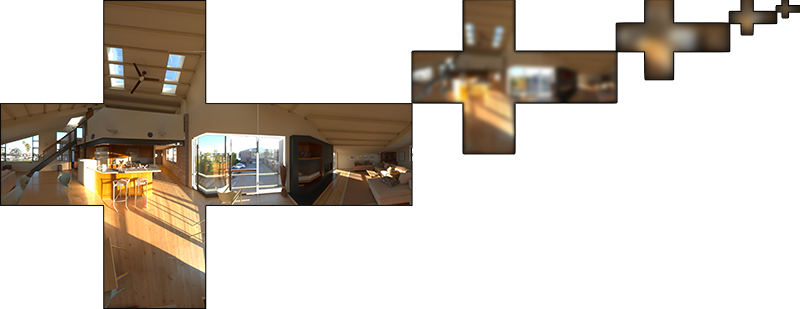

我们使用 Cook-Torrance BRDF 的正态分布函数(NDF)生成采样向量及其散射强度，该函数将法线和视角方向作为输入。由于我们在卷积环境贴图时事先不知道视角方向，因此 Epic Games 假设视角方向——也就是镜面反射方向——总是等于输出采样方向\(\omega_o\)，以作进一步近似。翻译成代码如下：

```c++
vec3 N = normalize(w_o);
vec3 R = N;
vec3 V = R;
```

这样，预过滤的环境卷积就不需要关心视角方向了。这意味着当从如下图的角度观察表面的镜面反射时，得到的掠角镜面反射效果不是很好（图片来自文章《Moving Frostbite to PBR》）。然而，通常可以认为这是一个体面的妥协：

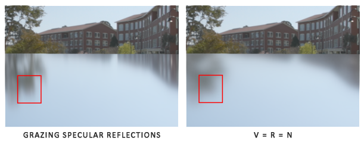

等式的第二部分等于镜面反射积分的 BRDF 部分。如果我们假设每个方向的入射辐射度都是白色的（因此\(L(p, x) = 1.0\) ），就可以在给定粗糙度、光线 \(\omega_i\) 法线 \(n\) 夹角 \(n \cdot \omega_i\) 的情况下，预计算 BRDF 的响应结果。Epic Games 将预计算好的 BRDF 对每个粗糙度和入射角的组合的响应结果存储在一张 2D 查找纹理(LUT)上，称为<def>BRDF积分贴图</def>。2D 查找纹理存储是菲涅耳响应的系数（R 通道）和偏差值（G 通道），它为我们提供了分割版镜面反射积分的第二个部分：

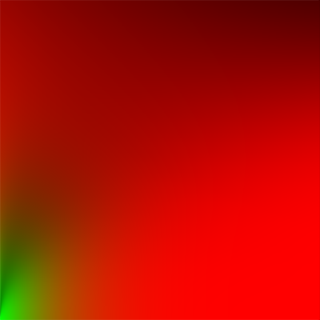

生成查找纹理的时候，我们以 BRDF 的输入\(n⋅\omega_i\)（范围在 0.0 和 1.0 之间）作为横坐标，以粗糙度作为纵坐标。有了此 BRDF 积分贴图和预过滤的环境贴图，我们就可以将两者结合起来，以获得镜面反射积分的结果：

```c++
float lod             = getMipLevelFromRoughness(roughness);
vec3 prefilteredColor = textureCubeLod(PrefilteredEnvMap, refVec, lod);
vec2 envBRDF          = texture2D(BRDFIntegrationMap, vec2(NdotV, roughness)).xy;
vec3 indirectSpecular = prefilteredColor * (F * envBRDF.x + envBRDF.y) 
```

至此，你应该对 Epic Games 的分割求和近似法的原理，以及它如何近似求解反射方程的间接镜面反射部分有了一些基本印象。让我们现在尝试一下自己构建预卷积部分。

## 预滤波HDR环境贴图

预滤波环境贴图的方法与我们对辐射度贴图求卷积的方法非常相似。对于卷积的每个粗糙度级别，我们将按顺序把模糊后的结果存储在预滤波贴图的 mipmap 中。
首先，我们需要生成一个新的立方体贴图来保存预过滤的环境贴图数据。为了确保为其 mip 级别分配足够的内存，一个简单方法是调用 <fun>glGenerateMipmap</fun>。

```c++
unsigned int prefilterMap;
glGenTextures(1, &prefilterMap);
glBindTexture(GL_TEXTURE_CUBE_MAP, prefilterMap);
for (unsigned int i = 0; i < 6; ++i)
{
    glTexImage2D(GL_TEXTURE_CUBE_MAP_POSITIVE_X + i, 0, GL_RGB16F, 128, 128, 0, GL_RGB, GL_FLOAT, nullptr);
}
glTexParameteri(GL_TEXTURE_CUBE_MAP, GL_TEXTURE_WRAP_S, GL_CLAMP_TO_EDGE);
glTexParameteri(GL_TEXTURE_CUBE_MAP, GL_TEXTURE_WRAP_T, GL_CLAMP_TO_EDGE);
glTexParameteri(GL_TEXTURE_CUBE_MAP, GL_TEXTURE_WRAP_R, GL_CLAMP_TO_EDGE);
glTexParameteri(GL_TEXTURE_CUBE_MAP, GL_TEXTURE_MIN_FILTER, GL_LINEAR_MIPMAP_LINEAR); 
glTexParameteri(GL_TEXTURE_CUBE_MAP, GL_TEXTURE_MAG_FILTER, GL_LINEAR);

glGenerateMipmap(GL_TEXTURE_CUBE_MAP);
```

注意，因为我们计划采样 <var>prefilterMap</var> 的 mipmap，所以需要确保将其缩小过滤器设置为 <var>GL_LINEAR_MIPMAP_LINEAR</var> 以启用三线性过滤。它存储的是预滤波的镜面反射，基础 mip 级别的分辨率是每面 128×128，对于大多数反射来说可能已经足够了，但如果场景里有大量光滑材料（想想汽车上的反射），可能需要提高分辨率。

在上一节教程中，我们使用球面坐标生成均匀分布在半球 \(\Omega\) 上的采样向量，以对环境贴图进行卷积。虽然这个方法非常适用于辐照度，但对于镜面反射效果较差。镜面反射依赖于表面的粗糙度，反射光线可能比较松散，也可能比较紧密，但是一定会围绕着反射向量\(r\)，除非表面极度粗糙：


所有可能出射的反射光构成的形状称为<def>镜面波瓣</def>。随着粗糙度的增加，镜面波瓣的大小增加；随着入射光方向不同，形状会发生变化。因此，镜面波瓣的形状高度依赖于材质。
在微表面模型里给定入射光方向，则镜面波瓣指向微平面的半向量的反射方向。考虑到大多数光线最终会反射到一个基于半向量的镜面波瓣内，采样时以类似的方式选取采样向量是有意义的，因为大部分其余的向量都被浪费掉了，这个过程称为<def>重要性采样</def>。

### 蒙特卡洛积分和重要性采样

为了充分理解重要性采样，我们首先要了解一种数学结构，称为<def>蒙特卡洛积分</def>。蒙特卡洛积分主要是统计和概率理论的组合。蒙特卡洛可以帮助我们离散地解决人口统计问题，而不必考虑**所有**人。

例如，假设您想要计算一个国家所有公民的平均身高。为了得到结果，你可以测量**每个**公民并对他们的身高求平均，这样会得到你需要的**确切**答案。但是，由于大多数国家人海茫茫，这个方法不现实：需要花费太多精力和时间。

另一种方法是选择一个小得多的**完全随机**（无偏）的人口子集，测量他们的身高并对结果求平均。可能只测量 100 人，虽然答案并非绝对精确，但会得到一个相对接近真相的答案，这个理论被称作<def>大数定律</def>。我们的想法是，如果从总人口中测量一组较小的真正随机样本的\(N\)，结果将相对接近真实答案，并随着样本数 \(N\) 的增加而愈加接近。

蒙特卡罗积分建立在大数定律的基础上，并采用相同的方法来求解积分。不为所有可能的（理论上是无限的）样本值 \(x\) 求解积分，而是简单地从总体中随机挑选样本 \(N\) 生成采样值并求平均。随着 \(N\) 的增加，我们的结果会越来越接近积分的精确结果：

$$
O =  \int\limits_{a}^{b} f(x) dx 
      = 
      \frac{1}{N} \sum_{i=0}^{N-1} \frac{f(x)}{pdf(x)}
$$

为了求解这个积分，我们在 \(a\) 到 \(b\) 上采样 \(N\) 个随机样本，将它们加在一起并除以样本总数来取平均。\(pdf\) 代表<def>概率密度函数</def> (probability density function)，它的含义是特定样本在整个样本集上发生的概率。例如，人口身高的 pdf 看起来应该像这样：

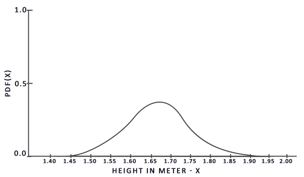

从该图中我们可以看出，如果我们对人口任意随机采样，那么挑选身高为 1.70 的人口样本的可能性更高，而样本身高为 1.50 的概率较低。

当涉及蒙特卡洛积分时，某些样本可能比其他样本具有更高的生成概率。这就是为什么对于任何一般的蒙特卡洛估计，我们都会根据 pdf 将采样值除以或乘以采样概率。到目前为止，我们每次需要估算积分的时候，生成的样本都是均匀分布的，概率完全相等。到目前为止，我们的估计是<def>无偏</def>的，这意味着随着样本数量的不断增加，我们最终将<def>收敛</def>到积分的**精确**解。

但是，某些蒙特卡洛估算是<def>有偏</def>的，这意味着生成的样本并不是完全随机的，而是集中于特定的值或方向。这些有偏的蒙特卡洛估算具有<def>更快的收敛速度</def>，它们会以更快的速度收敛到精确解，但是由于其有偏性，可能永远不会收敛到精确解。通常来说，这是一个可以接受的折衷方案，尤其是在计算机图形学中。因为只要结果在视觉上可以接受，解决方案的精确性就不太重要。下文我们将会提到一种（有偏的）重要性采样，其生成的样本偏向特定的方向，在这种情况下，我们会将每个样本乘以或除以相应的 pdf 再求和。

蒙特卡洛积分在计算机图形学中非常普遍，因为它是一种以高效的离散方式对连续的积分求近似而且非常直观的方法：对任何面积/体积进行采样——例如半球 \(\Omega\) ——在该面积/体积内生成数量 \(N\) 的随机采样，权衡每个样本对最终结果的贡献并求和。

蒙特卡洛积分是一个庞大的数学主题，在此不再赘述，但有一点需要提到：生成随机样本的方法也多种多样。默认情况下，每次采样都是我们熟悉的完全（伪）随机，不过利用半随机序列的某些属性，我们可以生成虽然是随机样本但具有一些有趣性质的样本向量。例如，我们可以对一种名为<def>低差异序列</def>的东西进行蒙特卡洛积分，该序列生成的仍然是随机样本，但样本分布更均匀：

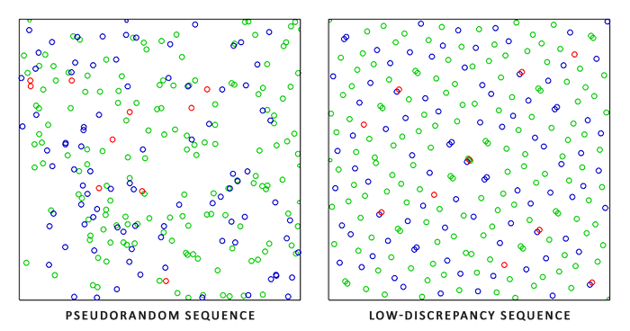

当使用低差异序列生成蒙特卡洛样本向量时，该过程称为<def>拟蒙特卡洛积分</def>。拟蒙特卡洛方法具有更快的<def>收敛速度</def>，这使得它对于性能繁重的应用很有用。

鉴于我们新获得的有关蒙特卡洛（Monte Carlo）和拟蒙特卡洛（Quasi-Monte Carlo）积分的知识，我们可以使用一个有趣的属性来获得更快的收敛速度，这就是<def>重要性采样</def>。我们在前文已经提到过它，但是在镜面反射的情况下，反射的光向量被限制在镜面波瓣中，波瓣的大小取决于表面的粗糙度。既然镜面波瓣外的任何（拟）随机生成的样本与镜面积分无关，因此将样本集中在镜面波瓣内生成是有意义的，但代价是蒙特卡洛估算会产生偏差。

本质上来说，这就是重要性采样的核心：只在某些区域生成采样向量，该区域围绕微表面半向量，受粗糙度限制。通过将拟蒙特卡洛采样与低差异序列相结合，并使用重要性采样偏置样本向量的方法，我们可以获得很高的收敛速度。因为我们求解的速度更快，所以要达到足够的近似度，我们所需要的样本更少。因此，这套组合方法甚至可以允许图形应用程序实时求解镜面积分，虽然比预计算结果还是要慢得多。

### 低差异序列

在本教程中，我们将使用重要性采样来预计算间接反射方程的镜面反射部分，该采样基于拟蒙特卡洛方法给出了随机的低差异序列。我们将使用的序列被称为 <def>Hammersley 序列</def>，[Holger Dammertz](http://holger.dammertz.org/stuff/notes_HammersleyOnHemisphere.html) 曾仔细描述过它。Hammersley 序列是基于 <def>Van Der Corput 序列</def>，该序列是把十进制数字的二进制表示镜像翻转到小数点右边而得。（译注：原文为 Van Der Corpus 疑似笔误，下文各处同）

给出一些巧妙的技巧，我们可以在着色器程序中非常有效地生成 Van Der Corput 序列，我们将用它来获得 Hammersley 序列，设总样本数为 <var>N</var>，样本索引为 <var>i</var>：

```c++
float RadicalInverse_VdC(uint bits) 
{
    bits = (bits << 16u) | (bits >> 16u);
    bits = ((bits & 0x55555555u) << 1u) | ((bits & 0xAAAAAAAAu) >> 1u);
    bits = ((bits & 0x33333333u) << 2u) | ((bits & 0xCCCCCCCCu) >> 2u);
    bits = ((bits & 0x0F0F0F0Fu) << 4u) | ((bits & 0xF0F0F0F0u) >> 4u);
    bits = ((bits & 0x00FF00FFu) << 8u) | ((bits & 0xFF00FF00u) >> 8u);
    return float(bits) * 2.3283064365386963e-10; // / 0x100000000
}
// ----------------------------------------------------------------------------
vec2 Hammersley(uint i, uint N)
{
    return vec2(float(i)/float(N), RadicalInverse_VdC(i));
}  
```

GLSL 的 <fun>Hammersley</fun> 函数可以获取大小为 <var>N</var> 的样本集中的低差异样本 <var>i</var>。

!!! important

	**无需位运算的 Hammersley 序列**

	并非所有 OpenGL 相关驱动程序都支持位运算符（例如WebGL和OpenGL ES 2.0），在这种情况下，你可能需要不依赖位运算符的替代版本 Van Der Corput 序列：

		float VanDerCorpus(uint n, uint base)
		{
		    float invBase = 1.0 / float(base);
		    float denom   = 1.0;
		    float result  = 0.0;

		    for(uint i = 0u; i < 32u; ++i)
		    {
		        if(n > 0u)
		        {
		            denom   = mod(float(n), 2.0);
		            result += denom * invBase;
		            invBase = invBase / 2.0;
		            n       = uint(float(n) / 2.0);
		        }
		    }

		    return result;
		}
		// ----------------------------------------------------------------------------
		vec2 HammersleyNoBitOps(uint i, uint N)
		{
		    return vec2(float(i)/float(N), VanDerCorpus(i, 2u));
		}

	请注意，由于旧硬件中的 GLSL 循环限制，该序列循环遍历了所有可能的 32 位，性能略差。但是如果你没有位运算符可用的话可以考虑它，它可以在所有硬件上运行。


### GGX 重要性采样

有别于均匀或纯随机地（比如蒙特卡洛）在积分半球 \(\Omega\) 产生采样向量，我们的采样会根据粗糙度，偏向微表面的半向量的宏观反射方向。采样过程将与我们之前看到的过程相似：开始一个大循环，生成一个随机（低差异）序列值，用该序列值在切线空间中生成样本向量，将样本向量变换到世界空间并对场景的辐射度采样。不同之处在于，我们现在使用低差异序列值作为输入来生成采样向量：

```c++
const uint SAMPLE_COUNT = 4096u;
for(uint i = 0u; i < SAMPLE_COUNT; ++i)
{
    vec2 Xi = Hammersley(i, SAMPLE_COUNT);   
}
```

此外，要构建采样向量，我们需要一些方法定向和偏移采样向量，以使其朝向特定粗糙度的镜面波瓣方向。我们可以如理论教程中所述使用 NDF，并将 GGX NDF 结合到 Epic Games 所述的球形采样向量的处理中：

```c++
vec3 ImportanceSampleGGX(vec2 Xi, vec3 N, float roughness)
{
    float a = roughness*roughness;
	
    float phi = 2.0 * PI * Xi.x;
    float cosTheta = sqrt((1.0 - Xi.y) / (1.0 + (a*a - 1.0) * Xi.y));
    float sinTheta = sqrt(1.0 - cosTheta*cosTheta);
	
    // from spherical coordinates to cartesian coordinates
    vec3 H;
    H.x = cos(phi) * sinTheta;
    H.y = sin(phi) * sinTheta;
    H.z = cosTheta;
	
    // from tangent-space vector to world-space sample vector
    vec3 up        = abs(N.z) < 0.999 ? vec3(0.0, 0.0, 1.0) : vec3(1.0, 0.0, 0.0);
    vec3 tangent   = normalize(cross(up, N));
    vec3 bitangent = cross(N, tangent);
	
    vec3 sampleVec = tangent * H.x + bitangent * H.y + N * H.z;
    return normalize(sampleVec);
}
```

基于特定的粗糙度输入和低差异序列值 <var>Xi</var>，我们获得了一个采样向量，该向量大体围绕着预估的微表面的半向量。注意，根据迪士尼对 PBR 的研究，Epic Games 使用了平方粗糙度以获得更好的视觉效果。

使用低差异 Hammersley 序列和上述定义的样本生成方法，我们可以最终完成预滤波器卷积着色器：

```c++
#version 330 core
out vec4 FragColor;
in vec3 localPos;

uniform samplerCube environmentMap;
uniform float roughness;

const float PI = 3.14159265359;

float RadicalInverse_VdC(uint bits);
vec2 Hammersley(uint i, uint N);
vec3 ImportanceSampleGGX(vec2 Xi, vec3 N, float roughness);
  
void main()
{		
    vec3 N = normalize(localPos);    
    vec3 R = N;
    vec3 V = R;

    const uint SAMPLE_COUNT = 1024u;
    float totalWeight = 0.0;   
    vec3 prefilteredColor = vec3(0.0);     
    for(uint i = 0u; i < SAMPLE_COUNT; ++i)
    {
        vec2 Xi = Hammersley(i, SAMPLE_COUNT);
        vec3 H  = ImportanceSampleGGX(Xi, N, roughness);
        vec3 L  = normalize(2.0 * dot(V, H) * H - V);

        float NdotL = max(dot(N, L), 0.0);
        if(NdotL > 0.0)
        {
            prefilteredColor += texture(environmentMap, L).rgb * NdotL;
            totalWeight      += NdotL;
        }
    }
    prefilteredColor = prefilteredColor / totalWeight;

    FragColor = vec4(prefilteredColor, 1.0);
}  

```

输入的粗糙度随着预过滤的立方体贴图的 mipmap 级别变化（从0.0到1.0），我们根据据粗糙度预过滤环境贴图，把结果存在 <var>prefilteredColor</var> 里。再用 <var>prefilteredColor</var> 除以采样权重总和，其中对最终结果影响较小（<var>NdotL</var> 较小）的采样最终权重也较小。

### 捕获预过滤 mipmap 级别

剩下要做的就是让 OpenGL 在多个 mipmap 级别上以不同的粗糙度值预过滤环境贴图。有了最开始的辐照度教程作为基础，实际上很简单：

```c++
prefilterShader.use();
prefilterShader.setInt("environmentMap", 0);
prefilterShader.setMat4("projection", captureProjection);
glActiveTexture(GL_TEXTURE0);
glBindTexture(GL_TEXTURE_CUBE_MAP, envCubemap);

glBindFramebuffer(GL_FRAMEBUFFER, captureFBO);
unsigned int maxMipLevels = 5;
for (unsigned int mip = 0; mip < maxMipLevels; ++mip)
{
    // reisze framebuffer according to mip-level size.
    unsigned int mipWidth  = 128 * std::pow(0.5, mip);
    unsigned int mipHeight = 128 * std::pow(0.5, mip);
    glBindRenderbuffer(GL_RENDERBUFFER, captureRBO);
    glRenderbufferStorage(GL_RENDERBUFFER, GL_DEPTH_COMPONENT24, mipWidth, mipHeight);
    glViewport(0, 0, mipWidth, mipHeight);

    float roughness = (float)mip / (float)(maxMipLevels - 1);
    prefilterShader.setFloat("roughness", roughness);
    for (unsigned int i = 0; i < 6; ++i)
    {
        prefilterShader.setMat4("view", captureViews[i]);
        glFramebufferTexture2D(GL_FRAMEBUFFER, GL_COLOR_ATTACHMENT0, 
                               GL_TEXTURE_CUBE_MAP_POSITIVE_X + i, prefilterMap, mip);

        glClear(GL_COLOR_BUFFER_BIT | GL_DEPTH_BUFFER_BIT);
        renderCube();
    }
}
glBindFramebuffer(GL_FRAMEBUFFER, 0);   
```

这个过程类似于辐照度贴图卷积，但是这次我们将帧缓冲区缩放到适当的 mipmap 尺寸， mip 级别每增加一级，尺寸缩小为一半。此外，我们在 <fun>glFramebufferTexture2D</fun> 的最后一个参数中指定要渲染的目标 mip 级别，然后将要预过滤的粗糙度传给预过滤着色器。

这样我们会得到一张经过适当预过滤的环境贴图，访问该贴图时指定的 mip 等级越高，获得的反射就越模糊。如果我们在天空盒着色器中显示这张预过滤的环境立方体贴图，并在其着色器中强制在其第一个 mip 级别以上采样，如下所示：

```c++
vec3 envColor = textureLod(environmentMap, WorldPos, 1.2).rgb;
```

我们得到的结果看起来确实像原始环境的模糊版本：

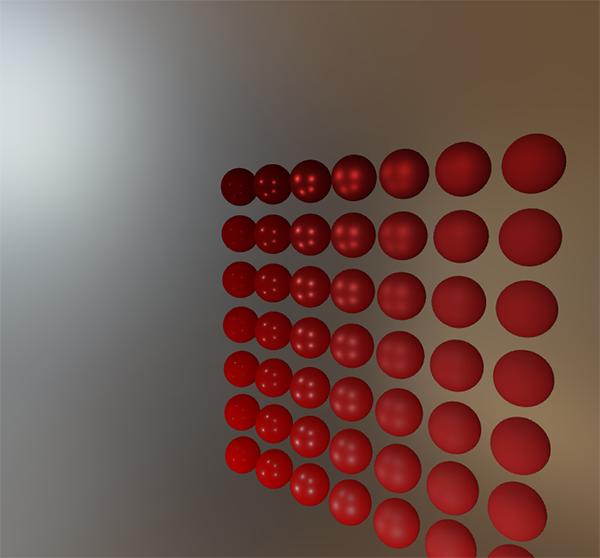

如果 HDR 环境贴图的预过滤看起来差不多没问题，尝试一下不同的 mipmap 级别，观察预过滤贴图随着 mip 级别增加，反射逐渐从锐利变模糊的过程。

## 预过滤卷积的伪像

当前的预过滤贴图可以在大多数情况下正常工作，不过你迟早会遇到几个与预过滤卷积直接相关的渲染问题。我将在这里列出最常见的一些问题，以及如何修复它们。

### 高粗糙度的立方体贴图接缝

在具有粗糙表面的表面上对预过滤贴图采样，也就等同于在较低的 mip 级别上对预过滤贴图采样。在对立方体贴图进行采样时，默认情况下，OpenGL不会在立方体面**之间**进行线性插值。由于较低的 mip 级别具有更低的分辨率，并且预过滤贴图代表了与更大的采样波瓣卷积，因此缺乏**立方体的面和面之间的滤波**的问题就更明显：

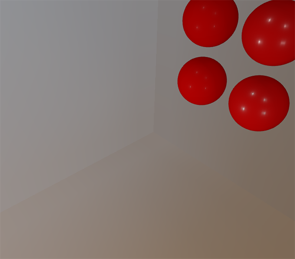

幸运的是，OpenGL 可以启用 <var>GL_TEXTURE_CUBE_MAP_SEAMLESS</var>，以为我们提供在立方体贴图的面之间进行正确过滤的选项：

```c++
glEnable(GL_TEXTURE_CUBE_MAP_SEAMLESS);  
```

### 预过滤卷积的亮点

由于镜面反射中光强度的变化大，高频细节多，所以对镜面反射进行卷积需要大量采样，才能正确反映 HDR 环境反射的混乱变化。我们已经进行了大量的采样，但是在某些环境下，在某些较粗糙的 mip 级别上可能仍然不够，导致明亮区域周围出现点状图案：

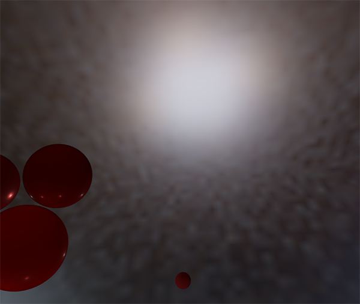

一种解决方案是进一步增加样本数量，但在某些情况下还是不够。另一种方案如 [Chetan Jags](https://chetanjags.wordpress.com/2015/08/26/image-based-lighting/) 所述，我们可以在预过滤卷积时，不直接采样环境贴图，而是基于积分的 PDF 和粗糙度采样环境贴图的 mipmap ，以减少伪像：

```c++
float D   = DistributionGGX(NdotH, roughness);
float pdf = (D * NdotH / (4.0 * HdotV)) + 0.0001; 

float resolution = 512.0; // resolution of source cubemap (per face)
float saTexel  = 4.0 * PI / (6.0 * resolution * resolution);
float saSample = 1.0 / (float(SAMPLE_COUNT) * pdf + 0.0001);

float mipLevel = roughness == 0.0 ? 0.0 : 0.5 * log2(saSample / saTexel); 
```

既然要采样 mipmap ，不要忘记在环境贴图上开启三线性过滤：

```c++
glBindTexture(GL_TEXTURE_CUBE_MAP, envCubemap);
glTexParameteri(GL_TEXTURE_CUBE_MAP, GL_TEXTURE_MIN_FILTER, GL_LINEAR_MIPMAP_LINEAR); 
```

设置立方体贴图的基本纹理后，让 OpenGL 生成 mipmap：

```c++
// convert HDR equirectangular environment map to cubemap equivalent
[...]
// then generate mipmaps
glBindTexture(GL_TEXTURE_CUBE_MAP, envCubemap);
glGenerateMipmap(GL_TEXTURE_CUBE_MAP);
```

这个方法效果非常好，可以去除预过滤贴图中较粗糙表面上的大多数甚至全部亮点。

## 预计算 BRDF

预过滤的环境贴图已经可以设置并运行，我们可以集中精力于求和近似的第二部分：BRDF。让我们再次简要回顾一下镜面部分的分割求和近似法：

$$
L_o(p,\omega_o) = 
		\int\limits_{\Omega} L_i(p,\omega_i) d\omega_i
		*
		\int\limits_{\Omega} f_r(p, \omega_i, \omega_o) n \cdot \omega_i d\omega_i
$$

我们已经在预过滤贴图的各个粗糙度级别上预计算了分割求和近似的左半部分。右半部分要求我们在 \(n \cdot \omega_o\) 、表面粗糙度、菲涅尔系数 \(F_0\) 上计算 BRDF 方程的卷积。这等同于在纯白的环境光或者辐射度恒定为 \(L_i\)=1.0 的设置下，对镜面 BRDF 求积分。对3个变量做卷积有点复杂，不过我们可以把 \(F_0\) 移出镜面 BRDF 方程：

$$
\int\limits_{\Omega} f_r(p, \omega_i, \omega_o) n \cdot \omega_i d\omega_i = \int\limits_{\Omega} f_r(p, \omega_i, \omega_o) \frac{F(\omega_o, h)}{F(\omega_o, h)} n \cdot \omega_i d\omega_i
$$

\(F\) 为菲涅耳方程。将菲涅耳分母移到 BRDF 下面可以得到如下等式：

$$
\int\limits_{\Omega} \frac{f_r(p, \omega_i, \omega_o)}{F(\omega_o, h)} F(\omega_o, h)  n \cdot \omega_i d\omega_i
$$

用 Fresnel-Schlick 近似公式替换右边的 \(F\) 可以得到：

$$
\int\limits_{\Omega} \frac{f_r(p, \omega_i, \omega_o)}{F(\omega_o, h)} (F_0 + (1 - F_0){(1 - \omega_o \cdot h)}^5)  n \cdot \omega_i d\omega_i
$$

让我们用 \(\alpha\) 替换 \({(1 - \omega_o \cdot h)}^5\) 以便更轻松地求解 \(F_0\)：

$$
\int\limits_{\Omega} \frac{f_r(p, \omega_i, \omega_o)}{F(\omega_o, h)} (F_0 + (1 - F_0)\alpha)  n \cdot \omega_i d\omega_i
$$

$$
\int\limits_{\Omega} \frac{f_r(p, \omega_i, \omega_o)}{F(\omega_o, h)} (F_0 + 1*\alpha - F_0*\alpha)  n \cdot \omega_i d\omega_i
$$

$$
\int\limits_{\Omega} \frac{f_r(p, \omega_i, \omega_o)}{F(\omega_o, h)} (F_0 * (1 - \alpha) + \alpha)  n \cdot \omega_i d\omega_i
$$

然后我们将菲涅耳函数 \(F\) 分拆到两个积分里：

$$
\int\limits_{\Omega} \frac{f_r(p, \omega_i, \omega_o)}{F(\omega_o, h)} (F_0 * (1 - \alpha))  n \cdot \omega_i d\omega_i
              +
	\int\limits_{\Omega} \frac{f_r(p, \omega_i, \omega_o)}{F(\omega_o, h)} (\alpha)  n \cdot \omega_i d\omega_i
$$

这样，\(F_0\)在整个积分上是恒定的，我们可以从积分中提取出\(F_0\)。接下来，我们将\(\alpha\)替换回其原始形式，从而得到最终分割求和的 BRDF 方程：

$$
F_0 \int\limits_{\Omega} f_r(p, \omega_i, \omega_o)(1 - {(1 - \omega_o \cdot h)}^5)  n \cdot \omega_i d\omega_i
              +
	\int\limits_{\Omega} f_r(p, \omega_i, \omega_o) {(1 - \omega_o \cdot h)}^5  n \cdot \omega_i d\omega_i
$$

公式中的两个积分分别表示 \(F_0\) 的比例和偏差。注意，由于 \(f(p, \omega_i, \omega_o)\) 已经包含 \(F\) 项，它们被约分了，这里的 \(f\) 中不计算 \(F\) 项。

和之前卷积环境贴图类似，我们可以对 BRDF 方程求卷积，其输入是 \(n\) 和 \(\omega_o\) 的夹角，以及粗糙度，并将卷积的结果存储在纹理中。我们将卷积后的结果存储在 2D 查找纹理（Look Up Texture, LUT）中，这张纹理被称为 <def>BRDF 积分贴图</def>，稍后会将其用于 PBR 光照着色器中，以获得间接镜面反射的最终卷积结果。

BRDF 卷积着色器在 2D 平面上执行计算，直接使用其 2D 纹理坐标作为卷积输入（<var>NdotV</var> 和 <var>roughness</var>）。代码与预滤波器的卷积代码大体相似，不同之处在于，它现在根据 BRDF 的几何函数和 Fresnel-Schlick 近似来处理采样向量：

```c++
vec2 IntegrateBRDF(float NdotV, float roughness)
{
    vec3 V;
    V.x = sqrt(1.0 - NdotV*NdotV);
    V.y = 0.0;
    V.z = NdotV;

    float A = 0.0;
    float B = 0.0;

    vec3 N = vec3(0.0, 0.0, 1.0);

    const uint SAMPLE_COUNT = 1024u;
    for(uint i = 0u; i < SAMPLE_COUNT; ++i)
    {
        vec2 Xi = Hammersley(i, SAMPLE_COUNT);
        vec3 H  = ImportanceSampleGGX(Xi, N, roughness);
        vec3 L  = normalize(2.0 * dot(V, H) * H - V);

        float NdotL = max(L.z, 0.0);
        float NdotH = max(H.z, 0.0);
        float VdotH = max(dot(V, H), 0.0);

        if(NdotL > 0.0)
        {
            float G = GeometrySmith(N, V, L, roughness);
            float G_Vis = (G * VdotH) / (NdotH * NdotV);
            float Fc = pow(1.0 - VdotH, 5.0);

            A += (1.0 - Fc) * G_Vis;
            B += Fc * G_Vis;
        }
    }
    A /= float(SAMPLE_COUNT);
    B /= float(SAMPLE_COUNT);
    return vec2(A, B);
}
// ----------------------------------------------------------------------------
void main() 
{
    vec2 integratedBRDF = IntegrateBRDF(TexCoords.x, TexCoords.y);
    FragColor = integratedBRDF;
}
```

如你所见，BRDF 卷积部分是从数学到代码的直接转换。我们将角度 \(\theta\) 和粗糙度作为输入，以重要性采样产生采样向量，在整个几何体上结合 BRDF 的菲涅耳项对向量进行处理，然后输出每个样本上 \(F_0\) 的系数和偏差，最后取平均值。

你可能回想起[理论](https://learnopengl-cn.github.io/07%20PBR/01%20Theory/)教程中的一个细节：与 IBL 一起使用时，BRDF 的几何项略有不同，因为 \(k\) 变量的含义稍有不同：

$$
k_{direct} = \frac{(\alpha + 1)^2}{8}
$$

$$
k_{IBL} = \frac{\alpha^2}{2}
$$

由于 BRDF 卷积是镜面 IBL 积分的一部分，因此我们要在 Schlick-GGX 几何函数中使用 \(k_{IBL}\)：

```c++
float GeometrySchlickGGX(float NdotV, float roughness)
{
    float a = roughness;
    float k = (a * a) / 2.0;

    float nom   = NdotV;
    float denom = NdotV * (1.0 - k) + k;

    return nom / denom;
}
// ----------------------------------------------------------------------------
float GeometrySmith(vec3 N, vec3 V, vec3 L, float roughness)
{
    float NdotV = max(dot(N, V), 0.0);
    float NdotL = max(dot(N, L), 0.0);
    float ggx2 = GeometrySchlickGGX(NdotV, roughness);
    float ggx1 = GeometrySchlickGGX(NdotL, roughness);

    return ggx1 * ggx2;
}  
```

请注意，虽然 \(k\) 还是从 a 计算出来的，但这里的 a 不是 <var>roughness</var> 的平方——如同最初对 a 的其他解释那样——在这里我们假装平方过了。我不确定这样处理是否与 Epic Games 或迪士尼原始论文不一致，但是直接将 <var>roughness</var> 赋给 a 得到的 BRDF 积分贴图与 Epic Games 的版本完全一致。

最后，为了存储 BRDF 卷积结果，我们需要生成一张 512 × 512 分辨率的 2D 纹理。

```c++
unsigned int brdfLUTTexture;
glGenTextures(1, &brdfLUTTexture);

// pre-allocate enough memory for the LUT texture.
glBindTexture(GL_TEXTURE_2D, brdfLUTTexture);
glTexImage2D(GL_TEXTURE_2D, 0, GL_RG16F, 512, 512, 0, GL_RG, GL_FLOAT, 0);
glTexParameteri(GL_TEXTURE_2D, GL_TEXTURE_WRAP_S, GL_CLAMP_TO_EDGE);
glTexParameteri(GL_TEXTURE_2D, GL_TEXTURE_WRAP_T, GL_CLAMP_TO_EDGE);
glTexParameteri(GL_TEXTURE_2D, GL_TEXTURE_MIN_FILTER, GL_LINEAR);
glTexParameteri(GL_TEXTURE_2D, GL_TEXTURE_MAG_FILTER, GL_LINEAR);
```

请注意，我们使用的是 Epic Games 推荐的16位精度浮点格式。将环绕模式设置为 <var>GL_CLAMP_TO_EDGE</var> 以防止边缘采样的伪像。
然后，我们复用同一个帧缓冲区对象，并在 NDC (译注：Normalized Device Coordinates) 屏幕空间四边形上运行此着色器：

```c++
glBindFramebuffer(GL_FRAMEBUFFER, captureFBO);
glBindRenderbuffer(GL_RENDERBUFFER, captureRBO);
glRenderbufferStorage(GL_RENDERBUFFER, GL_DEPTH_COMPONENT24, 512, 512);
glFramebufferTexture2D(GL_FRAMEBUFFER, GL_COLOR_ATTACHMENT0, GL_TEXTURE_2D, brdfLUTTexture, 0);

glViewport(0, 0, 512, 512);
brdfShader.use();
glClear(GL_COLOR_BUFFER_BIT | GL_DEPTH_BUFFER_BIT);
RenderQuad();

glBindFramebuffer(GL_FRAMEBUFFER, 0);  
```

分割积分和的 BRDF 卷积部分应该得到以下结果：


预过滤的环境贴图和 BRDF 的 2D LUT 都已经齐备，我们可以根据分割求和近似法重建间接镜面部分积分了。最后合并的结果将被用作间接镜面反射或环境镜面反射。

## 完成 IBL 反射

为了使反射方程的间接镜面反射部分正确运行，我们需要将分割求和近似法的两个部分缝合在一起。第一步是将预计算的光照数据声明到 PBR 着色器的最上面：

```c++
uniform samplerCube prefilterMap;
uniform sampler2D   brdfLUT;  
```

首先，使用反射向量采样预过滤的环境贴图，获取表面的间接镜面反射。请注意，我们会根据表面粗糙度在合适的 mip 级别采样，以使更粗糙的表面产生更模糊的镜面反射。

```c++
void main()
{
    [...]
    vec3 R = reflect(-V, N);   

    const float MAX_REFLECTION_LOD = 4.0;
    vec3 prefilteredColor = textureLod(prefilterMap, R,  roughness * MAX_REFLECTION_LOD).rgb;    
    [...]
}
```

在预过滤步骤中，我们仅将环境贴图卷积最多 5 个 mip 级别（0到4），此处记为 <var>MAX_REFLECTION_LOD</var>，以确保不会对一个没有数据的 mip 级别采样。
然后我们用已知的材质粗糙度和视线-法线夹角作为输入，采样 BRDF LUT。

```c++
vec3 F        = FresnelSchlickRoughness(max(dot(N, V), 0.0), F0, roughness);
vec2 envBRDF  = texture(brdfLUT, vec2(max(dot(N, V), 0.0), roughness)).rg;
vec3 specular = prefilteredColor * (F * envBRDF.x + envBRDF.y);
```

这样我们就从 BRDF LUT 中获得了 \(F_0\) 的系数和偏移，这里我们就直接用间接光菲涅尔项 <var>F</var> 代替\(F_0\)。把这个结果和 IBL 反射方程左边的预过滤部分结合起来，以重建整个近似积分，存入<var>specular</var>。

于是我们得到了反射方程的间接镜面反射部分。现在，将其与[上一节教程](https://learnopengl-cn.github.io/07%20PBR/03%20IBL/01%20Diffuse%20irradiance/)中的反射方程的漫反射部分结合起来，我们可以获得完整的 PBR IBL 结果：

```c++
vec3 F = FresnelSchlickRoughness(max(dot(N, V), 0.0), F0, roughness);

vec3 kS = F;
vec3 kD = 1.0 - kS;
kD *= 1.0 - metallic;	  
  
vec3 irradiance = texture(irradianceMap, N).rgb;
vec3 diffuse    = irradiance * albedo;
  
const float MAX_REFLECTION_LOD = 4.0;
vec3 prefilteredColor = textureLod(prefilterMap, R,  roughness * MAX_REFLECTION_LOD).rgb;   
vec2 envBRDF  = texture(brdfLUT, vec2(max(dot(N, V), 0.0), roughness)).rg;
vec3 specular = prefilteredColor * (F * envBRDF.x + envBRDF.y);
  
vec3 ambient = (kD * diffuse + specular) * ao; 
```

请注意，<var>specular</var> 没有乘以 <var>kS</var>，因为已经乘过了菲涅耳系数。
现在，在一系列粗糙度和金属度各异的球上运行此代码，我们终于可以在最终的 PBR 渲染器中看到其真实颜色：

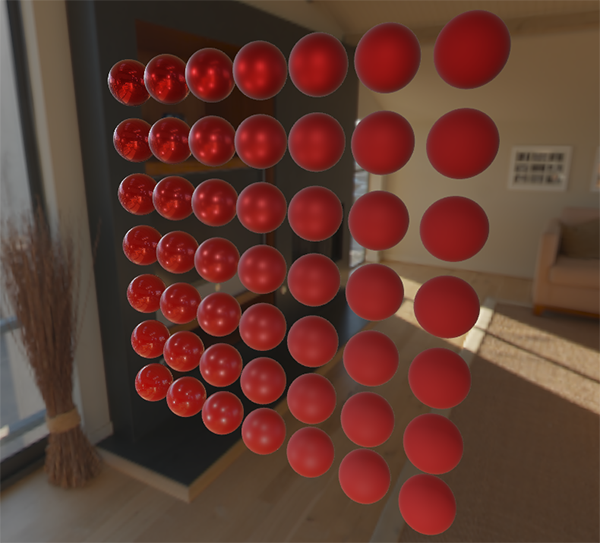

我们甚至可以再疯狂一点，使用一些带酷炫纹理的 [PBR 材质](http://freepbr.com/)：


或加载 Andrew Maximov 的[这款出色的免费 PBR 3D 模型](http://artisaverb.info/PBT.html)：

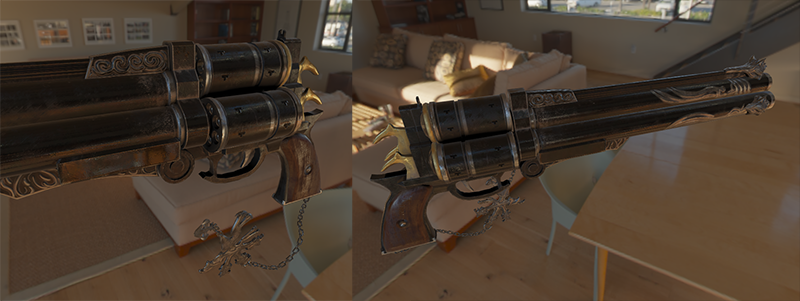

我敢肯定我们都同意现在的光照看起来更具说服力。更妙的是，无论我们使用哪种环境贴图，我们的光照看起来都是物理正确的。下面，您将看到几张不同的预计算 HDR 贴图，它们完全改变了光照动态，但是不需要调整任何光照变量，在外观上依然正确！

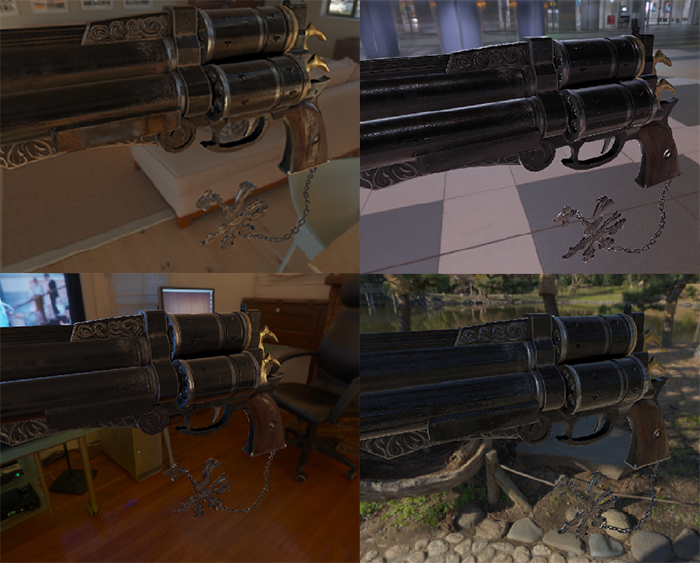

好吧，这是一场长长的 PBR 冒险。有很多步骤可能会出错，所以如果遇到问题卡住，请仔细研究[球形场景](https://learnopengl.com/code_viewer_gh.php?code=src/6.pbr/2.2.1.ibl_specular/ibl_specular.cpp)或[带纹理的场景代码](https://learnopengl.com/code_viewer_gh.php?code=src/6.pbr/2.2.2.ibl_specular_textured/ibl_specular_textured.cpp)示例——也包括所有着色器，或者检查之后在评论中提问。

### 下一步是？

希望在本教程结束时，你会对 PBR 的相关内容有一个清晰的了解，甚至可以构造并运行一个实际的 PBR 渲染器。在这几节教程中，我们已经在应用程序开始阶段，渲染循环之前，预计算了所有 PBR 相关的基于图像的光照数据。出于教育目的，这很好，但对于任何 PBR 的实践应用来说，都不是很漂亮。首先，预计算实际上只需要执行一次，而不是每次启动时都要做。其次，当使用多个环境贴图时，你必须在每次程序启动时全部预计算一遍，这是个必须步骤。

因此，通常只需要一次将环境贴图预计算为辐照度贴图和预过滤贴图，然后将其存储在磁盘上（注意，BRDF 积分贴图不依赖于环境贴图，因此只需要计算或加载一次）。这意味着您需要提出一种自定义图像格式来存储 HDR 立方体贴图，包括其 mip 级别。或者将图像存储为某种可用格式——例如支持存储 mip 级别的 .dds——并按其格式加载。

此外，我们也在教程中描述了**整个**过程，包括生成预计算的 IBL 图像，以帮助我们进一步了解 PBR 管线。此外还可以通过 [cmftStudio](https://github.com/dariomanesku/cmftStudio) 或 [IBLBaker](https://github.com/derkreature/IBLBaker) 等一些出色的工具为您生成这些预计算贴图，也很好用。

有一点内容我们跳过了，即如何将预计算的立方体贴图作为<def>反射探针</def>：立方体贴图插值和视差校正。这是一个在场景中放置多个反射探针的过程，这些探针在特定位置拍摄场景的立方体贴图快照，然后我们可以将其卷积，作为相应部分场景的 IBL 数据。基于相机的位置对附近的探针插值，我们可以实现局部的细节丰富的 IBL，受到的唯一限制就是探针放置的数量。这样一来，例如从一个明亮的室外部分移动到较暗的室内部分时，IBL 就能正确更新。我将来会在某个地方编写有关反射探针的教程，但现在，我建议阅读下面 Chetan Jags 的文章来作为入门。

## 进阶阅读

 * [Real Shading in Unreal Engine 4](http://blog.selfshadow.com/publications/s2013-shading-course/karis/s2013_pbs_epic_notes_v2.pdf)：讲解了 Epic Games 的分割求和近似法。IBL PBR 部分的代码就脱胎于此文。
 * [Physically Based Shading and Image Based Lighting](http://www.trentreed.net/blog/physically-based-shading-and-image-based-lighting/)：Trent Reed 的精彩博客文章，介绍了如何将镜面反射 IBL 实时集成到 PBR 管道中。
 * [Image Based Lighting](https://chetanjags.wordpress.com/2015/08/26/image-based-lighting/)：Chetan Jags 对基于镜面反射的 IBL 及其一些注意事项（包括光照探针插值）进行了广泛的讲解。
 * [Moving Frostbite to PBR](https://seblagarde.files.wordpress.com/2015/07/course_notes_moving_frostbite_to_pbr_v32.pdf)：Sébastien Lagarde 和 Charles de Rousiers 撰写的，对于如何将 PBR 集成到 AAA 游戏引擎进行了详尽而深入的概述。
 * [Physically Based Rendering – Part Three](https://jmonkeyengine.github.io/wiki/jme3/advanced/pbr_part3.html)：JMonkeyEngine 团队对 IBL 和 PBR 进行了较高层次的概述。
 * [Implementation Notes: Runtime Environment Map Filtering for Image Based Lighting](https://placeholderart.wordpress.com/2015/07/28/implementation-notes-runtime-environment-map-filtering-for-image-based-lighting/)：Padraic Hennessy 撰写的大量有关预过滤 HDR 环境贴图并显著优化采样过程的文章。


