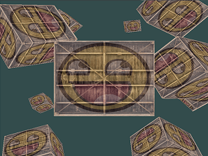

# 欢迎来到OpenGL的世界

欢迎来到OpenGL的世界。这个工程只是我([Joey de Vries](http://joeydevries.com/))的一次小小的尝试，希望能够建立起一个完善的OpenGL教学平台。无论你学习OpenGL是为了学业，找工作，或仅仅是因为兴趣，这个网站都将能够教会你**现代**(Core-profile) OpenGL的基础，中级，以及高级知识。LearnOpenGL的目标是使用易于理解的形式，使用清晰的例子，展现现代OpenGL的所有知识点，与此同时为以后的学习提供有用的参考。

如果您喜欢这个系列教程的话，不妨到Joey de Vries的[Patreon](https://www.patreon.com/learnopengl)上支持一下作者，让这个教程能够持续完善并更新。

## 为什么要阅读这些教程呢？

在互联网上，关于学习OpenGL的有成千上万的文档与资源，然而其中大部分的资源仅仅讨论了OpenGL的立即渲染模式(Immediate Mode，通常会说旧OpenGL)，亦或是不完整，缺少适当的文档，或仅仅不适合你的口味。所以我的目标是提供一个既完整，又易懂的平台供人们学习。

如果你很享受那些提供手把手指导的教程，那些提供清晰例子的教程，和那些不会一下将你淹没在细节中的教程，我的这些教程很可能就会适合你。这些教程旨在让那些没有图形编程经验的人们能够理解，又让那些有经验的读者有阅读下去的兴趣。这些教程同样也讨论了一些常用的概念，只需要你再有一点创造力，就能将你的想法变成真正的3D程序。如果如果你觉得前面这些讲的都是你，欢迎继续阅读我的教程。

## 你将学会什么呢？

我这些教程的核心是现代OpenGL。学习（和使用）现代OpenGL需要用户对图形编程以及OpenGL的幕后运作有非常高的理解才能在编程中有很好的发挥。所以，我们会先讨论核心的图形概念，OpenGL怎样画像素到屏幕上，还有如何利用黑科技做出一些很酷的效果。

除了核心概念之外，我们将会讨论许多有用的技巧，它们都可以用在你的程序中，比如说在你的场景中移动，做出漂亮的光效，加载一些建模软件导出的一些自定义的模型，做一些很酷的后期处理技巧等。最后，我们也将会使用我们已学的知识从头开始做一个小游戏，让你真正体验一把图形编程的魅力。

## 关于中文翻译

这里是LearnOpenGL教程的中文翻译，英文版的地址为：[http://learnopengl.com/](http://learnopengl.com/)

由于翻译可能无法做到精确表达原文意思，我们推荐您在对问题有疑惑的时候去阅读一下英文版的教程。如果您对翻译有更好的建议，可以去我们的[GitHub工程](https://github.com/LearnOpenGL-CN/LearnOpenGL-CN)上提交Issue或者Pull Request。如果是对教程的内容有问题，请先查看原文，如果不是翻译错误的话，请直接在原网站评论区向作者（JoeyDeVries）反馈。

如果教程中的源码无法打开的话，可以到教程的[GitHub页面](https://github.com/JoeyDeVries/LearnOpenGL)上去寻找所需的代码，每一节教程的源码以及练习都位于 `src` 目录下的对应章节目录中。