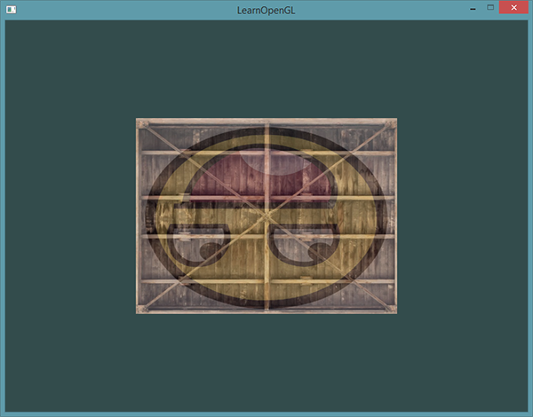
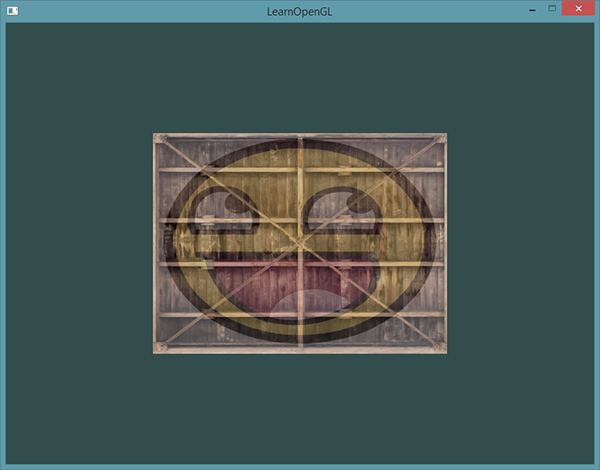

# 历史存档

由于作者在对教程不断地更新，一些比较旧的内容就从教程中删除或者修改了，但是这部分内容仍然对在更新以前就开始学习的读者可能还是会有点用处的。所以，我会将被大段删除或修改的内容留到这里以供大家参考。

注意的是，一些比较小的改动将不会出现在这里。

## 01-01 OpenGL

!!! important
	
	**基元类型(Primitive Type)**
	
	使用OpenGL时，建议使用OpenGL定义的基元类型。比如使用`float`时我们加上前缀`GL`（因此写作`GLfloat`）。`int`、`uint`、`char`、`bool`等等也类似。OpenGL定义的这些GL基元类型的内存布局是与平台无关的，而int等基元类型在不同操作系统上可能有不同的内存布局。使用GL基元类型可以保证你的程序在不同的平台上工作一致。

## 01-02 创建窗口

### 编译和链接GLEW

GLEW是OpenGL Extension Wrangler Library的缩写，它能解决我们上面提到的那个繁琐的问题。因为GLEW也是一个库，我们同样需要构建并将其链接进工程。GLEW可以从[这里](http://glew.sourceforge.net/index.html)下载，你同样可以选择下载二进制版本，如果你的目标平台列在上面的话，或者下载源码编译，步骤和编译GLFW时差不多。记住，如果不确定的话，选择32位的二进制版本。

我们使用GLEW的**静态**版本**glew32s.lib**（注意这里的“s”），将库文件添加到你的库目录，将**include**内容添加到你的include目录。接下来，在VS的链接器选项里加上**glew32s.lib**。注意GLFW3（默认）也是编译成了一个静态库。


!!! Important

	**静态**(Static)链接是指编译时就将库代码里的内容整合进你的二进制文件。优点就是你不需要管理额外的文件了，只需要发布你单独的一个二进制文件就行了。缺点就是你的可执行文件会变得更大，另外当库有升级版本时，你必须重新进行编译整个程序。
	
	**动态**(Dynamic)链接是指一个库通过`.dll`或`.so`的方式存在，它的代码与你的二进制文件的代码是分离的。优点是使你的二进制文件大小变小并且更容易升级，缺点是你最终发布程序时必须带上这些DLL。

如果你希望静态链接GLEW，必须在包含GLEW头文件之前定义预处理器宏`GLEW_STATIC`：

```c++
#define GLEW_STATIC
#include <GL/glew.h>
```

如果你希望动态链接，那么你可以省略这个宏。但是记住使用动态链接的话你需要拷贝一份.DLL文件到你的应用程序目录。

!!! Important

	对于用GCC编译的Linux用户建议使用这个命令行选项`-lGLEW -lglfw3 -lGL -lX11 -lpthread -lXrandr -lXi`。没有正确链接相应的库会产生 *undefined reference*(未定义的引用) 这个错误。

我们现在成功编译了GLFW和GLEW库，我们已经准备好将进入[下一节](01 Getting started/03 Hello Window.md)去真正使用GLFW和GLEW来设置OpenGL上下文并创建窗口。记得确保你的头文件和库文件的目录设置正确，以及链接器里引用的库文件名正确。如果仍然遇到错误，可以先看一下评论有没有人遇到类似的问题，请参考额外资源中的例子或者在下面的评论区提问。

## 01-03 你好，窗口

### GLEW

在之前的教程中已经提到过，GLEW是用来管理OpenGL的函数指针的，所以在调用任何OpenGL的函数之前我们需要初始化GLEW。

```c++
glewExperimental = GL_TRUE;
if (glewInit() != GLEW_OK)
{
    std::cout << "Failed to initialize GLEW" << std::endl;
    return -1;
}
```

请注意，我们在初始化GLEW之前设置<var>glewExperimental</var>变量的值为`GL_TRUE`，这样做能让GLEW在管理OpenGL的函数指针时更多地使用现代化的技术，如果把它设置为`GL_FALSE`的话可能会在使用OpenGL的核心模式时出现一些问题。


### 视口(Viewport)

在我们开始渲染之前还有一件重要的事情要做，我们必须告诉OpenGL渲染窗口的尺寸大小，这样OpenGL才只能知道怎样相对于窗口大小显示数据和坐标。我们可以通过调用<fun>glViewport</fun>函数来设置窗口的**维度**(Dimension)：

```c++
int width, height;
glfwGetFramebufferSize(window, &width, &height);
  
glViewport(0, 0, width, height);
```

<fun>glViewport</fun>函数前两个参数控制窗口左下角的位置。第三个和第四个参数控制渲染窗口的宽度和高度（像素），这里我们是直接从GLFW中获取的。我们从GLFW中获取视口的维度而不设置为800*600是为了让它在高DPI的屏幕上（比如说Apple的视网膜显示屏）也能[正常工作](http://www.glfw.org/docs/latest/window.html#window_size)。

我们实际上也可以将视口的维度设置为比GLFW的维度小，这样子之后所有的OpenGL渲染将会在一个更小的窗口中显示，这样子的话我们也可以将一些其它元素显示在OpenGL视口之外。

!!! Important

	OpenGL幕后使用<fun>glViewport</fun>中定义的位置和宽高进行2D坐标的转换，将OpenGL中的位置坐标转换为你的屏幕坐标。例如，OpenGL中的坐标(-0.5, 0.5)有可能（最终）被映射为屏幕中的坐标(200,450)。注意，处理过的OpenGL坐标范围只为-1到1，因此我们事实上将(-1到1)范围内的坐标映射到(0, 800)和(0, 600)。
### 输入

我们同样也希望能够在GLFW中实现一些键盘控制，这可以通过使用GLFW的回调函数(Callback Function)来完成。<def>回调函数</def>事实上是一个函数指针，当我们设置好后，GLFW会在合适的时候调用它。**按键回调**(KeyCallback)是众多回调函数中的一种。当我们设置了按键回调之后，GLFW会在用户有键盘交互时调用它。该回调函数的原型如下所示：

```c++
void key_callback(GLFWwindow* window, int key, int scancode, int action, int mode);
```

按键回调函数接受一个<fun>GLFWwindow</fun>指针作为它的第一个参数；第二个整形参数用来表示按下的按键；`action`参数表示这个按键是被按下还是释放；最后一个整形参数表示是否有Ctrl、Shift、Alt、Super等按钮的操作。GLFW会在合适的时候调用它，并为各个参数传入适当的值。


```c++
void key_callback(GLFWwindow* window, int key, int scancode, int action, int mode)
{
    // 当用户按下ESC键,我们设置window窗口的WindowShouldClose属性为true
    // 关闭应用程序
    if(key == GLFW_KEY_ESCAPE && action == GLFW_PRESS)
    	glfwSetWindowShouldClose(window, GL_TRUE);
}    
```

在我们（新创建的）<fun>key_callback</fun>函数中，我们检测了键盘是否按下了Escape键。如果键的确按下了(不释放)，我们使用<fun>glfwSetwindowShouldClose</fun>函数设定`WindowShouldClose`属性为`true`从而关闭GLFW。main函数的`while`循环下一次的检测将为失败，程序就关闭了。

最后一件事就是通过GLFW注册我们的函数至合适的回调，代码是这样的:

```c++
glfwSetKeyCallback(window, key_callback);  
```

除了按键回调函数之外，我们还能我们自己的函数注册其它的回调。例如，我们可以注册一个回调函数来处理窗口尺寸变化、处理一些错误信息等。我们可以在创建窗口之后，开始游戏循环之前注册各种回调函数。

## 01-06 纹理

### SOIL

SOIL是简易OpenGL图像库(Simple OpenGL Image Library)的缩写，它支持大多数流行的图像格式，使用起来也很简单，你可以从他们的[主页](http://www.lonesock.net/soil.html)下载。像其它库一样，你必须自己生成**.lib**。你可以使用**/projects**文件夹内的任意一个解决方案(Solution)文件（不用担心他们的Visual Studio版本太老，你可以把它们转变为新的版本，这一般是没问题的。译注：用VS2010的时候，你要用VC8而不是VC9的解决方案，想必更高版本的情况亦是如此）来生成你自己的**.lib**文件。你还要添加**src**文件夹里面的文件到你的**includes**文件夹；对了，不要忘记添加**SOIL.lib**到你的链接器选项，并在你代码文件的开头加上`#include <SOIL.h>`。

下面的教程中，我们会使用一张[木箱](img/01/06/container.jpg)的图片。要使用SOIL加载图片，我们需要使用它的<fun>SOIL_load_image</fun>函数：

```c++
int width, height;
unsigned char* image = SOIL_load_image("container.jpg", &width, &height, 0, SOIL_LOAD_RGB);
```

函数首先需要输入图片文件的路径。然后需要两个`int`指针作为第二个和第三个参数，SOIL会分别返回图片的**宽度**和**高度**到其中。后面我们在生成纹理的时候会用图像的宽度和高度。第四个参数指定图片的**通道**(Channel)数量，但是这里我们只需留为`0`。最后一个参数告诉SOIL如何来加载图片：我们只关注图片的`RGB`值。结果会储存为一个很大的char/byte数组。

### 生成纹理

和之前生成的OpenGL对象一样，纹理也是使用ID引用的。让我们来创建一个：

```c++
GLuint texture;
glGenTextures(1, &texture);
```

<fun>glGenTextures</fun>函数首先需要输入生成纹理的数量，然后把它们储存在第二个参数的`GLuint`数组中（我们的例子中只是一个单独的`GLuint`），就像其他对象一样，我们需要绑定它，让之后任何的纹理指令都可以配置当前绑定的纹理：

```c++
glBindTexture(GL_TEXTURE_2D, texture);
```

现在纹理已经绑定了，我们可以使用前面载入的图片数据生成一个纹理了。纹理可以通过<fun>glTexImage2D</fun>来生成：

```c++
glTexImage2D(GL_TEXTURE_2D, 0, GL_RGB, width, height, 0, GL_RGB, GL_UNSIGNED_BYTE, image);
glGenerateMipmap(GL_TEXTURE_2D);
```

函数很长，参数也不少，所以我们一个一个地讲解：

- 第一个参数指定了纹理目标(Target)。设置为<var>GL_TEXTURE_2D</var>意味着会生成与当前绑定的纹理对象在同一个目标上的纹理（任何绑定到<var>GL_TEXTURE_1D</var>和<var>GL_TEXTURE_3D</var>的纹理不会受到影响）。
- 第二个参数为纹理指定多级渐远纹理的级别，如果你希望单独手动设置每个多级渐远纹理的级别的话。这里我们填0，也就是基本级别。
- 第三个参数告诉OpenGL我们希望把纹理储存为何种格式。我们的图像只有`RGB`值，因此我们也把纹理储存为`RGB`值。
- 第四个和第五个参数设置最终的纹理的宽度和高度。我们之前加载图像的时候储存了它们，所以我们使用对应的变量。
- 下个参数应该总是被设为`0`（历史遗留问题）。
- 第七第八个参数定义了源图的格式和数据类型。我们使用RGB值加载这个图像，并把它们储存为`char`(byte)数组，我们将会传入对应值。
- 最后一个参数是真正的图像数据。

当调用<fun>glTexImage2D</fun>时，当前绑定的纹理对象就会被附加上纹理图像。然而，目前只有基本级别(Base-level)的纹理图像被加载了，如果要使用多级渐远纹理，我们必须手动设置所有不同的图像（不断递增第二个参数）。或者，直接在生成纹理之后调用<fun>glGenerateMipmap</fun>。这会为当前绑定的纹理自动生成所有需要的多级渐远纹理。

生成了纹理和相应的多级渐远纹理后，释放图像的内存并解绑纹理对象是一个很好的习惯。

```c++
SOIL_free_image_data(image);
glBindTexture(GL_TEXTURE_2D, 0);
```

生成一个纹理的过程应该看起来像这样：

```c++
GLuint texture;
glGenTextures(1, &texture);
glBindTexture(GL_TEXTURE_2D, texture);
// 为当前绑定的纹理对象设置环绕、过滤方式
...
// 加载并生成纹理
int width, height;
unsigned char* image = SOIL_load_image("container.jpg", &width, &height, 0, SOIL_LOAD_RGB);
glTexImage2D(GL_TEXTURE_2D, 0, GL_RGB, width, height, 0, GL_RGB, GL_UNSIGNED_BYTE, image);
glGenerateMipmap(GL_TEXTURE_2D);
SOIL_free_image_data(image);
glBindTexture(GL_TEXTURE_2D, 0); 
```

### 纹理单元

你可能会奇怪为什么`sampler2D`变量是个uniform，我们却不用<fun>glUniform</fun>给它赋值。使用<fun>glUniform1i</fun>，我们可以给纹理采样器分配一个位置值，这样的话我们能够在一个片段着色器中设置多个纹理。一个纹理的位置值通常称为一个<def>纹理单元</def>(Texture Unit)。一个纹理的默认纹理单元是0，它是默认的激活纹理单元，所以教程前面部分我们没有分配一个位置值。

纹理单元的主要目的是让我们在着色器中可以使用多于一个的纹理。通过把纹理单元赋值给采样器，我们可以一次绑定多个纹理，只要我们首先激活对应的纹理单元。就像<fun>glBindTexture</fun>一样，我们可以使用<fun>glActiveTexture</fun>激活纹理单元，传入我们需要使用的纹理单元：

```c++
glActiveTexture(GL_TEXTURE0); //在绑定纹理之前先激活纹理单元
glBindTexture(GL_TEXTURE_2D, texture);
```

激活纹理单元之后，接下来的<fun>glBindTexture</fun>函数调用会绑定这个纹理到当前激活的纹理单元，纹理单元<var>GL_TEXTURE0</var>默认总是被激活，所以我们在前面的例子里当我们使用`glBindTexture`的时候，无需激活任何纹理单元。

!!! Important

	OpenGL至少保证有16个纹理单元供你使用，也就是说你可以激活从<var>GL_TEXTURE0</var>到<var>GL_TEXTRUE15</var>。它们都是按顺序定义的，所以我们也可以通过<var>GL_TEXTURE0 + 8</var>的方式获得<var>GL_TEXTURE8</var>，这在当我们需要循环一些纹理单元的时候会很有用。
        
我们仍然需要编辑片段着色器来接收另一个采样器。这应该相对来说非常直接了：

```c++
#version 330 core
...

uniform sampler2D ourTexture1;
uniform sampler2D ourTexture2;

void main()
{
    color = mix(texture(ourTexture1, TexCoord), texture(ourTexture2, TexCoord), 0.2);
}
```

最终输出颜色现在是两个纹理的结合。GLSL内建的<fun>mix</fun>函数需要接受两个值作为参数，并对它们根据第三个参数进行线性插值。。如果第三个值是`0.0`，它会返回第一个输入；如果是`1.0`，会返回第二个输入值。`0.2`会返回`80%`的第一个输入颜色和`20%`的第二个输入颜色，即返回两个纹理的混合色。

我们现在需要载入并创建另一个纹理；你应该对这些步骤很熟悉了。记得创建另一个纹理对象，载入图片，使用<fun>glTexImage2D</fun>生成最终纹理。对于第二个纹理我们使用一张[你学习OpenGL时的面部表情](img/01/06/awesomeface.png)图片。

为了使用第二个纹理（以及第一个），我们必须改变一点渲染流程，先绑定两个纹理到对应的纹理单元，然后定义哪个uniform采样器对应哪个纹理单元：

```c++
glActiveTexture(GL_TEXTURE0);
glBindTexture(GL_TEXTURE_2D, texture1);
glUniform1i(glGetUniformLocation(ourShader.Program, "ourTexture1"), 0);
glActiveTexture(GL_TEXTURE1);
glBindTexture(GL_TEXTURE_2D, texture2);
glUniform1i(glGetUniformLocation(ourShader.Program, "ourTexture2"), 1);

glBindVertexArray(VAO);
glDrawElements(GL_TRIANGLES, 6, GL_UNSIGNED_INT, 0);
glBindVertexArray(0);
```

注意，我们使用<fun>glUniform1i</fun>设置uniform采样器的位置值，或者说纹理单元。通过<fun>glUniform1i</fun>的设置，我们保证每个uniform采样器对应着正确的纹理单元。你应该能得到下面的结果：



你可能注意到纹理上下颠倒了！这是因为OpenGL要求y轴`0.0`坐标是在图片的底部的，但是图片的y轴`0.0`坐标通常在顶部。一些图片加载器比如[DevIL](http://openil.sourceforge.net/tuts/tut_10/index.htm)在加载的时候有选项重置y原点，但是SOIL没有。SOIL却有一个叫做<fun>SOIL_load_OGL_texture</fun>函数可以使用一个叫做<var>SOIL_FLAG_INVERT_Y</var>的标记加载**并**生成纹理，这可以解决我们的问题。不过这个函数用了一些在现代OpenGL中失效的特性，所以现在我们仍需坚持使用<fun>SOIL_load_image</fun>，自己做纹理的生成。

所以修复我们的小问题，有两个选择：

1. 我们可以改变顶点数据的纹理坐标，翻转`y`值（用1减去y坐标）。
2. 我们可以编辑顶点着色器来自动翻转`y`坐标，替换`TexCoord`的值为`TexCoord = vec2(texCoord.x, 1.0f - texCoord.y);`。

!!! Attention

	上面提供的解决方案仅仅通过一些黑科技让图片翻转。它们在大多数情况下都能正常工作，然而实际上这种方案的效果取决于你的实现和纹理，所以最好的解决方案是调整你的图片加载器，或者以一种y原点符合OpenGL需求的方式编辑你的纹理图像。
        
如果你编辑了顶点数据，在顶点着色器中翻转了纵坐标，你会得到下面的结果：



如果你看到了一个开心的箱子，你就做对了。你可以对比一下[源代码](http://learnopengl.com/code_viewer.php?code=getting-started/textures_combined)，以及[顶点着](http://learnopengl.com/code_viewer.php?type=vertex&code=getting-started/texture)和[片段](http://learnopengl.com/code_viewer.php?type=fragment&code=getting-started/texture)着色器。

## 01-09 摄像机


### 自由移动

让摄像机绕着场景转的确很有趣，但是让我们自己移动摄像机会更有趣！首先我们必须设置一个摄像机系统，所以在我们的程序前面定义一些摄像机变量很有用：

```c++
glm::vec3 cameraPos   = glm::vec3(0.0f, 0.0f,  3.0f);
glm::vec3 cameraFront = glm::vec3(0.0f, 0.0f, -1.0f);
glm::vec3 cameraUp    = glm::vec3(0.0f, 1.0f,  0.0f);
```

`LookAt`函数现在成了：

```c++
view = glm::lookAt(cameraPos, cameraPos + cameraFront, cameraUp);
```

我们首先将摄像机位置设置为之前定义的<var>cameraPos</var>。方向是当前的位置加上我们刚刚定义的方向向量。这样能保证无论我们怎么移动，摄像机都会注视着目标方向。让我们摆弄一下这些向量，在按下某些按钮时更新<var>cameraPos</var>向量。

我们已经为GLFW的键盘输入定义了一个<fun>key_callback</fun>函数，我们来新添加几个需要检查的按键命令：

```c++
void key_callback(GLFWwindow* window, int key, int scancode, int action, int mode)
{
    ...
    GLfloat cameraSpeed = 0.05f;
    if(key == GLFW_KEY_W)
        cameraPos += cameraSpeed * cameraFront;
    if(key == GLFW_KEY_S)
        cameraPos -= cameraSpeed * cameraFront;
    if(key == GLFW_KEY_A)
        cameraPos -= glm::normalize(glm::cross(cameraFront, cameraUp)) * cameraSpeed;
    if(key == GLFW_KEY_D)
        cameraPos += glm::normalize(glm::cross(cameraFront, cameraUp)) * cameraSpeed;  
}
```

当我们按下**WASD**键的任意一个，摄像机的位置都会相应更新。如果我们希望向前或向后移动，我们就把位置向量加上或减去方向向量。如果我们希望向左右移动，我们使用叉乘来创建一个**右向量**(Right Vector)，并沿着它相应移动就可以了。这样就创建了使用摄像机时熟悉的<def>扫射</def>(Strafe)效果。

!!! important

	注意，我们对**右向量**进行了标准化。如果我们没对这个向量进行标准化，最后的叉乘结果会根据<var>cameraFront</var>变量返回大小不同的向量。如果我们不对向量进行标准化，我们就得根据摄像机的朝向不同加速或减速移动了，但假如进行了标准化移动就是匀速的。

如果你用这段代码更新<fun>key_callback</fun>函数，你就可以在场景中自由的前后左右移动了。

<video src="../img/01/09/camera_inside.mp4" controls="controls">
</video>

在摆弄这个基础的摄像机系统之后你可能会注意到这个摄像机系统不能同时朝两个方向移动（对角线移动），而且当你按下一个按键时，它会先顿一下才开始移动。这是因为大多数事件输入系统一次只能处理一个键盘输入，它们的函数只有当我们激活了一个按键时才被调用。虽然这对大多数GUI系统都没什么问题，它对摄像机来说并不合理。我们可以用一些小技巧解决这个问题。

这个技巧是在回调函数中只跟踪哪个按键被按下/释放。在游戏循环中我们读取这些值，检查哪个按键是**激活的**，然后做出相应反应。我们只储存哪个按键被按下/释放的状态信息，并在游戏循环中对状态做出反应。首先，我们来创建一个boolean数组代表被按下/释放的按键：

```c++
bool keys[1024];
```

然后我们需要在<fun>key_callback</fun>函数中设置被按下/释放的按键为`true`或`false`：

```c++
if(action == GLFW_PRESS)
    keys[key] = true;
else if(action == GLFW_RELEASE)
    keys[key] = false;
```

并且我们创建一个新的叫做<fun>do_movement</fun>的函数，在这个函数中，我们将根据正在被按下的按键更新摄像机的值。：

```c++
void do_movement()
{
  // 摄像机控制
  GLfloat cameraSpeed = 0.01f;
  if(keys[GLFW_KEY_W])
  	cameraPos += cameraSpeed * cameraFront;
  if(keys[GLFW_KEY_S])
  	cameraPos -= cameraSpeed * cameraFront;
  if(keys[GLFW_KEY_A])
  	cameraPos -= glm::normalize(glm::cross(cameraFront, cameraUp)) * cameraSpeed;
  if(keys[GLFW_KEY_D])
  	cameraPos += glm::normalize(glm::cross(cameraFront, cameraUp)) * cameraSpeed;
}
```

之前的代码现在被移动到<fun>do_movement</fun>函数中。由于所有GLFW的按键枚举值本质上都是整数，我们可以把它们当数组索引使用。

最后，我们需要在游戏循环中添加新函数的调用：

```c++
while(!glfwWindowShouldClose(window))
{
  // 检测并调用事件
  glfwPollEvents();
  do_movement();  
  
  // 渲染
  ...
}
```

至此，你应该可以同时向多个方向移动了，并且当你按下按钮时也会立刻移动了。如遇困难，可以查看下[源代码](http://learnopengl.com/code_viewer.php?code=getting-started/camera_keyboard)。